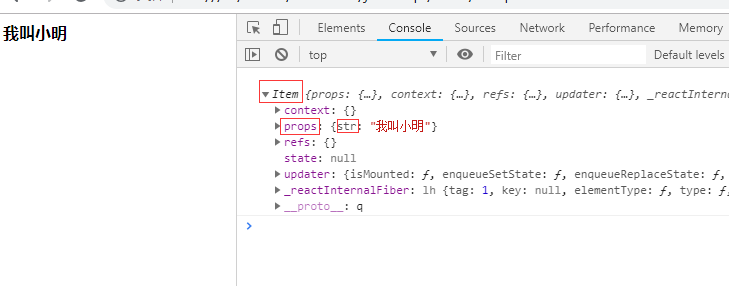
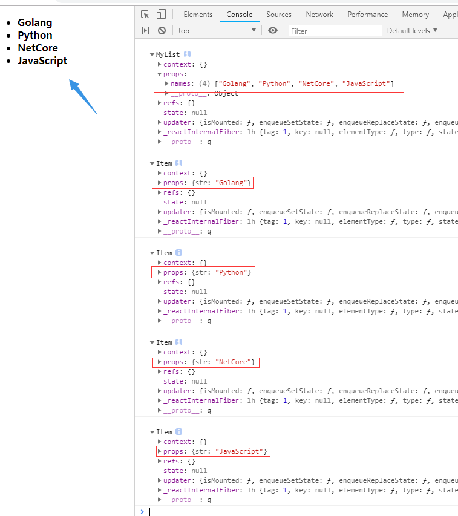
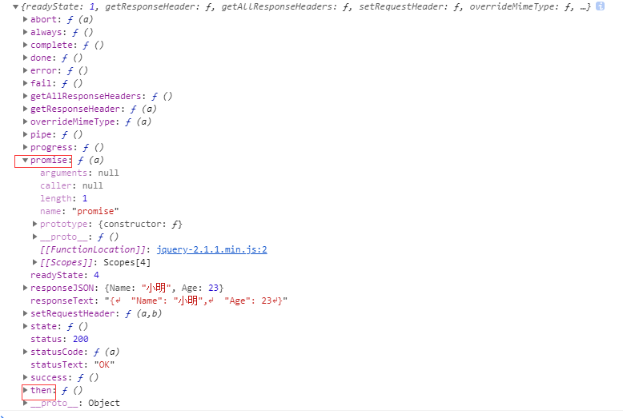
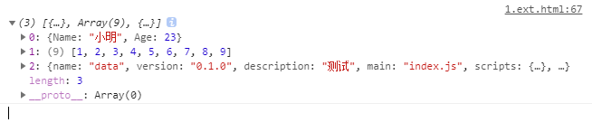

# Ⅰ.ES6~POP

ES6现在浏览器基本上都支持了，可以收一波韭菜了～（关键移动端都支持了）

## 1.变量

### 验证

1. `var`：可以重复定义，不能限制修改，没有块级作用域（和Python差不多）
2. `let`：不可以重复定义，相当于C#的变量，块级作用域（以后var全部换成let）
3. `const`：不可以重复定义，相当于C#的常量，块级作用域

### 可以重复定义的验证

1.**var可以重复定义**
```javascript
var a1 = 12; // 定义了一个a变量
// ...写了若干代码
var a1 = 5; // 然后又重新定义了一个a，这时候可能就有潜在bug了

console.log(a1); // 5
```

2.**let不可以重复定义，相当于C#的变量**（以后var全部换成let）
```javascript
let a2 = 12;
let a2 = 5;

// 标识符a已经被声明
console.log(a2); // Identifier 'a2' has already been declared
```

3.**const：不可以重复定义，相当于C#的常量**
```javascript
const a3 = 12;
const a3 = 5;

// 标识符a已经被声明
console.log(a3); // Identifier 'a3' has already been declared
```

---

### 可以被修改的验证

1.**`var`可以修改**
```javascript
var a = 2;
a = 3;

// var 可以修改
console.log(a); //3
```

2.**`let`可以修改**
```javascript
let b = 2;
b = 3;

// let可以修改
console.log(b);
```

3.**`const`不可以修改**
```javascript
const c = 12;
c = 5;

// 不能赋值给常量变量
console.log(c); // Assignment to constant variable.
```

---

### 验证作用域

1.**var没有块级作用域**
```javascript
if(1<2){
    var b1 = 1;
}

// var没有块级作用域
console.log(b1); // 1
```
2.**let复合正常变量特性**
```javascript
// 和我们平时使用差不多了
if(1<2){
    let b2 = 1;
}

// ReferenceError: b2 is not defined
console.log(b2); // b2 没有定义
```
3.**更严格的const就更不说了**
```javascript
if(1<2){
    const b3 = 1;
}

// ReferenceError: b3 is not defined
console.log(b3); // b3 没有定义
```

---


### Python3

**变量没有修饰符的，直接定义，全局变量`global`引用即可**

1.**var变量和Python类似**
```py
if 1 < 2:
    b = 1
print(b) # 1
```
2.**全局变量建议`global`引用一下**
```py
age = 20

def test():
    global age
    print(age) # 20
```

### 结论：(以后`var`全部换成`let`)
1. `var`：可以重复定义，不能限制修改，没有块级作用域（和Python差不多）
2. `let`：不可以重复定义，相当于C#的变量，块级作用域（以后var全部换成let）
3. `const`：不可以重复定义，相当于C#的常量，块级作用域

## 2.解构赋值

这个特性不管是`C#`还是`ES6`都是从`Python`那借鉴过来的，特点：
1. 左右两边结构一样
2. 定义和赋值同时完成

### 基础

简单版：
```javascript
let [a,b,c] = [1,2,3];
console.log(a,b,c); // 1 2 3
```

变化版：
```javascript
let {a,b,c} = {a:1,b:2,c:3}; // json格式对应也行
console.log(a,b,c); // 1 2 3
```
PS：把后面改成`{a1:1,b1:2,c1:3}`就变成`undefined undefined undefined`

复杂版：
```javascript
let [x, { a, b, c }, y] = [4, { a: 1, b: 2, c: 3 }, 5];
console.log(a, b, c, x, y); // 1 2 3 4 5
```

### 验证

1. **左右两边结构需要一样**
```javascript
// 这种就不行，格式得对应（左边3，右边5个 ==> over）
let [x, { a, b, c }, y] = { a: 1, b: 2, c: 3, x: 4, y: 5 };
console.log(a, b, c, x, y); // 未捕获的TypeError：{...}不可迭代
```

2. **定义和赋值同时完成**
```javascript
let [a, b, c];
[a, b, c] = [1, 2, 3];
// 未捕获的SyntaxError：在解构声明中缺少初始化程序
console.log(a, b, c);
```


## 3.函数系

### 3.1.箭头函数（匿名函数）

以前写法：
```javascript
function (参数,参数){
    函数体
}
```
简化写法：
```javascript
(参数,参数) => {
    函数体
}

参数 => {
    函数体
}

参数 => 表达式
```

**举个例子**：
```javascript
function add(x, y) {
    return x + y;
}

let add1 = function (x, y) {
    return x + y;
}

let add2 = (x, y) => {
    return x + y;
}

let add3 = (x,y) => x+y;
console.log(add(1, 2)); // 3
console.log(add1(1, 2)); // 3
console.log(add2(1, 2)); // 3
console.log(add3(1, 2)); // 3
```

#### 小验证（`和Net用起来基本上一样`）
1. **如果只有一个参数：`()`可以省略**
```javascript
let get_age = age => {
    return age - 2;
}
console.log(get_age(18)); // 16
```
2. **如果函数体只有一句话：`{}`可以省略**
    - 如果只有一句`return`，那么`return`也可以省略
```javascript
let get_age = age => age - 2;
console.log(get_age(18)); // 16
```
    - 没有`return`也可以简写
```javascript
let print_age = age => console.log(age - 2);
print_age(18); // 16
```

PS：**箭头函数会改变`this`（后面会说）**

---

### 3.2.默认参数

```javascript
// 原来：
function show(a, b, c) {
    c = c || 7; // 默认参数
    console.log(a, b, c);
}
// 现在：
function show(a, b, c = 7) {
    console.log(a, b, c);
}

show(1, 2); // 1 2 7
show(1, 2, 3); // 1 2 3
```

---

### 3.3.参数展开

#### 基本用法

举个例子：
```javascript
let show_args = (a, b, ...args) => console.log(a, b, args);
// `...args`是个数组（Python是元组）
show_args(1, 2, 3, 4, 5, 6);// 1 2 [3, 4, 5, 6] 
```

#### 小验证

1. **`...args`必须是最后一个参数**
```javascript
let show_args = (a, b, ...args, c) => console.log(a, b, args, c);
// Uncaught SyntaxError: Rest parameter must be last formal parameter
show_args(1, 2, 4, 5, 6, c = 3); // ...args必须是最后一个参数
```

PS：**Python里面可以**：
```py
def show(a, b, *args, c):
    print(a, b, args, c)

# 1 2 (4, 5, 6) 3
show(1, 2, 4, 5, 6, c=3)
```

#### 扩展用法

**案例1**：
```javascript
let nums = [1, 2, 3, 4];
// 解包使用
let nums2 = [0, ...nums, 5, 6];
// [0,1,2,3,4,5,6]
console.log(nums2);
```

PS：**Python用法类似**：
```py
# 列表换成元组也一样用
num_list = [1,2,3,4]
# 不管是列表还是元组，这边需要加*才能解包
num_list2 = [0,*num_list,5,6]
# [0, 1, 2, 3, 4, 5, 6]
print(num_list2)
```

**案例2**：
```javascript
let nums = [1, 2, 3, 4];
let nums2 = [0, 5, 6];
nums.push(...nums2);
// [1, 2, 3, 4, 0, 5, 6]
console.log(nums);
```

PS：**Python用法类似**：
```py
num_list = [1,2,3,4]
num_list2 = [0,5,6]
# [1, 2, 3, 4, 0, 5, 6]
num_list.extend(num_list2)
print(num_list)

# 如果使用append就是嵌套版列表了
# num_list.append(num_list2)
# [1, 2, 3, 4, [0, 5, 6]]
```

---

### 3.4.特殊的this（重要）

**普通函数的this ==> 谁调用就是谁（经常变：谁调用是谁）**

```javascript
function show() {
    alert(this); // 1,2,3,4
    console.log(this); // [1, 2, 3, 4, show: ƒ]
}

let arr = [1, 2, 3, 4];
arr.show = show;
arr.show();
```

---

**箭头函数的this ==> 在谁的环境下`this`就是谁（不变：当前作用域）**
```javascript
let arr = [1, 2, 3, 4];
arr.show = () => {
    alert(this); // [object Window]
    console.log(this); // Window
}
arr.show();
```

再举个例子：**在document内**
```javascript
document.onclick = function () {
    let arr = [1, 2, 3, 4];
    arr.show = () => {
        console.log(this); // document
    }
    arr.show();
}
```

## 4.数组方法

**下面几个方法都不会改变原数组**

### 4.1.map

**映射**，传几个参数进去，出来几个参数。（**不改变数组内容，生成新数组**）

#### 基本用法

```javascript
scor_arr = [100, 28, 38, 64]
let results = scor_arr.map(item => item >= 60);

// [true, false, false, true]
console.log(results); // 不改变scor_arr内容，生成新数组

// old：
// let results = scor_arr.map(function (item) {
//     return item >= 60;
// });
```

#### Python3

Python略有不同：(`把函数依次作用在list的每个元素上`)
```py
scor_list = [100, 28, 38, 64]
result_list = map(lambda item: item >= 60, scor_list)

# [True, False, False, True] 不改变旧list的值
print(list(result_list))
```
PS：result_list：PY2直接返回list，PY3返回`Iterator`

---

### 4.2.filter

代言词：**过滤**（**不改变数组内容，生成新数组**）

#### 基本用法

```javascript
nums = [1, 2, 3, 4, 5, 6, 7, 8, 9, 10];
nums2 = nums.filter(item => item % 2 == 0);

// [2, 4, 6, 8, 10]
console.log(nums2) // 不改变旧数组的值
```

#### Python3

Python略有不同：(`把函数依次作用在list的每个元素上`)
```py
nums = [1, 2, 3, 4, 5, 6, 7, 8, 9, 10]
nums2 = filter(lambda item: item % 2 == 0, nums)

# [2, 4, 6, 8, 10] 不改变旧list的值
print(list(nums2))
```

PS：nums2：PY2直接返回list，PY3返回`Iterator`

---

### 4.3.forEach

**不做任何修改，纯粹的遍历**，用法和`net`里面的`ForEach`差不多

#### `forEach`没有返回值的验证

```javascript
nums = [1, 2, 3, 4, 5, 6, 7, 8, 9, 10];
let sum = 0;
let temp =nums.forEach(item => {
    sum += item;
});
console.log(sum) // 55
console.log(temp) // 验证了：forEach 没有返回值
```

**NetCore**：
```csharp
var sum = 0;
var list = new List<int>() { 1, 2, 3, 4, 5, 6, 7, 8, 9, 10 };
list.ForEach(item => sum += item);
Console.WriteLine(sum); // 55
```

#### 不会改变原数组的验证

```javascript
nums = [1, 2, 3, 4, 5, 6, 7, 8, 9, 10];
nums.forEach(item => {
    item += 1;
});

// [1, 2, 3, 4, 5, 6, 7, 8, 9, 10]
console.log(nums); //不会改变nums，仅仅是遍历
```

**NetCore**：

```csharp
var list = new List<int>() { 1, 2, 3, 4, 5, 6, 7, 8, 9, 10 };
list.ForEach(item => item += 1);
foreach (var item in list)
{
    // 12345678910
    Console.Write(item); //不会改变list里面的值
}
```

---

### 4.4.reduce

代言词：**汇总**，和`map`有点相反，**进去一堆出来一个**

#### 基础用法

```javascript
nums = [1, 2, 3, 4, 5, 6, 7, 8, 9, 10];
// x是第一个元素，y是第二个元素
nums.reduce((x, y, index) => {
    console.log(x, y, index);
});
```
输出：
```
1 2 1
undefined 3 2
undefined 4 3
undefined 5 4
undefined 6 5
undefined 7 6
undefined 8 7
undefined 9 8
undefined 10 9
```

#### 逆推JS执行过程

**逆推整个执行过程**：
1. x只被赋值一次
2. y从第二个值开始往下遍历
3. 整个过程只遍历9遍就结束了
    - for循环需要10次遍历结束
    - y从第二个数开始的，少一次遍历也正常

简单说就是按顺序依次执行函数，eg：
```javascript
nums = [1, 2, 3, 4, 5, 6, 7, 8, 9, 10];
result = nums.reduce((x, y) => x + y);
console.log(result / nums.length) // 5.5
```

reduce直接求平均值：（**return**是关键）
```
nums = [1, 2, 3, 4, 5, 6, 7, 8, 9, 10];
let result = nums.reduce((temp, item, index) => {
    temp += item;
    if (index < nums.length - 1) {
        return temp;
    } else { // 最后一次，返回平均值即可
        return temp / nums.length;
    }
});
console.log(result) // 5.5
```

#### Python3

**reduce就两个参数（`有且仅有`）**

`Python`的`Reduce`没`js`的强大，一般都是对列表做一个累积的‘汇总’操作

```py
import functools
nums = [1, 2, 3, 4, 5, 6, 7, 8, 9, 10]
result = functools.reduce(lambda x, y: x + y, nums)
print(result / len(nums)) # 5.5
```

可以看看执行过程：
```py
import functools

nums = [1, 2, 3, 4, 5, 6, 7, 8, 9, 10]
result = functools.reduce(lambda x, y: print(x, y), nums)
print(result)
```
输出：
```
1 2
None 3
None 4
None 5
None 6
None 7
None 8
None 9
None 10
None
```

---

### 4.5.Array.from

通俗讲：**把类数组集合转化成数组**

HTML代码：`/BaseCode/javascript/1.ES6/1.array.from.html`

```html
<!DOCTYPE html>
<html>
<head>
    <meta charset="utf-8" />
    <title>Array.from的应用</title>
</head>
<body>
    <style type="text/css">
        div {
            width: 200px;
            height: 200px;
            margin-right: 1px;
            float: left;
        }
    </style>
    <div></div>
    <div></div>
    <div></div>
</body>
</html>
```
JS部分：(**collection是没有forEach方法的，需要转化成数组**)
```javascript
window.onload = () => {
    let collection = document.getElementsByTagName("div");
    Array.from(collection).forEach(item => item.style.background = "blue");
}
```


## 5.JSON系

### 键值相同可以只写一个
```javascript
let [a, b] = [1, 2];
json = { a, b, c: 3 };
console.log(json); // {a: 1, b: 2, c: 3}

// 原来写法
// json = { a: a, b: b, c: 3 };
```

### 函数function可以省略

```javascript
json = {
    a: 1,
    b: 2,
    show() {
        console.log(this.a, this.b);
    }
};
json.show(); // 1 2

// 原来写法
// json = {
//     a: 1,
//     b: 2,
//     show: function () {
//         console.log(this.a, this.b);
//     }
// };
```

### 基础复习

**`Json`字符串的标准写法**：
1. **只能用双引号**
2. **所有名字必须用引号包裹**

**字符串和Json相互转换**：
1. **转换成字符串：`JSON.parse()`
2. **转换成Json：`JSON.stringify()`**


```javascript
let str1 = '{ a: 12, b: 5 }'; // 错误
let str2 = '{ "a": 12, "b": 5 }';// 正确
let str3 = "{ 'a': 'abc', 'b': 5 }";// 错误（单引号）
let str4 = '{ "a": "abc", "b": 5 }';// 正确（双引号）

// 测试是否为字符串
[str1, str2, str3, str4].forEach(str => {
    try {
        let json = JSON.parse(str);// 转换成字符串
        console.log(json);
    } catch (ex) {
        console.log(`字符串：${str}转换发生异常：${ex}`);
    }
});
```

    字符串：{ a: 12, b: 5 }转换发生异常：SyntaxError: Unexpected token a in JSON at position 2
    { a: 12, b: 5 }
    字符串：{ 'a': 'abc', 'b': 5 }转换发生异常：SyntaxError: Unexpected token ' in JSON at position 2
    { a: 'abc', b: 5 }


```javascript
let json1 = { name: "小明", age: 23, test: "我X!@#$%^&*(-_-)=+" };
let new_str = JSON.stringify(json1);
console.log(new_str);

// encodeURI对有些特殊符号并不会编码替换
let urlstr = encodeURIComponent(`https://www.baidu.com/s?wd=${new_str}`);
console.log(urlstr);
console.log(decodeURIComponent(urlstr));
```

    {"name":"小明","age":23,"test":"我X!@#$%^&*(-_-)=+"}
    https%3A%2F%2Fwww.baidu.com%2Fs%3Fwd%3D%7B%22name%22%3A%22%E5%B0%8F%E6%98%8E%22%2C%22age%22%3A23%2C%22test%22%3A%22%E6%88%91X!%40%23%24%25%5E%26*(-_-)%3D%2B%22%7D
    https://www.baidu.com/s?wd={"name":"小明","age":23,"test":"我X!@#$%^&*(-_-)=+"}


## 5.字符串系

### 1.字符串模板

#### 渲染变量

省的一个个去拼接了（PS：`反单引号`）
```javascript
let [name,age]=["小明",23];

// 我叫小明,我今年23
console.log(`我叫${name},我今年${age}`);
```

**Python3用起来差不多**：
```py
name, age = "小明", 23

# 我叫小明,今年23
print(f"我叫{name},今年{age}")
```

#### 保持原有格式

**注意一点：换行内容如果不想要空格就顶行写**
```javascript
console.log(`我叫：
小明
今年：
23`);
```
输出：
```
我叫：
小明
今年：
23
```

Python就换成了`"""`
```py
print("""我叫：
小明
今年：
23
""")
```

### 2.开头结尾方法

#### 基本用法

```javascript
let url = "https://www.baidu.com";

if (url.startsWith("http://") || url.startsWith("https://")) {
    console.log("B/S");
}

if (url.endsWith(".com")) {
    console.log(".com")
}
```

#### Python3

```py
url = "https://www.baidu.com"

if url.startswith("https://") or url.startswith("http://"):
    print("B/S")

if url.endswith(".com"):
    print(".com")
```


```javascript

```

# Ⅱ.ES6~OOP

参考文档：https://developer.mozilla.org/zh-CN/docs/Web/JavaScript/Reference/Classes

以前JS的OOP严格意义上还是一个个函数，只是人为给他含义罢了，现在是真的支持了，**性能和语法都优化了**

## 1.封装

```javascript
// People后面没有括号
class People {
    // 构造函数
    constructor(name, age) {
        this.name = name;
        this.age = age;
    }
    show() {
        console.log(`我叫：${this.name}，今年${this.age}`);
    }
    // 静态方法
    static hello() {
        console.log("Hello World!");
    }
}
// new别忘记了
let xiaoming = new People("小明", 23);
xiaoming.show(); //我叫：小明，今年23
// xiaoming.hello(); 这个不能访问（PY可以）
People.hello(); //Hello World!
```

看看Python怎么定义的：（self每个都要写）

```py
class People(object):
    def __init__(self, name, age):
        self.name = name
        self.age = age

    def show(self):
        print(f"我叫：{self.name}，今年：{self.age}")

    @classmethod
    def hello(cls):
        print("Hello World!")


xiaoming = People("小明", 23)
xiaoming.show()  # 我叫：小明，今年：23
# 这个虽然可以访问到，但我一直都不建议这么用（不然用其他语言会混乱崩溃的）
xiaoming.hello()  # Hello World!
People.hello()  # Hello World!
```

PS：JS后来居上，看起来语法比PY更简洁点了

## 2.继承

```javascript
class Teacher extends People {
    constructor(name, age, work) {
        super(name, age); // 放上面
        this.work = work;
    }
    show_job() {
        console.log(`我是做${this.work}工作的`);
    }
}
let xiaozhang = new Teacher("小张", 25, "思想教育");
xiaozhang.show(); // 我叫：小张，今年25
xiaozhang.show_job(); // 我是做思想教育工作的
Teacher.hello(); // Hello World!
```

> PS：**如果子类中存在构造函数，则需要在使用`this`之前首先调用`super()`**

看看Python语法：
```py
class Teacher(People):
    def __init__(self, name, age, work):
        self.work = work
        super().__init__(name, age)

    def show_job(self):
        print(f"我是做{self.work}工作的")


xiaozhang = Teacher("小张", 25, "思想教育")
xiaozhang.show()  # 我叫：小张，今年：25
xiaozhang.show_job()  # 我是做思想教育工作的
Teacher.hello()  # Hello World!
```

## 3.多态

多态这方面和Python一样，有点后劲不足，只能伪实现，不能像Net、Java这些这么强大

```javascript
class Animal {
    constructor(name) {
        this.name = name;
    }
    run() {
        console.log(`${this.name}会跑`);
    }
}
class Dog extends Animal {
    run() {
        console.log(`${this.name}会飞快的跑着`);
    }
}
// 借助一个方法来实现多态
let run = obj => {
    obj.run()
}
run(new Animal("动物")); // 动物会跑
run(new Dog("小狗")); // 小狗会飞快的跑着
```

Python也半斤八两，十分相似
```py
class Animal(object):
    def __init__(self, name):
        self.name = name

    def run(self):
        print(f"{self.name}会跑")

class Dog(Animal):
    def run(self):
        print(f"{self.name}会飞快的跑着")

# 借助一个方法来实现多态
def run(obj):
    obj.run()

run(Animal("动物"))  # 动物会跑
run(Dog("小狗"))  # 小狗会飞快的跑着
```


## 业余拓展

### 函数中的`bind`

> **直接指定函数中`this`的值，防止改变**

**如果指定一个事件执行函数的时候，class里面的this会变化，这时候不想外面套一层方法就可以使用bind**

```javascript
class People {
    constructor(name, age) {
        this.name = name;
        this.age = age;
    }
    show() {
        console.log(this);
        console.log(`我叫：${this.name}，今年${this.age}`);
    }
}

let p = new People("小明", 23);

// 按照道理应该可以，但是因为this变了，所以不行
//document.onclick = p.show; // 我叫：undefined，今年undefined

// 原来写法：外面包裹一层方法
//document.onclick = () => p.show(); // 我叫：小明，今年23

// 简写：bind
document.onclick = p.show.bind(p); // 我叫：小明，今年23
```

---

### 几个验证

**小验证**：直接指定函数中`this`的值，防止改变
```javascript
function show() {
    console.log(this);
}
document.onclick = show; // document
document.onclick = show.bind("mmd"); // String {"mmd"}
```

**小验证**：`箭头函数的优先级比bind高`
```javascript
document.onclick = function () {
    let arr = [1, 2, 3, 4];
    arr.show = () => {
        console.log(this); // document
    }
    arr.show.bind("mmd"); // 箭头函数的优先级比bind高
    arr.show();
}
```

### ES6继承的不足
1. 只支持静态方法，不支持静态属性
2. class中不能定义私有变量和函数
    - class中定义的所有方法都会被放倒原型当中，都会被子类继承，而属性都会作为实例属性挂到this上

课后拓展：`https://www.jianshu.com/p/5cb692658704`

### Python3与NetCore

**Python3 与 C# 面向对象之～封装**：
https://www.cnblogs.com/dotnetcrazy/p/9202988.html

**Python3 与 C# 面向对象之～继承与多态**：
https://www.cnblogs.com/dotnetcrazy/p/9219226.html

## 4.OOP实战

**微信小程序出来后，组件化的概念越来越火（可以理解为模块化），结合`OOP`真的很方便**

### 4.1.React组件引入

先看个`React`的基础案例（结合`Next.js`更爽）
```html
<!DOCTYPE html>
<html>
<head>
    <meta charset="utf-8" />
    <meta http-equiv="X-UA-Compatible" content="IE=edge">
    <title>React组件化</title>
    <meta name="viewport" content="width=device-width, initial-scale=1">
    <script src="./js/react/16.6.3/react.production.min.js"></script>
    <script src="./js/react-dom/16.6.3/react-dom.production.min.js"></script>
    <script src="./js/babel-core/5.8.38/browser.min.js"></script>
    <!-- 注意下类型是"text/babel" -->
    <script type="text/babel">
    window.onload=function () {
        let item = document.getElementById("test");
        ReactDOM.render(
            <strong>公众号：逸鹏说道</strong>,
            item
        );
    };
    </script>
</head>
<body>
    <div id="test"></div>
</body>
</html>
```
输出：**公众号：逸鹏说道**

### 扩展说明

**业余扩展：`AMD`、`CMD`、`CJS`、`UMD`**：
https://blog.csdn.net/yikewang2016/article/details/79358563

#### 1.React and babel

**PS：`React 16.x`开始**：
1. `react.js` ==> `react.development.js`
    - **`react.min.js` ==> `react.production.min.js`**
2. `react-dom.js` ==> `react-dom.development.js`
    - **`react-dom.min.js` ==> `react-dom.production.min.js`**

**PS：如果自己找JS，搜索三个包：`react`、`react-dom`、`babel-core 5.x`**（JSX）

#### 2.npm and cnpm

**npm国内镜像**：`https://npm.taobao.org`

配置一下即可：**`npm install -g cnpm --registry=https://registry.npm.taobao.org`**

然后就可以把`cnpm`当作`npm`来用了，比如上面三个js文件：
1. **`cnpm install react`**
2. **`cnpm install react-dom`**
3. **`cnpm i babel-core@old`**

**PS：`i`是`install`的简写，`-g`是安装到全局环境中，不加就只是安装到当前目录**

---

### 4.2.OOP组件

#### 1.OOP改造

用`OOP`来改造一下上面的案例：（`ReactDOM`在执行`render`渲染`<MyTest>`标签的时候会返回，`MyTest类`里面的`return值`）
```html
<!DOCTYPE html>
<html>
<head>
    <meta charset="utf-8" />
    <meta http-equiv="X-UA-Compatible" content="IE=edge">
    <title>OOP组件</title>
    <meta name="viewport" content="width=device-width, initial-scale=1">
    <script src="./js/react/16.6.3/react.production.min.js"></script>
    <script src="./js/react-dom/16.6.3/react-dom.production.min.js"></script>
    <script src="./js/babel-core/5.8.38/browser.min.js"></script>
    <script type="text/babel">
        class MyTest extends React.Component{
            // 可以省略
            constructor(...args){
                super(...args);
            }
            // 必须定义的方法
            render(){
                return <strong>公众号：逸鹏说道</strong>;
            }
        }
        window.onload=()=>{
            let test = document.getElementById("test");
            ReactDOM.render(
                <MyTest></MyTest>,
                test
            );
        }
    </script>
</head>
<body>
    <div id="test"></div>
</body>
</html>
```
输出：**公众号：逸鹏说道**

#### 语法衍生

好处通过这个案例可能还看不出来，但是你想一下：当那些常用功能模板成为一个个自己的组件时，你的每一次前端开发是多么幸福的事情？

再语法衍生一下，来个稍微动态一点案例：

```html
<!DOCTYPE html>
<html>
<head>
    <meta charset="utf-8" />
    <meta http-equiv="X-UA-Compatible" content="IE=edge">
    <title>OOP组件</title>
    <meta name="viewport" content="width=device-width, initial-scale=1">
    <script src="./js/react/16.6.3/react.production.min.js"></script>
    <script src="./js/react-dom/16.6.3/react-dom.production.min.js"></script>
    <script src="./js/babel-core/5.8.38/browser.min.js"></script>
    <script type="text/babel">
        class Item extends React.Component{
            render(){
                console.log(this);
                return <strong>{this.props.str}</strong>;
            }
        }
        window.onload=()=>{
            ReactDOM.render(<Item str="我叫小明"></Item>,document.getElementById("test"));
        }
    </script>
</head>
<body>
    <div id="test"></div>
</body>
</html>
```
输出：(**两种方式传参：1.字符串，2.{}表达式**)


#### 自定义组件

有上面两个铺垫，现在做个自己的小组件：
```html
<!DOCTYPE html>
<html>

<head>
    <meta charset="utf-8" />
    <meta http-equiv="X-UA-Compatible" content="IE=edge">
    <title>OOP组件</title>
    <meta name="viewport" content="width=device-width, initial-scale=1">
    <script src="./js/react/16.6.3/react.production.min.js"></script>
    <script src="./js/react-dom/16.6.3/react-dom.production.min.js"></script>
    <script src="./js/babel-core/5.8.38/browser.min.js"></script>
    <script type="text/babel">
        class Item extends React.Component{
            render(){
                console.log(this);
                return <li><strong>{this.props.str}</strong></li>;
            }
        }
        class MyList extends React.Component{            
            render(){
                console.log(this);
                return <ul>
                {this.props.names.map(x=> <Item str={x}></Item>)}
                </ul>
            }
        }
        window.onload=()=>{
            let test = document.getElementById("test");
            ReactDOM.render(
                // 这边的值可以从后台获取
                <MyList names={["Golang","Python","NetCore","JavaScript"]}></MyList>,
                test
            );
        }
    </script>
</head>

<body>
    <div id="test"></div>
</body>
</html>
```
输出：(**两种方式传参：1.字符串，2.{}表达式**)



```javascript

```

# Ⅲ.ES6～EXT

课后拓展：`https://www.babeljs.cn/learn-es2015/`

## 1.异步

最后方案和写法类似于`Python`、`NetCore`，都是`async`和`await`，前面是一步步引入（本质）

### 1.1.JQ引入

#### 常见情景

基于`JQ`的异步操作很常见，比如：
```javascript
console.log("--------------------")
$.ajax({
    url: "./data/user.json",
    dataType: "json",
    success(data) {
        console.log(data);
    }, error(ex) {
        console.log("请求失败");
    }
});
console.log("--------------------")
```
输出：（的确是异步操作，不等结果返回就先执行下面语句了）
```
--------------------
--------------------
{Name: "小明", Age: 23}
```

#### 探讨本质

那么它的本质是什么呢？来看看返回什么：
```javascript
let p1 = $.ajax({
    url: "./data/user.json",
    dataType: "json"
});
console.log(p1);
```
输出：（其实本质也是一个封装版的**`Promise`**）


**用等价写法改装一下**：（`then两个方法，一个处理成功，一个处理失败`）
```javascript
let p1 = \$.ajax({
    url: "./data/user.json",
    dataType: "json"
});

// 不存在的文件
let p2 = \$.ajax({
    url: "./data/mmd.json",
    dataType: "json"
});

p1.then(data => console.log(data), ex => console.log("请求失败"));
p2.then(data => console.log(data), ex => console.log("请求失败"));
```
输出：(忽略上面的`\`我的渲染有的问题，需要转义一下)
```
{Name: "小明", Age: 23}
请求失败
```

### 1.2.Promise

简单的说就是：**Promise：用同步的方式去写异步**

语法：`Promise(()=>{});`

有点类似于`NetCore`的`Task`==> `Task.Run(()=>{});`

上面的那个例子本质上相当于：
```javascript
let p1 = new Promise((resolve, reject) => {
    $.ajax({
        url: "./data/user.json",
        dataType: "json",
        success(data) {
            resolve(data);
        },
        error(ex) {
            reject(ex);
        }
    });
});
p1.then(data => console.log(data), ex => console.log("请求失败"));
```

业务上难免都有相互依赖，以前写法也只能在`sucess`回调函数里面一层层的嵌套

一个是比较麻烦，还有就是看起来特别不方便，一不小心就搞错了，现在就简单多了，then里面直接处理

咋一看，没啥好处啊？而且还复杂了，其实当任务多的时候好处就来了

比如**结合JQ来模拟一个`事务`性的案例**：
```javascript
let p1 = $.ajax({ url: "./data/user.json", dataType: "json" });
let p2 = $.ajax({ url: "./data/list.txt", dataType: "json" });
let p3 = $.ajax({ url: "./data/package.json", dataType: "json" });

// 进行一系列处理（有一个失败都会直接进入错误处理）
Promise.all([p1, p2, p3]).then(arr => {
    // 这时候返回的是一个数组
    console.log(arr);
}, ex => {
    console.error(ex);
});
```
输出：



## 2.迭代器

这个简单过一下，和Python没有太多不同

### 2.1.引入

用`function*`来定义一个迭代器
```javascript
function* show() {
    console.log("a");
    yield "1";
    console.log("b");
    yield "2";
    console.log("c");
    return "d";
}

let gen = show();
// 每一次next都执行到下一个yield停止
console.log(gen.next());
// 返回值.value 可以得到yield返回的值
console.log(gen.next().value);
// done==true的时候代表迭代结束
console.log(gen.next());
```
输出：
```
a
{value: "1", done: false}
b
2
c
{value: "d", done: true}
```

### 2.2.遍历

#### JavaScript

通过上面输出可以瞬间知道退出条件：`done: true`，那么遍历方式就来了：
```javascript
function* show() {
    yield "1";
    yield "2";
    return "d";
}
let gen = show();

while (true) {
    let result = gen.next();
    if (result.done) {
        console.log(`返回值：${result.value}`);
        break;
    } else {
        console.log(result.value);
    }
}
```
输出：
```
1
2
返回值：d
```

JS也提供了**`for of`**来遍历：
```javascript
for (let item of show()) {
    console.log(item);
}
```

#### Python3

大体上差不多，结束条件是触发`StopIteration`异常
```py
def show():
    yield "1"
    yield "2"
    return "d"

gen = show()

while True:
    try:
        print(next(gen))
    except StopIteration as ex:
        print(f"返回值：{ex.value}")
        break

for item in show():
    print(item)  # 1 2
```
输出：
```
1
2
返回值：d
1
2
```

### 2.3.传参

#### JavaScript

```javascript
function* show2() {
    a = yield "111";
    console.log(a);
    b = yield a;
    console.log(b);
    c = yield b;
    console.log(c);
    return "over";
}

let gen = show2();
// 和Python一样，第一个不传参
console.log(gen.next());
console.log(gen.next("aaa"));
console.log(gen.next("bbb"));
console.log(gen.next("ccc"));
```
输出：
```
{value: "111", done: false}
aaa
{value: "aaa", done: false}
bbb
{value: "bbb", done: false}
ccc
{value: "over", done: true}
```

#### Python3

传参Python是使用的send方法，其实next本质也是send，这个之前讲过了：
```py
def show():
    a = yield "111"
    print(a)
    b = yield a
    print(b)
    c = yield b
    print(c)
    return "over"

gen = show()
# 第一个不传参
print(next(gen))  # gen.send(None)
print(gen.send("aaa"))
print(gen.send("bbb"))
try:
    print(gen.send("ccc"))
except StopIteration as ex:
    print(ex.value)
```
输出：
```
111
aaa
bbb
bbb
ccc
over
```

## 3.`async/await`

如果你现在还没有用过`async`和`await`的话...需要好好提升下了，还是通俗说下吧：
1. await你可以理解为：等待后面异步方法的结果，这时候的结果就是你需要的
2. async你可以理解为：使用了await的方法需要特殊标记一下

### 3.1.引入

ES6出来前，我们用异步一般是这么用的：
1. **和下文JS不关联的外部JS，都打个异步标签来异步加载**
2. `<script src="./js/test.js" async></script>`

现在可以正经的使用了，继续把上面那个例子衍生下：（之前用`then(()=>{},()=>{})`，现在可以使用`async`和`await`来简化）

```javascript
async function show(url) {
    let data = await $.ajax({ url: url, dataType: 'json' });
    console.log(data)
}
show("./data/list.txt")
```
输出：
```
[1, 2, 3, 4, 5, 6, 7, 8, 9]
```

### 3.2.批量

就算是批量任务也不用那么麻烦了：
```javascript
let show = async (urls) => {
    for (const url of urls) {
        let data = await $.ajax({ url: url, dataType: "json" });
        console.log(data);
    }
}

show(["./data/user.json", "./data/list.txt", "./data/package.json"]);
```
输出：
```
{Name: "小明", Age: 23}
[1, 2, 3, 4, 5, 6, 7, 8, 9]
{name: "data", version: "0.1.0", description: "测试", main: "index.js", scripts: {…}, …}
```

### 3.3.匿名

**应用常见其实很多，比如执行某个事件、比如引入某个外部JS...**，eg：

**test.js**
```javascript
(async () => {
    let data = await $.ajax({ url: "./data/list.txt", dataType: 'json' });
    console.log(data);
})();
```

HTML中引用一下：`<script src="./js/test.js" async></script>`

输出：
```
[1, 2, 3, 4, 5, 6, 7, 8, 9]
```

### 3.4.嵌套

和`NetCore`一样，可以嵌套使用的，`await`的对象一般都是`Promise`或者同是`async`修饰的方法

**举个例子**：

`test.js`：
```javascript
let show = async (urls) => {
    for (const url of urls) {
        let data = await $.ajax({ url: url, dataType: "json" });
        console.log(data);
    }
    return "ok";
}

let test = async () => {
    let result = await show(["./data/user.json", "./data/list.txt", "./data/package.json"]);
    return result;
}
```
页面
```html
<script src="./js/test.js"></script>
<script>
    (async () => {
        let data = await test();
        console.log(data);
    })();
</script>
```
输出：
```
{Name: "小明", Age: 23}
[1, 2, 3, 4, 5, 6, 7, 8, 9]
{name: "data", version: "0.1.0", description: "测试", main: "index.js", scripts: {…}, …}
ok
```

### Python3

Python3.7开始，语法才开始简洁：

```py
import asyncio

# 模拟一个异步操作
async def show():
    await asyncio.sleep(1)
    return "写完文章早点睡觉哈~"

# 定义一个异步方法
async def test(msg):
    print(msg)
    return await show()

# Python >= 3.7
result = asyncio.run(test("这是一个测试"))
print(result)

# Python >= 3.4
loop = asyncio.get_event_loop()
result = loop.run_until_complete(test("这是一个测试"))
print(result)
loop.close()
```
输出：
```
这是一个测试
写完文章早点睡觉哈~
```

## 4.模块化

这个ES6里面有，但是浏览器并没有完全支持，所以现在大家还是用**`Require.js`**和`Sea.js`更多点

简单看看就行：扩展链接 ~ `https://www.cnblogs.com/diligenceday/p/5503777.html`

模块定义：
```javascript
export { a, test, user }

let test = () => {
    console.log("test");
}

let user = () => {    
    console.log("user");
    return "小明";
}

let a = 1;
```

导入模块：
```javascript
import { a, test, user } from "./mod.js"
console.log(a);
test();
console.log(user());
```
