# 一文摸摸小程序的底

写在前面的话：**算不了入门教程，只能算这几晚的摸索教程，下次会出一篇`一文入门小程序`**

本文示例源码：<https://github.com/lotapp/BaseCode/tree/master/javascript/5.wechat/base>

## 1.屁话一箩筐

有些同志留言说我消失了，文章更新频率比以前慢多了？我这边先统一回复一下：

最近这`几个月`利用空闲时间把**三国**读完了（咳，别问我为什么读，就是突然想读了）
> PS：有空聊聊呗~

然后最近`两个星期`迷上了**读书**，回头可能会发点读书笔记，推荐几本不错的书给大家

然后就是`上次发文`，修复Shopee上传限制的时候使用了下`JQ`来快速实现
> PS：说到底还是个后端偏数据方向的，也就`JQ`还记得。。。

然后本着专研的精神，又把`H5`复习了一下
> PS：几年前曾经在旧博客写过H5的读书笔记

本来准备找下思维导图快速过下的，之后发现。。。当时懒了一下，只是发图，所以。。`丢包了`。。。
> PS：于是最近几天闲暇之余`W3C`逛的比较多

然后先是改写了上次的脚本，再写了`H5`的markdown`草稿`
> PS：过几天你们应该可以看到了，咳，人老了~容易疲劳。。让我先缓缓。。先缓缓

然后专研的毛病又来了，草稿写到导航和多媒体的时候想用小程序试试，毕竟现在是小程序的天下了
> PS：之前前给亲戚弄小程序的时候研究了1个晚上，发现不是很难，然后现在想到了

然后发现~前端的东西的确不难，但是我这人有个毛病：喜欢追求页面的美感。。

于是发现。。demo几分钟搞定了，为了调个漂亮样式却耗去几小时。。。
> PS：本来今天可以早点休息的，于是乎~陪大家熬个夜吧。。。

## 2.记录点小程序功能点

我用的不多，简单引入一下，小程序API用起来很简单的，更全的可以去官方查看
> PS：唉，还是Python官方文档最省心啊~

**话说，以后还是老老实实先把上面几个系列文章清了再说吧~**
> PS：清了以后，我还会回来的~

### 2.1.前言

`小程序|公众号`登录注册页面：<https://mp.weixin.qq.com/>
> 这个太简单，就不浪费时间了，贴个官方教程：<https://developers.weixin.qq.com/miniprogram/dev/#申请帐号>

下载开发工具：<https://developers.weixin.qq.com/miniprogram/dev/devtools/download.html>

新建个简单项目：


项目基本配置：一般在详细里面改就行了


文件简单介绍：（图说的很清楚了）
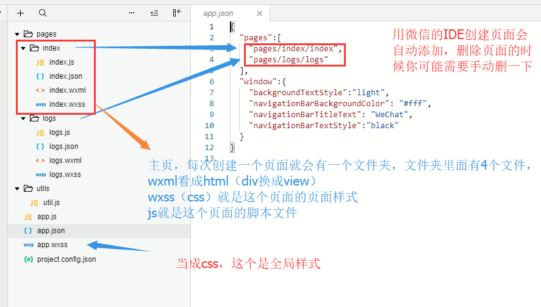

**PS：用法和css一样，在小程序中像素单位全部用`rpx`（类似于`rem`）**
> `rpx`: 可以根据屏幕宽度进行自适应，文档：<https://developers.weixin.qq.com/miniprogram/dev/framework/view/wxss.html>

**PS：小程序支持的标签**：<https://developers.weixin.qq.com/miniprogram/dev/component/>

下面开始就记录下遇到的**小技术点**：

### 2.2.页面初始数据的使用

源码：<https://github.com/lotapp/BaseCode/tree/master/javascript/5.wechat/base/pages/1data>

#### 2.2.1.获取

在页面的data中定义了几个字段：


想在页面中显示只需要写成`{{xxx}}`即可
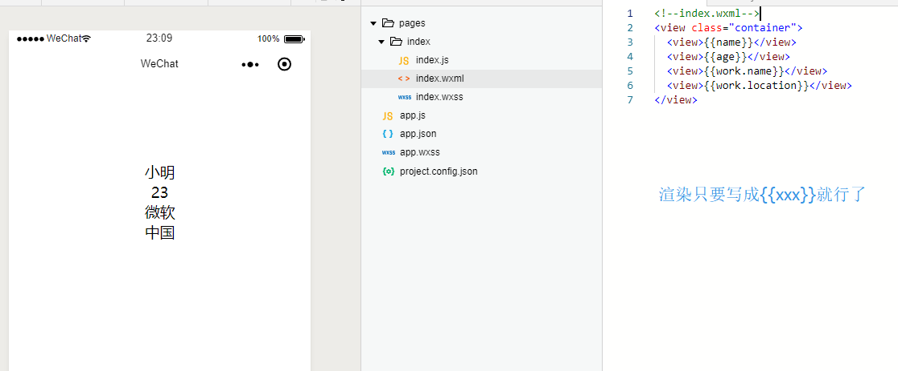

**PS：你每次保存，左边都会有预览的**

---

**`{{xxx}}`也可以在样式和属性中哦~**（`wxss和css用法一样`）

贴下demo：（支持的标签看官方文档即可）
```html
<!--index.wxml-->
<view class='container'>
  <view class='{{my_class}}'>{{name}}</view>
  <view>{{age}}</view>
  <view>{{work.name}}</view>
  <view>{{work.location}}</view>
</view>
```
脚本：（支持ES6语法）
```js
//index.js
Page({
  data: {
    name: "小明",
    age: 23,
    work: {
      "name": "微软",
      "location": "中国"
    },
    my_class: "red"
  },
  onLoad: function() {
    console.log("页面加载完成");
  }
})
```
样式：
```css
/* index.wxss */
view {
  padding: 10rpx;
}

.red {
  color: red;
}
```
效果演示：
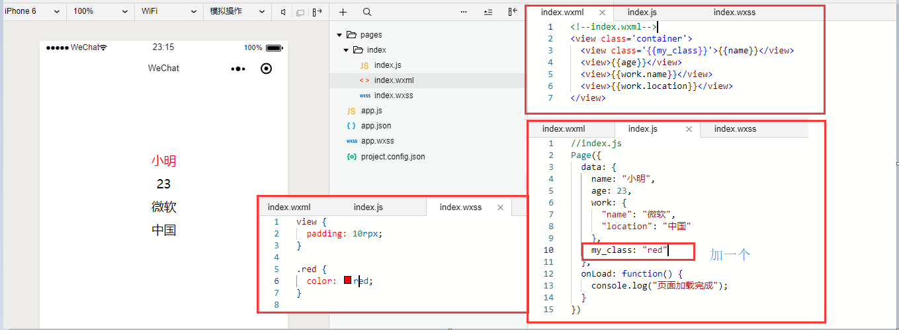

---

#### 2.2.2.设置

`知识点`：
- **获取：`this.data.xxx`**
- **设置：`this.setData({xxx:xx})`**
- **绑定事件：在标签中添加`bindtap="自定义方法"`属性**

来个修改页面初始数据的案例：（官方说先修改js中的值，然后异步修改页面中的值）
```html
<!--index.wxml-->
<view class='container'>
  <view class='{{my_class}}'>{{name}}</view>
  <view>{{age}}</view>
  <view>{{work.name}}</view>
  <view>{{work.location}}</view>
  <button bindtap='update_info'>点我就修改</button>
</view>
```
脚本文件：
```js
//index.js
Page({
  data: {
    name: "小明",
    age: 23,
    work: {
      "name": "微软",
      "location": "中国"
    },
    my_class: "red"
  },
  onLoad: function() {
    console.log("页面加载完成");
  },
  // 自定义方法  // look：新增内容
  update_info: function() {
    // this对象经常容易变，我一般都存一份
    var that = this;
    // 后台获取data里的值
    console.log(that.data.name, that.data.age)
    // 修改data(直接赋值没用)
    that.setData({
      age: 25,
      name: "小华",
      work: {
        "name": "苹果",
        "location": "美国"
      }
    });
  }
})
```
效果展示：
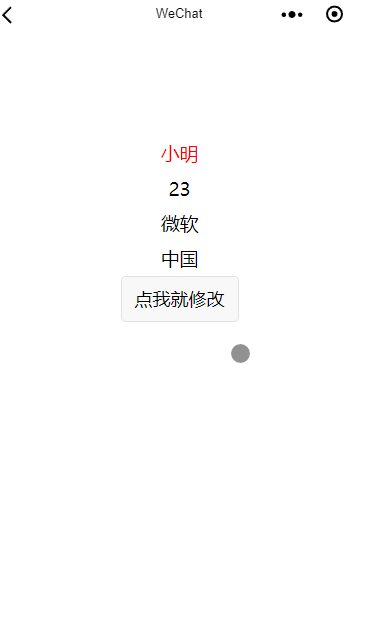

---

## 3.弹框提醒

官方文档：<https://developers.weixin.qq.com/miniprogram/dev/api/wx.showToast.html>

源码：<https://github.com/lotapp/BaseCode/tree/master/javascript/5.wechat/base/pages/2show>

**知识点：`wx.showToast({title:'内容',icon:'什么图标',duration:多少毫秒})`**

在View中添加按钮：
```html
<button bindtap='show_msg1'>点我弹两行</button>
<button bindtap='show_msg2'>点我就成功</button>
```
脚本中添加自定义方法：
```js
Page({
  data: {
    title1: '你知道吗？这是可以显示多行的弹框提醒~\r\n你知道吗？这是可以显示多行的弹框提醒~\r\n你知道吗？这是可以显示多行的弹框提醒~',
    title2: '一二三四五六七八'
  },
  onLoad: function() {
    console.log("页面加载完成");
  },
  // 弹框提醒
  show_msg1: function() {
    wx.showToast({
      title: this.data.title1,
      icon: 'none', // 可以显示2行
      duration: 2000 // 默认1500
    })
  },
  // 弹框提醒
  show_msg2: function() {
    // 默认只能显示7个中文字
    wx.showToast({
      title: this.data.title2
    })
  }
})
```
效果演示：（**`\r\n`可能在PC调试的时候不换行，但是可以在手机中换行**）
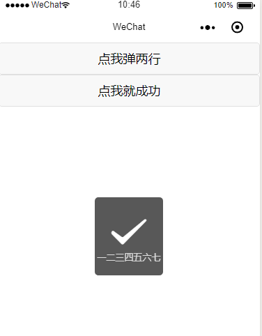
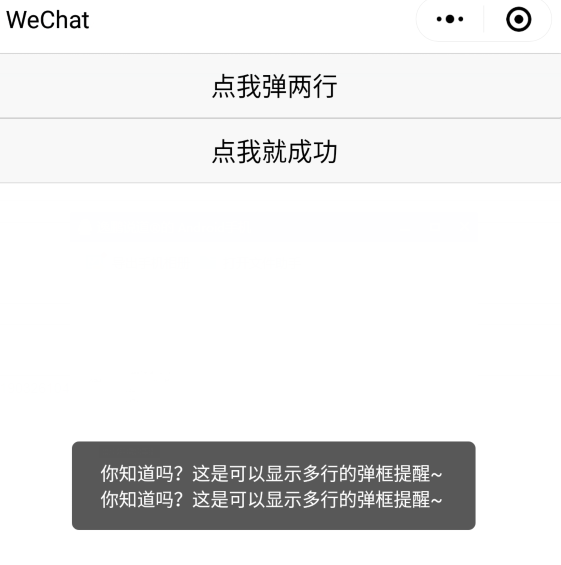

---

## 4.页面自定义属性值

源码：<https://github.com/lotapp/BaseCode/tree/master/javascript/5.wechat/base/pages/3data>

### 4.1.H5的自定义属性值

说这个之前，先普及一下H5的这方面知识：
**`自定义属性`**：在标签中的`data-自定义属性名`（为了规范化）
1. 获取自定义属性：`dom.dataset.自定义属性名` or `dom.dataset["自定义属性名"]`
2. 设置自定义属性：`dom.dataset.自定义属性名 = xxx` or `dom.dataset["自定义属性名"] = xxx`
3. 删除自定义属性：`delete dom.dataset.自定义属性名` or `delete dom.dataset["自定义属性名"]`
4. 一般属性：
    - 获取某个属性：`dom.getAttribute("属性名")`
    - 删除某个属性：`dom.removeAttribute("属性名")`
    - 设置某个属性：`dom.setAttribute("属性名", "值")`
    - 是否包含属性：`dom.hasAttribute("属性名")`

举个栗子：
```html
<div class="test" data-name="mmd" data-test-one="test">自定义属性</div>
<script>
    // 获取标签的自定义属性值
    let list = document.querySelector(".test").dataset;
    // 获取：dom.dataset.自定义属性名（属性名不包含`data-`)
    console.log(list.name);
    // PS：test-one名字会改成驼峰命名的变量：testOne
    console.log(list.testOne)
    // 设置：dom.dataset.自定义属性名 = xxx or dataset[自定义属性名] = xxx
    list.name = "小明"; // 标签中对应值会变成小明
    list.age = 23; // 添加一个属性
    // PS：设置为data-test-two
    list.testTwo = "test2";
</script>
```
输出效果：
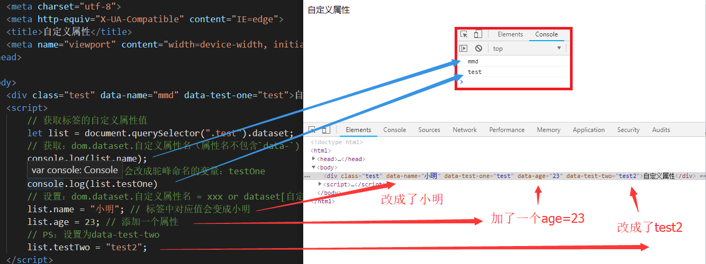

### 4.2.小程序版

官方文档：<https://developers.weixin.qq.com/miniprogram/dev/framework/view/wxml/event.html>

**知识点：`设置hover样式`：在标签内置了`hover-class="xxx"`属性**

view：
```html
<view class='container'>
  <view data-name='小张' data-age='22' bindtap='get_datas' hover-class='hover'>点我获取data值</view>
</view>
```
js：（ES6语法忘记的同志可以去之前写的<a href="https://www.cnblogs.com/dotnetcrazy/p/10061671.html" target="_blank">一文读懂ES6</a>）
```js
Page({
  data: {
    title: '获取Data属性的值'
  },
  onLoad: function(options) {
    // 设置标题
    wx.setNavigationBarTitle({
      title: this.data.title,
    });
  },
  get_datas: function(e) {
    console.log(e);
    let infos = e.currentTarget.dataset;
    // 显示弹框
    wx.showToast({
      title: `Name：${infos.name}，Age：${infos.age}`, // ES6语法
      icon: 'none'
    })
  }
})
```
样式：
```css
.hover {
  color: green;
}
```
动态演示：
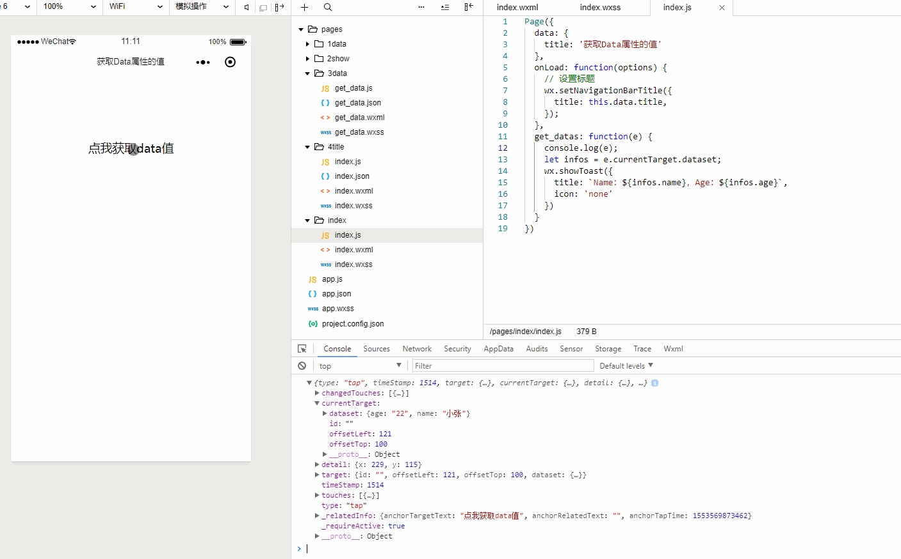

---

## 5.小程序标题

官方文档：<https://developers.weixin.qq.com/miniprogram/dev/api/wx.setNavigationBarTitle.html>

源码：<https://github.com/lotapp/BaseCode/tree/master/javascript/5.wechat/base/pages/4title>

**知识点：`wx.setNavigationBarTitle({title:"xxx"})`**

view：
```html
<view class='container'>
  <text>这是一个测试页面</text>
</view>
```
js文件：
```js
Page({
  data: {
    title: '欢迎光临'
  },
  onLoad: function(options) {
    // 设置标题
    wx.setNavigationBarTitle({
      title: this.data.title,
    });
  }
})
```
效果演示：
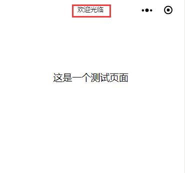

---

## 6.拨打电话

官方文档：<https://developers.weixin.qq.com/miniprogram/dev/api/wx.makePhoneCall.html>

源码：<https://github.com/lotapp/BaseCode/tree/master/javascript/5.wechat/base/pages/6tel>

**知识点：`wx.makePhoneCall({phoneNumber:"xx"})`**

view:
```html
<view class='container'>
  <view hover-class='hover'>
    <text data-tel='{{tel}}' bindtap='call_tel'>{{info}}{{tel}}</text>
  </view>
</view>
```
js：
```js
Page({
  data: {
    info: "客服电话：",
    tel: "95017"
  },
  onLoad: function(options) {},
  call_tel: function() {
    // 打电话
    wx.makePhoneCall({
      phoneNumber: this.data.tel
    });
  }
})
```
动态演示：
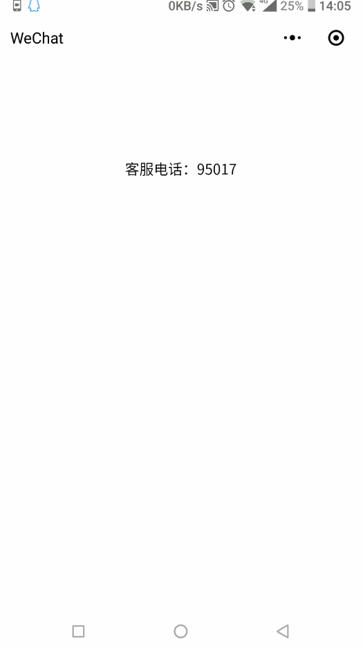

---

## 7.图片背景

源码：<https://github.com/lotapp/BaseCode/tree/master/javascript/5.wechat/base/pages/5img>

### 7.1.背景图片

这个和html一样，CSS3就可以实现了

wxml:
```html
<view class='container bg'>
  <view>This is Test</view>
</view>
```
wxss:
```css
.container {
  height: 1500rpx;
}

.bg {
  /* 设置背景图片的尺寸 */
  background-size: 100% 100%; /* CSS3 */
  /* 不支持本地图片，可以使用Base64或者允许域名下的图片 */
  background-image: url(data:image/jpeg;base64,/9j/4AAQSkZJ...省略);
}
```
动态展示：
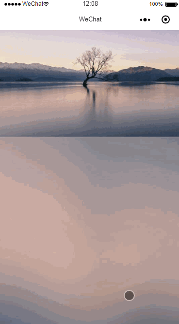

### 7.2.页面填充

官方文档：<https://developers.weixin.qq.com/miniprogram/dev/component/image.html>

**PS：图片懒加载：`lazy-load="true"`**

wxml:
```html
<view class='container'>
  <!-- 高度自适应 -->
  <image class="bg" src="../../images/bg.jpg" mode="widthFix"></image>
</view>
```
wxss:
```css
.container {
  padding: 0rpx;
}

.bg {
  width: 100%;
}
```
动态展示：


### 7.3.新思路

其实很多时候都是因为height设置100%，它不生效，所以才各种样式来调节

可以这样设置来达到目的：**`设置宽度100%，高度100vh`**（整个屏幕默认满屏为100vh）
> PS：地图用的比较多

扩展：
- <a href="https://blog.csdn.net/qq_31496003/article/details/81095614">微信小程序之图片处理</a>
- <a href="https://www.jianshu.com/p/0d0a0c7da4d3">关于小程序widthFix图片高度不能自适应的问题</a>

---

## 8.页面跳转

源码：<https://github.com/lotapp/BaseCode/tree/master/javascript/5.wechat/base/pages/7goto>

`知识点`：
- **通过方法跳转：`wx.navigateTo({url:"url地址"})`**
    - 官方文档：<https://developers.weixin.qq.com/miniprogram/dev/api/wx.navigateTo.html>
- **页面直接跳转：`<navigator url='url地址'>xxx</navigator>`**
    - 官方文档：<https://developers.weixin.qq.com/miniprogram/dev/component/navigator.html>
    - PS：**`open-type`**属性可以关注一下：
演示demo：

先看一下目录结构：
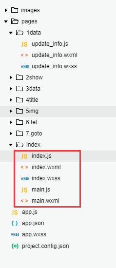

index页面
```html
<view class='container'>
  <view>
    <navigator url='{{url}}' hover-class='hover'>链接跳转</navigator>
  </view>
  <view hover-class='hover' bindtap='to_page' data-url='{{url}}'>方法跳转</view>
  <view hover-class='hover' bindtap='goto_page' data-url='{{url2}}'>带参跳转</view>
</view>
```
index脚本：
```js
Page({
  data: {
    name: '小明',
    age: 22,
    url: '../1data/update_info',
    url2: './main'
  },
  onLoad: function(options) {

  },
  to_page: e => {
    // 页面跳转
    wx.navigateTo({
      url: e.currentTarget.dataset.url
    })
  },
  goto_page: function(e) {
    var that = this;
    // 页面跳转
    wx.navigateTo({
      url: `${e.currentTarget.dataset.url}?name=${that.data.name}&age=${that.data.age}`
    });
  }
})
```
main页面：
```html
<view class='container'>
  <view>{{name}}</view>
  <view>{{age}}</view>
</view>
```
main脚本：
```js
Page({
  data: {},
  onLoad: function(pms) {
    console.log(pms);

    var that = this;
    // 设置data值
    this.setData({
      name: pms.name,
      age: pms.age
    });
  }
})
```
动态演示：
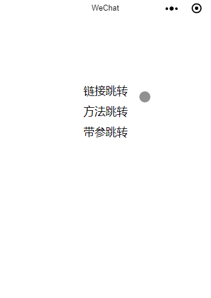

这些东西都是用API，算是比较简单的了，就是找起来麻烦点，时间不早了，地图这块我再贴一个案例就先结束吧

## 9.地图相关

源码：<https://github.com/lotapp/BaseCode/tree/master/javascript/5.wechat/base/pages/8map>

### 9.1.简单案例

`知识点`：
- **`wx.getLocation({success:成功执行的方法,fail:失败执行的方法})`：获取经纬度**
- **`wx.openLocation({latitude: 经度值, longitude: 纬度值})`：显示对应位置的地图**

wxml：
```html
<view>
  <button bindtap='get_location'>{{demo1}}</button>
  <button bindtap='open_location'>{{demo2}}</button>
</view>
```
js源码：
```js
Page({
  data: {
    demo1: '获取经纬',
    demo2: '打开地图',
    lon: 120.636146,
    lat: 31.25893
  },
  onLoad: function(options) {},
  // 需要使用this的时候，最外面方法老老实实写function()
  get_location: function() {
    var that = this;
    // 获取经纬度
    wx.getLocation({
      // 成功的时候
      success: res => {
        console.log(res.latitude, res.longitude, res.speed, res.accuracy);
        // 更新页面数据
        that.setData({
          lon: res.longitude,
          lat: res.latitude
        });
        // 弹框提醒
        wx.showToast({
          title: `(${res.longitude}，${res.latitude})`, // ES6语法
          icon: 'none'
        });
      },
      // 失败的时候
      fail: ex => {
        // 弹框提醒
        wx.showToast({
          title: '定位未授权，请重新授权：\r\n删除小程序后再打开',
          icon: 'none'
        });
      }
    });
  },
  // 打开位置
  open_location: function() {
    var that = this;
    // 打开位置
    wx.openLocation({
      latitude: that.data.lat,
      longitude: that.data.lon
    });
  }
})
```
**简单说下成功之后的参数含义**：
- `res.longitude`：经度
- `res.latitude`：纬度
- `res.speed`：移动速度（实时定位的时候用的多）
- `res.accuracy`：精确度（一般低于50，经纬数据就偏差太多）

失败摸拟：
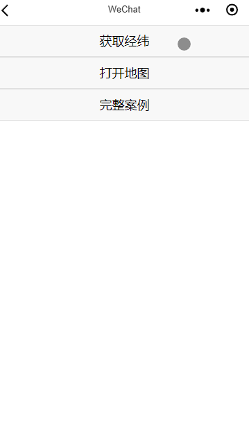

成功摸拟：
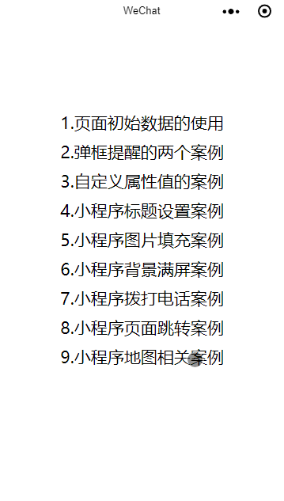

**额外说明：需要配置一下你需要使用的权限**


PS：授权之后，在开发的时候可以清楚状态（现实中重新授权需要`删除小程序再打开`）
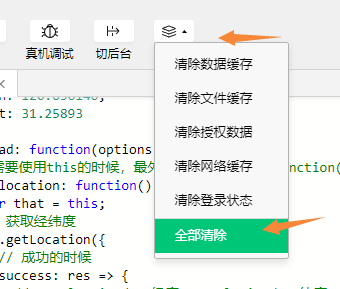

---

### 9.2.Map组件

官方文档：<https://developers.weixin.qq.com/miniprogram/dev/component/map.html>

#### 1.简单案例扩展

先看下简单案例的扩展：

**在打开地图的时候指定`address`** 可以更人性化显示：
```js
Page({
  data: {
    lon: 120.674297,
    lat: 31.324571
  },
open_location: function() {
    var that = this;
    // 打开位置
    wx.openLocation({
      latitude: that.data.lat,
      longitude: that.data.lon,
      // scale: 10, // 缩放级别（5~18）默认是18
      address: '江苏省苏州市工业园区都市花园' // 这个信息可以通过地图api逆向解析
    });
  }
})
```
效果：
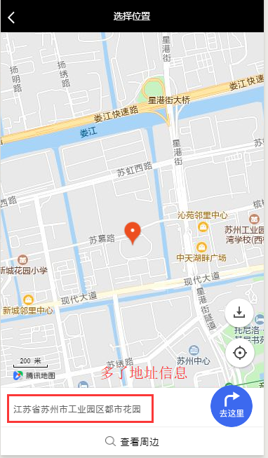

#### 2.Map组件案例

`知识点`：
- **`show-location`：显示当前定位点**
- **`markers`：多个标识**
- **`bindmarkertap`：标记点击事件**
- **满屏设置：`width:100%;height:100vh`**

wxml：
```html
<view>
  <map longitude='{{lon}}' latitude='{{lat}}' markers='{{markers}}' show-location='true' bindmarkertap='makertap' style='width:100%;height:100vh'></map>
  <!--  -->
</view>
```
JS：
```js
Page({
  data: {
    lon: 120.674297,
    lat: 31.324571,
    markers: []
  },
  // 页面加载
  onLoad: function() {
    var that = this;
    // eg：可以通过baidu Map获取到markers信息
    // BMap.regeocoding({success: ret => {ret.wxMarkerData}});
    // 假设通过API获取到了数据
    that.setData({
      markers: [{
        id: 0,
        latitude: that.data.lat,
        longitude: that.data.lon,
        address: '江苏省苏州市工业园区都市花园',
        iconPath: '/images/marker_red.png',
        callout: {
          'content': '江苏省苏州市工业园区都市花园',
          'bgColor': '#fff',
          'color': '#f00',
          'padding': 15,
          'display': 'ALWAYS', // BYCLICK：点击显示
          'borderRadius': 5
        }
      }]
    });
  },
  // 标记点击事件
  makertap: function(e) {
    var that = this;
    // 提示
    wx.showToast({
      title: `点击了标记点${e.markerId}`,
      icon: 'none'
    });
    // 可以根据e.markerId获取marker信息
    console.log(that.data.markers[e.markerId]);
  }
})
```
动态演示：
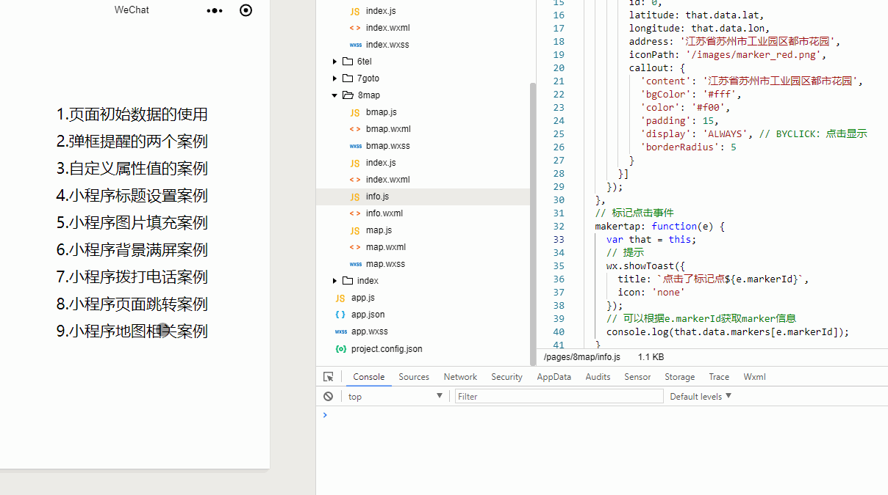

PS：可以通过经纬信息来获取对应的位置信息（`最后一个百度地图的demo里有贴`）
> 官方文档：<http://lbsyun.baidu.com/index.php?title=wxjsapi/guide/getlocation>

我还写了一个惯连的案例，这边就不演示了，给大家课后自测吧：
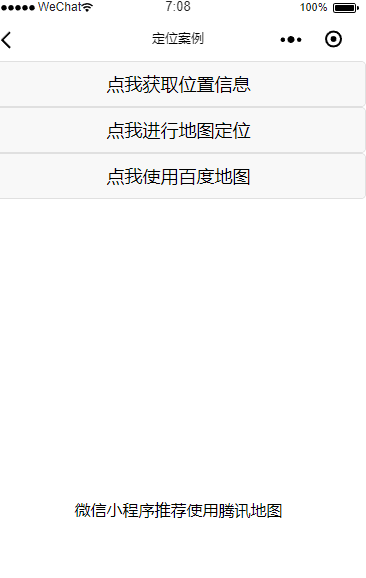

PS：在使用外部链接的时候需要添加到白名单中（补充说明里有贴哦~）

## 补充说明

### 1.关于调试

开发的时候可以在手机中预览，也可以真机调试把输出信息直接显示到PC端：
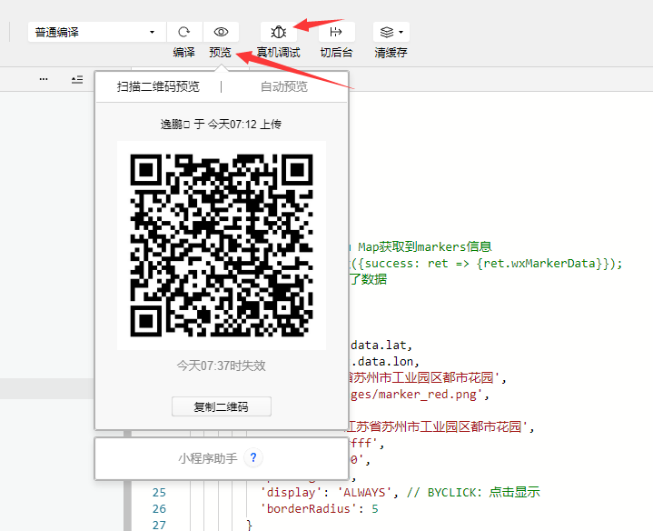

手机调试可以打开调试模式：
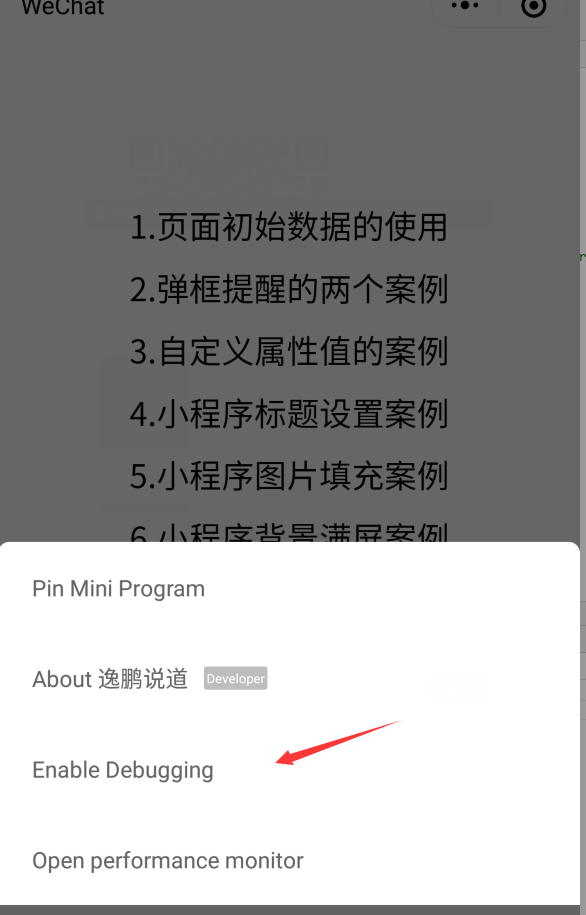

之后的操作都会记录，而且控制台输出也会显示：
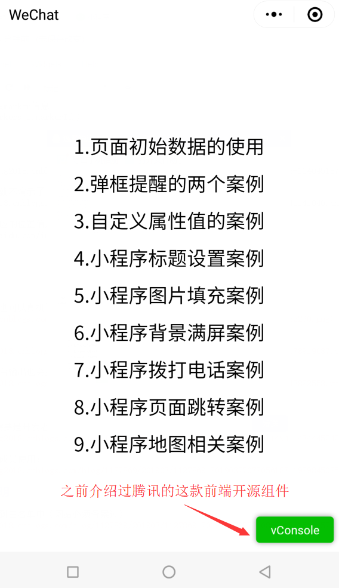
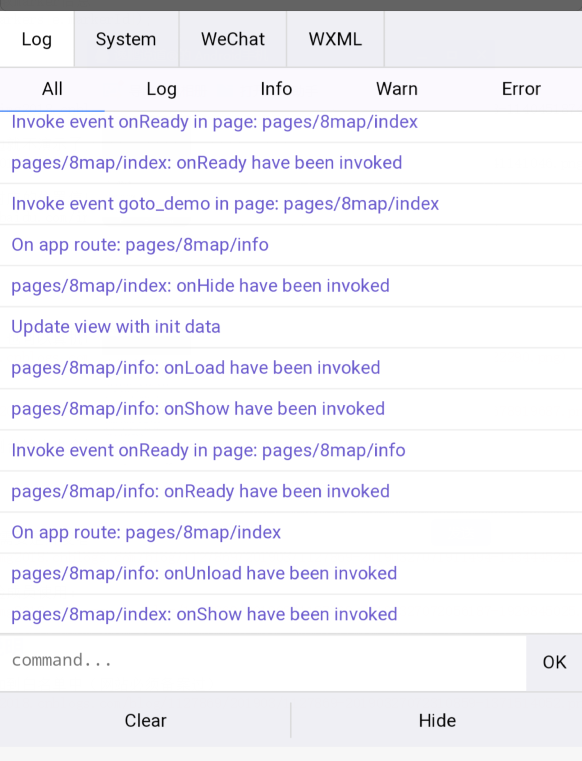

### 2.关于开发者设置

有了AppID，并不可以开发，还需要是开发者|管理员：
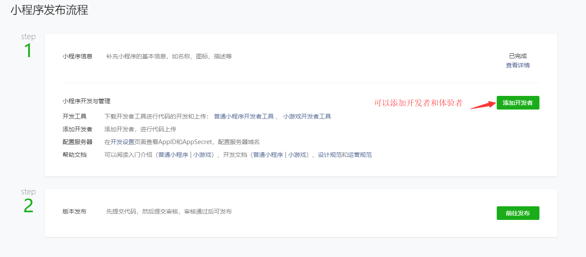

在没有上线前，职工开发和体验成员使用：
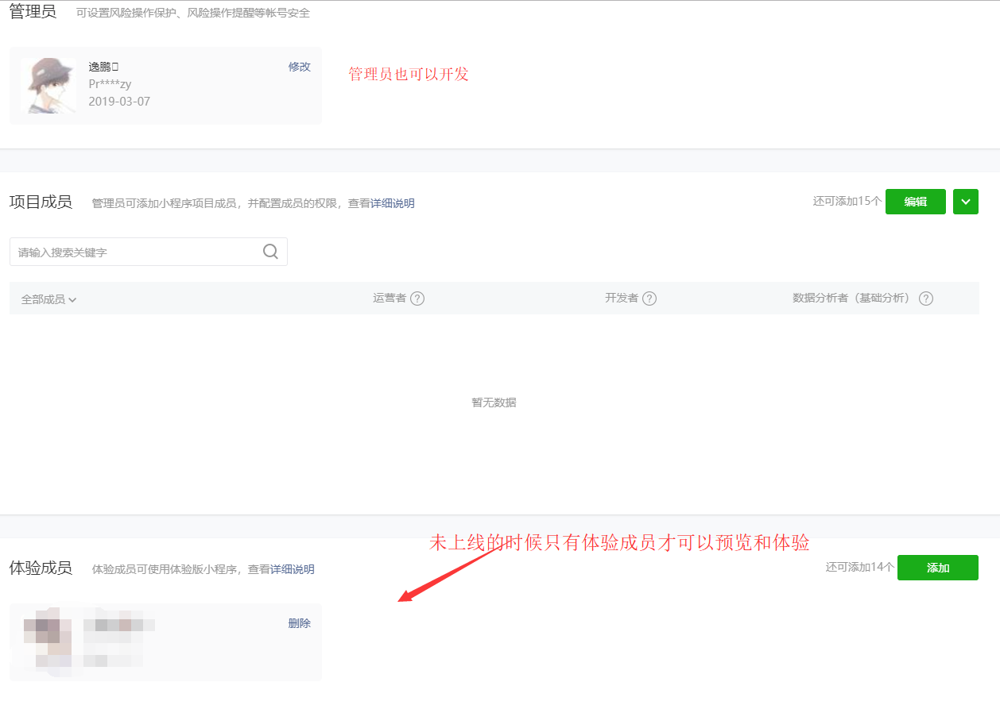

### 3.关于网络资源的说明

在使用外部链接的时候需要添加到白名单中（网站必须备案过）
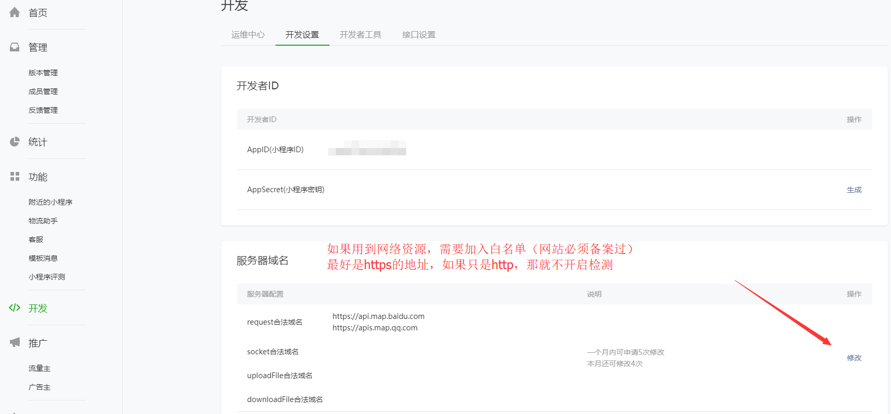

### 4.发布和预览

先要上传代码：
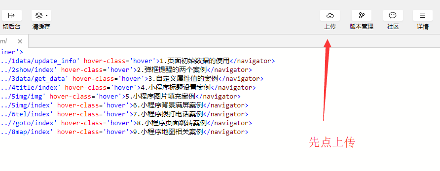
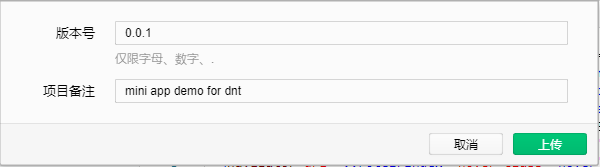

这时候可以选择
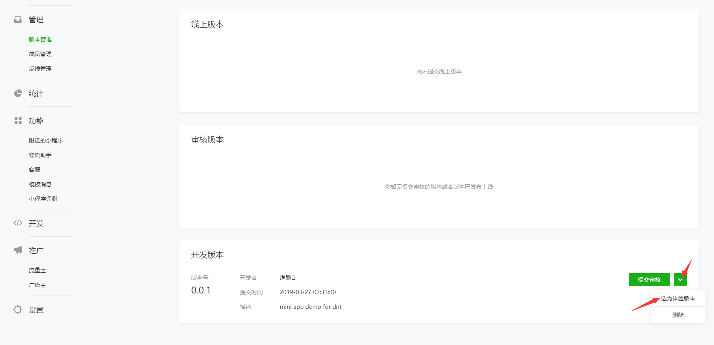
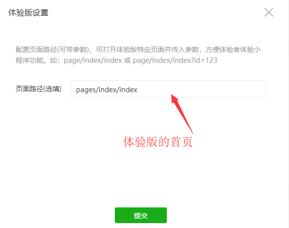
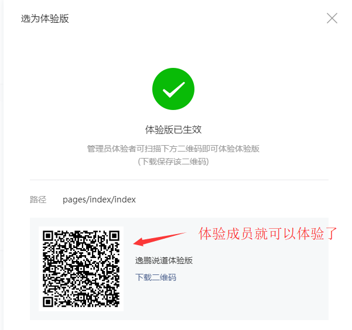

PS：提交核审后就可以上线了（不推荐把自己做的demo提交核审，腾讯会处罚的~）

现在小程序提供了`云开发`的API（可以当做`数据库`+`文件上传下载`）感兴趣的可以先了解下：
> <https://developers.weixin.qq.com/miniprogram/dev/wxcloud/basis/getting-started.html>
