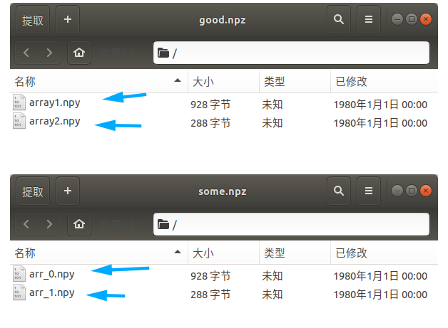

## 1.数组定义、常见属性

引入一下`Numpy`模块，`Numpy`的数组使用可以查看一下帮助文档，`Numpy`的`array`数组类型必须是一致的（后面会讲）


```python
# 导入Numpy模块
import numpy as np
```


```python
help(np.array) #或者用 np.array? 查看
```

    Help on built-in function array in module numpy.core.multiarray:
    
    array(...)
        array(object, dtype=None, copy=True, order='K', subok=False, ndmin=0)
        
        Create an array.
        
        Parameters
        ----------
        object : array_like
            An array, any object exposing the array interface, an object whose
            __array__ method returns an array, or any (nested) sequence.
        dtype : data-type, optional
            The desired data-type for the array.  If not given, then the type will
            be determined as the minimum type required to hold the objects in the
            sequence.  This argument can only be used to 'upcast' the array.  For
            downcasting, use the .astype(t) method.
        copy : bool, optional
            If true (default), then the object is copied.  Otherwise, a copy will
            only be made if __array__ returns a copy, if obj is a nested sequence,
            or if a copy is needed to satisfy any of the other requirements
            (`dtype`, `order`, etc.).
        order : {'K', 'A', 'C', 'F'}, optional
            Specify the memory layout of the array. If object is not an array, the
            newly created array will be in C order (row major) unless 'F' is
            specified, in which case it will be in Fortran order (column major).
            If object is an array the following holds.
        
            ===== ========= ===================================================
            order  no copy                     copy=True
            ===== ========= ===================================================
            'K'   unchanged F & C order preserved, otherwise most similar order
            'A'   unchanged F order if input is F and not C, otherwise C order
            'C'   C order   C order
            'F'   F order   F order
            ===== ========= ===================================================
        
            When ``copy=False`` and a copy is made for other reasons, the result is
            the same as if ``copy=True``, with some exceptions for `A`, see the
            Notes section. The default order is 'K'.
        subok : bool, optional
            If True, then sub-classes will be passed-through, otherwise
            the returned array will be forced to be a base-class array (default).
        ndmin : int, optional
            Specifies the minimum number of dimensions that the resulting
            array should have.  Ones will be pre-pended to the shape as
            needed to meet this requirement.
        
        Returns
        -------
        out : ndarray
            An array object satisfying the specified requirements.
        
        See Also
        --------
        empty, empty_like, zeros, zeros_like, ones, ones_like, full, full_like
        
        Notes
        -----
        When order is 'A' and `object` is an array in neither 'C' nor 'F' order,
        and a copy is forced by a change in dtype, then the order of the result is
        not necessarily 'C' as expected. This is likely a bug.
        
        Examples
        --------
        >>> np.array([1, 2, 3])
        array([1, 2, 3])
        
        Upcasting:
        
        >>> np.array([1, 2, 3.0])
        array([ 1.,  2.,  3.])
        
        More than one dimension:
        
        >>> np.array([[1, 2], [3, 4]])
        array([[1, 2],
               [3, 4]])
        
        Minimum dimensions 2:
        
        >>> np.array([1, 2, 3], ndmin=2)
        array([[1, 2, 3]])
        
        Type provided:
        
        >>> np.array([1, 2, 3], dtype=complex)
        array([ 1.+0.j,  2.+0.j,  3.+0.j])
        
        Data-type consisting of more than one element:
        
        >>> x = np.array([(1,2),(3,4)],dtype=[('a','<i4'),('b','<i4')])
        >>> x['a']
        array([1, 3])
        
        Creating an array from sub-classes:
        
        >>> np.array(np.mat('1 2; 3 4'))
        array([[1, 2],
               [3, 4]])
        
        >>> np.array(np.mat('1 2; 3 4'), subok=True)
        matrix([[1, 2],
                [3, 4]])
    


### 1.1.通过List创建数组

`np.array(list)`

**注意**：

`print(np.array([1,2,3,4,5]))`和`np.array([1,2,3,4,5])`

**在交互摸索下显示是稍微有点区别的**，千万别以为是不一样的东西


```python
# 构造一个list1
list1 = list(range(10))
print(list1)

# 通过List创建一个一维数组
array1 = np.array(list1)

print(array1)
type(array1)
```

    [0, 1, 2, 3, 4, 5, 6, 7, 8, 9]
    [0 1 2 3 4 5 6 7 8 9]


    numpy.ndarray


```python
# 你直接写也一样
test_array = np.array([0, 1, 2, 3, 4, 5, 6, 7, 8, 9])

print(test_array)
type(test_array)
```

    [0 1 2 3 4 5 6 7 8 9]


    numpy.ndarray


```python
# 创建一个嵌套列表
list2 = [list1,list1]
print(list2)

# 通过嵌套列表创建二维数组
array2 = np.array(list2)
print(array2)
```

    [[0, 1, 2, 3, 4, 5, 6, 7, 8, 9], [0, 1, 2, 3, 4, 5, 6, 7, 8, 9]]
    [[0 1 2 3 4 5 6 7 8 9]
     [0 1 2 3 4 5 6 7 8 9]]


```python
# 创建3维数组
array3 = np.array([
    [[1,2,3],[4,5,6],[7,8,9]],
    [[1,2,3],[4,5,6],[7,8,9]]
])

print(array3)
type(array3)
```

    [[[1 2 3]
      [4 5 6]
      [7 8 9]]
    
     [[1 2 3]
      [4 5 6]
      [7 8 9]]]


    numpy.ndarray


```python
################### 扩展部分 ########################

# 其实你通过元组创建也一样，只是官方演示文档里面用的是list

# 逆天推荐使用列表（和官方文档一致嘛）
```


```python
# 一维数组
np.array((1,2,3,4,5))
```


    array([1, 2, 3, 4, 5])


```python
# 都是一个数组，你print和直接输入名字是稍微有点区别的
# 千万别以为是不一样东西

print(np.array((1,2,3,4,5)))
```

    [1 2 3 4 5]


```python
# 二维数组
np.array(((1,2,3),(4,5,6)))
```


    array([[1, 2, 3],
           [4, 5, 6]])


```python
# 二维数组，这种方式也一样
np.array(([1,2,3],[4,5,6]))
```


    array([[1, 2, 3],
           [4, 5, 6]])


### 1.2.常用属性

`ndim` 查看数组维度

`shape` 查看数组形状

`size` 查看数组含有多少元素（行*列）

`dtype` 查看元素的数据类型


```python
help(array2)
```

    Help on ndarray object:
    
    class ndarray(builtins.object)
     |  ndarray(shape, dtype=float, buffer=None, offset=0,
     |          strides=None, order=None)
     |  
     |  An array object represents a multidimensional, homogeneous array
     |  of fixed-size items.  An associated data-type object describes the
     |  format of each element in the array (its byte-order, how many bytes it
     |  occupies in memory, whether it is an integer, a floating point number,
     |  or something else, etc.)
     |  
     |  Arrays should be constructed using `array`, `zeros` or `empty` (refer
     |  to the See Also section below).  The parameters given here refer to
     |  a low-level method (`ndarray(...)`) for instantiating an array.
     |  
     |  For more information, refer to the `numpy` module and examine the
     |  methods and attributes of an array.
     |  
     |  Parameters
     |  ----------
     |  (for the __new__ method; see Notes below)
     |  
     |  shape : tuple of ints
     |      Shape of created array.
     |  dtype : data-type, optional
     |      Any object that can be interpreted as a numpy data type.
     |  buffer : object exposing buffer interface, optional
     |      Used to fill the array with data.
     |  offset : int, optional
     |      Offset of array data in buffer.
     |  strides : tuple of ints, optional
     |      Strides of data in memory.
     |  order : {'C', 'F'}, optional
     |      Row-major (C-style) or column-major (Fortran-style) order.
     |  
     |  Attributes
     |  ----------
     |  T : ndarray
     |      Transpose of the array.
     |  data : buffer
     |      The array's elements, in memory.
     |  dtype : dtype object
     |      Describes the format of the elements in the array.
     |  flags : dict
     |      Dictionary containing information related to memory use, e.g.,
     |      'C_CONTIGUOUS', 'OWNDATA', 'WRITEABLE', etc.
     |  flat : numpy.flatiter object
     |      Flattened version of the array as an iterator.  The iterator
     |      allows assignments, e.g., ``x.flat = 3`` (See `ndarray.flat` for
     |      assignment examples; TODO).
     |  imag : ndarray
     |      Imaginary part of the array.
     |  real : ndarray
     |      Real part of the array.
     |  size : int
     |      Number of elements in the array.
     |  itemsize : int
     |      The memory use of each array element in bytes.
     |  nbytes : int
     |      The total number of bytes required to store the array data,
     |      i.e., ``itemsize * size``.
     |  ndim : int
     |      The array's number of dimensions.
     |  shape : tuple of ints
     |      Shape of the array.
     |  strides : tuple of ints
     |      The step-size required to move from one element to the next in
     |      memory. For example, a contiguous ``(3, 4)`` array of type
     |      ``int16`` in C-order has strides ``(8, 2)``.  This implies that
     |      to move from element to element in memory requires jumps of 2 bytes.
     |      To move from row-to-row, one needs to jump 8 bytes at a time
     |      (``2 * 4``).
     |  ctypes : ctypes object
     |      Class containing properties of the array needed for interaction
     |      with ctypes.
     |  base : ndarray
     |      If the array is a view into another array, that array is its `base`
     |      (unless that array is also a view).  The `base` array is where the
     |      array data is actually stored.
     |  
     |  See Also
     |  --------
     |  array : Construct an array.
     |  zeros : Create an array, each element of which is zero.
     |  empty : Create an array, but leave its allocated memory unchanged (i.e.,
     |          it contains "garbage").
     |  dtype : Create a data-type.
     |  
     |  Notes
     |  -----
     |  There are two modes of creating an array using ``__new__``:
     |  
     |  1. If `buffer` is None, then only `shape`, `dtype`, and `order`
     |     are used.
     |  2. If `buffer` is an object exposing the buffer interface, then
     |     all keywords are interpreted.
     |  
     |  No ``__init__`` method is needed because the array is fully initialized
     |  after the ``__new__`` method.
     |  
     |  Examples
     |  --------
     |  These examples illustrate the low-level `ndarray` constructor.  Refer
     |  to the `See Also` section above for easier ways of constructing an
     |  ndarray.
     |  
     |  First mode, `buffer` is None:
     |  
     |  >>> np.ndarray(shape=(2,2), dtype=float, order='F')
     |  array([[ -1.13698227e+002,   4.25087011e-303],
     |         [  2.88528414e-306,   3.27025015e-309]])         #random
     |  
     |  Second mode:
     |  
     |  >>> np.ndarray((2,), buffer=np.array([1,2,3]),
     |  ...            offset=np.int_().itemsize,
     |  ...            dtype=int) # offset = 1*itemsize, i.e. skip first element
     |  array([2, 3])
     |  
     |  Methods defined here:
     |  
     |  __abs__(self, /)
     |      abs(self)
     |  
     |  __add__(self, value, /)
     |      Return self+value.
     |  
     |  __and__(self, value, /)
     |      Return self&value.
     |  
     |  __array__(...)
     |      a.__array__(|dtype) -> reference if type unchanged, copy otherwise.
     |      
     |      Returns either a new reference to self if dtype is not given or a new array
     |      of provided data type if dtype is different from the current dtype of the
     |      array.
     |  
     |  __array_prepare__(...)
     |      a.__array_prepare__(obj) -> Object of same type as ndarray object obj.
     |  
     |  __array_ufunc__(...)
     |  
     |  __array_wrap__(...)
     |      a.__array_wrap__(obj) -> Object of same type as ndarray object a.
     |  
     |  __bool__(self, /)
     |      self != 0
     |  
     |  __complex__(...)
     |  
     |  __contains__(self, key, /)
     |      Return key in self.
     |  
     |  __copy__(...)
     |      a.__copy__()
     |      
     |      Used if :func:`copy.copy` is called on an array. Returns a copy of the array.
     |      
     |      Equivalent to ``a.copy(order='K')``.
     |  
     |  __deepcopy__(...)
     |      a.__deepcopy__(memo, /) -> Deep copy of array.
     |      
     |      Used if :func:`copy.deepcopy` is called on an array.
     |  
     |  __delitem__(self, key, /)
     |      Delete self[key].
     |  
     |  __divmod__(self, value, /)
     |      Return divmod(self, value).
     |  
     |  __eq__(self, value, /)
     |      Return self==value.
     |  
     |  __float__(self, /)
     |      float(self)
     |  
     |  __floordiv__(self, value, /)
     |      Return self//value.
     |  
     |  __format__(...)
     |      default object formatter
     |  
     |  __ge__(self, value, /)
     |      Return self>=value.
     |  
     |  __getitem__(self, key, /)
     |      Return self[key].
     |  
     |  __gt__(self, value, /)
     |      Return self>value.
     |  
     |  __iadd__(self, value, /)
     |      Return self+=value.
     |  
     |  __iand__(self, value, /)
     |      Return self&=value.
     |  
     |  __ifloordiv__(self, value, /)
     |      Return self//=value.
     |  
     |  __ilshift__(self, value, /)
     |      Return self<<=value.
     |  
     |  __imatmul__(self, value, /)
     |      Return self@=value.
     |  
     |  __imod__(self, value, /)
     |      Return self%=value.
     |  
     |  __imul__(self, value, /)
     |      Return self*=value.
     |  
     |  __index__(self, /)
     |      Return self converted to an integer, if self is suitable for use as an index into a list.
     |  
     |  __int__(self, /)
     |      int(self)
     |  
     |  __invert__(self, /)
     |      ~self
     |  
     |  __ior__(self, value, /)
     |      Return self|=value.
     |  
     |  __ipow__(self, value, /)
     |      Return self**=value.
     |  
     |  __irshift__(self, value, /)
     |      Return self>>=value.
     |  
     |  __isub__(self, value, /)
     |      Return self-=value.
     |  
     |  __iter__(self, /)
     |      Implement iter(self).
     |  
     |  __itruediv__(self, value, /)
     |      Return self/=value.
     |  
     |  __ixor__(self, value, /)
     |      Return self^=value.
     |  
     |  __le__(self, value, /)
     |      Return self<=value.
     |  
     |  __len__(self, /)
     |      Return len(self).
     |  
     |  __lshift__(self, value, /)
     |      Return self<<value.
     |  
     |  __lt__(self, value, /)
     |      Return self<value.
     |  
     |  __matmul__(self, value, /)
     |      Return self@value.
     |  
     |  __mod__(self, value, /)
     |      Return self%value.
     |  
     |  __mul__(self, value, /)
     |      Return self*value.
     |  
     |  __ne__(self, value, /)
     |      Return self!=value.
     |  
     |  __neg__(self, /)
     |      -self
     |  
     |  __new__(*args, **kwargs) from builtins.type
     |      Create and return a new object.  See help(type) for accurate signature.
     |  
     |  __or__(self, value, /)
     |      Return self|value.
     |  
     |  __pos__(self, /)
     |      +self
     |  
     |  __pow__(self, value, mod=None, /)
     |      Return pow(self, value, mod).
     |  
     |  __radd__(self, value, /)
     |      Return value+self.
     |  
     |  __rand__(self, value, /)
     |      Return value&self.
     |  
     |  __rdivmod__(self, value, /)
     |      Return divmod(value, self).
     |  
     |  __reduce__(...)
     |      a.__reduce__()
     |      
     |      For pickling.
     |  
     |  __repr__(self, /)
     |      Return repr(self).
     |  
     |  __rfloordiv__(self, value, /)
     |      Return value//self.
     |  
     |  __rlshift__(self, value, /)
     |      Return value<<self.
     |  
     |  __rmatmul__(self, value, /)
     |      Return value@self.
     |  
     |  __rmod__(self, value, /)
     |      Return value%self.
     |  
     |  __rmul__(self, value, /)
     |      Return value*self.
     |  
     |  __ror__(self, value, /)
     |      Return value|self.
     |  
     |  __rpow__(self, value, mod=None, /)
     |      Return pow(value, self, mod).
     |  
     |  __rrshift__(self, value, /)
     |      Return value>>self.
     |  
     |  __rshift__(self, value, /)
     |      Return self>>value.
     |  
     |  __rsub__(self, value, /)
     |      Return value-self.
     |  
     |  __rtruediv__(self, value, /)
     |      Return value/self.
     |  
     |  __rxor__(self, value, /)
     |      Return value^self.
     |  
     |  __setitem__(self, key, value, /)
     |      Set self[key] to value.
     |  
     |  __setstate__(...)
     |      a.__setstate__(state, /)
     |      
     |      For unpickling.
     |      
     |      The `state` argument must be a sequence that contains the following
     |      elements:
     |      
     |      Parameters
     |      ----------
     |      version : int
     |          optional pickle version. If omitted defaults to 0.
     |      shape : tuple
     |      dtype : data-type
     |      isFortran : bool
     |      rawdata : string or list
     |          a binary string with the data (or a list if 'a' is an object array)
     |  
     |  __sizeof__(...)
     |      __sizeof__() -> int
     |      size of object in memory, in bytes
     |  
     |  __str__(self, /)
     |      Return str(self).
     |  
     |  __sub__(self, value, /)
     |      Return self-value.
     |  
     |  __truediv__(self, value, /)
     |      Return self/value.
     |  
     |  __xor__(self, value, /)
     |      Return self^value.
     |  
     |  all(...)
     |      a.all(axis=None, out=None, keepdims=False)
     |      
     |      Returns True if all elements evaluate to True.
     |      
     |      Refer to `numpy.all` for full documentation.
     |      
     |      See Also
     |      --------
     |      numpy.all : equivalent function
     |  
     |  any(...)
     |      a.any(axis=None, out=None, keepdims=False)
     |      
     |      Returns True if any of the elements of `a` evaluate to True.
     |      
     |      Refer to `numpy.any` for full documentation.
     |      
     |      See Also
     |      --------
     |      numpy.any : equivalent function
     |  
     |  argmax(...)
     |      a.argmax(axis=None, out=None)
     |      
     |      Return indices of the maximum values along the given axis.
     |      
     |      Refer to `numpy.argmax` for full documentation.
     |      
     |      See Also
     |      --------
     |      numpy.argmax : equivalent function
     |  
     |  argmin(...)
     |      a.argmin(axis=None, out=None)
     |      
     |      Return indices of the minimum values along the given axis of `a`.
     |      
     |      Refer to `numpy.argmin` for detailed documentation.
     |      
     |      See Also
     |      --------
     |      numpy.argmin : equivalent function
     |  
     |  argpartition(...)
     |      a.argpartition(kth, axis=-1, kind='introselect', order=None)
     |      
     |      Returns the indices that would partition this array.
     |      
     |      Refer to `numpy.argpartition` for full documentation.
     |      
     |      .. versionadded:: 1.8.0
     |      
     |      See Also
     |      --------
     |      numpy.argpartition : equivalent function
     |  
     |  argsort(...)
     |      a.argsort(axis=-1, kind='quicksort', order=None)
     |      
     |      Returns the indices that would sort this array.
     |      
     |      Refer to `numpy.argsort` for full documentation.
     |      
     |      See Also
     |      --------
     |      numpy.argsort : equivalent function
     |  
     |  astype(...)
     |      a.astype(dtype, order='K', casting='unsafe', subok=True, copy=True)
     |      
     |      Copy of the array, cast to a specified type.
     |      
     |      Parameters
     |      ----------
     |      dtype : str or dtype
     |          Typecode or data-type to which the array is cast.
     |      order : {'C', 'F', 'A', 'K'}, optional
     |          Controls the memory layout order of the result.
     |          'C' means C order, 'F' means Fortran order, 'A'
     |          means 'F' order if all the arrays are Fortran contiguous,
     |          'C' order otherwise, and 'K' means as close to the
     |          order the array elements appear in memory as possible.
     |          Default is 'K'.
     |      casting : {'no', 'equiv', 'safe', 'same_kind', 'unsafe'}, optional
     |          Controls what kind of data casting may occur. Defaults to 'unsafe'
     |          for backwards compatibility.
     |      
     |            * 'no' means the data types should not be cast at all.
     |            * 'equiv' means only byte-order changes are allowed.
     |            * 'safe' means only casts which can preserve values are allowed.
     |            * 'same_kind' means only safe casts or casts within a kind,
     |              like float64 to float32, are allowed.
     |            * 'unsafe' means any data conversions may be done.
     |      subok : bool, optional
     |          If True, then sub-classes will be passed-through (default), otherwise
     |          the returned array will be forced to be a base-class array.
     |      copy : bool, optional
     |          By default, astype always returns a newly allocated array. If this
     |          is set to false, and the `dtype`, `order`, and `subok`
     |          requirements are satisfied, the input array is returned instead
     |          of a copy.
     |      
     |      Returns
     |      -------
     |      arr_t : ndarray
     |          Unless `copy` is False and the other conditions for returning the input
     |          array are satisfied (see description for `copy` input parameter), `arr_t`
     |          is a new array of the same shape as the input array, with dtype, order
     |          given by `dtype`, `order`.
     |      
     |      Notes
     |      -----
     |      Starting in NumPy 1.9, astype method now returns an error if the string
     |      dtype to cast to is not long enough in 'safe' casting mode to hold the max
     |      value of integer/float array that is being casted. Previously the casting
     |      was allowed even if the result was truncated.
     |      
     |      Raises
     |      ------
     |      ComplexWarning
     |          When casting from complex to float or int. To avoid this,
     |          one should use ``a.real.astype(t)``.
     |      
     |      Examples
     |      --------
     |      >>> x = np.array([1, 2, 2.5])
     |      >>> x
     |      array([ 1. ,  2. ,  2.5])
     |      
     |      >>> x.astype(int)
     |      array([1, 2, 2])
     |  
     |  byteswap(...)
     |      a.byteswap(inplace=False)
     |      
     |      Swap the bytes of the array elements
     |      
     |      Toggle between low-endian and big-endian data representation by
     |      returning a byteswapped array, optionally swapped in-place.
     |      
     |      Parameters
     |      ----------
     |      inplace : bool, optional
     |          If ``True``, swap bytes in-place, default is ``False``.
     |      
     |      Returns
     |      -------
     |      out : ndarray
     |          The byteswapped array. If `inplace` is ``True``, this is
     |          a view to self.
     |      
     |      Examples
     |      --------
     |      >>> A = np.array([1, 256, 8755], dtype=np.int16)
     |      >>> map(hex, A)
     |      ['0x1', '0x100', '0x2233']
     |      >>> A.byteswap(inplace=True)
     |      array([  256,     1, 13090], dtype=int16)
     |      >>> map(hex, A)
     |      ['0x100', '0x1', '0x3322']
     |      
     |      Arrays of strings are not swapped
     |      
     |      >>> A = np.array(['ceg', 'fac'])
     |      >>> A.byteswap()
     |      array(['ceg', 'fac'],
     |            dtype='|S3')
     |  
     |  choose(...)
     |      a.choose(choices, out=None, mode='raise')
     |      
     |      Use an index array to construct a new array from a set of choices.
     |      
     |      Refer to `numpy.choose` for full documentation.
     |      
     |      See Also
     |      --------
     |      numpy.choose : equivalent function
     |  
     |  clip(...)
     |      a.clip(min=None, max=None, out=None)
     |      
     |      Return an array whose values are limited to ``[min, max]``.
     |      One of max or min must be given.
     |      
     |      Refer to `numpy.clip` for full documentation.
     |      
     |      See Also
     |      --------
     |      numpy.clip : equivalent function
     |  
     |  compress(...)
     |      a.compress(condition, axis=None, out=None)
     |      
     |      Return selected slices of this array along given axis.
     |      
     |      Refer to `numpy.compress` for full documentation.
     |      
     |      See Also
     |      --------
     |      numpy.compress : equivalent function
     |  
     |  conj(...)
     |      a.conj()
     |      
     |      Complex-conjugate all elements.
     |      
     |      Refer to `numpy.conjugate` for full documentation.
     |      
     |      See Also
     |      --------
     |      numpy.conjugate : equivalent function
     |  
     |  conjugate(...)
     |      a.conjugate()
     |      
     |      Return the complex conjugate, element-wise.
     |      
     |      Refer to `numpy.conjugate` for full documentation.
     |      
     |      See Also
     |      --------
     |      numpy.conjugate : equivalent function
     |  
     |  copy(...)
     |      a.copy(order='C')
     |      
     |      Return a copy of the array.
     |      
     |      Parameters
     |      ----------
     |      order : {'C', 'F', 'A', 'K'}, optional
     |          Controls the memory layout of the copy. 'C' means C-order,
     |          'F' means F-order, 'A' means 'F' if `a` is Fortran contiguous,
     |          'C' otherwise. 'K' means match the layout of `a` as closely
     |          as possible. (Note that this function and :func:`numpy.copy` are very
     |          similar, but have different default values for their order=
     |          arguments.)
     |      
     |      See also
     |      --------
     |      numpy.copy
     |      numpy.copyto
     |      
     |      Examples
     |      --------
     |      >>> x = np.array([[1,2,3],[4,5,6]], order='F')
     |      
     |      >>> y = x.copy()
     |      
     |      >>> x.fill(0)
     |      
     |      >>> x
     |      array([[0, 0, 0],
     |             [0, 0, 0]])
     |      
     |      >>> y
     |      array([[1, 2, 3],
     |             [4, 5, 6]])
     |      
     |      >>> y.flags['C_CONTIGUOUS']
     |      True
     |  
     |  cumprod(...)
     |      a.cumprod(axis=None, dtype=None, out=None)
     |      
     |      Return the cumulative product of the elements along the given axis.
     |      
     |      Refer to `numpy.cumprod` for full documentation.
     |      
     |      See Also
     |      --------
     |      numpy.cumprod : equivalent function
     |  
     |  cumsum(...)
     |      a.cumsum(axis=None, dtype=None, out=None)
     |      
     |      Return the cumulative sum of the elements along the given axis.
     |      
     |      Refer to `numpy.cumsum` for full documentation.
     |      
     |      See Also
     |      --------
     |      numpy.cumsum : equivalent function
     |  
     |  diagonal(...)
     |      a.diagonal(offset=0, axis1=0, axis2=1)
     |      
     |      Return specified diagonals. In NumPy 1.9 the returned array is a
     |      read-only view instead of a copy as in previous NumPy versions.  In
     |      a future version the read-only restriction will be removed.
     |      
     |      Refer to :func:`numpy.diagonal` for full documentation.
     |      
     |      See Also
     |      --------
     |      numpy.diagonal : equivalent function
     |  
     |  dot(...)
     |      a.dot(b, out=None)
     |      
     |      Dot product of two arrays.
     |      
     |      Refer to `numpy.dot` for full documentation.
     |      
     |      See Also
     |      --------
     |      numpy.dot : equivalent function
     |      
     |      Examples
     |      --------
     |      >>> a = np.eye(2)
     |      >>> b = np.ones((2, 2)) * 2
     |      >>> a.dot(b)
     |      array([[ 2.,  2.],
     |             [ 2.,  2.]])
     |      
     |      This array method can be conveniently chained:
     |      
     |      >>> a.dot(b).dot(b)
     |      array([[ 8.,  8.],
     |             [ 8.,  8.]])
     |  
     |  dump(...)
     |      a.dump(file)
     |      
     |      Dump a pickle of the array to the specified file.
     |      The array can be read back with pickle.load or numpy.load.
     |      
     |      Parameters
     |      ----------
     |      file : str
     |          A string naming the dump file.
     |  
     |  dumps(...)
     |      a.dumps()
     |      
     |      Returns the pickle of the array as a string.
     |      pickle.loads or numpy.loads will convert the string back to an array.
     |      
     |      Parameters
     |      ----------
     |      None
     |  
     |  fill(...)
     |      a.fill(value)
     |      
     |      Fill the array with a scalar value.
     |      
     |      Parameters
     |      ----------
     |      value : scalar
     |          All elements of `a` will be assigned this value.
     |      
     |      Examples
     |      --------
     |      >>> a = np.array([1, 2])
     |      >>> a.fill(0)
     |      >>> a
     |      array([0, 0])
     |      >>> a = np.empty(2)
     |      >>> a.fill(1)
     |      >>> a
     |      array([ 1.,  1.])
     |  
     |  flatten(...)
     |      a.flatten(order='C')
     |      
     |      Return a copy of the array collapsed into one dimension.
     |      
     |      Parameters
     |      ----------
     |      order : {'C', 'F', 'A', 'K'}, optional
     |          'C' means to flatten in row-major (C-style) order.
     |          'F' means to flatten in column-major (Fortran-
     |          style) order. 'A' means to flatten in column-major
     |          order if `a` is Fortran *contiguous* in memory,
     |          row-major order otherwise. 'K' means to flatten
     |          `a` in the order the elements occur in memory.
     |          The default is 'C'.
     |      
     |      Returns
     |      -------
     |      y : ndarray
     |          A copy of the input array, flattened to one dimension.
     |      
     |      See Also
     |      --------
     |      ravel : Return a flattened array.
     |      flat : A 1-D flat iterator over the array.
     |      
     |      Examples
     |      --------
     |      >>> a = np.array([[1,2], [3,4]])
     |      >>> a.flatten()
     |      array([1, 2, 3, 4])
     |      >>> a.flatten('F')
     |      array([1, 3, 2, 4])
     |  
     |  getfield(...)
     |      a.getfield(dtype, offset=0)
     |      
     |      Returns a field of the given array as a certain type.
     |      
     |      A field is a view of the array data with a given data-type. The values in
     |      the view are determined by the given type and the offset into the current
     |      array in bytes. The offset needs to be such that the view dtype fits in the
     |      array dtype; for example an array of dtype complex128 has 16-byte elements.
     |      If taking a view with a 32-bit integer (4 bytes), the offset needs to be
     |      between 0 and 12 bytes.
     |      
     |      Parameters
     |      ----------
     |      dtype : str or dtype
     |          The data type of the view. The dtype size of the view can not be larger
     |          than that of the array itself.
     |      offset : int
     |          Number of bytes to skip before beginning the element view.
     |      
     |      Examples
     |      --------
     |      >>> x = np.diag([1.+1.j]*2)
     |      >>> x[1, 1] = 2 + 4.j
     |      >>> x
     |      array([[ 1.+1.j,  0.+0.j],
     |             [ 0.+0.j,  2.+4.j]])
     |      >>> x.getfield(np.float64)
     |      array([[ 1.,  0.],
     |             [ 0.,  2.]])
     |      
     |      By choosing an offset of 8 bytes we can select the complex part of the
     |      array for our view:
     |      
     |      >>> x.getfield(np.float64, offset=8)
     |      array([[ 1.,  0.],
     |         [ 0.,  4.]])
     |  
     |  item(...)
     |      a.item(*args)
     |      
     |      Copy an element of an array to a standard Python scalar and return it.
     |      
     |      Parameters
     |      ----------
     |      \*args : Arguments (variable number and type)
     |      
     |          * none: in this case, the method only works for arrays
     |            with one element (`a.size == 1`), which element is
     |            copied into a standard Python scalar object and returned.
     |      
     |          * int_type: this argument is interpreted as a flat index into
     |            the array, specifying which element to copy and return.
     |      
     |          * tuple of int_types: functions as does a single int_type argument,
     |            except that the argument is interpreted as an nd-index into the
     |            array.
     |      
     |      Returns
     |      -------
     |      z : Standard Python scalar object
     |          A copy of the specified element of the array as a suitable
     |          Python scalar
     |      
     |      Notes
     |      -----
     |      When the data type of `a` is longdouble or clongdouble, item() returns
     |      a scalar array object because there is no available Python scalar that
     |      would not lose information. Void arrays return a buffer object for item(),
     |      unless fields are defined, in which case a tuple is returned.
     |      
     |      `item` is very similar to a[args], except, instead of an array scalar,
     |      a standard Python scalar is returned. This can be useful for speeding up
     |      access to elements of the array and doing arithmetic on elements of the
     |      array using Python's optimized math.
     |      
     |      Examples
     |      --------
     |      >>> x = np.random.randint(9, size=(3, 3))
     |      >>> x
     |      array([[3, 1, 7],
     |             [2, 8, 3],
     |             [8, 5, 3]])
     |      >>> x.item(3)
     |      2
     |      >>> x.item(7)
     |      5
     |      >>> x.item((0, 1))
     |      1
     |      >>> x.item((2, 2))
     |      3
     |  
     |  itemset(...)
     |      a.itemset(*args)
     |      
     |      Insert scalar into an array (scalar is cast to array's dtype, if possible)
     |      
     |      There must be at least 1 argument, and define the last argument
     |      as *item*.  Then, ``a.itemset(*args)`` is equivalent to but faster
     |      than ``a[args] = item``.  The item should be a scalar value and `args`
     |      must select a single item in the array `a`.
     |      
     |      Parameters
     |      ----------
     |      \*args : Arguments
     |          If one argument: a scalar, only used in case `a` is of size 1.
     |          If two arguments: the last argument is the value to be set
     |          and must be a scalar, the first argument specifies a single array
     |          element location. It is either an int or a tuple.
     |      
     |      Notes
     |      -----
     |      Compared to indexing syntax, `itemset` provides some speed increase
     |      for placing a scalar into a particular location in an `ndarray`,
     |      if you must do this.  However, generally this is discouraged:
     |      among other problems, it complicates the appearance of the code.
     |      Also, when using `itemset` (and `item`) inside a loop, be sure
     |      to assign the methods to a local variable to avoid the attribute
     |      look-up at each loop iteration.
     |      
     |      Examples
     |      --------
     |      >>> x = np.random.randint(9, size=(3, 3))
     |      >>> x
     |      array([[3, 1, 7],
     |             [2, 8, 3],
     |             [8, 5, 3]])
     |      >>> x.itemset(4, 0)
     |      >>> x.itemset((2, 2), 9)
     |      >>> x
     |      array([[3, 1, 7],
     |             [2, 0, 3],
     |             [8, 5, 9]])
     |  
     |  max(...)
     |      a.max(axis=None, out=None, keepdims=False)
     |      
     |      Return the maximum along a given axis.
     |      
     |      Refer to `numpy.amax` for full documentation.
     |      
     |      See Also
     |      --------
     |      numpy.amax : equivalent function
     |  
     |  mean(...)
     |      a.mean(axis=None, dtype=None, out=None, keepdims=False)
     |      
     |      Returns the average of the array elements along given axis.
     |      
     |      Refer to `numpy.mean` for full documentation.
     |      
     |      See Also
     |      --------
     |      numpy.mean : equivalent function
     |  
     |  min(...)
     |      a.min(axis=None, out=None, keepdims=False)
     |      
     |      Return the minimum along a given axis.
     |      
     |      Refer to `numpy.amin` for full documentation.
     |      
     |      See Also
     |      --------
     |      numpy.amin : equivalent function
     |  
     |  newbyteorder(...)
     |      arr.newbyteorder(new_order='S')
     |      
     |      Return the array with the same data viewed with a different byte order.
     |      
     |      Equivalent to::
     |      
     |          arr.view(arr.dtype.newbytorder(new_order))
     |      
     |      Changes are also made in all fields and sub-arrays of the array data
     |      type.
     |      
     |      
     |      
     |      Parameters
     |      ----------
     |      new_order : string, optional
     |          Byte order to force; a value from the byte order specifications
     |          below. `new_order` codes can be any of:
     |      
     |          * 'S' - swap dtype from current to opposite endian
     |          * {'<', 'L'} - little endian
     |          * {'>', 'B'} - big endian
     |          * {'=', 'N'} - native order
     |          * {'|', 'I'} - ignore (no change to byte order)
     |      
     |          The default value ('S') results in swapping the current
     |          byte order. The code does a case-insensitive check on the first
     |          letter of `new_order` for the alternatives above.  For example,
     |          any of 'B' or 'b' or 'biggish' are valid to specify big-endian.
     |      
     |      
     |      Returns
     |      -------
     |      new_arr : array
     |          New array object with the dtype reflecting given change to the
     |          byte order.
     |  
     |  nonzero(...)
     |      a.nonzero()
     |      
     |      Return the indices of the elements that are non-zero.
     |      
     |      Refer to `numpy.nonzero` for full documentation.
     |      
     |      See Also
     |      --------
     |      numpy.nonzero : equivalent function
     |  
     |  partition(...)
     |      a.partition(kth, axis=-1, kind='introselect', order=None)
     |      
     |      Rearranges the elements in the array in such a way that value of the
     |      element in kth position is in the position it would be in a sorted array.
     |      All elements smaller than the kth element are moved before this element and
     |      all equal or greater are moved behind it. The ordering of the elements in
     |      the two partitions is undefined.
     |      
     |      .. versionadded:: 1.8.0
     |      
     |      Parameters
     |      ----------
     |      kth : int or sequence of ints
     |          Element index to partition by. The kth element value will be in its
     |          final sorted position and all smaller elements will be moved before it
     |          and all equal or greater elements behind it.
     |          The order all elements in the partitions is undefined.
     |          If provided with a sequence of kth it will partition all elements
     |          indexed by kth of them into their sorted position at once.
     |      axis : int, optional
     |          Axis along which to sort. Default is -1, which means sort along the
     |          last axis.
     |      kind : {'introselect'}, optional
     |          Selection algorithm. Default is 'introselect'.
     |      order : str or list of str, optional
     |          When `a` is an array with fields defined, this argument specifies
     |          which fields to compare first, second, etc.  A single field can
     |          be specified as a string, and not all fields need be specified,
     |          but unspecified fields will still be used, in the order in which
     |          they come up in the dtype, to break ties.
     |      
     |      See Also
     |      --------
     |      numpy.partition : Return a parititioned copy of an array.
     |      argpartition : Indirect partition.
     |      sort : Full sort.
     |      
     |      Notes
     |      -----
     |      See ``np.partition`` for notes on the different algorithms.
     |      
     |      Examples
     |      --------
     |      >>> a = np.array([3, 4, 2, 1])
     |      >>> a.partition(3)
     |      >>> a
     |      array([2, 1, 3, 4])
     |      
     |      >>> a.partition((1, 3))
     |      array([1, 2, 3, 4])
     |  
     |  prod(...)
     |      a.prod(axis=None, dtype=None, out=None, keepdims=False)
     |      
     |      Return the product of the array elements over the given axis
     |      
     |      Refer to `numpy.prod` for full documentation.
     |      
     |      See Also
     |      --------
     |      numpy.prod : equivalent function
     |  
     |  ptp(...)
     |      a.ptp(axis=None, out=None)
     |      
     |      Peak to peak (maximum - minimum) value along a given axis.
     |      
     |      Refer to `numpy.ptp` for full documentation.
     |      
     |      See Also
     |      --------
     |      numpy.ptp : equivalent function
     |  
     |  put(...)
     |      a.put(indices, values, mode='raise')
     |      
     |      Set ``a.flat[n] = values[n]`` for all `n` in indices.
     |      
     |      Refer to `numpy.put` for full documentation.
     |      
     |      See Also
     |      --------
     |      numpy.put : equivalent function
     |  
     |  ravel(...)
     |      a.ravel([order])
     |      
     |      Return a flattened array.
     |      
     |      Refer to `numpy.ravel` for full documentation.
     |      
     |      See Also
     |      --------
     |      numpy.ravel : equivalent function
     |      
     |      ndarray.flat : a flat iterator on the array.
     |  
     |  repeat(...)
     |      a.repeat(repeats, axis=None)
     |      
     |      Repeat elements of an array.
     |      
     |      Refer to `numpy.repeat` for full documentation.
     |      
     |      See Also
     |      --------
     |      numpy.repeat : equivalent function
     |  
     |  reshape(...)
     |      a.reshape(shape, order='C')
     |      
     |      Returns an array containing the same data with a new shape.
     |      
     |      Refer to `numpy.reshape` for full documentation.
     |      
     |      See Also
     |      --------
     |      numpy.reshape : equivalent function
     |      
     |      Notes
     |      -----
     |      Unlike the free function `numpy.reshape`, this method on `ndarray` allows
     |      the elements of the shape parameter to be passed in as separate arguments.
     |      For example, ``a.reshape(10, 11)`` is equivalent to
     |      ``a.reshape((10, 11))``.
     |  
     |  resize(...)
     |      a.resize(new_shape, refcheck=True)
     |      
     |      Change shape and size of array in-place.
     |      
     |      Parameters
     |      ----------
     |      new_shape : tuple of ints, or `n` ints
     |          Shape of resized array.
     |      refcheck : bool, optional
     |          If False, reference count will not be checked. Default is True.
     |      
     |      Returns
     |      -------
     |      None
     |      
     |      Raises
     |      ------
     |      ValueError
     |          If `a` does not own its own data or references or views to it exist,
     |          and the data memory must be changed.
     |          PyPy only: will always raise if the data memory must be changed, since
     |          there is no reliable way to determine if references or views to it
     |          exist.
     |      
     |      SystemError
     |          If the `order` keyword argument is specified. This behaviour is a
     |          bug in NumPy.
     |      
     |      See Also
     |      --------
     |      resize : Return a new array with the specified shape.
     |      
     |      Notes
     |      -----
     |      This reallocates space for the data area if necessary.
     |      
     |      Only contiguous arrays (data elements consecutive in memory) can be
     |      resized.
     |      
     |      The purpose of the reference count check is to make sure you
     |      do not use this array as a buffer for another Python object and then
     |      reallocate the memory. However, reference counts can increase in
     |      other ways so if you are sure that you have not shared the memory
     |      for this array with another Python object, then you may safely set
     |      `refcheck` to False.
     |      
     |      Examples
     |      --------
     |      Shrinking an array: array is flattened (in the order that the data are
     |      stored in memory), resized, and reshaped:
     |      
     |      >>> a = np.array([[0, 1], [2, 3]], order='C')
     |      >>> a.resize((2, 1))
     |      >>> a
     |      array([[0],
     |             [1]])
     |      
     |      >>> a = np.array([[0, 1], [2, 3]], order='F')
     |      >>> a.resize((2, 1))
     |      >>> a
     |      array([[0],
     |             [2]])
     |      
     |      Enlarging an array: as above, but missing entries are filled with zeros:
     |      
     |      >>> b = np.array([[0, 1], [2, 3]])
     |      >>> b.resize(2, 3) # new_shape parameter doesn't have to be a tuple
     |      >>> b
     |      array([[0, 1, 2],
     |             [3, 0, 0]])
     |      
     |      Referencing an array prevents resizing...
     |      
     |      >>> c = a
     |      >>> a.resize((1, 1))
     |      Traceback (most recent call last):
     |      ...
     |      ValueError: cannot resize an array that has been referenced ...
     |      
     |      Unless `refcheck` is False:
     |      
     |      >>> a.resize((1, 1), refcheck=False)
     |      >>> a
     |      array([[0]])
     |      >>> c
     |      array([[0]])
     |  
     |  round(...)
     |      a.round(decimals=0, out=None)
     |      
     |      Return `a` with each element rounded to the given number of decimals.
     |      
     |      Refer to `numpy.around` for full documentation.
     |      
     |      See Also
     |      --------
     |      numpy.around : equivalent function
     |  
     |  searchsorted(...)
     |      a.searchsorted(v, side='left', sorter=None)
     |      
     |      Find indices where elements of v should be inserted in a to maintain order.
     |      
     |      For full documentation, see `numpy.searchsorted`
     |      
     |      See Also
     |      --------
     |      numpy.searchsorted : equivalent function
     |  
     |  setfield(...)
     |      a.setfield(val, dtype, offset=0)
     |      
     |      Put a value into a specified place in a field defined by a data-type.
     |      
     |      Place `val` into `a`'s field defined by `dtype` and beginning `offset`
     |      bytes into the field.
     |      
     |      Parameters
     |      ----------
     |      val : object
     |          Value to be placed in field.
     |      dtype : dtype object
     |          Data-type of the field in which to place `val`.
     |      offset : int, optional
     |          The number of bytes into the field at which to place `val`.
     |      
     |      Returns
     |      -------
     |      None
     |      
     |      See Also
     |      --------
     |      getfield
     |      
     |      Examples
     |      --------
     |      >>> x = np.eye(3)
     |      >>> x.getfield(np.float64)
     |      array([[ 1.,  0.,  0.],
     |             [ 0.,  1.,  0.],
     |             [ 0.,  0.,  1.]])
     |      >>> x.setfield(3, np.int32)
     |      >>> x.getfield(np.int32)
     |      array([[3, 3, 3],
     |             [3, 3, 3],
     |             [3, 3, 3]])
     |      >>> x
     |      array([[  1.00000000e+000,   1.48219694e-323,   1.48219694e-323],
     |             [  1.48219694e-323,   1.00000000e+000,   1.48219694e-323],
     |             [  1.48219694e-323,   1.48219694e-323,   1.00000000e+000]])
     |      >>> x.setfield(np.eye(3), np.int32)
     |      >>> x
     |      array([[ 1.,  0.,  0.],
     |             [ 0.,  1.,  0.],
     |             [ 0.,  0.,  1.]])
     |  
     |  setflags(...)
     |      a.setflags(write=None, align=None, uic=None)
     |      
     |      Set array flags WRITEABLE, ALIGNED, (WRITEBACKIFCOPY and UPDATEIFCOPY),
     |      respectively.
     |      
     |      These Boolean-valued flags affect how numpy interprets the memory
     |      area used by `a` (see Notes below). The ALIGNED flag can only
     |      be set to True if the data is actually aligned according to the type.
     |      The WRITEBACKIFCOPY and (deprecated) UPDATEIFCOPY flags can never be set
     |      to True. The flag WRITEABLE can only be set to True if the array owns its
     |      own memory, or the ultimate owner of the memory exposes a writeable buffer
     |      interface, or is a string. (The exception for string is made so that
     |      unpickling can be done without copying memory.)
     |      
     |      Parameters
     |      ----------
     |      write : bool, optional
     |          Describes whether or not `a` can be written to.
     |      align : bool, optional
     |          Describes whether or not `a` is aligned properly for its type.
     |      uic : bool, optional
     |          Describes whether or not `a` is a copy of another "base" array.
     |      
     |      Notes
     |      -----
     |      Array flags provide information about how the memory area used
     |      for the array is to be interpreted. There are 7 Boolean flags
     |      in use, only four of which can be changed by the user:
     |      WRITEBACKIFCOPY, UPDATEIFCOPY, WRITEABLE, and ALIGNED.
     |      
     |      WRITEABLE (W) the data area can be written to;
     |      
     |      ALIGNED (A) the data and strides are aligned appropriately for the hardware
     |      (as determined by the compiler);
     |      
     |      UPDATEIFCOPY (U) (deprecated), replaced by WRITEBACKIFCOPY;
     |      
     |      WRITEBACKIFCOPY (X) this array is a copy of some other array (referenced
     |      by .base). When the C-API function PyArray_ResolveWritebackIfCopy is
     |      called, the base array will be updated with the contents of this array.
     |      
     |      All flags can be accessed using the single (upper case) letter as well
     |      as the full name.
     |      
     |      Examples
     |      --------
     |      >>> y
     |      array([[3, 1, 7],
     |             [2, 0, 0],
     |             [8, 5, 9]])
     |      >>> y.flags
     |        C_CONTIGUOUS : True
     |        F_CONTIGUOUS : False
     |        OWNDATA : True
     |        WRITEABLE : True
     |        ALIGNED : True
     |        WRITEBACKIFCOPY : False
     |        UPDATEIFCOPY : False
     |      >>> y.setflags(write=0, align=0)
     |      >>> y.flags
     |        C_CONTIGUOUS : True
     |        F_CONTIGUOUS : False
     |        OWNDATA : True
     |        WRITEABLE : False
     |        ALIGNED : False
     |        WRITEBACKIFCOPY : False
     |        UPDATEIFCOPY : False
     |      >>> y.setflags(uic=1)
     |      Traceback (most recent call last):
     |        File "<stdin>", line 1, in <module>
     |      ValueError: cannot set WRITEBACKIFCOPY flag to True
     |  
     |  sort(...)
     |      a.sort(axis=-1, kind='quicksort', order=None)
     |      
     |      Sort an array, in-place.
     |      
     |      Parameters
     |      ----------
     |      axis : int, optional
     |          Axis along which to sort. Default is -1, which means sort along the
     |          last axis.
     |      kind : {'quicksort', 'mergesort', 'heapsort'}, optional
     |          Sorting algorithm. Default is 'quicksort'.
     |      order : str or list of str, optional
     |          When `a` is an array with fields defined, this argument specifies
     |          which fields to compare first, second, etc.  A single field can
     |          be specified as a string, and not all fields need be specified,
     |          but unspecified fields will still be used, in the order in which
     |          they come up in the dtype, to break ties.
     |      
     |      See Also
     |      --------
     |      numpy.sort : Return a sorted copy of an array.
     |      argsort : Indirect sort.
     |      lexsort : Indirect stable sort on multiple keys.
     |      searchsorted : Find elements in sorted array.
     |      partition: Partial sort.
     |      
     |      Notes
     |      -----
     |      See ``sort`` for notes on the different sorting algorithms.
     |      
     |      Examples
     |      --------
     |      >>> a = np.array([[1,4], [3,1]])
     |      >>> a.sort(axis=1)
     |      >>> a
     |      array([[1, 4],
     |             [1, 3]])
     |      >>> a.sort(axis=0)
     |      >>> a
     |      array([[1, 3],
     |             [1, 4]])
     |      
     |      Use the `order` keyword to specify a field to use when sorting a
     |      structured array:
     |      
     |      >>> a = np.array([('a', 2), ('c', 1)], dtype=[('x', 'S1'), ('y', int)])
     |      >>> a.sort(order='y')
     |      >>> a
     |      array([('c', 1), ('a', 2)],
     |            dtype=[('x', '|S1'), ('y', '<i4')])
     |  
     |  squeeze(...)
     |      a.squeeze(axis=None)
     |      
     |      Remove single-dimensional entries from the shape of `a`.
     |      
     |      Refer to `numpy.squeeze` for full documentation.
     |      
     |      See Also
     |      --------
     |      numpy.squeeze : equivalent function
     |  
     |  std(...)
     |      a.std(axis=None, dtype=None, out=None, ddof=0, keepdims=False)
     |      
     |      Returns the standard deviation of the array elements along given axis.
     |      
     |      Refer to `numpy.std` for full documentation.
     |      
     |      See Also
     |      --------
     |      numpy.std : equivalent function
     |  
     |  sum(...)
     |      a.sum(axis=None, dtype=None, out=None, keepdims=False)
     |      
     |      Return the sum of the array elements over the given axis.
     |      
     |      Refer to `numpy.sum` for full documentation.
     |      
     |      See Also
     |      --------
     |      numpy.sum : equivalent function
     |  
     |  swapaxes(...)
     |      a.swapaxes(axis1, axis2)
     |      
     |      Return a view of the array with `axis1` and `axis2` interchanged.
     |      
     |      Refer to `numpy.swapaxes` for full documentation.
     |      
     |      See Also
     |      --------
     |      numpy.swapaxes : equivalent function
     |  
     |  take(...)
     |      a.take(indices, axis=None, out=None, mode='raise')
     |      
     |      Return an array formed from the elements of `a` at the given indices.
     |      
     |      Refer to `numpy.take` for full documentation.
     |      
     |      See Also
     |      --------
     |      numpy.take : equivalent function
     |  
     |  tobytes(...)
     |      a.tobytes(order='C')
     |      
     |      Construct Python bytes containing the raw data bytes in the array.
     |      
     |      Constructs Python bytes showing a copy of the raw contents of
     |      data memory. The bytes object can be produced in either 'C' or 'Fortran',
     |      or 'Any' order (the default is 'C'-order). 'Any' order means C-order
     |      unless the F_CONTIGUOUS flag in the array is set, in which case it
     |      means 'Fortran' order.
     |      
     |      .. versionadded:: 1.9.0
     |      
     |      Parameters
     |      ----------
     |      order : {'C', 'F', None}, optional
     |          Order of the data for multidimensional arrays:
     |          C, Fortran, or the same as for the original array.
     |      
     |      Returns
     |      -------
     |      s : bytes
     |          Python bytes exhibiting a copy of `a`'s raw data.
     |      
     |      Examples
     |      --------
     |      >>> x = np.array([[0, 1], [2, 3]])
     |      >>> x.tobytes()
     |      b'\x00\x00\x00\x00\x01\x00\x00\x00\x02\x00\x00\x00\x03\x00\x00\x00'
     |      >>> x.tobytes('C') == x.tobytes()
     |      True
     |      >>> x.tobytes('F')
     |      b'\x00\x00\x00\x00\x02\x00\x00\x00\x01\x00\x00\x00\x03\x00\x00\x00'
     |  
     |  tofile(...)
     |      a.tofile(fid, sep="", format="%s")
     |      
     |      Write array to a file as text or binary (default).
     |      
     |      Data is always written in 'C' order, independent of the order of `a`.
     |      The data produced by this method can be recovered using the function
     |      fromfile().
     |      
     |      Parameters
     |      ----------
     |      fid : file or str
     |          An open file object, or a string containing a filename.
     |      sep : str
     |          Separator between array items for text output.
     |          If "" (empty), a binary file is written, equivalent to
     |          ``file.write(a.tobytes())``.
     |      format : str
     |          Format string for text file output.
     |          Each entry in the array is formatted to text by first converting
     |          it to the closest Python type, and then using "format" % item.
     |      
     |      Notes
     |      -----
     |      This is a convenience function for quick storage of array data.
     |      Information on endianness and precision is lost, so this method is not a
     |      good choice for files intended to archive data or transport data between
     |      machines with different endianness. Some of these problems can be overcome
     |      by outputting the data as text files, at the expense of speed and file
     |      size.
     |  
     |  tolist(...)
     |      a.tolist()
     |      
     |      Return the array as a (possibly nested) list.
     |      
     |      Return a copy of the array data as a (nested) Python list.
     |      Data items are converted to the nearest compatible Python type.
     |      
     |      Parameters
     |      ----------
     |      none
     |      
     |      Returns
     |      -------
     |      y : list
     |          The possibly nested list of array elements.
     |      
     |      Notes
     |      -----
     |      The array may be recreated, ``a = np.array(a.tolist())``.
     |      
     |      Examples
     |      --------
     |      >>> a = np.array([1, 2])
     |      >>> a.tolist()
     |      [1, 2]
     |      >>> a = np.array([[1, 2], [3, 4]])
     |      >>> list(a)
     |      [array([1, 2]), array([3, 4])]
     |      >>> a.tolist()
     |      [[1, 2], [3, 4]]
     |  
     |  tostring(...)
     |      a.tostring(order='C')
     |      
     |      Construct Python bytes containing the raw data bytes in the array.
     |      
     |      Constructs Python bytes showing a copy of the raw contents of
     |      data memory. The bytes object can be produced in either 'C' or 'Fortran',
     |      or 'Any' order (the default is 'C'-order). 'Any' order means C-order
     |      unless the F_CONTIGUOUS flag in the array is set, in which case it
     |      means 'Fortran' order.
     |      
     |      This function is a compatibility alias for tobytes. Despite its name it returns bytes not strings.
     |      
     |      Parameters
     |      ----------
     |      order : {'C', 'F', None}, optional
     |          Order of the data for multidimensional arrays:
     |          C, Fortran, or the same as for the original array.
     |      
     |      Returns
     |      -------
     |      s : bytes
     |          Python bytes exhibiting a copy of `a`'s raw data.
     |      
     |      Examples
     |      --------
     |      >>> x = np.array([[0, 1], [2, 3]])
     |      >>> x.tobytes()
     |      b'\x00\x00\x00\x00\x01\x00\x00\x00\x02\x00\x00\x00\x03\x00\x00\x00'
     |      >>> x.tobytes('C') == x.tobytes()
     |      True
     |      >>> x.tobytes('F')
     |      b'\x00\x00\x00\x00\x02\x00\x00\x00\x01\x00\x00\x00\x03\x00\x00\x00'
     |  
     |  trace(...)
     |      a.trace(offset=0, axis1=0, axis2=1, dtype=None, out=None)
     |      
     |      Return the sum along diagonals of the array.
     |      
     |      Refer to `numpy.trace` for full documentation.
     |      
     |      See Also
     |      --------
     |      numpy.trace : equivalent function
     |  
     |  transpose(...)
     |      a.transpose(*axes)
     |      
     |      Returns a view of the array with axes transposed.
     |      
     |      For a 1-D array, this has no effect. (To change between column and
     |      row vectors, first cast the 1-D array into a matrix object.)
     |      For a 2-D array, this is the usual matrix transpose.
     |      For an n-D array, if axes are given, their order indicates how the
     |      axes are permuted (see Examples). If axes are not provided and
     |      ``a.shape = (i[0], i[1], ... i[n-2], i[n-1])``, then
     |      ``a.transpose().shape = (i[n-1], i[n-2], ... i[1], i[0])``.
     |      
     |      Parameters
     |      ----------
     |      axes : None, tuple of ints, or `n` ints
     |      
     |       * None or no argument: reverses the order of the axes.
     |      
     |       * tuple of ints: `i` in the `j`-th place in the tuple means `a`'s
     |         `i`-th axis becomes `a.transpose()`'s `j`-th axis.
     |      
     |       * `n` ints: same as an n-tuple of the same ints (this form is
     |         intended simply as a "convenience" alternative to the tuple form)
     |      
     |      Returns
     |      -------
     |      out : ndarray
     |          View of `a`, with axes suitably permuted.
     |      
     |      See Also
     |      --------
     |      ndarray.T : Array property returning the array transposed.
     |      
     |      Examples
     |      --------
     |      >>> a = np.array([[1, 2], [3, 4]])
     |      >>> a
     |      array([[1, 2],
     |             [3, 4]])
     |      >>> a.transpose()
     |      array([[1, 3],
     |             [2, 4]])
     |      >>> a.transpose((1, 0))
     |      array([[1, 3],
     |             [2, 4]])
     |      >>> a.transpose(1, 0)
     |      array([[1, 3],
     |             [2, 4]])
     |  
     |  var(...)
     |      a.var(axis=None, dtype=None, out=None, ddof=0, keepdims=False)
     |      
     |      Returns the variance of the array elements, along given axis.
     |      
     |      Refer to `numpy.var` for full documentation.
     |      
     |      See Also
     |      --------
     |      numpy.var : equivalent function
     |  
     |  view(...)
     |      a.view(dtype=None, type=None)
     |      
     |      New view of array with the same data.
     |      
     |      Parameters
     |      ----------
     |      dtype : data-type or ndarray sub-class, optional
     |          Data-type descriptor of the returned view, e.g., float32 or int16. The
     |          default, None, results in the view having the same data-type as `a`.
     |          This argument can also be specified as an ndarray sub-class, which
     |          then specifies the type of the returned object (this is equivalent to
     |          setting the ``type`` parameter).
     |      type : Python type, optional
     |          Type of the returned view, e.g., ndarray or matrix.  Again, the
     |          default None results in type preservation.
     |      
     |      Notes
     |      -----
     |      ``a.view()`` is used two different ways:
     |      
     |      ``a.view(some_dtype)`` or ``a.view(dtype=some_dtype)`` constructs a view
     |      of the array's memory with a different data-type.  This can cause a
     |      reinterpretation of the bytes of memory.
     |      
     |      ``a.view(ndarray_subclass)`` or ``a.view(type=ndarray_subclass)`` just
     |      returns an instance of `ndarray_subclass` that looks at the same array
     |      (same shape, dtype, etc.)  This does not cause a reinterpretation of the
     |      memory.
     |      
     |      For ``a.view(some_dtype)``, if ``some_dtype`` has a different number of
     |      bytes per entry than the previous dtype (for example, converting a
     |      regular array to a structured array), then the behavior of the view
     |      cannot be predicted just from the superficial appearance of ``a`` (shown
     |      by ``print(a)``). It also depends on exactly how ``a`` is stored in
     |      memory. Therefore if ``a`` is C-ordered versus fortran-ordered, versus
     |      defined as a slice or transpose, etc., the view may give different
     |      results.
     |      
     |      
     |      Examples
     |      --------
     |      >>> x = np.array([(1, 2)], dtype=[('a', np.int8), ('b', np.int8)])
     |      
     |      Viewing array data using a different type and dtype:
     |      
     |      >>> y = x.view(dtype=np.int16, type=np.matrix)
     |      >>> y
     |      matrix([[513]], dtype=int16)
     |      >>> print(type(y))
     |      <class 'numpy.matrixlib.defmatrix.matrix'>
     |      
     |      Creating a view on a structured array so it can be used in calculations
     |      
     |      >>> x = np.array([(1, 2),(3,4)], dtype=[('a', np.int8), ('b', np.int8)])
     |      >>> xv = x.view(dtype=np.int8).reshape(-1,2)
     |      >>> xv
     |      array([[1, 2],
     |             [3, 4]], dtype=int8)
     |      >>> xv.mean(0)
     |      array([ 2.,  3.])
     |      
     |      Making changes to the view changes the underlying array
     |      
     |      >>> xv[0,1] = 20
     |      >>> print(x)
     |      [(1, 20) (3, 4)]
     |      
     |      Using a view to convert an array to a recarray:
     |      
     |      >>> z = x.view(np.recarray)
     |      >>> z.a
     |      array([1], dtype=int8)
     |      
     |      Views share data:
     |      
     |      >>> x[0] = (9, 10)
     |      >>> z[0]
     |      (9, 10)
     |      
     |      Views that change the dtype size (bytes per entry) should normally be
     |      avoided on arrays defined by slices, transposes, fortran-ordering, etc.:
     |      
     |      >>> x = np.array([[1,2,3],[4,5,6]], dtype=np.int16)
     |      >>> y = x[:, 0:2]
     |      >>> y
     |      array([[1, 2],
     |             [4, 5]], dtype=int16)
     |      >>> y.view(dtype=[('width', np.int16), ('length', np.int16)])
     |      Traceback (most recent call last):
     |        File "<stdin>", line 1, in <module>
     |      ValueError: new type not compatible with array.
     |      >>> z = y.copy()
     |      >>> z.view(dtype=[('width', np.int16), ('length', np.int16)])
     |      array([[(1, 2)],
     |             [(4, 5)]], dtype=[('width', '<i2'), ('length', '<i2')])
     |  
     |  ----------------------------------------------------------------------
     |  Data descriptors defined here:
     |  
     |  T
     |      Same as self.transpose(), except that self is returned if
     |      self.ndim < 2.
     |      
     |      Examples
     |      --------
     |      >>> x = np.array([[1.,2.],[3.,4.]])
     |      >>> x
     |      array([[ 1.,  2.],
     |             [ 3.,  4.]])
     |      >>> x.T
     |      array([[ 1.,  3.],
     |             [ 2.,  4.]])
     |      >>> x = np.array([1.,2.,3.,4.])
     |      >>> x
     |      array([ 1.,  2.,  3.,  4.])
     |      >>> x.T
     |      array([ 1.,  2.,  3.,  4.])
     |  
     |  __array_finalize__
     |      None.
     |  
     |  __array_interface__
     |      Array protocol: Python side.
     |  
     |  __array_priority__
     |      Array priority.
     |  
     |  __array_struct__
     |      Array protocol: C-struct side.
     |  
     |  base
     |      Base object if memory is from some other object.
     |      
     |      Examples
     |      --------
     |      The base of an array that owns its memory is None:
     |      
     |      >>> x = np.array([1,2,3,4])
     |      >>> x.base is None
     |      True
     |      
     |      Slicing creates a view, whose memory is shared with x:
     |      
     |      >>> y = x[2:]
     |      >>> y.base is x
     |      True
     |  
     |  ctypes
     |      An object to simplify the interaction of the array with the ctypes
     |      module.
     |      
     |      This attribute creates an object that makes it easier to use arrays
     |      when calling shared libraries with the ctypes module. The returned
     |      object has, among others, data, shape, and strides attributes (see
     |      Notes below) which themselves return ctypes objects that can be used
     |      as arguments to a shared library.
     |      
     |      Parameters
     |      ----------
     |      None
     |      
     |      Returns
     |      -------
     |      c : Python object
     |          Possessing attributes data, shape, strides, etc.
     |      
     |      See Also
     |      --------
     |      numpy.ctypeslib
     |      
     |      Notes
     |      -----
     |      Below are the public attributes of this object which were documented
     |      in "Guide to NumPy" (we have omitted undocumented public attributes,
     |      as well as documented private attributes):
     |      
     |      * data: A pointer to the memory area of the array as a Python integer.
     |        This memory area may contain data that is not aligned, or not in correct
     |        byte-order. The memory area may not even be writeable. The array
     |        flags and data-type of this array should be respected when passing this
     |        attribute to arbitrary C-code to avoid trouble that can include Python
     |        crashing. User Beware! The value of this attribute is exactly the same
     |        as self._array_interface_['data'][0].
     |      
     |      * shape (c_intp*self.ndim): A ctypes array of length self.ndim where
     |        the basetype is the C-integer corresponding to dtype('p') on this
     |        platform. This base-type could be c_int, c_long, or c_longlong
     |        depending on the platform. The c_intp type is defined accordingly in
     |        numpy.ctypeslib. The ctypes array contains the shape of the underlying
     |        array.
     |      
     |      * strides (c_intp*self.ndim): A ctypes array of length self.ndim where
     |        the basetype is the same as for the shape attribute. This ctypes array
     |        contains the strides information from the underlying array. This strides
     |        information is important for showing how many bytes must be jumped to
     |        get to the next element in the array.
     |      
     |      * data_as(obj): Return the data pointer cast to a particular c-types object.
     |        For example, calling self._as_parameter_ is equivalent to
     |        self.data_as(ctypes.c_void_p). Perhaps you want to use the data as a
     |        pointer to a ctypes array of floating-point data:
     |        self.data_as(ctypes.POINTER(ctypes.c_double)).
     |      
     |      * shape_as(obj): Return the shape tuple as an array of some other c-types
     |        type. For example: self.shape_as(ctypes.c_short).
     |      
     |      * strides_as(obj): Return the strides tuple as an array of some other
     |        c-types type. For example: self.strides_as(ctypes.c_longlong).
     |      
     |      Be careful using the ctypes attribute - especially on temporary
     |      arrays or arrays constructed on the fly. For example, calling
     |      ``(a+b).ctypes.data_as(ctypes.c_void_p)`` returns a pointer to memory
     |      that is invalid because the array created as (a+b) is deallocated
     |      before the next Python statement. You can avoid this problem using
     |      either ``c=a+b`` or ``ct=(a+b).ctypes``. In the latter case, ct will
     |      hold a reference to the array until ct is deleted or re-assigned.
     |      
     |      If the ctypes module is not available, then the ctypes attribute
     |      of array objects still returns something useful, but ctypes objects
     |      are not returned and errors may be raised instead. In particular,
     |      the object will still have the as parameter attribute which will
     |      return an integer equal to the data attribute.
     |      
     |      Examples
     |      --------
     |      >>> import ctypes
     |      >>> x
     |      array([[0, 1],
     |             [2, 3]])
     |      >>> x.ctypes.data
     |      30439712
     |      >>> x.ctypes.data_as(ctypes.POINTER(ctypes.c_long))
     |      <ctypes.LP_c_long object at 0x01F01300>
     |      >>> x.ctypes.data_as(ctypes.POINTER(ctypes.c_long)).contents
     |      c_long(0)
     |      >>> x.ctypes.data_as(ctypes.POINTER(ctypes.c_longlong)).contents
     |      c_longlong(4294967296L)
     |      >>> x.ctypes.shape
     |      <numpy.core._internal.c_long_Array_2 object at 0x01FFD580>
     |      >>> x.ctypes.shape_as(ctypes.c_long)
     |      <numpy.core._internal.c_long_Array_2 object at 0x01FCE620>
     |      >>> x.ctypes.strides
     |      <numpy.core._internal.c_long_Array_2 object at 0x01FCE620>
     |      >>> x.ctypes.strides_as(ctypes.c_longlong)
     |      <numpy.core._internal.c_longlong_Array_2 object at 0x01F01300>
     |  
     |  data
     |      Python buffer object pointing to the start of the array's data.
     |  
     |  dtype
     |      Data-type of the array's elements.
     |      
     |      Parameters
     |      ----------
     |      None
     |      
     |      Returns
     |      -------
     |      d : numpy dtype object
     |      
     |      See Also
     |      --------
     |      numpy.dtype
     |      
     |      Examples
     |      --------
     |      >>> x
     |      array([[0, 1],
     |             [2, 3]])
     |      >>> x.dtype
     |      dtype('int32')
     |      >>> type(x.dtype)
     |      <type 'numpy.dtype'>
     |  
     |  flags
     |      Information about the memory layout of the array.
     |      
     |      Attributes
     |      ----------
     |      C_CONTIGUOUS (C)
     |          The data is in a single, C-style contiguous segment.
     |      F_CONTIGUOUS (F)
     |          The data is in a single, Fortran-style contiguous segment.
     |      OWNDATA (O)
     |          The array owns the memory it uses or borrows it from another object.
     |      WRITEABLE (W)
     |          The data area can be written to.  Setting this to False locks
     |          the data, making it read-only.  A view (slice, etc.) inherits WRITEABLE
     |          from its base array at creation time, but a view of a writeable
     |          array may be subsequently locked while the base array remains writeable.
     |          (The opposite is not true, in that a view of a locked array may not
     |          be made writeable.  However, currently, locking a base object does not
     |          lock any views that already reference it, so under that circumstance it
     |          is possible to alter the contents of a locked array via a previously
     |          created writeable view onto it.)  Attempting to change a non-writeable
     |          array raises a RuntimeError exception.
     |      ALIGNED (A)
     |          The data and all elements are aligned appropriately for the hardware.
     |      WRITEBACKIFCOPY (X)
     |          This array is a copy of some other array. The C-API function
     |          PyArray_ResolveWritebackIfCopy must be called before deallocating
     |          to the base array will be updated with the contents of this array.
     |      UPDATEIFCOPY (U)
     |          (Deprecated, use WRITEBACKIFCOPY) This array is a copy of some other array.
     |          When this array is
     |          deallocated, the base array will be updated with the contents of
     |          this array.
     |      FNC
     |          F_CONTIGUOUS and not C_CONTIGUOUS.
     |      FORC
     |          F_CONTIGUOUS or C_CONTIGUOUS (one-segment test).
     |      BEHAVED (B)
     |          ALIGNED and WRITEABLE.
     |      CARRAY (CA)
     |          BEHAVED and C_CONTIGUOUS.
     |      FARRAY (FA)
     |          BEHAVED and F_CONTIGUOUS and not C_CONTIGUOUS.
     |      
     |      Notes
     |      -----
     |      The `flags` object can be accessed dictionary-like (as in ``a.flags['WRITEABLE']``),
     |      or by using lowercased attribute names (as in ``a.flags.writeable``). Short flag
     |      names are only supported in dictionary access.
     |      
     |      Only the WRITEBACKIFCOPY, UPDATEIFCOPY, WRITEABLE, and ALIGNED flags can be
     |      changed by the user, via direct assignment to the attribute or dictionary
     |      entry, or by calling `ndarray.setflags`.
     |      
     |      The array flags cannot be set arbitrarily:
     |      
     |      - UPDATEIFCOPY can only be set ``False``.
     |      - WRITEBACKIFCOPY can only be set ``False``.
     |      - ALIGNED can only be set ``True`` if the data is truly aligned.
     |      - WRITEABLE can only be set ``True`` if the array owns its own memory
     |        or the ultimate owner of the memory exposes a writeable buffer
     |        interface or is a string.
     |      
     |      Arrays can be both C-style and Fortran-style contiguous simultaneously.
     |      This is clear for 1-dimensional arrays, but can also be true for higher
     |      dimensional arrays.
     |      
     |      Even for contiguous arrays a stride for a given dimension
     |      ``arr.strides[dim]`` may be *arbitrary* if ``arr.shape[dim] == 1``
     |      or the array has no elements.
     |      It does *not* generally hold that ``self.strides[-1] == self.itemsize``
     |      for C-style contiguous arrays or ``self.strides[0] == self.itemsize`` for
     |      Fortran-style contiguous arrays is true.
     |  
     |  flat
     |      A 1-D iterator over the array.
     |      
     |      This is a `numpy.flatiter` instance, which acts similarly to, but is not
     |      a subclass of, Python's built-in iterator object.
     |      
     |      See Also
     |      --------
     |      flatten : Return a copy of the array collapsed into one dimension.
     |      
     |      flatiter
     |      
     |      Examples
     |      --------
     |      >>> x = np.arange(1, 7).reshape(2, 3)
     |      >>> x
     |      array([[1, 2, 3],
     |             [4, 5, 6]])
     |      >>> x.flat[3]
     |      4
     |      >>> x.T
     |      array([[1, 4],
     |             [2, 5],
     |             [3, 6]])
     |      >>> x.T.flat[3]
     |      5
     |      >>> type(x.flat)
     |      <type 'numpy.flatiter'>
     |      
     |      An assignment example:
     |      
     |      >>> x.flat = 3; x
     |      array([[3, 3, 3],
     |             [3, 3, 3]])
     |      >>> x.flat[[1,4]] = 1; x
     |      array([[3, 1, 3],
     |             [3, 1, 3]])
     |  
     |  imag
     |      The imaginary part of the array.
     |      
     |      Examples
     |      --------
     |      >>> x = np.sqrt([1+0j, 0+1j])
     |      >>> x.imag
     |      array([ 0.        ,  0.70710678])
     |      >>> x.imag.dtype
     |      dtype('float64')
     |  
     |  itemsize
     |      Length of one array element in bytes.
     |      
     |      Examples
     |      --------
     |      >>> x = np.array([1,2,3], dtype=np.float64)
     |      >>> x.itemsize
     |      8
     |      >>> x = np.array([1,2,3], dtype=np.complex128)
     |      >>> x.itemsize
     |      16
     |  
     |  nbytes
     |      Total bytes consumed by the elements of the array.
     |      
     |      Notes
     |      -----
     |      Does not include memory consumed by non-element attributes of the
     |      array object.
     |      
     |      Examples
     |      --------
     |      >>> x = np.zeros((3,5,2), dtype=np.complex128)
     |      >>> x.nbytes
     |      480
     |      >>> np.prod(x.shape) * x.itemsize
     |      480
     |  
     |  ndim
     |      Number of array dimensions.
     |      
     |      Examples
     |      --------
     |      >>> x = np.array([1, 2, 3])
     |      >>> x.ndim
     |      1
     |      >>> y = np.zeros((2, 3, 4))
     |      >>> y.ndim
     |      3
     |  
     |  real
     |      The real part of the array.
     |      
     |      Examples
     |      --------
     |      >>> x = np.sqrt([1+0j, 0+1j])
     |      >>> x.real
     |      array([ 1.        ,  0.70710678])
     |      >>> x.real.dtype
     |      dtype('float64')
     |      
     |      See Also
     |      --------
     |      numpy.real : equivalent function
     |  
     |  shape
     |      Tuple of array dimensions.
     |      
     |      The shape property is usually used to get the current shape of an array,
     |      but may also be used to reshape the array in-place by assigning a tuple of
     |      array dimensions to it.  As with `numpy.reshape`, one of the new shape
     |      dimensions can be -1, in which case its value is inferred from the size of
     |      the array and the remaining dimensions. Reshaping an array in-place will
     |      fail if a copy is required.
     |      
     |      Examples
     |      --------
     |      >>> x = np.array([1, 2, 3, 4])
     |      >>> x.shape
     |      (4,)
     |      >>> y = np.zeros((2, 3, 4))
     |      >>> y.shape
     |      (2, 3, 4)
     |      >>> y.shape = (3, 8)
     |      >>> y
     |      array([[ 0.,  0.,  0.,  0.,  0.,  0.,  0.,  0.],
     |             [ 0.,  0.,  0.,  0.,  0.,  0.,  0.,  0.],
     |             [ 0.,  0.,  0.,  0.,  0.,  0.,  0.,  0.]])
     |      >>> y.shape = (3, 6)
     |      Traceback (most recent call last):
     |        File "<stdin>", line 1, in <module>
     |      ValueError: total size of new array must be unchanged
     |      >>> np.zeros((4,2))[::2].shape = (-1,)
     |      Traceback (most recent call last):
     |        File "<stdin>", line 1, in <module>
     |      AttributeError: incompatible shape for a non-contiguous array
     |      
     |      See Also
     |      --------
     |      numpy.reshape : similar function
     |      ndarray.reshape : similar method
     |  
     |  size
     |      Number of elements in the array.
     |      
     |      Equivalent to ``np.prod(a.shape)``, i.e., the product of the array's
     |      dimensions.
     |      
     |      Examples
     |      --------
     |      >>> x = np.zeros((3, 5, 2), dtype=np.complex128)
     |      >>> x.size
     |      30
     |      >>> np.prod(x.shape)
     |      30
     |  
     |  strides
     |      Tuple of bytes to step in each dimension when traversing an array.
     |      
     |      The byte offset of element ``(i[0], i[1], ..., i[n])`` in an array `a`
     |      is::
     |      
     |          offset = sum(np.array(i) * a.strides)
     |      
     |      A more detailed explanation of strides can be found in the
     |      "ndarray.rst" file in the NumPy reference guide.
     |      
     |      Notes
     |      -----
     |      Imagine an array of 32-bit integers (each 4 bytes)::
     |      
     |        x = np.array([[0, 1, 2, 3, 4],
     |                      [5, 6, 7, 8, 9]], dtype=np.int32)
     |      
     |      This array is stored in memory as 40 bytes, one after the other
     |      (known as a contiguous block of memory).  The strides of an array tell
     |      us how many bytes we have to skip in memory to move to the next position
     |      along a certain axis.  For example, we have to skip 4 bytes (1 value) to
     |      move to the next column, but 20 bytes (5 values) to get to the same
     |      position in the next row.  As such, the strides for the array `x` will be
     |      ``(20, 4)``.
     |      
     |      See Also
     |      --------
     |      numpy.lib.stride_tricks.as_strided
     |      
     |      Examples
     |      --------
     |      >>> y = np.reshape(np.arange(2*3*4), (2,3,4))
     |      >>> y
     |      array([[[ 0,  1,  2,  3],
     |              [ 4,  5,  6,  7],
     |              [ 8,  9, 10, 11]],
     |             [[12, 13, 14, 15],
     |              [16, 17, 18, 19],
     |              [20, 21, 22, 23]]])
     |      >>> y.strides
     |      (48, 16, 4)
     |      >>> y[1,1,1]
     |      17
     |      >>> offset=sum(y.strides * np.array((1,1,1)))
     |      >>> offset/y.itemsize
     |      17
     |      
     |      >>> x = np.reshape(np.arange(5*6*7*8), (5,6,7,8)).transpose(2,3,1,0)
     |      >>> x.strides
     |      (32, 4, 224, 1344)
     |      >>> i = np.array([3,5,2,2])
     |      >>> offset = sum(i * x.strides)
     |      >>> x[3,5,2,2]
     |      813
     |      >>> offset / x.itemsize
     |      813
     |  
     |  ----------------------------------------------------------------------
     |  Data and other attributes defined here:
     |  
     |  __hash__ = None
    


```python
# 查看维度
print(array1.ndim)
print(array2.ndim)
print(array3.ndim)
```

    1
    2
    3


```python
# 数组的形状，Tuple类型
print(array1.shape)
print(array2.shape) # 2行10列
print(array3.shape)
```

    (10,)
    (2, 10)
    (2, 3, 3)


```python
# 查看总共多少元素（行*列）
array2.size
```


    20


```python
# 查看元素的数据类型
array2.dtype
```


    dtype('int64')


```python
################### 扩展部分 ########################
```


```python
# Array元素类型都一致，如果不一致会以最大兼容来初始化

np.array([[1,2,3],[4,5,6.0]]) # 都变成Float类型了
```


    array([[1., 2., 3.],
           [4., 5., 6.]])


```python
# 指定类型
np.array([[1,2,3],[4,5,6]],dtype=float)
```


    array([[1., 2., 3.],
           [4., 5., 6.]])


```python
# 行元素的个数不一致的测试

test_list = [[1],[1,2]]
print(test_list)

test_array = np.array(test_list)

print(test_array)

print(test_array.dtype) # 全部变成了object
```

    [[1], [1, 2]]
    [list([1]) list([1, 2])]
    object


### 1.3.通过arange和reshape创建数组

`range()`返回的是`range`对象，而 **`np.arange()`返回的是`numpy.ndarray() `**

两者都可以进行迭代，而`np.nrange`还是一个序列，可被当做向量使用

`range()`不支持步长为小数, **`np.arange()`支持步长为小数**

如果这些基础类型还不是很清楚，可以看我之前写的文章：<a href="https://www.cnblogs.com/dunitian/p/4822808.html#ai" target="_blank">https://www.cnblogs.com/dotnetcrazy/p/9155310.html</a>

---

**多维数组创建**：（reshape的 **行x列 != 元素个数** 就会报错）

创建3行5列的数组：`np.arange(15).reshape((3,5))`

告诉它多少列，自动求行：`np.arange(20).reshape((-1,5))`

告诉它多少行，自动求列：`np.arange(20).reshape((4,-1))`


```python
help(np.arange)
```

    Help on built-in function arange in module numpy.core.multiarray:
    
    arange(...)
        arange([start,] stop[, step,], dtype=None)
        
        Return evenly spaced values within a given interval.
        
        Values are generated within the half-open interval ``[start, stop)``
        (in other words, the interval including `start` but excluding `stop`).
        For integer arguments the function is equivalent to the Python built-in
        `range <http://docs.python.org/lib/built-in-funcs.html>`_ function,
        but returns an ndarray rather than a list.
        
        When using a non-integer step, such as 0.1, the results will often not
        be consistent.  It is better to use ``linspace`` for these cases.
        
        Parameters
        ----------
        start : number, optional
            Start of interval.  The interval includes this value.  The default
            start value is 0.
        stop : number
            End of interval.  The interval does not include this value, except
            in some cases where `step` is not an integer and floating point
            round-off affects the length of `out`.
        step : number, optional
            Spacing between values.  For any output `out`, this is the distance
            between two adjacent values, ``out[i+1] - out[i]``.  The default
            step size is 1.  If `step` is specified as a position argument,
            `start` must also be given.
        dtype : dtype
            The type of the output array.  If `dtype` is not given, infer the data
            type from the other input arguments.
        
        Returns
        -------
        arange : ndarray
            Array of evenly spaced values.
        
            For floating point arguments, the length of the result is
            ``ceil((stop - start)/step)``.  Because of floating point overflow,
            this rule may result in the last element of `out` being greater
            than `stop`.
        
        See Also
        --------
        linspace : Evenly spaced numbers with careful handling of endpoints.
        ogrid: Arrays of evenly spaced numbers in N-dimensions.
        mgrid: Grid-shaped arrays of evenly spaced numbers in N-dimensions.
        
        Examples
        --------
        >>> np.arange(3)
        array([0, 1, 2])
        >>> np.arange(3.0)
        array([ 0.,  1.,  2.])
        >>> np.arange(3,7)
        array([3, 4, 5, 6])
        >>> np.arange(3,7,2)
        array([3, 5])
    


```python
list(range(5))
```


    [0, 1, 2, 3, 4]


```python
np.arange(5)
```


    array([0, 1, 2, 3, 4])


```python
type(range(1,10))
```


    range


```python
# 用法和range差不多
array1 = np.arange(1,10) # [1,10)

print(array1)

type(array1)
```

    [1 2 3 4 5 6 7 8 9]


    numpy.ndarray


```python
# 可以直接迭代
for i in array1:
    print(i,end=' ')
```

    1 2 3 4 5 6 7 8 9 


```python
# Python里面的range不支持步长为小数
range(1,10,0.5)
```


    ---------------------------------------------------------------------------

    TypeError                                 Traceback (most recent call last)

    <ipython-input-27-546bf1d2fbc2> in <module>()
          1 # Python里面的range不支持步长为小数
    ----> 2 range(1,10,0.5)
    

    TypeError: 'float' object cannot be interpreted as an integer


```python
# 支持步长为小数
np.arange(1,10,0.5) # step为0.5
```


    array([1. , 1.5, 2. , 2.5, 3. , 3.5, 4. , 4.5, 5. , 5.5, 6. , 6.5, 7. ,
           7.5, 8. , 8.5, 9. , 9.5])


```python
################### 开始变化 ########################
```


```python
help(array1.reshape)
```

    Help on built-in function reshape:
    
    reshape(...) method of numpy.ndarray instance
        a.reshape(shape, order='C')
        
        Returns an array containing the same data with a new shape.
        
        Refer to `numpy.reshape` for full documentation.
        
        See Also
        --------
        numpy.reshape : equivalent function
        
        Notes
        -----
        Unlike the free function `numpy.reshape`, this method on `ndarray` allows
        the elements of the shape parameter to be passed in as separate arguments.
        For example, ``a.reshape(10, 11)`` is equivalent to
        ``a.reshape((10, 11))``.
    


```python
# 创建2维数组，参数传元组比较合适（官方案例也是元组）
np.arange(1,10,0.5).reshape((2,9))
```


    array([[1. , 1.5, 2. , 2.5, 3. , 3.5, 4. , 4.5, 5. ],
           [5.5, 6. , 6.5, 7. , 7.5, 8. , 8.5, 9. , 9.5]])


```python
# 3行5列
np.arange(15).reshape((3,5))
```


    array([[ 0,  1,  2,  3,  4],
           [ 5,  6,  7,  8,  9],
           [10, 11, 12, 13, 14]])


```python
# 告诉它多少列，自动求行
np.arange(20).reshape((-1,5))
```


    array([[ 0,  1,  2,  3,  4],
           [ 5,  6,  7,  8,  9],
           [10, 11, 12, 13, 14],
           [15, 16, 17, 18, 19]])


```python
# 告诉它多少行，自动求列
np.arange(20).reshape((4,-1))
```


    array([[ 0,  1,  2,  3,  4],
           [ 5,  6,  7,  8,  9],
           [10, 11, 12, 13, 14],
           [15, 16, 17, 18, 19]])


```python
# reshape的 **行x列 != 元素个数** 就会报错
np.arange(20).reshape(3,7)
```


    ---------------------------------------------------------------------------

    ValueError                                Traceback (most recent call last)

    <ipython-input-35-7050b8704de5> in <module>()
          1 # reshape的 **行x列 != 元素个数** 就会报错
    ----> 2 np.arange(20).reshape(3,7)
    

    ValueError: cannot reshape array of size 20 into shape (3,7)


### 1.4.创建随机数组

`np.random.randint` 生成给定范围内均匀分布的整数

`np.random.rand` 生成`[0,1)`之间均匀分布的随机数

`np.random.ranf` 生成均匀分布的浮点数字`[0.0, 1.0)`

`np.random.randn` 生成符合正态分布的随机数 

`np.random.normal` 从正态分布中返回符合你输入的均值与方差以及shape的值

扩展：`np.random.seed` 设置随机种子，一般不太用，特殊场景需要


```python
# 生成一个给定范围内均匀分布的整数[0,10)
np.random.randint(10)
```


    0


```python
# 生成20个在[0,10)的整数
np.random.randint(10,size=20)
```


    array([4, 4, 7, 8, 1, 7, 5, 7, 4, 4, 3, 7, 2, 6, 9, 2, 7, 0, 4, 5])


```python
# 生成2*4的数组，取值范围在[0,5)
np.random.randint(5, size=(2, 4))
```


    array([[1, 1, 0, 1],
           [3, 0, 1, 4]])


```python
# 更多可以查看
help(np.random.randint)
```

    Help on built-in function randint:
    
    randint(...) method of mtrand.RandomState instance
        randint(low, high=None, size=None, dtype='l')
        
        Return random integers from `low` (inclusive) to `high` (exclusive).
        
        Return random integers from the "discrete uniform" distribution of
        the specified dtype in the "half-open" interval [`low`, `high`). If
        `high` is None (the default), then results are from [0, `low`).
        
        Parameters
        ----------
        low : int
            Lowest (signed) integer to be drawn from the distribution (unless
            ``high=None``, in which case this parameter is one above the
            *highest* such integer).
        high : int, optional
            If provided, one above the largest (signed) integer to be drawn
            from the distribution (see above for behavior if ``high=None``).
        size : int or tuple of ints, optional
            Output shape.  If the given shape is, e.g., ``(m, n, k)``, then
            ``m * n * k`` samples are drawn.  Default is None, in which case a
            single value is returned.
        dtype : dtype, optional
            Desired dtype of the result. All dtypes are determined by their
            name, i.e., 'int64', 'int', etc, so byteorder is not available
            and a specific precision may have different C types depending
            on the platform. The default value is 'np.int'.
        
            .. versionadded:: 1.11.0
        
        Returns
        -------
        out : int or ndarray of ints
            `size`-shaped array of random integers from the appropriate
            distribution, or a single such random int if `size` not provided.
        
        See Also
        --------
        random.random_integers : similar to `randint`, only for the closed
            interval [`low`, `high`], and 1 is the lowest value if `high` is
            omitted. In particular, this other one is the one to use to generate
            uniformly distributed discrete non-integers.
        
        Examples
        --------
        >>> np.random.randint(2, size=10)
        array([1, 0, 0, 0, 1, 1, 0, 0, 1, 0])
        >>> np.random.randint(1, size=10)
        array([0, 0, 0, 0, 0, 0, 0, 0, 0, 0])
        
        Generate a 2 x 4 array of ints between 0 and 4, inclusive:
        
        >>> np.random.randint(5, size=(2, 4))
        array([[4, 0, 2, 1],
               [3, 2, 2, 0]])
    


```python
# 均匀分布的随机数[0,1)
np.random.rand(10)
```


    array([0.08996296, 0.82827789, 0.74820873, 0.09045909, 0.26352475,
           0.66150275, 0.0038369 , 0.47934078, 0.43417883, 0.05288273])


```python
# 更多可以查看
help(np.random.rand)
```

    Help on built-in function rand:
    
    rand(...) method of mtrand.RandomState instance
        rand(d0, d1, ..., dn)
        
        Random values in a given shape.
        
        Create an array of the given shape and populate it with
        random samples from a uniform distribution
        over ``[0, 1)``.
        
        Parameters
        ----------
        d0, d1, ..., dn : int, optional
            The dimensions of the returned array, should all be positive.
            If no argument is given a single Python float is returned.
        
        Returns
        -------
        out : ndarray, shape ``(d0, d1, ..., dn)``
            Random values.
        
        See Also
        --------
        random
        
        Notes
        -----
        This is a convenience function. If you want an interface that
        takes a shape-tuple as the first argument, refer to
        np.random.random_sample .
        
        Examples
        --------
        >>> np.random.rand(3,2)
        array([[ 0.14022471,  0.96360618],  #random
               [ 0.37601032,  0.25528411],  #random
               [ 0.49313049,  0.94909878]]) #random
    


```python
# 均匀分布的浮点数字[0.0, 1.0)
np.random.ranf(10)
```


    array([0.95702794, 0.59910303, 0.73824443, 0.6832429 , 0.64869682,
           0.0955835 , 0.99294838, 0.55386257, 0.25567338, 0.95512264])


```python
# 更多可以查看
help(np.random.ranf)
```

    Help on built-in function random_sample:
    
    random_sample(...) method of mtrand.RandomState instance
        random_sample(size=None)
        
        Return random floats in the half-open interval [0.0, 1.0).
        
        Results are from the "continuous uniform" distribution over the
        stated interval.  To sample :math:`Unif[a, b), b > a` multiply
        the output of `random_sample` by `(b-a)` and add `a`::
        
          (b - a) * random_sample() + a
        
        Parameters
        ----------
        size : int or tuple of ints, optional
            Output shape.  If the given shape is, e.g., ``(m, n, k)``, then
            ``m * n * k`` samples are drawn.  Default is None, in which case a
            single value is returned.
        
        Returns
        -------
        out : float or ndarray of floats
            Array of random floats of shape `size` (unless ``size=None``, in which
            case a single float is returned).
        
        Examples
        --------
        >>> np.random.random_sample()
        0.47108547995356098
        >>> type(np.random.random_sample())
        <type 'float'>
        >>> np.random.random_sample((5,))
        array([ 0.30220482,  0.86820401,  0.1654503 ,  0.11659149,  0.54323428])
        
        Three-by-two array of random numbers from [-5, 0):
        
        >>> 5 * np.random.random_sample((3, 2)) - 5
        array([[-3.99149989, -0.52338984],
               [-2.99091858, -0.79479508],
               [-1.23204345, -1.75224494]])
    


```python
# 创建10个符合正态分布的随机数
np.random.randn(10)
```


    array([ 1.05768826e+00, -3.95641972e-01,  2.37315110e+00, -6.94658823e-01,
            7.70828099e-01,  1.91420905e+00, -1.77742033e+00,  1.87125778e+00,
            3.81989892e-01,  1.85276444e-03])


```python
# 更多可以查看
help(np.random.randn)
```

    Help on built-in function randn:
    
    randn(...) method of mtrand.RandomState instance
        randn(d0, d1, ..., dn)
        
        Return a sample (or samples) from the "standard normal" distribution.
        
        If positive, int_like or int-convertible arguments are provided,
        `randn` generates an array of shape ``(d0, d1, ..., dn)``, filled
        with random floats sampled from a univariate "normal" (Gaussian)
        distribution of mean 0 and variance 1 (if any of the :math:`d_i` are
        floats, they are first converted to integers by truncation). A single
        float randomly sampled from the distribution is returned if no
        argument is provided.
        
        This is a convenience function.  If you want an interface that takes a
        tuple as the first argument, use `numpy.random.standard_normal` instead.
        
        Parameters
        ----------
        d0, d1, ..., dn : int, optional
            The dimensions of the returned array, should be all positive.
            If no argument is given a single Python float is returned.
        
        Returns
        -------
        Z : ndarray or float
            A ``(d0, d1, ..., dn)``-shaped array of floating-point samples from
            the standard normal distribution, or a single such float if
            no parameters were supplied.
        
        See Also
        --------
        random.standard_normal : Similar, but takes a tuple as its argument.
        
        Notes
        -----
        For random samples from :math:`N(\mu, \sigma^2)`, use:
        
        ``sigma * np.random.randn(...) + mu``
        
        Examples
        --------
        >>> np.random.randn()
        2.1923875335537315 #random
        
        Two-by-four array of samples from N(3, 6.25):
        
        >>> 2.5 * np.random.randn(2, 4) + 3
        array([[-4.49401501,  4.00950034, -1.81814867,  7.29718677],  #random
               [ 0.39924804,  4.68456316,  4.99394529,  4.84057254]]) #random
    


```python
# 符合均值为0，方差为1的正态分布的浮点数
np.random.normal()
```


    -0.9892652426992485


```python
# 符合均值为10，方差为100的正态分布的浮点数
np.random.normal(10,100)
```


    -39.99076455480153


```python
# 符合均值为10，方差为100，3*2的正态分布矩阵
np.random.normal(10,100,(3,2))
```


    array([[106.69681561, -81.35604536],
           [-22.26387387, 141.78449018],
           [ 28.3122283 , -96.87127422]])


```python
# 更多可以查看
help(np.random.normal)
```

    Help on built-in function normal:
    
    normal(...) method of mtrand.RandomState instance
        normal(loc=0.0, scale=1.0, size=None)
        
        Draw random samples from a normal (Gaussian) distribution.
        
        The probability density function of the normal distribution, first
        derived by De Moivre and 200 years later by both Gauss and Laplace
        independently [2]_, is often called the bell curve because of
        its characteristic shape (see the example below).
        
        The normal distributions occurs often in nature.  For example, it
        describes the commonly occurring distribution of samples influenced
        by a large number of tiny, random disturbances, each with its own
        unique distribution [2]_.
        
        Parameters
        ----------
        loc : float or array_like of floats
            Mean ("centre") of the distribution.
        scale : float or array_like of floats
            Standard deviation (spread or "width") of the distribution.
        size : int or tuple of ints, optional
            Output shape.  If the given shape is, e.g., ``(m, n, k)``, then
            ``m * n * k`` samples are drawn.  If size is ``None`` (default),
            a single value is returned if ``loc`` and ``scale`` are both scalars.
            Otherwise, ``np.broadcast(loc, scale).size`` samples are drawn.
        
        Returns
        -------
        out : ndarray or scalar
            Drawn samples from the parameterized normal distribution.
        
        See Also
        --------
        scipy.stats.norm : probability density function, distribution or
            cumulative density function, etc.
        
        Notes
        -----
        The probability density for the Gaussian distribution is
        
        .. math:: p(x) = \frac{1}{\sqrt{ 2 \pi \sigma^2 }}
                         e^{ - \frac{ (x - \mu)^2 } {2 \sigma^2} },
        
        where :math:`\mu` is the mean and :math:`\sigma` the standard
        deviation. The square of the standard deviation, :math:`\sigma^2`,
        is called the variance.
        
        The function has its peak at the mean, and its "spread" increases with
        the standard deviation (the function reaches 0.607 times its maximum at
        :math:`x + \sigma` and :math:`x - \sigma` [2]_).  This implies that
        `numpy.random.normal` is more likely to return samples lying close to
        the mean, rather than those far away.
        
        References
        ----------
        .. [1] Wikipedia, "Normal distribution",
               http://en.wikipedia.org/wiki/Normal_distribution
        .. [2] P. R. Peebles Jr., "Central Limit Theorem" in "Probability,
               Random Variables and Random Signal Principles", 4th ed., 2001,
               pp. 51, 51, 125.
        
        Examples
        --------
        Draw samples from the distribution:
        
        >>> mu, sigma = 0, 0.1 # mean and standard deviation
        >>> s = np.random.normal(mu, sigma, 1000)
        
        Verify the mean and the variance:
        
        >>> abs(mu - np.mean(s)) < 0.01
        True
        
        >>> abs(sigma - np.std(s, ddof=1)) < 0.01
        True
        
        Display the histogram of the samples, along with
        the probability density function:
        
        >>> import matplotlib.pyplot as plt
        >>> count, bins, ignored = plt.hist(s, 30, normed=True)
        >>> plt.plot(bins, 1/(sigma * np.sqrt(2 * np.pi)) *
        ...                np.exp( - (bins - mu)**2 / (2 * sigma**2) ),
        ...          linewidth=2, color='r')
        >>> plt.show()
    


### 1.5.linspace创建等差数组

`np.linspace` 生成等差数列的数组

和arange不一样的是end值可以取到


```python
help(np.linspace)
```

    Help on function linspace in module numpy.core.function_base:
    
    linspace(start, stop, num=50, endpoint=True, retstep=False, dtype=None)
        Return evenly spaced numbers over a specified interval.
        
        Returns `num` evenly spaced samples, calculated over the
        interval [`start`, `stop`].
        
        The endpoint of the interval can optionally be excluded.
        
        Parameters
        ----------
        start : scalar
            The starting value of the sequence.
        stop : scalar
            The end value of the sequence, unless `endpoint` is set to False.
            In that case, the sequence consists of all but the last of ``num + 1``
            evenly spaced samples, so that `stop` is excluded.  Note that the step
            size changes when `endpoint` is False.
        num : int, optional
            Number of samples to generate. Default is 50. Must be non-negative.
        endpoint : bool, optional
            If True, `stop` is the last sample. Otherwise, it is not included.
            Default is True.
        retstep : bool, optional
            If True, return (`samples`, `step`), where `step` is the spacing
            between samples.
        dtype : dtype, optional
            The type of the output array.  If `dtype` is not given, infer the data
            type from the other input arguments.
        
            .. versionadded:: 1.9.0
        
        Returns
        -------
        samples : ndarray
            There are `num` equally spaced samples in the closed interval
            ``[start, stop]`` or the half-open interval ``[start, stop)``
            (depending on whether `endpoint` is True or False).
        step : float, optional
            Only returned if `retstep` is True
        
            Size of spacing between samples.
        
        
        See Also
        --------
        arange : Similar to `linspace`, but uses a step size (instead of the
                 number of samples).
        logspace : Samples uniformly distributed in log space.
        
        Examples
        --------
        >>> np.linspace(2.0, 3.0, num=5)
        array([ 2.  ,  2.25,  2.5 ,  2.75,  3.  ])
        >>> np.linspace(2.0, 3.0, num=5, endpoint=False)
        array([ 2. ,  2.2,  2.4,  2.6,  2.8])
        >>> np.linspace(2.0, 3.0, num=5, retstep=True)
        (array([ 2.  ,  2.25,  2.5 ,  2.75,  3.  ]), 0.25)
        
        Graphical illustration:
        
        >>> import matplotlib.pyplot as plt
        >>> N = 8
        >>> y = np.zeros(N)
        >>> x1 = np.linspace(0, 10, N, endpoint=True)
        >>> x2 = np.linspace(0, 10, N, endpoint=False)
        >>> plt.plot(x1, y, 'o')
        [<matplotlib.lines.Line2D object at 0x...>]
        >>> plt.plot(x2, y + 0.5, 'o')
        [<matplotlib.lines.Line2D object at 0x...>]
        >>> plt.ylim([-0.5, 1])
        (-0.5, 1)
        >>> plt.show()
    


```python
# 创建一个从0~10，差值为1的等差数组
# 0~10总共11个数（和arange不一样的是end值可以取到）
np.linspace(0,10,11)
```


    array([ 0.,  1.,  2.,  3.,  4.,  5.,  6.,  7.,  8.,  9., 10.])


```python
# 0~20(总共22个数)差值为2的等差数组
np.linspace(0,20,11)
```


    array([ 0.,  2.,  4.,  6.,  8., 10., 12., 14., 16., 18., 20.])


```python
# 也可以让end_index取不到
np.linspace(0,20,10,endpoint=False)
```


    array([ 0.,  2.,  4.,  6.,  8., 10., 12., 14., 16., 18.])


## 2.数组常用方法

### 2.1.数组元素的获取

基础用法之前讲过，可以回顾一下：<a href="https://www.cnblogs.com/dotnetcrazy/p/9114691.html#2.1.Python" target="_blank">https://www.cnblogs.com/dotnetcrazy/p/9114691.html#2.1.Python</a>

简写：**`array_name[行,列]`** （行列都是从0开始）

其他写法：`array_name[行][列]`（**Numpy不建议这么写，多维数组用切片的时候语义容易偏差**，eg:`xx[:2][:2]`)


```python
# 先用熟悉的一维数组
array1 = np.arange(10)

print(array1)
```

    [0 1 2 3 4 5 6 7 8 9]


```python
# 取第一个元素
array1[0]
```


    0


```python
# 取最后一个元素
array1[-1]
```


    9


```python
# 取第二个元素
array1[1]
```


    1


```python
# 取倒数第二个元素
array1[-2]
```


    8


```python
################### 二维数组 ########################
```


```python
test_array = np.array([[1,2,3],[4,5,6]])

print(test_array)
```

    [[1 2 3]
     [4 5 6]]


```python
# 获取元素4（行列都是从0开始）
test_array[1][0] # Numpy不建议这么写
```


    4


```python
# 获取元素4 简写
test_array[1,0]
```


    4


```python
# 获取第一行最后一个
test_array[0,-1]
```


    3


```python
# 获取最后一行倒数第二个元素
test_array[-1,-2]
```


    5


### 2.2.多维数组的切片用法

**`array_name[行切片,列切片]`** eg：`test_array[1:3,1:3]`==> 取索引为1,2的行；取索引为1,2的列

基础用法之前讲过，可以回顾一下：<a href="https://www.cnblogs.com/dotnetcrazy/p/9155310.html#1.7.列表切片" target="_blank">https://www.cnblogs.com/dotnetcrazy/p/9155310.html#1.7.列表切片</a>


```python
# 先用熟悉的一维数组
array1 = np.arange(100)

print(array1)
```

    [ 0  1  2  3  4  5  6  7  8  9 10 11 12 13 14 15 16 17 18 19 20 21 22 23
     24 25 26 27 28 29 30 31 32 33 34 35 36 37 38 39 40 41 42 43 44 45 46 47
     48 49 50 51 52 53 54 55 56 57 58 59 60 61 62 63 64 65 66 67 68 69 70 71
     72 73 74 75 76 77 78 79 80 81 82 83 84 85 86 87 88 89 90 91 92 93 94 95
     96 97 98 99]


```python
# 全部取出来
array1[::]
```


    array([ 0,  1,  2,  3,  4,  5,  6,  7,  8,  9, 10, 11, 12, 13, 14, 15, 16,
           17, 18, 19, 20, 21, 22, 23, 24, 25, 26, 27, 28, 29, 30, 31, 32, 33,
           34, 35, 36, 37, 38, 39, 40, 41, 42, 43, 44, 45, 46, 47, 48, 49, 50,
           51, 52, 53, 54, 55, 56, 57, 58, 59, 60, 61, 62, 63, 64, 65, 66, 67,
           68, 69, 70, 71, 72, 73, 74, 75, 76, 77, 78, 79, 80, 81, 82, 83, 84,
           85, 86, 87, 88, 89, 90, 91, 92, 93, 94, 95, 96, 97, 98, 99])


```python
# 从索引为1～最后
array1[1::]
```


    array([ 1,  2,  3,  4,  5,  6,  7,  8,  9, 10, 11, 12, 13, 14, 15, 16, 17,
           18, 19, 20, 21, 22, 23, 24, 25, 26, 27, 28, 29, 30, 31, 32, 33, 34,
           35, 36, 37, 38, 39, 40, 41, 42, 43, 44, 45, 46, 47, 48, 49, 50, 51,
           52, 53, 54, 55, 56, 57, 58, 59, 60, 61, 62, 63, 64, 65, 66, 67, 68,
           69, 70, 71, 72, 73, 74, 75, 76, 77, 78, 79, 80, 81, 82, 83, 84, 85,
           86, 87, 88, 89, 90, 91, 92, 93, 94, 95, 96, 97, 98, 99])


```python
################### 切片开始 ########################
```


```python
# 从第二个元素取到最后,step为10
array1[1::10]
```


    array([ 1, 11, 21, 31, 41, 51, 61, 71, 81, 91])


```python
# [1,5) 从下标1取到下标4,下标为5的取不到
array1[1:5]
```


    array([1, 2, 3, 4])


```python
# 取下标为1～倒数第二个元素（end_index取不到）
array1[1:-1]
```


    array([ 1,  2,  3,  4,  5,  6,  7,  8,  9, 10, 11, 12, 13, 14, 15, 16, 17,
           18, 19, 20, 21, 22, 23, 24, 25, 26, 27, 28, 29, 30, 31, 32, 33, 34,
           35, 36, 37, 38, 39, 40, 41, 42, 43, 44, 45, 46, 47, 48, 49, 50, 51,
           52, 53, 54, 55, 56, 57, 58, 59, 60, 61, 62, 63, 64, 65, 66, 67, 68,
           69, 70, 71, 72, 73, 74, 75, 76, 77, 78, 79, 80, 81, 82, 83, 84, 85,
           86, 87, 88, 89, 90, 91, 92, 93, 94, 95, 96, 97, 98])


```python
# 取前10个
array1[:10]
```


    array([0, 1, 2, 3, 4, 5, 6, 7, 8, 9])


```python
# 取最后10个，可以理解为从索引-5的元素到最后
array1[-10:]
```


    array([90, 91, 92, 93, 94, 95, 96, 97, 98, 99])


```python
# 前11~20（eg：第二页）
array1[10:20]
```


    array([10, 11, 12, 13, 14, 15, 16, 17, 18, 19])


```python
# 取80~90（eg:倒数第二页）
array1[-20:-10]
```


    array([80, 81, 82, 83, 84, 85, 86, 87, 88, 89])


```python
# 前20个数，每两个取一个（eg:隔行换样式）
array1[:20:2]
```


    array([ 0,  2,  4,  6,  8, 10, 12, 14, 16, 18])


```python
# 所有数每10个取一个（eg:test的时候十里挑一）
array1[::10]
```


    array([ 0, 10, 20, 30, 40, 50, 60, 70, 80, 90])


```python
################### 二维数组 ########################
```


```python
# 生成一个多维数组
test_array = np.arange(15).reshape(3,5)

print(test_array)
```

    [[ 0  1  2  3  4]
     [ 5  6  7  8  9]
     [10 11 12 13 14]]


```python
# [行切片，列切片]
# 行：取第2行到最后，列：取第3列到最后
test_array[1:,2:]
```


    array([[ 7,  8,  9],
           [12, 13, 14]])


```python
# 所有行，最后一列
test_array[:,-1:]
```


    array([[ 4],
           [ 9],
           [14]])


```python
# 所有行，索引[0,2)列
test_array[:,:2]
```


    array([[ 0,  1],
           [ 5,  6],
           [10, 11]])


```python
# 索引1的行，索引1的列
test_array[1:2,1:2]
```


    array([[6]])


```python
# 上面的等同于test_array[1][1]
print(test_array[1,1])
```

    6


```python
# 取索引为1,2的行；取索引为1,2的列
test_array[1:3,1:3]
```


    array([[ 6,  7],
           [11, 12]])


### 2.3.unique、max、min、sum

`np.unique` 找出其中不重复的元素

`np.max` 找出其中最大的值

`np.min` 找出其中最小值

`np.sum` 求和系列


```python
a = np.random.randint(5,size=(4,5))

print(a)
```

    [[3 4 4 2 0]
     [3 3 2 1 4]
     [2 4 1 3 4]
     [2 0 3 3 0]]


```python
# 找出其中不重复的元素
np.unique(a)
```


    array([0, 1, 2, 3, 4])


```python
# 找出其中最大的值
np.max(a) # 或者：a.max()
```


    4


```python
# 找出第1行最大值
np.max(a[0]) # 或者：max(a[0])
```


    4


```python
# 找出第3列最大值
np.max(a[:,2]) # 或者：max(a[:,2])
```


    4


```python
print(a)
```

    [[3 4 4 2 0]
     [3 3 2 1 4]
     [2 4 1 3 4]
     [2 0 3 3 0]]


```python
# 找出其中最小值
np.min(a) # a.min()
```


    0


```python
# 找出第1行最小值
np.min(a[0]) # min(a[0])
```


    0


```python
# 找出第3列最小值
np.min(a[:,2]) # min(a[:,2])
```


    1


```python
print(a)
```

    [[3 4 4 2 0]
     [3 3 2 1 4]
     [2 4 1 3 4]
     [2 0 3 3 0]]


```python
np.sum(a)
```


    48


```python
# 注意：这个是每一列分别求和
sum(a) 
```


    array([10, 11, 10,  9,  8])


```python
# 求第1行和
np.sum(a[0]) # sum(a[0])
```


    13


```python
# 求第3列和
np.sum(a[:,2]) # sum(a[:,2])
```


    10


### 2.4.load导入、save导出

以前我们可能使用 pickle来实现，现在直接可以用自带的方法实现，eg：
```py
import pickle

f = open('x.dat','wb') # 写二进制文件
pickle.dump(array2,f) # 把对象array2写入f中
f.close()

f = open('x.dat','rb') # 读二进制文件
temp = pickle.load(f)
print(temp)
```
现在直接调用Numpy里面的方法即可
```py
np.save('file_name',obj)
np.load('file_name.npy')
```
多个文件：推荐用这种指定key的方式 默认以npz结尾:
```py
np.savez('file_name',obj1=obj1,obj2=obj2)
temp = np.load('file_name.npz')
temp[obj1]
temp.close()
```
也可以用扩展里面的方法


```python
help(np.save)
```

    Help on function save in module numpy.lib.npyio:
    
    save(file, arr, allow_pickle=True, fix_imports=True)
        Save an array to a binary file in NumPy ``.npy`` format.
        
        Parameters
        ----------
        file : file, str, or pathlib.Path
            File or filename to which the data is saved.  If file is a file-object,
            then the filename is unchanged.  If file is a string or Path, a ``.npy``
            extension will be appended to the file name if it does not already
            have one.
        arr : array_like
            Array data to be saved.
        allow_pickle : bool, optional
            Allow saving object arrays using Python pickles. Reasons for disallowing
            pickles include security (loading pickled data can execute arbitrary
            code) and portability (pickled objects may not be loadable on different
            Python installations, for example if the stored objects require libraries
            that are not available, and not all pickled data is compatible between
            Python 2 and Python 3).
            Default: True
        fix_imports : bool, optional
            Only useful in forcing objects in object arrays on Python 3 to be
            pickled in a Python 2 compatible way. If `fix_imports` is True, pickle
            will try to map the new Python 3 names to the old module names used in
            Python 2, so that the pickle data stream is readable with Python 2.
        
        See Also
        --------
        savez : Save several arrays into a ``.npz`` archive
        savetxt, load
        
        Notes
        -----
        For a description of the ``.npy`` format, see the module docstring
        of `numpy.lib.format` or the NumPy Enhancement Proposal
        http://docs.scipy.org/doc/numpy/neps/npy-format.html
        
        Examples
        --------
        >>> from tempfile import TemporaryFile
        >>> outfile = TemporaryFile()
        
        >>> x = np.arange(10)
        >>> np.save(outfile, x)
        
        >>> outfile.seek(0) # Only needed here to simulate closing & reopening file
        >>> np.load(outfile)
        array([0, 1, 2, 3, 4, 5, 6, 7, 8, 9])
    


```python
!ls # 查看下当前目录

print(array2)
```

    NumpyBase.ipynb  矩阵系列.ipynb
    [[0 1 2 3 4 5 6 7 8 9]
     [0 1 2 3 4 5 6 7 8 9]]


```python
# 把array2对象保存成本地二进制文件（自动以.npy结尾）
np.save('bak',array2)
```


```python
!ls
```

    bak.npy  NumpyBase.ipynb  矩阵系列.ipynb


```python
# 读取
np.load('bak.npy')
```


    array([[0, 1, 2, 3, 4, 5, 6, 7, 8, 9],
           [0, 1, 2, 3, 4, 5, 6, 7, 8, 9]])


```python
################### 多个对象保存 ########################
```


```python
help(np.savez)
```

    Help on function savez in module numpy.lib.npyio:
    
    savez(file, *args, **kwds)
        Save several arrays into a single file in uncompressed ``.npz`` format.
        
        If arguments are passed in with no keywords, the corresponding variable
        names, in the ``.npz`` file, are 'arr_0', 'arr_1', etc. If keyword
        arguments are given, the corresponding variable names, in the ``.npz``
        file will match the keyword names.
        
        Parameters
        ----------
        file : str or file
            Either the file name (string) or an open file (file-like object)
            where the data will be saved. If file is a string or a Path, the
            ``.npz`` extension will be appended to the file name if it is not
            already there.
        args : Arguments, optional
            Arrays to save to the file. Since it is not possible for Python to
            know the names of the arrays outside `savez`, the arrays will be saved
            with names "arr_0", "arr_1", and so on. These arguments can be any
            expression.
        kwds : Keyword arguments, optional
            Arrays to save to the file. Arrays will be saved in the file with the
            keyword names.
        
        Returns
        -------
        None
        
        See Also
        --------
        save : Save a single array to a binary file in NumPy format.
        savetxt : Save an array to a file as plain text.
        savez_compressed : Save several arrays into a compressed ``.npz`` archive
        
        Notes
        -----
        The ``.npz`` file format is a zipped archive of files named after the
        variables they contain.  The archive is not compressed and each file
        in the archive contains one variable in ``.npy`` format. For a
        description of the ``.npy`` format, see `numpy.lib.format` or the
        NumPy Enhancement Proposal
        http://docs.scipy.org/doc/numpy/neps/npy-format.html
        
        When opening the saved ``.npz`` file with `load` a `NpzFile` object is
        returned. This is a dictionary-like object which can be queried for
        its list of arrays (with the ``.files`` attribute), and for the arrays
        themselves.
        
        Examples
        --------
        >>> from tempfile import TemporaryFile
        >>> outfile = TemporaryFile()
        >>> x = np.arange(10)
        >>> y = np.sin(x)
        
        Using `savez` with \*args, the arrays are saved with default names.
        
        >>> np.savez(outfile, x, y)
        >>> outfile.seek(0) # Only needed here to simulate closing & reopening file
        >>> npzfile = np.load(outfile)
        >>> npzfile.files
        ['arr_1', 'arr_0']
        >>> npzfile['arr_0']
        array([0, 1, 2, 3, 4, 5, 6, 7, 8, 9])
        
        Using `savez` with \**kwds, the arrays are saved with the keyword names.
        
        >>> outfile = TemporaryFile()
        >>> np.savez(outfile, x=x, y=y)
        >>> outfile.seek(0)
        >>> npzfile = np.load(outfile)
        >>> npzfile.files
        ['y', 'x']
        >>> npzfile['x']
        array([0, 1, 2, 3, 4, 5, 6, 7, 8, 9])
    


```python
print(array1)
print(array2)
```

    [ 0  1  2  3  4  5  6  7  8  9 10 11 12 13 14 15 16 17 18 19 20 21 22 23
     24 25 26 27 28 29 30 31 32 33 34 35 36 37 38 39 40 41 42 43 44 45 46 47
     48 49 50 51 52 53 54 55 56 57 58 59 60 61 62 63 64 65 66 67 68 69 70 71
     72 73 74 75 76 77 78 79 80 81 82 83 84 85 86 87 88 89 90 91 92 93 94 95
     96 97 98 99]
    [[0 1 2 3 4 5 6 7 8 9]
     [0 1 2 3 4 5 6 7 8 9]]


```python
# 推荐用这种指定key的方式 默认以npz结尾
np.savez('good',array1=array1,array2=array2)
```


```python
!ls
```

    bak.npy  good.npz  NumpyBase.ipynb  矩阵系列.ipynb


```python
temp = np.load('good.npz')
```


```python
temp['array1']
```


    array([ 0,  1,  2,  3,  4,  5,  6,  7,  8,  9, 10, 11, 12, 13, 14, 15, 16,
           17, 18, 19, 20, 21, 22, 23, 24, 25, 26, 27, 28, 29, 30, 31, 32, 33,
           34, 35, 36, 37, 38, 39, 40, 41, 42, 43, 44, 45, 46, 47, 48, 49, 50,
           51, 52, 53, 54, 55, 56, 57, 58, 59, 60, 61, 62, 63, 64, 65, 66, 67,
           68, 69, 70, 71, 72, 73, 74, 75, 76, 77, 78, 79, 80, 81, 82, 83, 84,
           85, 86, 87, 88, 89, 90, 91, 92, 93, 94, 95, 96, 97, 98, 99])


```python
temp['array2']
```


    array([[0, 1, 2, 3, 4, 5, 6, 7, 8, 9],
           [0, 1, 2, 3, 4, 5, 6, 7, 8, 9]])


```python
################### 扩展系列 ########################
```


```python
# 默认以npz结尾
np.savez('some',array1,array2)
```


```python
!ls
```

    bak.npy  good.npz  NumpyBase.ipynb  some.npz  矩阵系列.ipynb


```python
temp = np.load('some.npz')

type(temp)
```


    numpy.lib.npyio.NpzFile


```python
# 知道有那些文件名，也就是对应的key了
keys = temp.files

print(keys)
```

    ['arr_0', 'arr_1']


```python
# 通过这种方式获取
temp[keys[0]]
```


    array([ 0,  1,  2,  3,  4,  5,  6,  7,  8,  9, 10, 11, 12, 13, 14, 15, 16,
           17, 18, 19, 20, 21, 22, 23, 24, 25, 26, 27, 28, 29, 30, 31, 32, 33,
           34, 35, 36, 37, 38, 39, 40, 41, 42, 43, 44, 45, 46, 47, 48, 49, 50,
           51, 52, 53, 54, 55, 56, 57, 58, 59, 60, 61, 62, 63, 64, 65, 66, 67,
           68, 69, 70, 71, 72, 73, 74, 75, 76, 77, 78, 79, 80, 81, 82, 83, 84,
           85, 86, 87, 88, 89, 90, 91, 92, 93, 94, 95, 96, 97, 98, 99])


```python
temp[keys[1]]
```


    array([[0, 1, 2, 3, 4, 5, 6, 7, 8, 9],
           [0, 1, 2, 3, 4, 5, 6, 7, 8, 9]])


看个图就知道它多文件是啥意思了


### 2.5.合并系列（concatenate、hstack、vstack）

#### 2.5.1.`concatenate`

`np.concatenate(tuple,axis=0)` 默认是x轴拼接（上下、按照列顺序），`axis=1` => y轴拼接（左右、按照行顺序）


```python
help(np.concatenate)
```

    Help on built-in function concatenate in module numpy.core.multiarray:
    
    concatenate(...)
        concatenate((a1, a2, ...), axis=0, out=None)
        
        Join a sequence of arrays along an existing axis.
        
        Parameters
        ----------
        a1, a2, ... : sequence of array_like
            The arrays must have the same shape, except in the dimension
            corresponding to `axis` (the first, by default).
        axis : int, optional
            The axis along which the arrays will be joined.  Default is 0.
        out : ndarray, optional
            If provided, the destination to place the result. The shape must be
            correct, matching that of what concatenate would have returned if no
            out argument were specified.
        
        Returns
        -------
        res : ndarray
            The concatenated array.
        
        See Also
        --------
        ma.concatenate : Concatenate function that preserves input masks.
        array_split : Split an array into multiple sub-arrays of equal or
                      near-equal size.
        split : Split array into a list of multiple sub-arrays of equal size.
        hsplit : Split array into multiple sub-arrays horizontally (column wise)
        vsplit : Split array into multiple sub-arrays vertically (row wise)
        dsplit : Split array into multiple sub-arrays along the 3rd axis (depth).
        stack : Stack a sequence of arrays along a new axis.
        hstack : Stack arrays in sequence horizontally (column wise)
        vstack : Stack arrays in sequence vertically (row wise)
        dstack : Stack arrays in sequence depth wise (along third dimension)
        
        Notes
        -----
        When one or more of the arrays to be concatenated is a MaskedArray,
        this function will return a MaskedArray object instead of an ndarray,
        but the input masks are *not* preserved. In cases where a MaskedArray
        is expected as input, use the ma.concatenate function from the masked
        array module instead.
        
        Examples
        --------
        >>> a = np.array([[1, 2], [3, 4]])
        >>> b = np.array([[5, 6]])
        >>> np.concatenate((a, b), axis=0)
        array([[1, 2],
               [3, 4],
               [5, 6]])
        >>> np.concatenate((a, b.T), axis=1)
        array([[1, 2, 5],
               [3, 4, 6]])
        
        This function will not preserve masking of MaskedArray inputs.
        
        >>> a = np.ma.arange(3)
        >>> a[1] = np.ma.masked
        >>> b = np.arange(2, 5)
        >>> a
        masked_array(data = [0 -- 2],
                     mask = [False  True False],
               fill_value = 999999)
        >>> b
        array([2, 3, 4])
        >>> np.concatenate([a, b])
        masked_array(data = [0 1 2 2 3 4],
                     mask = False,
               fill_value = 999999)
        >>> np.ma.concatenate([a, b])
        masked_array(data = [0 -- 2 2 3 4],
                     mask = [False  True False False False False],
               fill_value = 999999)
    


```python
A = np.random.randint(10,size=(2,3))

print(A)
```

    [[8 9 1]
     [8 9 0]]


```python
# 默认是上下（x轴）拼接，第一个参数是元组
np.concatenate((A,A))
```


    array([[8, 9, 1],
           [8, 9, 0],
           [8, 9, 1],
           [8, 9, 0]])


```python
# 左右（沿y轴）拼接
np.concatenate((A,A),axis=1)
```


    array([[8, 9, 1, 8, 9, 1],
           [8, 9, 0, 8, 9, 0]])


#### 2.5.2.hstack and vstack

注意一点：concatenate只能处理一个维度的，如果维度不同可以使用容错性更强的`vstack`（垂直拼接）和`hstack`（水平拼接）


```python
print(A)
print(new_test_array)

np.concatenate((A,new_test_array)) # 只能处理一个维度的
```

    [[8 9 1]
     [8 9 0]]


    ---------------------------------------------------------------------------

    NameError                                 Traceback (most recent call last)

    <ipython-input-124-1d57e04ff24b> in <module>()
          1 print(A)
    ----> 2 print(new_test_array)
          3 
          4 np.concatenate((A,new_test_array)) # 只能处理一个维度的


    NameError: name 'new_test_array' is not defined


```python
help(np.hstack)
```

    Help on function hstack in module numpy.core.shape_base:
    
    hstack(tup)
        Stack arrays in sequence horizontally (column wise).
        
        This is equivalent to concatenation along the second axis, except for 1-D
        arrays where it concatenates along the first axis. Rebuilds arrays divided
        by `hsplit`.
        
        This function makes most sense for arrays with up to 3 dimensions. For
        instance, for pixel-data with a height (first axis), width (second axis),
        and r/g/b channels (third axis). The functions `concatenate`, `stack` and
        `block` provide more general stacking and concatenation operations.
        
        Parameters
        ----------
        tup : sequence of ndarrays
            The arrays must have the same shape along all but the second axis,
            except 1-D arrays which can be any length.
        
        Returns
        -------
        stacked : ndarray
            The array formed by stacking the given arrays.
        
        See Also
        --------
        stack : Join a sequence of arrays along a new axis.
        vstack : Stack arrays in sequence vertically (row wise).
        dstack : Stack arrays in sequence depth wise (along third axis).
        concatenate : Join a sequence of arrays along an existing axis.
        hsplit : Split array along second axis.
        block : Assemble arrays from blocks.
        
        Examples
        --------
        >>> a = np.array((1,2,3))
        >>> b = np.array((2,3,4))
        >>> np.hstack((a,b))
        array([1, 2, 3, 2, 3, 4])
        >>> a = np.array([[1],[2],[3]])
        >>> b = np.array([[2],[3],[4]])
        >>> np.hstack((a,b))
        array([[1, 2],
               [2, 3],
               [3, 4]])
    


```python
print(A)

np.hstack((A,A))
```

    [[8 9 1]
     [8 9 0]]


    array([[8, 9, 1, 8, 9, 1],
           [8, 9, 0, 8, 9, 0]])


```python
np.vstack((A,A))
```


    array([[8, 9, 1],
           [8, 9, 0],
           [8, 9, 1],
           [8, 9, 0]])


```python
print(new_test_array)

np.hstack((A,new_test_array))
```


    ---------------------------------------------------------------------------

    NameError                                 Traceback (most recent call last)

    <ipython-input-128-2b6aab3c90b4> in <module>()
    ----> 1 print(new_test_array)
          2 
          3 np.hstack((A,new_test_array))


    NameError: name 'new_test_array' is not defined


```python
# 元素不够也是一样报错的
np.vstack((A,new_test_array))
```


    ---------------------------------------------------------------------------

    NameError                                 Traceback (most recent call last)

    <ipython-input-129-97df5d70dcf5> in <module>()
          1 # 元素不够也是一样报错的
    ----> 2 np.vstack((A,new_test_array))
    

    NameError: name 'new_test_array' is not defined


```python
help(np.vstack)
```

    Help on function vstack in module numpy.core.shape_base:
    
    vstack(tup)
        Stack arrays in sequence vertically (row wise).
        
        This is equivalent to concatenation along the first axis after 1-D arrays
        of shape `(N,)` have been reshaped to `(1,N)`. Rebuilds arrays divided by
        `vsplit`.
        
        This function makes most sense for arrays with up to 3 dimensions. For
        instance, for pixel-data with a height (first axis), width (second axis),
        and r/g/b channels (third axis). The functions `concatenate`, `stack` and
        `block` provide more general stacking and concatenation operations.
        
        Parameters
        ----------
        tup : sequence of ndarrays
            The arrays must have the same shape along all but the first axis.
            1-D arrays must have the same length.
        
        Returns
        -------
        stacked : ndarray
            The array formed by stacking the given arrays, will be at least 2-D.
        
        See Also
        --------
        stack : Join a sequence of arrays along a new axis.
        hstack : Stack arrays in sequence horizontally (column wise).
        dstack : Stack arrays in sequence depth wise (along third dimension).
        concatenate : Join a sequence of arrays along an existing axis.
        vsplit : Split array into a list of multiple sub-arrays vertically.
        block : Assemble arrays from blocks.
        
        Examples
        --------
        >>> a = np.array([1, 2, 3])
        >>> b = np.array([2, 3, 4])
        >>> np.vstack((a,b))
        array([[1, 2, 3],
               [2, 3, 4]])
        
        >>> a = np.array([[1], [2], [3]])
        >>> b = np.array([[2], [3], [4]])
        >>> np.vstack((a,b))
        array([[1],
               [2],
               [3],
               [2],
               [3],
               [4]])
    


### 2.6.切割系列（split、hsplit、vsplit）

**按行切割** `np.split(test_array,[index])` 简化：`np.vsplit(test_array,[index])`

**按列切割** `np.split(test_array,[index],axis=1)` 简化：`np.hsplit(test_array,[index])`


```python
A = np.random.randint(10,size=10) # np.arange(10)

print(A)
```

    [2 9 3 9 1 5 7 4 0 0]


```python
a,b = np.split(A,[2])

print(a)
print(b)
```

    [2 9]
    [3 9 1 5 7 4 0 0]


```python
# 索引2、4分割
a,b,c = np.split(A,[2,4])

print(a)
print(b)
print(c)
```

    [2 9]
    [3 9]
    [1 5 7 4 0 0]


```python
################### 多维系列 ########################
```


```python
test_array = np.random.randint(10,size=(4,5))

print(test_array)
```

    [[4 6 2 2 2]
     [0 7 7 9 1]
     [5 1 1 3 6]
     [9 0 5 0 1]]


```python
# 按行切割
a,b = np.split(test_array,[1])

print(a)
print(b)
```

    [[4 6 2 2 2]]
    [[0 7 7 9 1]
     [5 1 1 3 6]
     [9 0 5 0 1]]


```python
# 简化写法
a,b = np.vsplit(test_array,[1])

print(a)
print(b)
```

    [[4 6 2 2 2]]
    [[0 7 7 9 1]
     [5 1 1 3 6]
     [9 0 5 0 1]]


```python
# 按列切割
a,b = np.split(test_array,[1],axis=1)

print(a)
print(b)
```

    [[4]
     [0]
     [5]
     [9]]
    [[6 2 2 2]
     [7 7 9 1]
     [1 1 3 6]
     [0 5 0 1]]


```python
# 简化写法
a,b = np.hsplit(test_array,[1])

print(a)
print(b)
```

    [[4]
     [0]
     [5]
     [9]]
    [[6 2 2 2]
     [7 7 9 1]
     [1 1 3 6]
     [0 5 0 1]]


```python
help(np.split)
```

    Help on function split in module numpy.lib.shape_base:
    
    split(ary, indices_or_sections, axis=0)
        Split an array into multiple sub-arrays.
        
        Parameters
        ----------
        ary : ndarray
            Array to be divided into sub-arrays.
        indices_or_sections : int or 1-D array
            If `indices_or_sections` is an integer, N, the array will be divided
            into N equal arrays along `axis`.  If such a split is not possible,
            an error is raised.
        
            If `indices_or_sections` is a 1-D array of sorted integers, the entries
            indicate where along `axis` the array is split.  For example,
            ``[2, 3]`` would, for ``axis=0``, result in
        
              - ary[:2]
              - ary[2:3]
              - ary[3:]
        
            If an index exceeds the dimension of the array along `axis`,
            an empty sub-array is returned correspondingly.
        axis : int, optional
            The axis along which to split, default is 0.
        
        Returns
        -------
        sub-arrays : list of ndarrays
            A list of sub-arrays.
        
        Raises
        ------
        ValueError
            If `indices_or_sections` is given as an integer, but
            a split does not result in equal division.
        
        See Also
        --------
        array_split : Split an array into multiple sub-arrays of equal or
                      near-equal size.  Does not raise an exception if
                      an equal division cannot be made.
        hsplit : Split array into multiple sub-arrays horizontally (column-wise).
        vsplit : Split array into multiple sub-arrays vertically (row wise).
        dsplit : Split array into multiple sub-arrays along the 3rd axis (depth).
        concatenate : Join a sequence of arrays along an existing axis.
        stack : Join a sequence of arrays along a new axis.
        hstack : Stack arrays in sequence horizontally (column wise).
        vstack : Stack arrays in sequence vertically (row wise).
        dstack : Stack arrays in sequence depth wise (along third dimension).
        
        Examples
        --------
        >>> x = np.arange(9.0)
        >>> np.split(x, 3)
        [array([ 0.,  1.,  2.]), array([ 3.,  4.,  5.]), array([ 6.,  7.,  8.])]
        
        >>> x = np.arange(8.0)
        >>> np.split(x, [3, 5, 6, 10])
        [array([ 0.,  1.,  2.]),
         array([ 3.,  4.]),
         array([ 5.]),
         array([ 6.,  7.]),
         array([], dtype=float64)]
    


### 2.7.扩展系列

#### 2.7.1.`np.copy`

我们先来看看为什么要用copy


```python
test_list = list(range(10))
print(test_list)

# 在Python中切片是不改变原列表的
new_test_list = test_list[:5]
print(test_list)
print(new_test_list)
```

    [0, 1, 2, 3, 4, 5, 6, 7, 8, 9]
    [0, 1, 2, 3, 4, 5, 6, 7, 8, 9]
    [0, 1, 2, 3, 4]


```python
# 修改切片出来的列表不影响原列表
new_test_list[0] = 22
print(test_list)
print(new_test_list)
```

    [0, 1, 2, 3, 4, 5, 6, 7, 8, 9]
    [22, 1, 2, 3, 4]


```python
# 再看看Numpy的数组
test_array = np.random.randint(10,size=(3,5))
print(test_array)

new_test_array = test_array[:2,:2]
print(new_test_array)
print(test_array)
```

    [[5 5 2 6 6]
     [1 2 2 4 8]
     [8 4 2 5 8]]
    [[5 5]
     [1 2]]
    [[5 5 2 6 6]
     [1 2 2 4 8]
     [8 4 2 5 8]]


```python
# Numpy只要效率，所以不是真的给你切出新数组
new_test_array[0,0]=22

print(new_test_array)
print(test_array)
```

    [[22  5]
     [ 1  2]]
    [[22  5  2  6  6]
     [ 1  2  2  4  8]
     [ 8  4  2  5  8]]


```python
################### Copy登场 ########################
```


```python
print(test_array)

temp = test_array.copy()
new_test_array = temp[:2,:2]

print(new_test_array)
```

    [[22  5  2  6  6]
     [ 1  2  2  4  8]
     [ 8  4  2  5  8]]
    [[22  5]
     [ 1  2]]


```python
# 验证一下是不是真的copy，的确是真copy
new_test_array[0,0] = 6

print(new_test_array)
print(test_array)
```

    [[6 5]
     [1 2]]
    [[22  5  2  6  6]
     [ 1  2  2  4  8]
     [ 8  4  2  5  8]]


还有什么补充以后就添加在这
