# Linux专项

先写几个问号来概况下今天准备说的内容：（谜底自己解开，文中都有）

1. **你知道`Ctrl+C`终止进程的本质吗？你知道`Kill -9 pid`的真正含义吗？**
2. **你知道那些跨平台框架（Python，NetCore）在Linux下创建进程干了啥？**
3. **你了解`僵尸进程`和`孤儿进程`的悲催生产史吗？`孤儿找干爹`，`僵尸送往生`想知道不？**
4. **想知道创建子进程后怎么`李代桃僵`吗？`ps aux | grep xxx`的背后到底隐藏了什么？**
5. **你了解Linux磁盘中p类型的文件到底是个啥吗？**
6. **为什么要realase发布而不用debug直接部署?这背后的性能相差几何？**
7. **还有更多进程间的`密密私语`等着你来查看哦～**

关于帮助文档的说明：
- 所有用到的系统函数你都可以使用`man`查看，eg：`man 2 pipe`
- Python里面的方法你都可以通过`help`查看，eg：`help(os.pipe)`

## 1.概念引入

正式讲课之前，先说些基本概念，难理解的用程序跑跑然后再理解：**如有错误欢迎批评指正**

**<a href="https://baike.baidu.com/item/并发" target="_blank">并发</a>** :一个时间段中有几个程序都处于已启动运行到运行完毕之间，且这几个程序都是在同一个处理机上运行，但任一个时刻点上只有一个程序在处理机上运行。

**<a href="https://baike.baidu.com/item/并行" target="_blank">并行</a>** :当一个CPU执行一个线程时，另一个CPU可以执行另一个线程，两个线程互不抢占CPU资源，可以同时进行，这种方式我们称之为并行(Parallel)。（在同一个时间段内，两个或多个程序执行，有时间上的重叠）

---

通俗的举个例子：

小明、小潘、小张、小康去食堂打饭，4个小伙子Coding了3天，饿爆了，现在需要1分钟内让他们都吃上饭，不然就有可怕的事情发生。

按照正常的流程，1分钟可能只够他们一个人打饭，这不行啊，于是有了几种处理方法：

**并发**：快快快，**一人先吃一口，轮着来，一直喂到你们都饱了**(只有一个食堂打饭的窗口)（单核CPU）

**并行**：
- 开了2~3个窗口，和上面处理一样，只是竞争的强度没那么大了
- 开了4个窗口，不着急，一人一个窗口妥妥的

---

对于操作系统来说，**一个任务就是一个进程（Process）**，比如打开一个浏览器就是启动一个浏览器进程，打开两个浏览器就启动了两个浏览器进程。

有些进程还不止同时干一件事，比如Word，它可以同时进行打字、拼写检查、打印等事情。**在一个进程内部，要同时干多件事，就需要同时运行多个“子任务”，我们把进程内的这些“子任务”称为线程（Thread）**。

由于**每个进程至少要干一件事，所以，一个进程至少有一个线程**。像Word这种复杂的进程可以有多个线程，多个线程可以同时执行，多线程的执行方式和多进程是一样的，也是由操作系统在多个线程之间快速切换，让每个线程都短暂地交替运行，看起来就像同时执行一样。

通俗讲：**线程是最小的执行单元，而进程由至少一个线程组成。`如何调度进程和线程，完全由操作系统决定，程序自己不能决定什么时候执行，执行多长时间`**

---

PS：进程5态下次正式讲程序的时候会说，然后就是==> 程序实战不会像今天这样繁琐的，Code很简单，但是不懂这些基本概念往后会吃很多亏，逆天遇到太多坑了，所以避免大家入坑，简单说说这些概念和一些偏底层的东西～看不懂没事，有个印象即可，以后遇到问题至少知道从哪个方向去解决

## 2.进程相关

示例代码：<a href="https://github.com/lotapp/BaseCode/tree/master/python/5.concurrent/Linux" target="_blank">https://github.com/lotapp/BaseCode/tree/master/python/5.concurrent/Linux</a>

### 2.1.fork引入

示例代码：<a href="https://github.com/lotapp/BaseCode/tree/master/python/5.concurrent/Linux/base" target="_blank">https://github.com/lotapp/BaseCode/tree/master/python/5.concurrent/Linux/base</a>

(linux/unix)操作系统提供了一个`fork()`系统调用。普通的函数调用，调用一次，返回一次，但是`fork()`**一次调用，两次返回**。

因为操作系统自动把父进程复制了一份，分别在父进程和子进程内返回。为了便于区分，操作系统是这样做的：**子进程永远返回0，而父进程返回子进程的ID**

查看下帮助文档：
```py
import os

help(os.fork)
Help on built-in function fork in module posix:

fork()
    Fork a child process.
    
    Return 0 to child process and PID of child to parent process.
```
我们来跑个程序验证一下：（PID返回值如果小于0一般都是出错了）
```py
import os

def main():
    print("准备测试～PID：%d" % os.getpid())
    pid = os.fork()
    if pid == 0:
        print("子进程：PID：%d,PPID：%d" % (os.getpid(), os.getppid()))
    elif pid > 0:
        print("父进程：PID：%d,PPID：%d" % (os.getpid(), os.getppid()))

if __name__ == '__main__':
    main()
```
结果：
```
准备测试～PID：11247
父进程：PID：11247,PPID：11229
子进程：PID：11248,PPID：11247
```
可以查看下这个进程是啥：


这个指令如果还不熟悉，Linux基础得好好复习下了：<a href="https://www.cnblogs.com/dunitian/p/4822807.html" target="_blank">https://www.cnblogs.com/dunitian/p/4822807.html</a>，简单分析下吧：a是查看所有（可以联想ls -a），u是显示详细信息，x是把不依赖终端的进程也显示出来（终端可以理解为：人与机器交互的那些）

技巧：指令学习可以递增式学习：`ps`，`ps a` `ps au` `ps aux` `ps ajx`

现在验证一下复制一份是什么意思：（代码原封不动，只是在最下面添加了一行输出）
```py
import os

def main():
    print("准备测试～PID：%d" % os.getpid())
    pid = os.fork() # 子进程被父进程fork出来后，在fork处往下执行
    
    if pid == 0:
        print("子进程：PID：%d,PPID：%d" % (os.getpid(), os.getppid()))
    elif pid > 0:
        print("父进程：PID：%d,PPID：%d" % (os.getpid(), os.getppid()))
    
    print("PID:%d,我是卖报的小行家，大风大雨都不怕" % os.getpid())

if __name__ == '__main__':
    main()
```
输出：（父子进程的执行顺序是系统调度决定的）
```
准备测试～PID：13081
父进程：PID：13081,PPID：9388
PID:13081,我是卖报的小行家，大风大雨都不怕
子进程：PID：13083,PPID：13081
PID:13083,我是卖报的小行家，大风大雨都不怕
```
的确是Copy了一份，Code都一样（玩过逆向的应该知道，**这份Code其实就放在了`.text`（代码段）里面**）

子进程被父进程fork出来后，在fork处往下执行（Code和父进程一样），这时候他们就为了抢CPU各自为战了

最后验证一下：**各个进程地址空间中数据是完全独立的**（有血缘关系的则是：读时共享，写时复制，比如父子进程等）
```py
import os

def main():
    num = 100
    pid = os.fork()
    # 子进程
    if pid == 0:
        num += 10
    elif pid > 0:
        num += 20

    print("PID:%d，PPID：%d，Num=%d" % (os.getpid(), os.getppid(), num))

if __name__ == '__main__':
    main()
```
输出：（进程间通信下一节课会系统的讲，今天只谈Linux和概念）
```
PID:6369，PPID：6332，Num=120
PID:6376，PPID：6369，Num=110
```

---

扩展：（简单了解下即可）
1. **程序**：二进制文件（占用磁盘）
2. **进程**：启动的程序（所有数据都在内存中，需要占用CPU、内存等资源）
3. 进程是CPU、内存、I/0设备的抽象（**各个进程地址空间中数据是完全独立的**）
4. 0号进程是Linux**内核进程**（这么理解：初代吸血鬼）
5. 1号进程是用户进程，所有进程的创建或多或少和它有关系（`init` or `systemd`）
6. 2号进程和1号进程一样，都是0号进程创建的，所有**线程调度**都和他有关系

先看看Linux启动的图示：（图片来自网络）


查看一下init进程


CentOS进行了优化管理～`systemd`
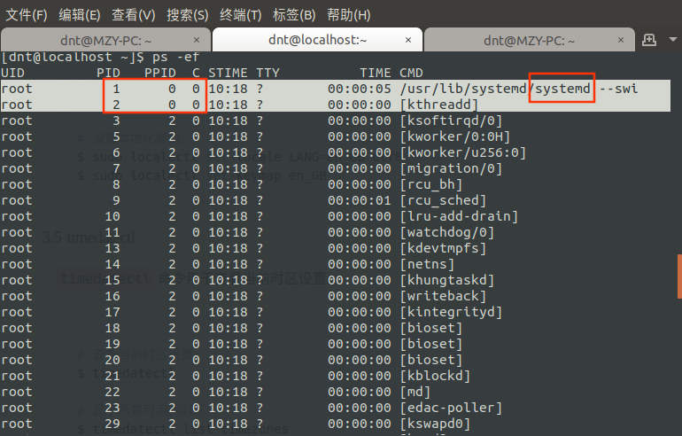

其实程序开机启动方式也可以知道区别了：`systemctl start mongodb.service` and `sudo /etc/init.d/ssh start`

Win系列的0号进程：
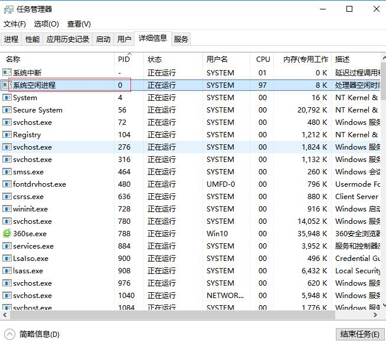

---

第5点的说明：（以远程CentOS服务器为例）
**pstree -ps**
```shell
systemd(1)─┬─NetworkManager(646)─┬─{NetworkManager}(682)
           │                     └─{NetworkManager}(684)
           ├─agetty(1470)
           ├─auditd(600)───{auditd}(601)
           ├─crond(637)
           ├─dbus-daemon(629)───{dbus-daemon}(634)
           ├─firewalld(645)───{firewalld}(774)
           ├─lvmetad(483)
           ├─master(1059)─┬─pickup(52930)
           │              └─qmgr(1061)
           ├─polkitd(627)─┬─{polkitd}(636)
           │              ├─{polkitd}(639)
           │              ├─{polkitd}(640)
           │              ├─{polkitd}(642)
           │              └─{polkitd}(643)
           ├─rsyslogd(953)─┬─{rsyslogd}(960)
           │               └─{rsyslogd}(961)
           ├─sshd(950)───sshd(50312)───sshd(50325)───bash(50326)───pstree(54258)
           ├─systemd-journal(462)
           ├─systemd-logind(626)
           ├─systemd-udevd(492)
           └─tuned(951)─┬─{tuned}(1005)
                        ├─{tuned}(1006)
                        ├─{tuned}(1007)
                        └─{tuned}(1048)
```
再看一个例子：
```shell
[dnt@localhost ~]$ pstree dnt -ps
sshd(50325)───bash(50326)───pstree(54471)
[dnt@localhost ~]$ pstree 50325 -ps
systemd(1)───sshd(950)───sshd(50312)───sshd(50325)───bash(50326)───pstree(54489)
```
其实你可以在虚拟机试试干死1号进程，就到了登录页面了【现在大部分系统都不让你这么干了】
**kill -9 1**
```
-bash: kill: (1) - 不允许的操作
```

### 2.2.僵尸进程和孤儿进程

示例代码：<a href="https://github.com/lotapp/BaseCode/tree/master/python/5.concurrent/Linux/base" target="_blank">https://github.com/lotapp/BaseCode/tree/master/python/5.concurrent/Linux/base</a>

先看看定义：

**<a href="https://baike.baidu.com/item/孤儿进程" target="_blank">孤儿进程</a>** ：一个父进程退出，而它的一个或多个子进程还在运行，那么那些子进程将成为孤儿进程。孤儿进程将被init进程(进程号为1)所收养，并由init进程对它们完成状态收集工作。

**<a href="https://baike.baidu.com/item/僵尸进程" target="_blank">僵尸进程</a>** ：一个进程使用fork创建子进程，如果子进程退出，而父进程并没有调用wait或waitpid获取子进程的状态信息，那么子进程的进程描述符仍然保存在系统中。这种进程称之为僵死进程。

通俗讲就是：

**孤儿进程：你爸在你之前死了，你成了孤儿，然后你被进程1收养，你死后的事宜你干爹帮你解决**

**僵尸进程：你挂了，你爸忙着干其他事情没有帮你安葬，你变成了孤魂野鬼，你的怨念一直长存世间**

举个例子看看：
```py
import os
import time

def main():
    pid = os.fork()
    if pid == 0:
        print("子进程：Pid=%d,PPID=%d" % (os.getpid(), os.getppid()))
        time.sleep(1)  # 睡1s
    elif pid > 0:
        print("父进程：Pid=%d,PPID=%d" % (os.getpid(), os.getppid()))

    print("pid=%d,over" % os.getpid())

if __name__ == '__main__':
    main()
```
输出：
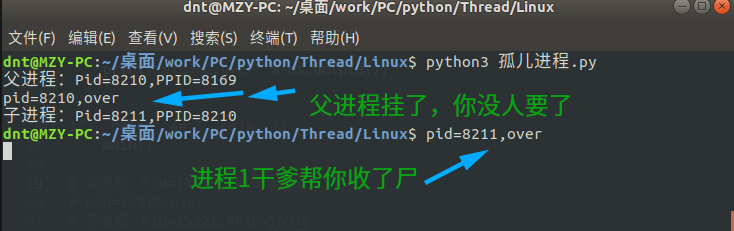

```py
import os
import time

def main():
    pid = os.fork()
    if pid == 0:
        print("子进程：Pid=%d,PPID=%d" % (os.getpid(), os.getppid()))
    elif pid > 0:
        print("父进程：Pid=%d,PPID=%d" % (os.getpid(), os.getppid()))
        while True:
            print("父亲我忙着呢，没时间管你个小屁孩")
            time.sleep(1)

    print("pid=%d,over" % os.getpid())

if __name__ == '__main__':
    main()
```
输出+测试：
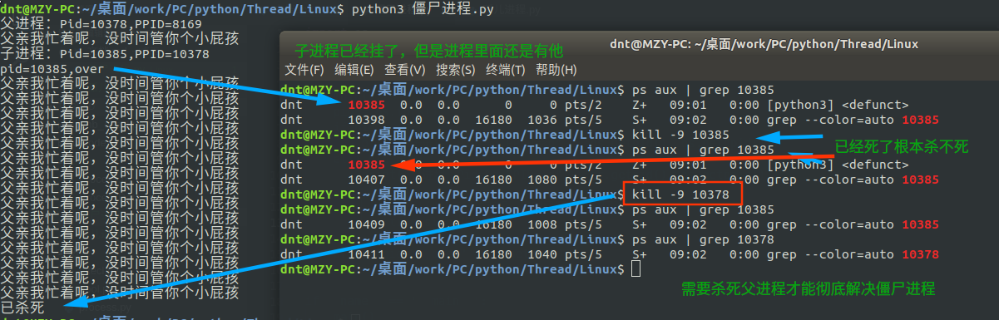

其实僵尸进程的危害真的很大，这也就是为什么有些人为了追求效率过度调用底层，不考虑自己实际情况最后发现还不如用自托管的效率高

僵尸进程是杀不死的，必须杀死父类才能彻底解决它们，下面说说怎么让父进程为子进程‘收尸’

---

### 2.3.父进程回收子进程（wait and waitpid）

讲解之前先简单分析一下上面的Linux指令（防止有人不太清楚）

**`kill -9 pid`** ==> 以前逆天说过，是无条件杀死进程，其实这种说法不准确，应该是**发信号给某个进程**

-9指的就是信号道里面的`SIGKILL`（信号终止），你写成`kill -SIGKILL pid`也一样

-9只是系统给的一种简化写法（好像记得1~31信号，各个Linux中都差不多，其他的有点不一样）
```shell
dnt@MZY-PC:~/桌面/work/PC/python/Thread/Linux kill -l
 1) SIGHUP	 2) SIGINT	 3) SIGQUIT	 4) SIGILL	 5) SIGTRAP
 6) SIGABRT	 7) SIGBUS	 8) SIGFPE	 9) SIGKILL	10) SIGUSR1
11) SIGSEGV	12) SIGUSR2	13) SIGPIPE	14) SIGALRM	15) SIGTERM
16) SIGSTKFLT	17) SIGCHLD	18) SIGCONT	19) SIGSTOP	20) SIGTSTP
21) SIGTTIN	22) SIGTTOU	23) SIGURG	24) SIGXCPU	25) SIGXFSZ
26) SIGVTALRM	27) SIGPROF	28) SIGWINCH	29) SIGIO	30) SIGPWR
31) SIGSYS	34) SIGRTMIN	35) SIGRTMIN+1	36) SIGRTMIN+2	37) SIGRTMIN+3
38) SIGRTMIN+4	39) SIGRTMIN+5	40) SIGRTMIN+6	41) SIGRTMIN+7	42) SIGRTMIN+8
43) SIGRTMIN+9	44) SIGRTMIN+10	45) SIGRTMIN+11	46) SIGRTMIN+12	47) SIGRTMIN+13
48) SIGRTMIN+14	49) SIGRTMIN+15	50) SIGRTMAX-14	51) SIGRTMAX-13	52) SIGRTMAX-12
53) SIGRTMAX-11	54) SIGRTMAX-10	55) SIGRTMAX-9	56) SIGRTMAX-8	57) SIGRTMAX-7
58) SIGRTMAX-6	59) SIGRTMAX-5	60) SIGRTMAX-4	61) SIGRTMAX-3	62) SIGRTMAX-2
63) SIGRTMAX-1	64) SIGRTMAX	
```
一般搜索进程中的某个程序一般都是用这个：**`ps -aux | grep xxx`** （`|`其实就是管道，用于有血缘关系进程间通信，等会讲）

如果安装了`pstree`就更方便了：**`pstree 13570 -ps`** （Ubuntu自带，CentOS要装下`yum install psmisc`）
```py
systemd(1)───systemd(1160)───gnome-terminal-(21604)───bash(8169)───python3(13570)───python3(13571)
```

扩展：**我们平时`Ctrl+C`其实就是给 2）`SIGINT`发一个信号**

---

#### 2.3.1.wait

代码实例：<a href="https://github.com/lotapp/BaseCode/tree/master/python/5.concurrent/Linux/wait" target="_blank">https://github.com/lotapp/BaseCode/tree/master/python/5.concurrent/Linux/wait</a>

步入正题：

Python的Wait和C系列的稍有不同，这边重点说说Python：
```py
help(os.wait)

Help on built-in function wait in module posix:

wait()
    Wait for completion of a child process.
    
    Returns a tuple of information about the child process:
        (pid, status)
```
`os.wait()`返回一个元组，第一个是进程id，第二个是状态，正常退出是0，被九号信号干死就返回9

来个案例：
```py
import os
import time

def main():
    pid = os.fork()
    if pid == 0:
        print("子进程：Pid=%d,PPID=%d" % (os.getpid(), os.getppid()))
    elif pid > 0:
        print("父进程：Pid=%d,PPID=%d" % (os.getpid(), os.getppid()))
        wpid, status = os.wait()
        print(wpid)
        print(status)

    print("pid=%d,over" % os.getpid())

if __name__ == '__main__':
    main()
```
输出：
```
父进程：Pid=22322,PPID=10139
子进程：Pid=22323,PPID=22322
pid=22323,over
22323
0
pid=22322,over
```
演示一下被9号信号干死的情况：
```py
import os
import time

def main():
    pid = os.fork()
    if pid == 0:
        print("子进程：Pid=%d,PPID=%d" % (os.getpid(), os.getppid()))
        while True:
            print("孩子老卵，就是不听话")
            time.sleep(1)
    elif pid > 0:
        print("父进程：Pid=%d,PPID=%d" % (os.getpid(), os.getppid()))
        wpid, status = os.wait()  # 调用一次只能回收一次，想都回收，就来个while循环，-1则退出
        print(wpid)
        print(status)
        if status == 0:
            print("正常退出")
        elif status == 9:
            print("被信号9干死了")

    print("pid=%d,over" % os.getpid())

if __name__ == '__main__':
    main()
```
输出：
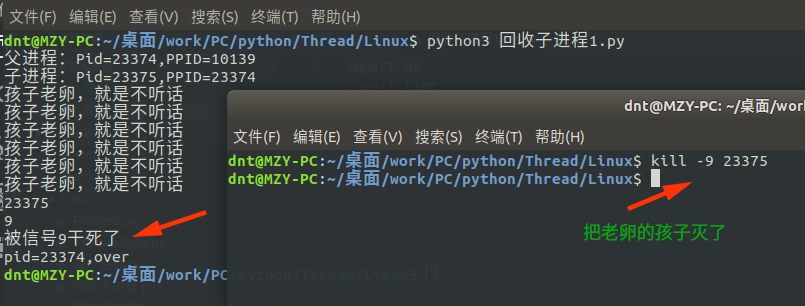

---

扩展：（回收所有子进程，status返回-1代表没有子进程了，Python里面没有子进程会触发异常）

```py
import os
import time

def main():
    i = 0
    while i < 3:
        pid = os.fork()
        # 防止产生孙子进程（可以自己思索下）
        if pid == 0:
            break
        i += 1

    if i == 0:
        print("i=%d,子进程：Pid=%d,PPID=%d" % (i, os.getpid(), os.getppid()))
        time.sleep(1)
    elif i == 1:
        print("i=%d,子进程：Pid=%d,PPID=%d" % (i, os.getpid(), os.getppid()))
        time.sleep(1)
    elif i == 2:
        print("i=%d,子进程：Pid=%d,PPID=%d" % (i, os.getpid(), os.getppid()))
        time.sleep(3)
        while True:
            print("(PID=%d)我又老卵了，怎么滴～" % os.getpid())
            time.sleep(3)
    elif i==3: # 循环结束后，父进程才会退出，这时候i=3
        print("i=%d,父进程：Pid=%d,PPID=%d" % (i, os.getpid(), os.getppid()))
        while True:
            print("等待回收子进程")
            try:
                wpid, status = os.wait()
                print(wpid)
                print(status)
                if status == 0:
                    print("正常退出")
                elif status == 9:
                    print("被信号9干死了")
            except OSError as ex:
                print(ex)
                break

    print("pid=%d,over，ppid=%d" % (os.getpid(), os.getppid()))

if __name__ == '__main__':
    main()
```
演示：看最后一句输出，父进程扫尾工作做完就over了
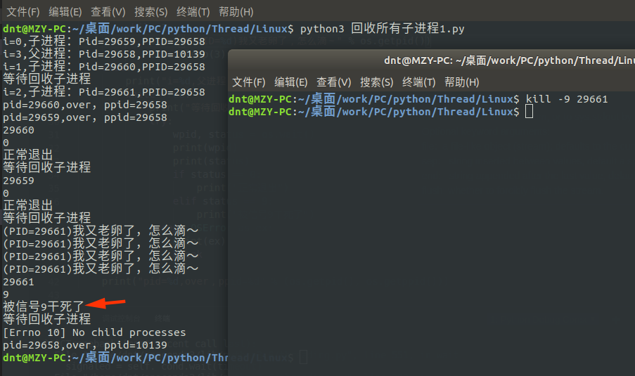

---

#### 2.3.2.waitpid

代码实例：<a href="https://github.com/lotapp/BaseCode/tree/master/python/5.concurrent/Linux/waitpid" target="_blank">https://github.com/lotapp/BaseCode/tree/master/python/5.concurrent/Linux/waitpid</a>

上面说的`wait`方法是阻塞进程的一种方式，`waitpid`可以设置不阻塞进程

```py
help(os.waitpid)

Help on built-in function waitpid in module posix:

waitpid(pid, options, /)
    Wait for completion of a given child process.
    
    Returns a tuple of information regarding the child process:
        (pid, status)
    
    The options argument is ignored on Windows.
```
等待进程id为pid的进程结束，返回一个tuple，包括进程的进程ID和退出信息(和os.wait()一样)，参数options会影响该函数的行为。在默认情况下，options的值为0。

1. 如果pid是一个正数，waitpid()请求获取一个pid指定的进程的退出信息
2. 如果pid为0，则等待并获取当前进程组中的任何子进程的值
3. **如果pid为-1，则等待当前进程的任何子进程**
4. 如果pid小于-1，则获取进程组id为pid的绝对值的任何一个进程
5. 当系统调用返回-1时，抛出一个OSError异常。

<a href="https://docs.python.org/3/library/os.html#os.waitpid" target="_blank">官方原话是这样的</a>：（英语好的可以看看我有没有翻译错）
```
If pid is greater than 0, waitpid() requests status information for that specific process.
If pid is 0, the request is for the status of any child in the process group of the current process. 
If pid is -1, the request pertains to any child of the current process. 
If pid is less than -1, status is requested for any process in the process group -pid (the absolute value of pid).
```

options:（宏）
```py
os.WNOHANG - 如果没有子进程退出，则不阻塞waitpid()调用
os.WCONTINUED - 如果子进程从stop状态变为继续执行，则返回进程自前一次报告以来的信息。
os.WUNTRACED - 如果子进程被停止过而且其状态信息还没有报告过，则报告子进程的信息。
```

补充：
1. 进程组：每一个进程都属于一个“进程组”，当一个进程被创建的时候，它默认是其父进程所在组的成员（**你们一家**）
2. 会  话：几个进程组又构成一个会话（**你们小区**）

用法和`wait`差不多，就是多了一个不阻塞线程的方法：
```py
import os
import time

def main():
    pid = os.fork()

    if pid == 0:
        print("[子进程]PID：%d，PPID：%d" % (os.getpid(), os.getppid()))
        time.sleep(2)

    elif pid > 0:
        print("[父进程]PID：%d，PPID：%d" % (os.getpid(), os.getppid()))
        while True:
            try:
                wpid, status = os.waitpid(-1, os.WNOHANG)
                if wpid > 0:
                    print("回收子进程wpid:%d,状态status:%d" % (wpid, status))
            except OSError:
                print("没有子进程了")
                break

            print("父进程忙着挣钱养家呢～")
            time.sleep(3)

    print("[over]PID：%d，PPID：%d" % (os.getpid(), os.getppid()))

if __name__ == '__main__':
    main()
```
输出：
```
[父进程]PID：1371，PPID：29604
[子进程]PID：1372，PPID：1371
父进程忙着挣钱养家呢～
[over]PID：1372，PPID：1371
回收子进程wpid:1372,状态status:0
父进程忙着挣钱养家呢～
没有子进程了
[over]PID：1371，PPID：29604
```

#### 2.3.3.wait3 and wait4

代码实例：<a href="https://github.com/lotapp/BaseCode/blob/master/python/5.concurrent/Linux/wait3.py" target="_blank">https://github.com/lotapp/BaseCode/blob/master/python/5.concurrent/Linux/wait3.py</a>

```py
help(os.wait3)

Help on built-in function wait3 in module posix:

wait3(options)
    Wait for completion of a child process.
    
    Returns a tuple of information about the child process:
      (pid, status, rusage)
```
```py
help(os.wait4)

Help on built-in function wait4 in module posix:

wait4(pid, options)
    Wait for completion of a specific child process.
    
    Returns a tuple of information about the child process:
      (pid, status, rusage)
```
这个是Python扩展的方法，用法和`wait、waitpid`差不多，我就不一个个的举例子了，以`wait3`为例
```py
import os
import time

def main():
    pid = os.fork()

    if pid == 0:
        print("[子进程]PID：%d，PPID：%d" % (os.getpid(), os.getppid()))
        time.sleep(2)

    elif pid > 0:
        print("[父进程]PID：%d，PPID：%d" % (os.getpid(), os.getppid()))
        while True:
            try:
                wpid, status, rusage = os.wait3(os.WNOHANG)
                if wpid > 0:
                    print("回收子进程wpid:%d,状态status:%d\n详细信息：%s" % (wpid, status,
                                                                 rusage))
            except OSError:
                print("没有子进程了")
                break

            print("父进程忙着挣钱养家呢～")
            time.sleep(3)

    print("[over]PID：%d，PPID：%d" % (os.getpid(), os.getppid()))

if __name__ == '__main__':
    main()
```
输出
```
[父进程]PID：2638，PPID：29604
[子进程]PID：2639，PPID：2638
父进程忙着挣钱养家呢～
[over]PID：2639，PPID：2638
回收子进程wpid:2639,状态status:0
详细信息：resource.struct_rusage(ru_utime=0.0052179999999999995, ru_stime=0.0052179999999999995, ru_maxrss=7032, ru_ixrss=0, ru_idrss=0, ru_isrss=0, ru_minflt=869, ru_majflt=0, ru_nswap=0, ru_inblock=0, ru_oublock=0, ru_msgsnd=0, ru_msgrcv=0, ru_nsignals=0, ru_nvcsw=2, ru_nivcsw=0)
父进程忙着挣钱养家呢～
没有子进程了
[over]PID：2638，PPID：29604
```

---

### 扩展：execl and execlp

代码实例：<a href="https://github.com/lotapp/BaseCode/blob/master/python/5.concurrent/Linux/execl.py" target="_blank">https://github.com/lotapp/BaseCode/blob/master/python/5.concurrent/Linux/execl.py</a>

之前有说fork后，相当于copy了一份，.text里面放的是代码段，如果想要调用另一个程序，可以使用`execlxxx`，他会把.text里面的代码替换掉

```py
help(os.execl)

Help on function execl in module os:

execl(file, *args)
    execl(file, *args)
    
    Execute the executable file with argument list args, replacing the
    current process.
```
```py
help(os.execlp)

Help on function execlp in module os:

execlp(file, *args)
    execlp(file, *args)
    
    Execute the executable file (which is searched for along PATH)
    with argument list args, replacing the current process.
```
来看个例子，`os.execl("绝对路径","参数或者指令")` or `os.execlp("Path中包含的命令","参数或者指令")`

提示：查看命令路径：eg：`which ls`

```py
import os

def main():
    pid = os.fork()
    if pid == 0:
        # 第二个参数不能为None,，第一个路径为绝对路径 eg：os.execl("/bin/ls"," ")
        os.execl("/bin/ls", "ls", "-al")
        # os.execlp("ls", "ls", "-al")  # 执行Path环境变量可以搜索到的命令
        print("exec函数族会替换代码，我是不会被执行的，除非上面的出问题了")

    print("-" * 10)  # 父进程执行一次，子进程不会执行

if __name__ == '__main__':
    main()
```
注意输出信息：`os.execlp("ls", "ls", "-al")`
```
----------
总用量 28
drwxrwxr-x 6 dnt dnt 4096 7月  26 05:23 .
drwxrwxr-x 9 dnt dnt 4096 7月  24 20:55 ..
drwxr-xr-x 2 dnt dnt 4096 7月  19 14:47 .ipynb_checkpoints
drwxrwxr-x 6 dnt dnt 4096 7月  26 06:27 Linux
-rw-rw-r-- 1 dnt dnt   93 7月  26 05:49 temp.py
drwxrwxr-x 2 dnt dnt 4096 7月  24 15:29 .vscode
drwxrwxr-x 2 dnt dnt 4096 7月  25 12:18 进程
```

### 2.4.1.进程间通信～文件通信

代码实例：<a href="https://github.com/lotapp/BaseCode/tree/master/python/5.concurrent/Linux/进程通信/1.file" target="_blank">https://github.com/lotapp/BaseCode/tree/master/python/5.concurrent/Linux/进程通信/1.file</a>

讲管道之前，先说个简单的：通过文件进行通信

来一个简单读写的案例先适应下文件操作：


```python
!ls

# 这种写法类似于Net的 using 托管
with open("test.txt", "w") as f:
    f.write("从前有座山,山上有座庙,庙里有个老和尚和一个小和尚。有一天,老和尚对小和尚说:")

with open("test.txt", "r") as f:
    data = f.read()
    print(data)

!ls
```

    并发编程～进程先导篇.ipynb
    从前有座山,山上有座庙,庙里有个老和尚和一个小和尚。有一天,老和尚对小和尚说:
    test.txt  并发编程～进程先导篇.ipynb


来个简单的案例：
```py
import os
import time

def main():
    pid = os.fork()

    if pid > 0:
        print("父进程(pid=%d)开始写入：" % os.getpid())
        with open(str(pid), "w") as f:
            f.write("[父进程写入]从前有座山,山上有座庙,庙里有个老和尚和一个小和尚。有一天,老和尚对小和尚说:\n")
        time.sleep(2)
        print("父进程(pid=%d)开始读取：" % os.getpid())
        with open(str(pid), "r") as f:
            print(f.read())

        wpid, status = os.wait()  # 收尸
        print("pid=%d已经回收,status:%d" % (wpid, status))

    elif pid == 0:
        print("子进程(pid=%d)开始读取：" % os.getpid())
        with open(str(os.getpid()), "r") as f:
            print(f.read())
        print("子进程(pid=%d)开始追加：" % os.getpid())
        with open(str(os.getpid()), "a") as f:  # 追加
            f.write("[子进程追加]从前有座山,山上有座庙,庙里有个老和尚和一个小和尚。有一天,老和尚对小和尚说:\n")

    print("\n进程(pid=%d)完蛋了" % os.getpid())

if __name__ == '__main__':
    main()

```
图示：
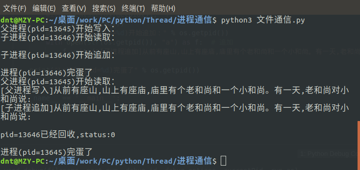

### 2.4.2.进程间通信～队列 Queue（常用）

代码实例：<a href="https://github.com/lotapp/BaseCode/tree/master/python/5.concurrent/Linux/进程通信/2.Queue" target="_blank">https://github.com/lotapp/BaseCode/tree/master/python/5.concurrent/Linux/进程通信/2.Queue</a>

```py
from multiprocessing import Queue

help(Queue)

Help on method Queue in module multiprocessing.context:

Queue(maxsize=0) method of multiprocessing.context.DefaultContext instance
    Returns a queue object
```
实例化对象帮助文档：
```py
from multiprocessing import Queue

q = Queue(2)
help(q)

Help on Queue in module multiprocessing.queues object:

class Queue(builtins.object)
 |  Methods defined here:
 |  
 |  __getstate__(self)
 |  
 |  __init__(self, maxsize=0, *, ctx)
 |      Initialize self.  See help(type(self)) for accurate signature.
 |  
 |  __setstate__(self, state)
 |  
 |  cancel_join_thread(self)
 |  
 |  close(self)
 |  
 |  empty(self)
 |  
 |  full(self)
 |  
 |  get(self, block=True, timeout=None)
 |  
 |  get_nowait(self)
 |  
 |  join_thread(self)
 |  
 |  put(self, obj, block=True, timeout=None)
 |  
 |  put_nowait(self, obj)
 |  
 |  qsize(self)
 |  
 |  ----------------------------------------------------------------------
 |  Data descriptors defined here:
 |  
 |  __dict__
 |      dictionary for instance variables (if defined)
 |  
 |  __weakref__
 |      list of weak references to the object (if defined)
```
详细内容（如：非阻塞、池中应用等）下次讲代码的时候会详说，简单看个例子：

```py
import os
from multiprocessing import Queue

def main():
    q = Queue(1)  # 创建一个容量为1的队列（只能put接受1条,get取出后才可以放）
    pid = os.fork()
    if pid == 0:
        print("[子进程]:pid:%d,ppid:%d" % (os.getpid(), os.getppid()))
        q.put("父亲大人，我可以出去玩吗？")
        output = q.get()
        print("[子进程]收到父亲大人回复：%s" % output)
    elif pid > 0:
        print("[父进程]:pid:%d,ppid:%d" % (os.getppid(), os.getppid()))
        output = q.get()  # 儿子每天出去都会说，等待ing
        print("[父进程]收到儿子的话：%s" % output)
        q.put("准了")

        wpid, status = os.wait()
        print("[父进程]帮pid:%d收尸，状态：%d" % (wpid, status))

    print("[OVER]:pid:%d,ppid:%d" % (os.getpid(), os.getppid()))

if __name__ == '__main__':
    main()
```
输出:
```
[父进程]:pid:12403,ppid:12403
[子进程]:pid:744,ppid:743
[父进程]收到儿子的话：父亲大人，我可以出去玩吗？
[子进程]收到父亲大人回复：准了
[OVER]:pid:744,ppid:743
[父进程]帮pid:744收尸，状态：0
[OVER]:pid:743,ppid:12403
```

### 2.4.3.进程间通信～PIPE匿名管道（常用）

代码实例：<a href="https://github.com/lotapp/BaseCode/tree/master/python/5.concurrent/Linux/进程通信/3.pipe" target="_blank">https://github.com/lotapp/BaseCode/tree/master/python/5.concurrent/Linux/进程通信/3.pipe</a>

知识普及：
1. 命令模式下默认有六个终端tty1-tty6
2. tty7代表图形登录
3. 远程登录会显示pts/0,1,2...

如果终端的概念还不清楚可以看之前的文章：<a href="https://www.cnblogs.com/dunitian/p/6658273.html" target="_blank">https://www.cnblogs.com/dunitian/p/6658273.html</a>

```py
help(os.pipe)

Help on built-in function pipe in module posix:

pipe()
    Create a pipe.
    
    Returns a tuple of two file descriptors:
      (read_fd, write_fd)
```
匿名管道的模式其实我们平时都在用，只是不知道而已，比如：**`ps aux | grep "python"`** 这个 **`|`** 就是匿名管道

**本质**：内核的缓冲区，不占用磁盘空间（可以看成伪文件）【默认4k，相差不大的情况下系统会自动微调大小】

我们来看一下：**`ulimit -a`**

Ubuntu 18.04
```
core file size          (blocks, -c) 0
data seg size           (kbytes, -d) unlimited
scheduling priority             (-e) 0
file size               (blocks, -f) unlimited
pending signals                 (-i) 14894
max locked memory       (kbytes, -l) 16384
max memory size         (kbytes, -m) unlimited
open files                      (-n) 1024
pipe size            (512 bytes, -p) 8
POSIX message queues     (bytes, -q) 819200
real-time priority              (-r) 0
stack size              (kbytes, -s) 8192
cpu time               (seconds, -t) unlimited
max user processes              (-u) 14894
virtual memory          (kbytes, -v) unlimited
file locks                      (-x) unlimited
```
CentOS 7.5
```
core file size          (blocks, -c) 0
data seg size           (kbytes, -d) unlimited
scheduling priority             (-e) 0
file size               (blocks, -f) unlimited
pending signals                 (-i) 3543
max locked memory       (kbytes, -l) 64
max memory size         (kbytes, -m) unlimited
open files                      (-n) 1024
pipe size            (512 bytes, -p) 8
POSIX message queues     (bytes, -q) 819200
real-time priority              (-r) 0
stack size              (kbytes, -s) 8192
cpu time               (seconds, -t) unlimited
max user processes              (-u) 3543
virtual memory          (kbytes, -v) unlimited
file locks                      (-x) unlimited
```
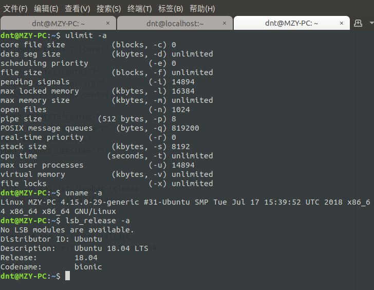
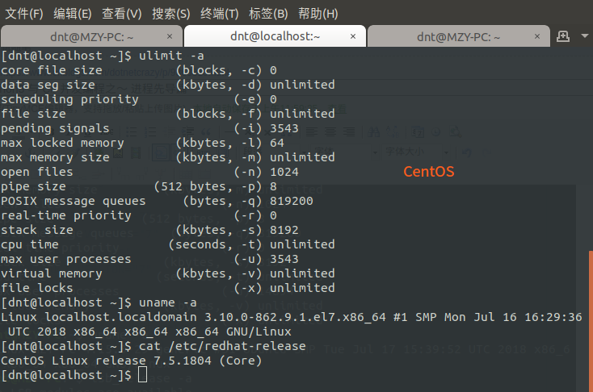

**原理**：算法实现的环形**队列**（队列：先进先出）

**特点**：
1. 操作管道的进程被销毁后，管道自动被释放
2. 管道默认是阻塞（读、写两端都阻塞）
3. 管道有两个端，一个是读端（read_fd，一般都为3),一个是写端（write_fd，一般都为4）
4. **单向传输**

4的意思是这样的（网上找个图，然后改造一下）
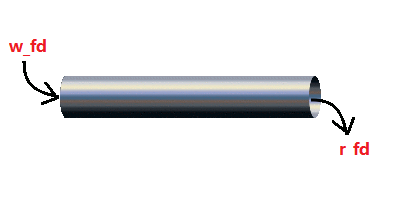

验证一下3：
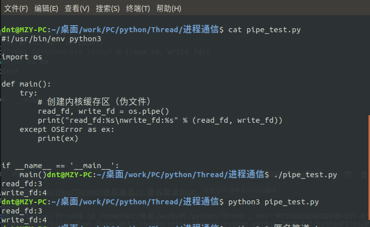

为什么是3开始呢？查看一下源码：（<a href="https://github.com/python/cpython/blob/v3.7.0/Lib/pty.py" target="_blank">https://github.com/python/cpython/blob/v3.7.0/Lib/pty.py</a>）
```py
STDIN_FILENO = 0  # 看这：文件描述符输入（读端）
STDOUT_FILENO = 1 # 看这：文件描述符输出（写端）
STDERR_FILENO = 2 # 已经被占用了0~2了，自然从3开始

# 下面的不用你会，上面Code看完，我们的目的就达到了，下面看看即可
def fork():
    """fork() -> (pid, master_fd) Fork分叉后让子进程成为控制终端的会话领导者"""
    try:
        pid, fd = os.forkpty() # 设置会话领导
    except (AttributeError, OSError):
        pass
    else: # 没有错误执行
        if pid == CHILD:
            os.setsid()
        return pid, fd

    master_fd, slave_fd = openpty()
    pid = os.fork()
    if pid == CHILD:
        # 建立一个新的会话
        os.setsid()
        os.close(master_fd)

        # 把子进程里面的 slave_fd 重定向到 stdin/stdout/stderr
        os.dup2(slave_fd, STDIN_FILENO)
        os.dup2(slave_fd, STDOUT_FILENO)
        os.dup2(slave_fd, STDERR_FILENO)
        if (slave_fd > STDERR_FILENO):
            os.close (slave_fd)

        # 显式打开tty，使它成为一个tty控制
        tmp_fd = os.open(os.ttyname(STDOUT_FILENO), os.O_RDWR)
        os.close(tmp_fd)
    else:
        os.close(slave_fd)

    # Parent and child process.
    return pid, master_fd
```

画个大纲图理解一下：（读的时候关闭写，写的时候关闭读）
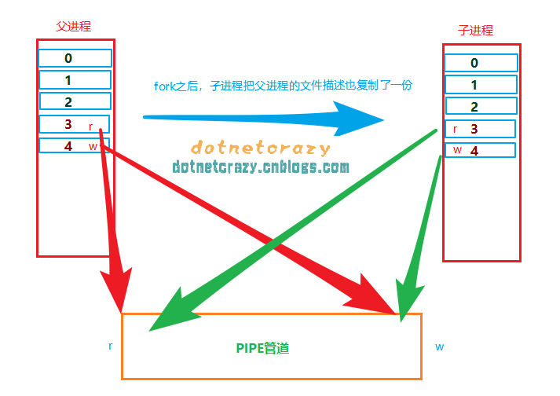

结合单向传输理解一下：（父子只能一个人写，另一个人只能读）
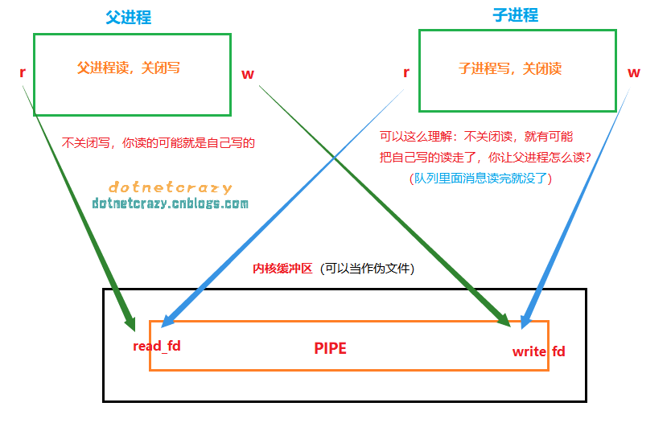
简单概况上图：**子进程只读，父进程只写** or **子进程只写，父进程只读** (如果想要相互读写通信～两根管道走起)

简单分析一下 **`ps aux | grep python`** ，本来ps aux是准备在终端中输出的，现在写入内核缓冲区了，grep从内核缓冲区里面读取，把符合条件的输出到终端

终端文件描述获取：
```py
import sys

sys.stdin.fileno() # STDIN_FILENO = 0：文件描述符输入（读端）
sys.stdout.fileno() # STDOUT_FILENO = 1：看这：文件描述符输出（写端）
```

我们用程序实现一个同样效果的：(`grep`有颜色，其实就是加了`--color=auto`)
```py
import os
import sys

def main():
    # 创建内核缓存区（伪文件）
    read_fd, write_fd = os.pipe()
    print("read_fd:%s\nwrite_fd:%s" % (read_fd, write_fd))

    pid = os.fork()
    if pid > 0:
        print("[父进程]pid=%d,ppid=%d" % (os.getpid(), os.getppid()))

        # 写或者读，则需要关闭另一端（防止自己写自己读）
        os.close(read_fd)
        # dup2(oldfd,newfd) 把写端数据重定向到文件描述符输出端
        os.dup2(write_fd, sys.stdout.fileno())  # STDOUT_FILENO==1 (文件描述符输出，写端)
        # 僵桃李代
        os.execlp("ps", "ps", "aux")

    elif pid == 0:
        print("[子进程]pid=%d,ppid=%d" % (os.getpid(), os.getppid()))

        # 子进程现在需要读，关闭写段
        os.close(write_fd)
        # dup2(oldfd,newfd) 把读端数据重定向到文件描述符输入端
        os.dup2(read_fd, sys.stdin.fileno())  # STDOUT_FILENO == 0 (文件描述符输入，读端)
        # 僵桃李代 （默认是从终端读，重定向后从内核缓冲区读）
        os.execlp("grep", "grep", "python", "--color=auto")

if __name__ == '__main__':
    main()
```
输出：（用到的函数：`os.pipe()` and `os.dup2(oldfd,newfd)`）
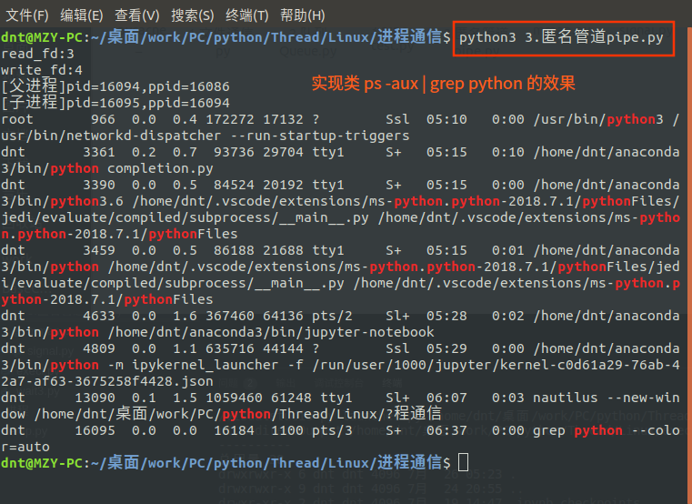

PS：在C系列里面如果你该关闭的fd没关，会资源浪费，python好像做了处理，没能够问题复现，所以还是建议**父子一方只读，一方只写**

---

概念再理解：fork了两个子进程，则文件描述符被复制了2份，大家文件描述符的3、4都指向了`pipe管道`的`read_fd`和`write_fd`
![子进程通信1]](../../../images/python/2018-07-24/4.子进程通信1.png)

来张图理解一下，哪些fd被close了(如果让子进程之间通信，父进程因为不读不写，所以读写都得关闭)
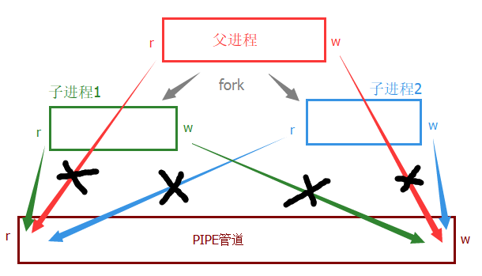
代码演示：（这次注释很全）
```py
import os
import sys
import time

def main():

    read_fd, write_fd = os.pipe()  # 可以思考为啥在上面创建管道（提示.text代码段都一样）

    i = 0
    while i < 2:
        pid = os.fork()
        # 防止子进程生猴子
        if pid == 0:
            break
        i += 1

    # 子进程1
    if i == 0:
        print("[子进程%d]pid=%d，ppid=%d" % (i, os.getpid(), os.getppid()))

        # 准备重定向到写端，所以先关了读端
        os.close(read_fd)
        os.dup2(write_fd, sys.stdout.fileno())  # STDOUT_FILENO == 1 (文件描述符输出，写端)

        # 僵桃李代
        os.execlp("ps", "ps", "-aux")
        # 僵桃李代后，.text代码段都被替换了，自然不会执行
        print("我是不会执行的，不信你看呗")
    elif i == 1:
        print("[子进程%d]pid=%d，ppid=%d" % (i, os.getpid(), os.getppid()))

        # 准备重定向到读端，所以先关了写端
        os.close(write_fd)
        os.dup2(read_fd, sys.stdin.fileno())  # STDIN_FILENO == 0 (文件描述符输入，读端)

        # 僵桃李代  ”bash“是查找关键词，你写你想找的字符串即可
        os.execlp("grep", "grep", "bash", "--color=auto")

        # 僵桃李代后，.text代码段都被替换了，自然不会执行
        print("我是不会执行的，不信你看呗")
    elif i == 2:
        print("[父进程]pid=%d，ppid=%d" % (os.getpid(), os.getppid()))

        # 我不写不读
        os.close(read_fd)
        os.close(write_fd)

        # 为了大家熟练掌握wait系列，这次用waitpid
        while (True):
            info = ()
            try:
                info = os.waitpid(-1, os.WNOHANG)  # 非阻塞的方式回收所有子进程
            except OSError:
                break  # waitpid返回-1的时候，Python会抛出异常

            if info[0] > 0:
                print("父进程收尸成功：pid=%d，ppid=%d，状态status：%d" %
                      (os.getpid(), os.getppid(), info[1]))
            print("父进程做其他事情...")
            time.sleep(0.005)  # 休息 0.005s

    print("[父进程-遗言]pid=%d，ppid=%d" % (os.getpid(), os.getppid()))

if __name__ == '__main__':
    main()
```
结果：
```
[父进程]pid=18678，ppid=27202
[子进程0]pid=18679，ppid=18678
[子进程1]pid=18680，ppid=18678
父进程做其他事情...
父进程做其他事情...
父进程做其他事情...
父进程做其他事情...
dnt       4622  0.0  0.1  24880  5688 pts/2    Ss   05:28   0:00 bash
父进程做其他事情...
dnt      15419  0.0  0.1  25152  5884 pts/0    Ss+  06:29   0:00 /bin/bash
dnt      18680  0.0  0.0  16184  1044 pts/4    S+   13:25   0:00 grep bash --color=auto
dnt      27202  0.0  0.1  25012  6052 pts/4    Ss   08:25   0:00 bash
父进程收尸成功：pid=18678，ppid=27202，状态status：0
父进程做其他事情...
父进程收尸成功：pid=18678，ppid=27202，状态status：0
父进程做其他事情...
[父进程-遗言]pid=18678，ppid=27202
```


```python
# 说管道读写之前，先复习个知识点：
bts = "尴尬".encode()
b_str = bts.decode()
print(bts)
print(b_str)
```

    b'\xe5\xb0\xb4\xe5\xb0\xac'
    尴尬


#### 匿名管道读写操作

上面知识点忘了可以复习一下：<a href="https://www.cnblogs.com/dotnetcrazy/p/9278573.html#1.2.字符串和编码" target="_blank">https://www.cnblogs.com/dotnetcrazy/p/9278573.html#1.2.字符串和编码</a>

用到的函数：（这个就不需要使用`dup2`来重定向到终端了【有血缘关系的进程之间通信，并不依赖于终端显示】）

`os.write(fd, str)`写入字符串到文件描述符 fd中. 返回实际写入的字符串长度

`os.read(fd, n)`从文件描述符 fd 中读取最多 n 个字节，返回包含读取字节的字符串

如果文件描述符fd对应文件已达到结尾, 返回一个空字符串

举个父子间通信的例子（比C系列简单太多）【下次讲的通用Code会更简单】
```py
import os

def close_fd(*fd_tuple_args):
    """关闭fd，fd_tuple_args是可变参数"""
    for item in fd_tuple_args:
        os.close(item[0])
        os.close(item[1])

def main():
    # 管道是单向的，相互读写，那就创建两个管道
    fd_tuple1 = os.pipe()  # 进程1写，进程2读
    fd_tuple2 = os.pipe()  # 进程2写，进程1读

    i = 0
    while (i < 2):
        pid = os.fork()
        if pid == 0:
            break
        i += 1
    # 子进程1
    if i == 0:
        print("[子进程]pid：%d，ppid：%d" % (os.getpid(), os.getppid()))

        os.close(fd_tuple1[0])  # 进程1写，则关闭下读端
        msg_str = "进程1说：兄弟，今天撸串吗？"
        os.write(fd_tuple1[1], msg_str.encode())  # 把字符串xxx转换成bytes

        # 不读的我关闭掉：
        os.close(fd_tuple2[1])  # 进程2写，我不需要写，关闭写端
        bts = os.read(fd_tuple2[0], 1024)
        print("[子进程1]", bts.decode())

        exit(0)  # 退出后就不执行下面代码块语句了
    # 子进程2
    elif i == 1:
        print("[子进程2]pid：%d，ppid：%d" % (os.getpid(), os.getppid()))

        os.close(fd_tuple1[1])  # 进程2读，则关闭下写端
        bts = os.read(fd_tuple1[0], 1024)
        print("[子进程2]", bts.decode())

        # 不读的我关闭掉：
        os.close(fd_tuple2[0])  # 进程2写，关闭读端
        msg_str = "进程2说：可以可以～"
        os.write(fd_tuple2[1], msg_str.encode())  # 把字符串xxx转换成bytes

        exit()  # 不加参数默认是None
    # 父进程
    elif i == 2:
        print("[父进程]pid：%d，ppid：%d" % (os.getpid(), os.getppid()))

        # 父进程不读不写，就看看
        close_fd(fd_tuple1, fd_tuple2)

        # 收尸ing
        while True:
            try:
                wpid, status = os.wait()
                print("[父进程～收尸]子进程PID：%d 的状态status：%d" % (wpid, status))
            except OSError:
                break
    # 子进程都exit()退出了，不会执行这句话了
    print("[父进程遗言]pid：%d,ppid：%d" % (os.getpid(), os.getppid()))

if __name__ == '__main__':
    main()
```
输出结果：
```
[父进程]pid：12002，ppid：27202
[子进程2]pid：12004，ppid：12002
[子进程]pid：12003，ppid：12002
[子进程2] 进程1说：兄弟，今天撸串吗？
[子进程1] 进程2说：可以可以～
[父进程～收尸]子进程PID：12003 的状态status：0
[父进程～收尸]子进程PID：12004 的状态status：0
[父进程遗言]pid：12002,ppid：27202
```

#### 非阻塞管道（简写法）

队列的`get`，`put`方法默认也是阻塞的，如果想非阻塞可以调用`get_nowait`和`put_nowait`来变成非阻塞，那pipe管道呢？

C系列一般使用`fcntl`来实现，Python进行了封装，我们可以通过`os.pipe2(os.O_NONBLOCK)`来设置非阻塞管道
```
help(os.pipe2)

Help on built-in function pipe2 in module posix:

pipe2(flags, /)
    Create a pipe with flags set atomically.

    Returns a tuple of two file descriptors:
      (read_fd, write_fd)

    flags can be constructed by ORing together one or more of these values:
    O_NONBLOCK, O_CLOEXEC.
```
举个例子：
```py
import os
import time

def main():
    r_fd, w_fd = os.pipe2(os.O_NONBLOCK | os.O_CLOEXEC)

    pid = os.fork()
    if pid == 0:
        print("子进程：pid=%d，ppid=%d" % (os.getpid(), os.getppid()))
        time.sleep(0.5)

        # 和父进程进行通信
        os.close(r_fd)
        os.write(w_fd, "老爸，我出去玩了～".encode())

        exit(0)  # 子进程退出
    elif pid > 0:
        print("父进程：pid=%d，ppid=%d" % (os.getpid(), os.getppid()))

        # 读儿子的留言
        os.close(w_fd)
        b_msg = b""
        while True:
            try:
                b_msg = os.read(r_fd, 1)  # 没有数据就出错（一般都是等待一会，也可以和信号联合使用）
            except OSError:
                print("儿子怎么没有留言呢？")

            print("父进程：做其他事情...")
            if len(b_msg) > 0:
                break
            time.sleep(0.1)

        # 继续读剩下的消息
        b_msg += os.read(r_fd, 1024)
        print("儿子留言:", b_msg.decode())

        wpid, status = os.wait()
        print("帮儿子做扫尾工作：pid=%d，status=%d" % (wpid, status))

    print("父进程遗言：pid=%d，status=%d" % (os.getpid(), os.getppid()))

if __name__ == '__main__':
    main()
```
输出：
```
父进程：pid=31430，ppid=27202
子进程：pid=31431，ppid=31430
儿子怎么没有留言呢？
父进程：做其他事情...
儿子怎么没有留言呢？
父进程：做其他事情...
儿子怎么没有留言呢？
父进程：做其他事情...
儿子怎么没有留言呢？
父进程：做其他事情...
儿子怎么没有留言呢？
父进程：做其他事情...
父进程：做其他事情...
儿子留言: 老爸，我出去玩了～
帮儿子做扫尾工作：pid=31431，status=0
父进程遗言：pid=31430，status=27202
```

扩展：
1. 数据只能读1次（队列和栈都这样）
2. 匿名管道必须有血缘关系的进程才能通信
3. <a href="https://baike.baidu.com/item/半双工通信" target="_blank">半双工通信</a>：同一时刻里，信息只能有一个传输方向（类似于对讲机）
    - <a href="https://baike.baidu.com/item/单工通信" target="_blank">单工通信</a>：消息只能单方向传输（类似于遥控器）
    - <a href="https://baike.baidu.com/item/半双工通信" target="_blank">半双工通信</a>：类似于对讲机
    - <a href="https://baike.baidu.com/item/双工通信" target="_blank">双工通信</a>：类似于电话


### 2.4.4.进程间通信～FIFO有名管道

代码实例：<a href="https://github.com/lotapp/BaseCode/tree/master/python/5.concurrent/Linux/进程通信/4.fifo" target="_blank">https://github.com/lotapp/BaseCode/tree/master/python/5.concurrent/Linux/进程通信/4.fifo</a>

**<a href="https://baike.baidu.com/item/FIFO管道" target="_blank">FIFO管道</a>**：

1. 有名管道，除了血缘关系进程通信，没有血缘关系的进程也可以通信
2. 在磁盘上有会存放一个文件类型为`p`，大小为`0`的管道文件（伪文件，大小始终为0）
3. 内核中有一个对应的缓冲区（数据就放在里面）
4. 半双工通信：同一时刻里，信息只能有一个传输方向（类似于对讲机）
5. fifo要求读写双方必须同时打开才可以继续进行读写操作，否则打开操作会堵塞直到对方也打开
6. 如果读端全部关闭，管道破裂，进程自动被终止（PIPE也是这样的）

对2的验证：
其实你用`ll`来查看，就是文件类型为`p`的文件（大小始终为0）
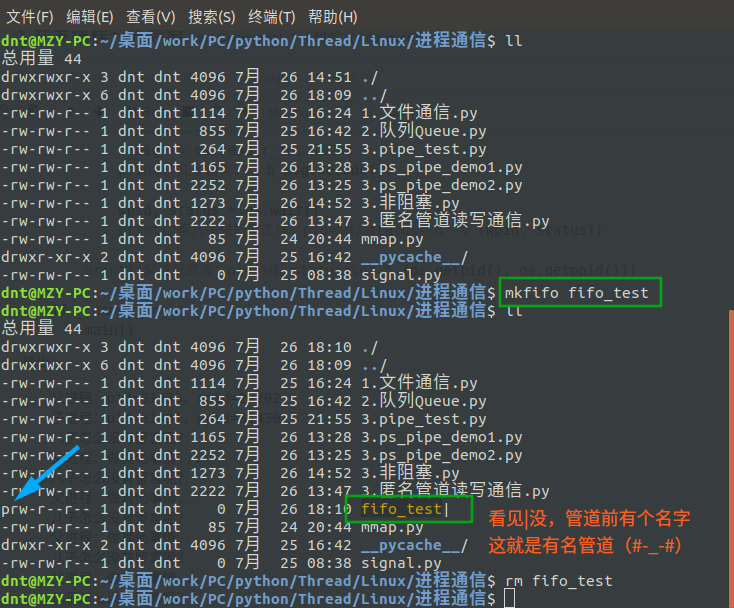

Linux底层提供了`mkfifo`函数，Python创建使用**`os.mkfifo()`**

画个图来看3：
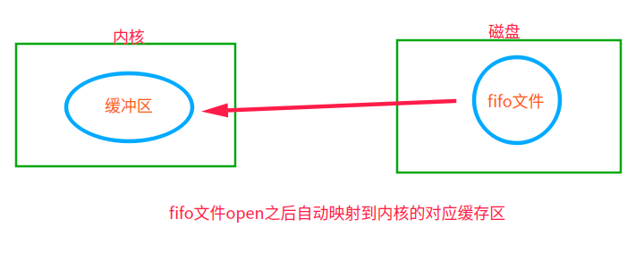

**知识普及**：
```py
help(os.open)

Help on built-in function open in module posix:

open(path, flags, mode=511, *, dir_fd=None)
    Open a file for low level IO.  Returns a file descriptor (integer).
    
    If dir_fd is not None, it should be a file descriptor open to a directory,
      and path should be relative; path will then be relative to that directory.
    dir_fd may not be implemented on your platform.
      If it is unavailable, using it will raise a NotImplementedError.
```

`flags` -- 该参数可以是以下选项，多个使用 `|` 隔开：
- **os.O_RDONLY: 以只读的方式打开**
- **os.O_WRONLY: 以只写的方式打开**
- **os.O_RDWR : 以读写的方式打开**
- **os.O_NONBLOCK: 打开时不阻塞**
- **os.O_APPEND: 以追加的方式打开**
- os.O_CREAT: 创建并打开一个新文件
- os.O_TRUNC: 打开一个文件并截断它的长度为零（必须有写权限）
- os.O_EXCL: 如果指定的文件存在，返回错误
- os.O_SHLOCK: 自动获取共享锁
- os.O_EXLOCK: 自动获取独立锁
- os.O_DIRECT: 消除或减少缓存效果
- os.O_FSYNC : 同步写入
- os.O_NOFOLLOW: 不追踪软链接

---

很多人直接使用了Open方法`open(fifo_path, "r")`和`open(fifo_path, "w")`貌似也是可以的，但是不推荐

我们使用<a href="https://docs.python.org/3/library/functions.html?highlight=open#open" target="_blank">官方推荐的方法</a>：

#### 无血缘关系通信

fifo操作非常简单，和文件IO操作几乎一样，看个**无血缘关系进程通信**的例子：

进程1源码：r_fifo.py
```py
import os

def main():
    file_name = "fifo_file"
    if not os.path.exists(file_name):
        os.mkfifo(file_name)

    fd = os.open(file_name, os.O_RDONLY)  # 只读（阻塞）
    while True:
        b_msg = os.read(fd, 1024)
        if len(b_msg) > 0:
            print(b_msg.decode())

if __name__ == '__main__':
    main()
```
进程2源码：w_fifo.py
```py
import os
import time

def main():
    file_name = "fifo_file"
    if not os.path.exists(file_name):
        os.mkfifo(file_name)

    fd = os.open(file_name, os.O_WRONLY)  # 只写
    while True:
        time.sleep(1)  # 模拟一下实际生产环境下的 读快写慢
        try:
            os.write(fd, "我是说话有魔性，喝水会长胖的小明同学".encode())  # 写入bytes
        except BrokenPipeError:
            print("如果读端全部关闭，管道破裂，进程自动被终止")
            break

if __name__ == '__main__':
    main()
```
做个读端的测试：
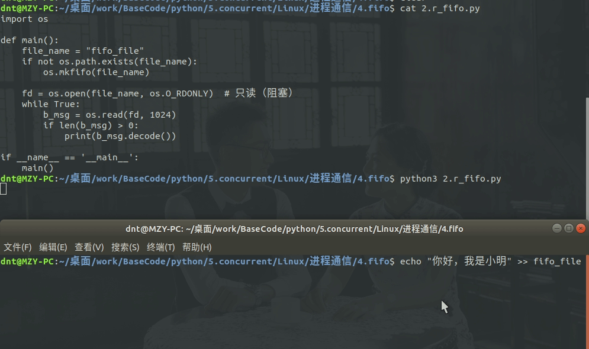

读写双测：（fifo文件大小始终为0，只是伪文件而已）


扩展一下，如果你通过终端读写呢？（同上）
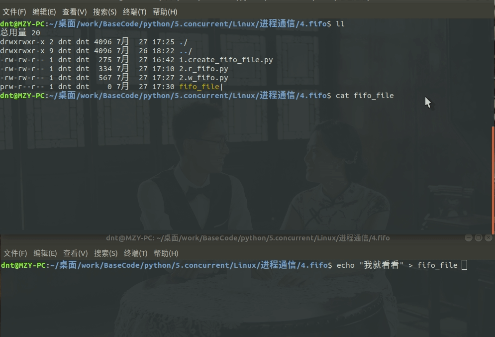

**再来个读写的案例**

3.rw_fifo1.py
```py
import os

def main():
    file_name = "fifo_temp"
    if not os.path.exists(file_name):
        os.mkfifo(file_name)

    fd = os.open(file_name, os.O_RDWR)  # 你输入os.O_rw就会有这个选项了，不用硬记
    msg = os.read(fd, 1024).decode()  # 阻塞的方式，不用担心
    print("[进程2]%s" % msg)
    os.write(fd, "小明啊，你忘记你长几斤肉了?".encode())

if __name__ == '__main__':
    main()
```
rw_fifo2.py
```
import os
import time

def main():
    file_name = "fifo_temp"
    if not os.path.exists(file_name):
        os.mkfifo(file_name)

    fd = os.open(file_name, os.O_RDWR)  # 你输入os.O_rw就会有这个选项了，不用硬记
    os.write(fd, "小潘，撸串去不?".encode())

    time.sleep(3)  # 防止自己写的被自己读了

    msg = os.read(fd, 1024).decode()  # 阻塞的方式，不用担心
    print("[进程1]]%s" % msg)

if __name__ == '__main__':
    main()
```
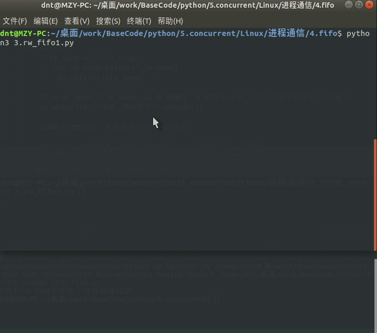

#### 有血缘关系通信

来个父子间通信：（代码比较简单，和上面差不多，看看即可）
```py
import os

def main():
    file_name = "fifo_test"
    if not os.path.exists(file_name):
        os.mkfifo(file_name)

    fd = os.open(file_name, os.O_RDWR)  # 读写方式打开文件描述符 （O_RDONLY | O_WRONLY）

    pid = os.fork()
    if pid == 0:
        print("子进程：PID:%d，PPID:%d" % (os.getpid(), os.getppid()))

        os.write(fd, "子进程说：老爸，我想出去玩".encode())  # 写
        msg = os.read(fd, 1024).decode()  # 读
        print("[子进程]%s" % msg)
    elif pid > 0:
        print("父进程：PID:%d，PPID:%d" % (os.getpid(), os.getppid()))

        msg = os.read(fd, 1024).decode()  # 阻塞方式，不用担心
        print("[父进程]%s" % msg)
        os.write(fd, "父进程说：去吧乖儿子".encode())

        # 给子进程收尸
        wpid, status = os.wait()
        print("父进程收尸：子进程PID=%d，PPID=%d" % (wpid, status))

    print("进程遗言：PID=%d，PPID=%d" % (os.getpid(), os.getppid()))  # 剩下的代码段

if __name__ == '__main__':
    main()
```
输出：
```
父进程：PID:21498，PPID:20943
子进程：PID:21499，PPID:21498
[父进程]子进程说：老爸，我想出去玩
[子进程]父进程说：去吧乖儿子
进程遗言：PID=21499，PPID=21498
父进程收尸：子进程PID=21499，PPID=0
进程遗言：PID=21498，PPID=20943
```

### 2.4.5.进程间通信～MMAP内存映射（常用）

代码实例：<a href="https://github.com/lotapp/BaseCode/tree/master/python/5.concurrent/Linux/进程通信/5.mmap" target="_blank">https://github.com/lotapp/BaseCode/tree/master/python/5.concurrent/Linux/进程通信/5.mmap</a>

好处：内存操作，比IO快

缺点：和文件一样不会像管道一样阻塞（读的可能不全，需要自己考虑读写效率）

画个简单的图示：
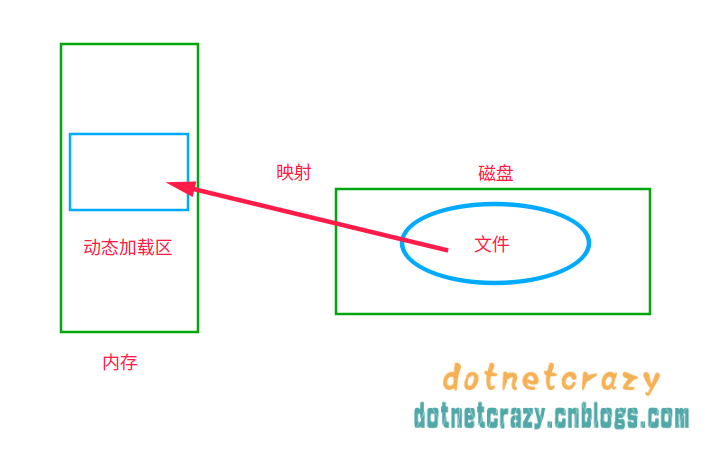
PS：**内存映射一个文件并不会导致整个文件被读取到内存中**:
1. 文件并没有被复制到内存缓存中，操作系统仅仅为文件内容保留了一段虚拟内存。
2. 当你访问文件的不同区域时，这些区域的内容才根据需要被读取并映射到内存区域中。
3. 没有访问的部分还是留在磁盘上

以Linux为例，简单解析一下帮助文档：（加粗的是必填参数）
```py
mmap.mmap（fileno,length[,flags=MAP_SHARED][,prot=PROT_WRITE|PROT_READ][,access=ACCESS_DEFAULT][,offset]）
```
1. **fileno**：就是我们经常说的`文件描述fd`
    1. 可以通过`os.open()`直接打开fd
    2. 也可以调用文件的`f.fileno()`
2. **length**：映射区大小，（一般写0就OK了）
    1. 如果length为0，则映射的最大长度将是调用时文件的当前大小
    2. 一般把`文件大小 os.path.getsize(path)`传进去就可以了
3. flags：映射区性质，默认是用共享
    1. MAP_SHARED  共享（数据会自动同步磁盘）
    2. MAP_PRIVATE 私有（不同步磁盘）
4. prot：映射区权限，如果指定，就会提供内存保护（默认即可）
    1. PROT_READ 读
    2. PROT_READ | PROT_WRITE 写（必须有读的权限）
5. *access：可以指定访问来代替flags和prot作为可选的关键字参数【这个是Python为了简化而添加的】*
    1. ACCESS_READ：只读
    2. ACCESS_WRITE：读和写（会影响内存和文件）
    3. ACCESS_COPY：写时复制内存（影响内存，但不会更新基础文件）
    4. *ACCESS_DEFAULT：延迟到prot（3.7才添加）*
6. offset，偏移量，默认是0（和文件一致）


```python
# 这个够明了了，\0转换成二进制就是\x00
"\0".encode()
```


    b'\x00'


```python
# 老规矩，开始之前，扩充一个小知识点：(空字符串和'\0'区别)
a = "" # 空字符串 （Python里面没有char类型）
b = "\x00" # `\0` 的二进制写法
c = "\0"

print(a)
print(b)
print(c)

print(len(a))
print(len(b))
print(len(c))
```

    
    
    
    0
    1
    1


看个简单的案例快速熟悉mmap模块：(大文件处理这块先不说，以后要是有机会讲数据分析的时候会再提)
```py
m.size()  # 查看文件大小
m.seek(0)  # 修改Postion位置
m.tell()  # 返回 m 对应文件的Postion位置
m.read().translate(None, b"\x00")  # 读取所有内容并把\0删除
m.closed  # 查看mmap是否关闭

# 支持切片操作
m[0:10] # 取值
m[0:10] = b"1234567890"  # 赋值

# 对自行模式大文件处理的同志，给个提示
m.readline().decode() # 读一行，并转换成str
m.size()==m.tell() # while循环退出条件
```
熟悉一下上面几个方法：
```py
import os
import mmap

def create_file(filename, size):
    """初始化一个文件，并把文件扩充到指定大小"""
    with open(filename, "wb") as f:
        f.seek(size - 1)  # 改变流的位置
        f.write(b"\x00")  # 在末尾写个`\0`

def main():
    create_file("mmap_file", 4096)  # 创建一个4k的文件
    with mmap.mmap(os.open("mmap_file", os.O_RDWR), 0) as m:  # 创建映射
        print(m.size())  # 查看文件大小
        m.resize(1024)  # 重新设置文件大小
        print(len(m))  # len也一样查看文件大小
        print(m.read().translate(None, b"\x00"))  # 读取所有内容并把\0删除
        print(m.readline().decode())  # 读取一行，bytes转成str
        print(m.tell())  # 返回 m 对应文件的当前位置
        m.seek(0)  # 修改Postion位置
        print(m.tell())  # 返回 m 对应文件的当前位置
        print(m[0:10])  # 支持切片操作
        print("postion_index:%d" % m.tell())
        m[0:10] = b"1234567890"  # 赋值
        print("postion_index:%d" % m.tell())
        print(m[0:10])  # 取值
        print("postion_index:%d" % m.tell())
        print(m[:].decode())  # 全部读出来
    print(m.closed)  # 查看mmap是否关闭

if __name__ == '__main__':
    main()
```
输出：(测试了一下，切片操作【读、写】不会影响postion)
```
4096
1024
b''

1024
0
b'\x00\x00\x00\x00\x00\x00\x00\x00\x00\x00'
postion_index:0
postion_index:0
b'1234567890'
postion_index:0
1234567890
True
```
看下open打开的案例：
```py
import os
import mmap

def main():
    with open("temp", "wb") as f:
        f.write("小明同学最爱刷碗\n小潘同学最爱打扫".encode())

    # 打开磁盘二进制文件进行更新（读写）
    with open("temp", "r+b") as f:
        with mmap.mmap(f.fileno(), 0) as m:
            print("postion_index:%d" % m.tell())
            print(m.readline().decode().strip())  # 转成str并去除两端空格
            print("postion_index:%d" % m.tell())
            print(m[:].decode())  # 全部读出来
            print("postion_index:%d" % m.tell())
            m.seek(0)
            print("postion_index:%d" % m.tell())

if __name__ == '__main__':
    main()
```
输出：
```
postion_index:0
小明同学最爱刷碗
postion_index:25
小明同学最爱刷碗
小潘同学最爱打扫
postion_index:25
postion_index:0
```

其他方法可以参考：<a href="https://www.cnblogs.com/zhoujinyi/p/6062907.html" target="_blank">这篇文章</a>（Python3很多都和Python2不太相同，辩证去看吧）

注意一点：

通过MMap内存映射之后，**进程间通信并不是对文件操作，而是在内存中**。文件保持同步只是因为mmap的flags默认设置的是共享模式（MAP_SHARED）

PS：还记得之前讲<a href="https://www.cnblogs.com/dotnetcrazy/p/9202988.html#1.8-实例方法、类方法、静态方法" target="_blank">类方法和实例方法</a>的时候吗？Python中类方法可以直接被对象便捷调用，这边**mmap实例对象中的方法，其实很多都是类方法**
**步入正轨**：

来看一个有血缘关系的通信案例：（一般用匿名）
```py
import os
import time
import mmap

def create_file(file_name, size):
    with open(file_name, "wb") as f:
        f.seek(size - 1)
        f.write(b"\0x00")

def main():
    file_name = "temp.bin"
    # mmap映射的时候不能映射空文件，所以我们自己创建一个
    create_file(file_name, 1024)

    fd = os.open(file_name, os.O_RDWR)
    with mmap.mmap(fd, 0) as m:  # m.resize(1024) # 大小可以自己调整的
        pid = os.fork()
        if pid == 0:
            print("[子进程]PID:%d，PPID:%d" % (os.getpid(), os.getppid()))
            m.write("子进程说：老爸，我想出去玩了～\n".encode())
            time.sleep(3)
            print(m.readline().decode().strip())
            exit(0)
        elif pid > 0:
            print("[父进程]PID:%d，PPID:%d" % (os.getpid(), os.getppid()))
            time.sleep(1)  # 和文件一样，非堵塞
            print(m.readline().decode().strip())
            m.write("父进程说：去吧去吧\n".encode())
            wpid, status = os.wait()
            print("[父进程]收尸：PID:%d，Status:%d" % (wpid, status))
            exit(0)

if __name__ == '__main__':
    main()
```
输出：
```
[父进程]PID:6843，PPID:3274
[子进程]PID:6844，PPID:6843
子进程说：老爸，我想出去玩了～
父进程说：去吧去吧
[父进程]收尸：PID:6844，Status:0
```

#### 有血缘关系使用MMAP通信

父进程创建了一份mmap对象，fork产生子进程的时候相当于copy了一份指向，所以可以进行直接通信（联想fd的copy）

```py
import os
import time
import mmap

def main():
    # 不记录文件中，直接内存中读写（这个地方len就不能为0了，自己指定一个大小eg：4k）
    with mmap.mmap(-1, 4096) as m:
        pid = os.fork()
        if pid == 0:
            print("[子进程]PID:%d，PPID:%d" % (os.getpid(), os.getppid()))
            m.write("[子进程]老爸我出去嗨了～\n".encode())
            time.sleep(2)
            msg = m.readline().decode().strip()
            print(msg)
            exit(0)
        elif pid > 0:
            print("[父进程]PID:%d，PPID:%d" % (os.getpid(), os.getppid()))
            time.sleep(1)
            msg = m.readline().decode().strip()
            print(msg)
            m.write("[父进程]去吧，皮卡丘～".encode())

            wpid, status = os.wait()
            print("[父进程]收尸：PID:%d，Status:%d" % (wpid, status))
            exit(0)

if __name__ == '__main__':
    main()
```
输出：
```
[父进程]PID:8115，PPID:3274
[子进程]PID:8116，PPID:8115
[子进程]老爸我出去嗨了～
[父进程]去吧，皮卡丘～
[父进程]收尸：PID:8116，Status:0
```

#### 无血缘关系使用MMAP通信

因为不同进程之前没有关联，必须以文件为媒介（文件描述符fd）

进程1：
```py
import os
import time
import mmap

def create_file(file_name, size):
    with open(file_name, "wb") as f:
        f.seek(size - 1)
        f.write(b"\0x00")

def main():
    file_name = "temp.bin"

    if not os.path.exists(file_name):
        # mmap映射的时候不能映射空文件，所以我们自己创建一个
        create_file(file_name, 1024)

    fd = os.open(file_name, os.O_RDWR)
    with mmap.mmap(fd, 0) as m:  # m.resize(1024) # 大小可以自己调整的
        print("[进程1]PID:%d，PPID:%d" % (os.getpid(), os.getppid()))
        m.write("进程1说：小明放学去撸串吗？\n".encode())
        time.sleep(3)
        print(m.readline().decode().strip())
        exit(0)

if __name__ == '__main__':
    main()
```
进程2：
```py
import os
import time
import mmap

def create_file(file_name, size):
    with open(file_name, "wb") as f:
        f.seek(size - 1)
        f.write(b"\0x00")

def main():
    file_name = "temp.bin"

    if not os.path.exists(file_name):
        # mmap映射的时候不能映射空文件，所以我们自己创建一个
        create_file(file_name, 1024)

    fd = os.open(file_name, os.O_RDWR)
    with mmap.mmap(fd, 0) as m:  # m.resize(1024) # 大小可以自己调整的
        print("[进程2]PID:%d，PPID:%d" % (os.getpid(), os.getppid()))
        time.sleep(1)
        print(m.readline().decode().strip())
        m.write("进程2说：为毛不去？\n".encode())
        exit(0)

if __name__ == '__main__':
    main()
```
输出图示：


### 2.4.6.进程间通信～Signal信号

代码实例：<a href="https://github.com/lotapp/BaseCode/tree/master/python/5.concurrent/Linux/进程通信/6.signal" target="_blank">https://github.com/lotapp/BaseCode/tree/master/python/5.concurrent/Linux/进程通信/6.signal</a>

<a href="https://baike.baidu.com/item/信号/7927794" target="_blank">信号</a>：它是一种异步的通知机制，用来提醒进程一个事件已经发生。当一个信号发送给一个进程，操作系统中断了进程正常的控制流程，此时，任何非原子操作都将被中断。如果进程定义了信号的处理函数，那么它将被执行，否则就执行默认的处理函数。

一般信号不太用于进程间通信，常用就是发个信号把xxx进程干死。

先来个例子，等会讲理论：

Python里面一般用`os.kill(pid,signalnum)`来发信号：eg：`kill 9 pid`
```py
import os
import time
import signal

def main():
    pid = os.fork()
    if pid == 0:
        print("[子进程]PID=%d,PPID=%d" % (os.getpid(), os.getppid()))
        while True:
            print("[子进程]孩子老卵，怎么滴吧～")
            time.sleep(1)
    elif pid > 0:
        print("[父进程]PID=%d,PPID=%d" % (os.getpid(), os.getppid()))
        time.sleep(3)
        print("父进程耐心有限，准备杀了儿子")

        # sigkill 相当于kill 9 pid
        os.kill(pid, signal.SIGKILL)  # 发信号

        # 收尸
        wpid, status = os.wait()
        print("父进程收尸：子进程PID=%d,Status=%d" % (wpid, status))

if __name__ == '__main__':
    main()
```
输出：
```
[父进程]PID=21841,PPID=5559
[子进程]PID=21842,PPID=21841
[子进程]孩子老卵，怎么滴吧～
[子进程]孩子老卵，怎么滴吧～
[子进程]孩子老卵，怎么滴吧～
父进程耐心有限，准备杀了儿子
父进程收尸：子进程PID=21842,Status=9
```
扩展一下：
1. `signal.pthread_kill(thread_id,signal.SIGKILL))  # 杀死线程`
2. `os.abort()  # 给自己发异常终止信号`

#### 理论开始

这边开始说说理论：

**信号状态**：
1. 产生状态
2. 未决状态（信号产生后没有被处理）
3. 递达状态（信号已经传达到进程中）

**产生、传递**等都是通过内核进行的，结合上面的例子画个图理解下：
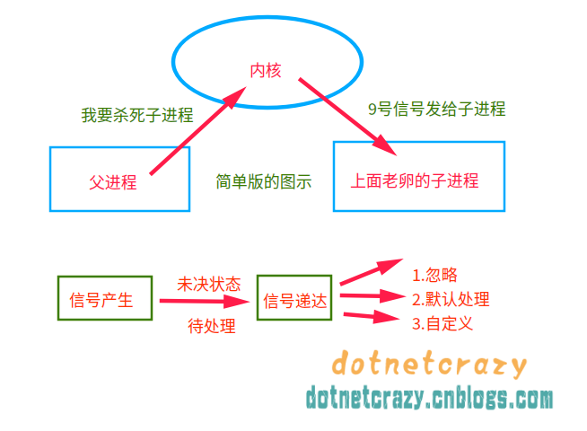

未决信号集：没有被当前进程处理的信号集合（可以通过`signal.sigpending()`获取`set`集合）

阻塞信号集：要屏蔽的信号（不能被用户操作）

回顾一下上面说`kill 9 pid`原理的知识：`kill -l`
```
 1) SIGHUP	 2) SIGINT	 3) SIGQUIT	 4) SIGILL	 5) SIGTRAP
 6) SIGABRT	 7) SIGBUS	 8) SIGFPE	 9) SIGKILL	10) SIGUSR1
11) SIGSEGV	12) SIGUSR2	13) SIGPIPE	14) SIGALRM	15) SIGTERM
16) SIGSTKFLT	17) SIGCHLD	18) SIGCONT	19) SIGSTOP	20) SIGTSTP
21) SIGTTIN	22) SIGTTOU	23) SIGURG	24) SIGXCPU	25) SIGXFSZ
26) SIGVTALRM	27) SIGPROF	28) SIGWINCH	29) SIGIO	30) SIGPWR
31) SIGSYS	34) SIGRTMIN	35) SIGRTMIN+1	36) SIGRTMIN+2	37) SIGRTMIN+3
38) SIGRTMIN+4	39) SIGRTMIN+5	40) SIGRTMIN+6	41) SIGRTMIN+7	42) SIGRTMIN+8
43) SIGRTMIN+9	44) SIGRTMIN+10	45) SIGRTMIN+11	46) SIGRTMIN+12	47) SIGRTMIN+13
48) SIGRTMIN+14	49) SIGRTMIN+15	50) SIGRTMAX-14	51) SIGRTMAX-13	52) SIGRTMAX-12
53) SIGRTMAX-11	54) SIGRTMAX-10	55) SIGRTMAX-9	56) SIGRTMAX-8	57) SIGRTMAX-7
58) SIGRTMAX-6	59) SIGRTMAX-5	60) SIGRTMAX-4	61) SIGRTMAX-3	62) SIGRTMAX-2
63) SIGRTMAX-1	64) SIGRTMAX
```
说下常用的几个信号：
1. 9号信号（`sigkill`）是`kill 9`
2. 2号信号（`sigint`）是`Ctrl+C`终止进程
3. 3号信号（`sigquit`）是`Ctrl+\`终止进程

#### 信号捕捉

现在说说信号捕捉`signal.signal(signalnum, handler)`

`handler处理函数`，除了自定义信号处理函数外也可以使用系统提供的两种方式：
1. `SIG_IGN`（忽略该信号）
2. `SIG_DFL`（系统默认操作）

注意一点：`SIGSTOP` 和 `SIGKILL` 信号是不能被捕获、忽略和阻塞的（这个是系统预留的，如果连预留都没有可以想象肯定木马横向）

PS:**信号的优先级**一般都是**比较高**的,往往**进程收到信号后都会停下手上的事情先处理信号**（死循环也一样歇菜）

来看一个例子:(处理singint，忽略sigquit)
```py
import os
import time
import signal

def print_info(signalnum, frame):
    print("信号:%d准备弄我,我是小强我怕谁?(%s)" % (signalnum, frame))

def main():
    signal.signal(signal.SIGINT, print_info)  # 处理Ctrl+C的终止命令(singint)
    signal.signal(signal.SIGQUIT, signal.SIG_IGN)  # 忽略Ctrl+\的终止命令(sigquit)

    while True:
        print("[PID:%d]我很坚强,不退出,等着信号来递达~" % os.getpid())
        time.sleep(3)  # 你要保证进程不会退出才能处理信号,不用担心影响信号（优先级高）

if __name__ == '__main__':
    main()
```
输出图示:（我休息3s，在3s内给程序发送了`sigint`信号（Ctrl+C）就立马处理了）
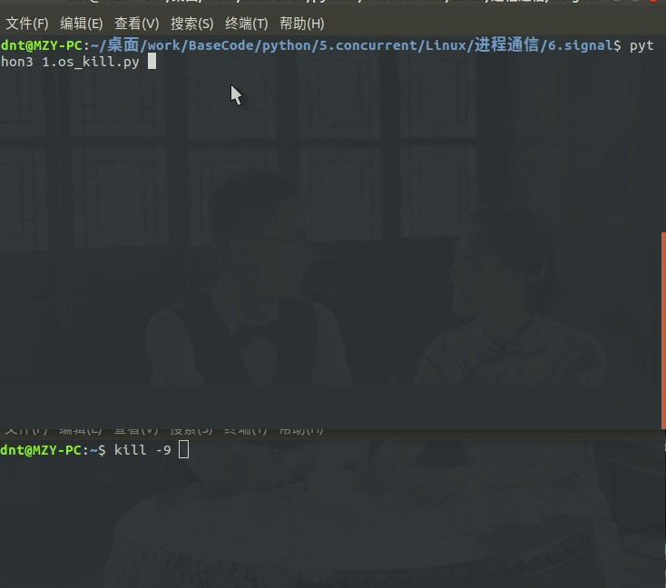

扩展：
1. 如果你只是等一个信号就退出，可以使用：`signal.pause()`，不必使用死循环来轮询了
2. `os.killpg(pgid, sid)`进程组结束
3. `signal.siginterrupt(signal.SIGALRM, False)` 防止系统调用被信号打断所设立（其实一般也不太用，出问题才用）

通俗的讲就是，要是系统和你发一样的信号可能也就被处理了，加上这句就ok了，eg：

举个例子，有时候有些恶意程序蓄意破坏或者被所谓的安全软件误杀比如系统函数`kill(-1)`【有权限的都杀了】
```py
import signal

def print_info(signalnum, frame):
    print("死前留言：我被信号%d弄死了，记得替我报仇啊！" % signalnum)

def main():
    signal.signal(signal.SIGINT, print_info)  # 处理Ctrl+C的终止命令(singint)
    signal.signal(signal.SIGQUIT, print_info)  # 处理Ctrl+\的终止命令(singquit)
    signal.siginterrupt(signal.SIGINT, False)
    signal.siginterrupt(signal.SIGQUIT, False)
    signal.pause()  # 设置一个进程到休眠状态直到接收一个信号

if __name__ == '__main__':
    main()
```
输出：
```
dnt@MZY-PC:~/桌面/work/BaseCode/python/5.concurrent/Linux/进程通信/6.signal python3 1.os_kill2.py 
^C死前留言：我被信号2弄死了，记得替我报仇啊！
dnt@MZY-PC:~/桌面/work/BaseCode/python/5.concurrent/Linux/进程通信/6.signal python3 1.os_kill2.py 
^\死前留言：我被信号3弄死了，记得替我报仇啊！
dnt@MZY-PC:~/桌面/work/BaseCode/python/5.concurrent/Linux/进程通信/6.signal 
```

#### 定时器alarm（执行一次）

再说两个定时器就进下一个话题把，这个主要就是**信号捕捉用得比较多**，然后就是**一般都是守护进程发信号**

先验证一个概念：**alarm闹钟不能被fork后的子进程继承**
```py
import os
import time
import signal

def main():
    # 不受进程影响，每个进程只能有一个定时器，再设置只是重置
    signal.alarm(3)  # 设置终止时间（3s），然后终止进程（sigaltirm）

    pid = os.fork()
    if pid == 0:
        print("[子进程]PID=%d,PPID=%d" % (os.getpid(), os.getppid()))
        for i in range(5):
            print("[子进程]孩子老卵，怎么滴吧～")
            time.sleep(1)
    elif pid > 0:
        print("[父进程]PID=%d,PPID=%d" % (os.getpid(), os.getppid()))

    print("[遗言]PID=%d,PPID=%d" % (os.getpid(), os.getppid()))

if __name__ == '__main__':
    main()
```
输出
```
[父进程]PID=9687,PPID=9063
[遗言]PID=9687,PPID=9063
[子进程]PID=9688,PPID=9687
[子进程]孩子老卵，怎么滴吧～
[子进程]孩子老卵，怎么滴吧～
[子进程]孩子老卵，怎么滴吧～
[子进程]孩子老卵，怎么滴吧～
[子进程]孩子老卵，怎么滴吧～
[遗言]PID=9688,PPID=1060
```
这个你可以自己验证：**不受进程影响，每个进程只能有一个定时器，再设置只是重置**

#### 普及一个小技巧

其实好好看逆天的问题都会发现各种小技巧的，所有小技巧自我总结一下就会产生质变了

```py
import signal

def main():
    signal.alarm(1)  # 设置终止时间（3s），然后终止进程（sigaltirm）
    i = 0
    while True:
        print(i)
        i += 1  # 别忘记，Python里面没有++哦～

if __name__ == '__main__':
    main()
```
运行一下：**`time python3 xxx.py`**
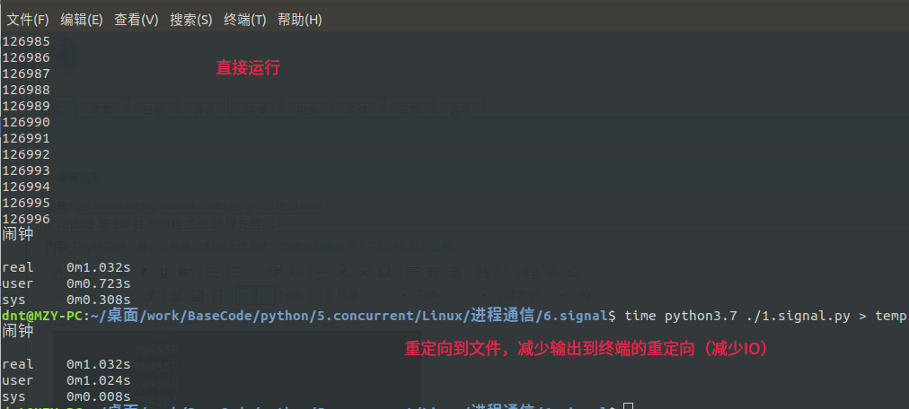
运行一下：**`time python3 xxx.py > temp`**
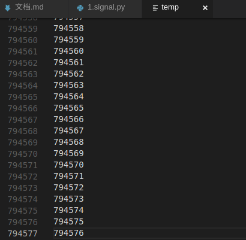

简单说下三个参数：
1. `real`总共运行时间（real=user+sys+损耗时间）
2. `user`（用户代码真正运行时间）
3. `sys`（内核运行时间）【内核不运行，你系统也不正常了】

其实就是减少了IO操作，性能方面就相差几倍！我这边只是一台老电脑，要是真在服务器下性能相差可能让你吓一跳

现在知道为什么要realase发布而不用debug直接部署了吧（**线上项目非必要情况，一般都会删除所有日记输出的**）

#### 定时器setitimer（周期执行）

`signal.setitimer(which, seconds, interval=0.0)` which参数说明：
1. **signal.TIMER_REAL：按实际时间计时，计时到达将给进程发送SIGALRM信号**
2. signal.ITIMER_VIRTUAL：仅当进程执行时才进行计时。计时到达将发送SIGVTALRM信号给进程。
3. signal.ITIMER_PROF：当进程执行时和系统为该进程执行动作时都计时。与ITIMER_VIRTUAL是一对，该定时器经常用来统计进程在用户态和内核态花费的时间。计时到达将发送SIGPROF信号给进程。

这个一般在守护进程中经常用，看个简单案例：

```py
import time
import signal

def say_hai(signalnum, frame):
    print("我会周期性执行哦～")

def main():
    # 捕捉信号（在前面最好，不然容易漏捕获）
    signal.signal(signal.SIGALRM, say_hai)
    # 设置定时器，第一次1s后执行，以后都3s执行一次
    signal.setitimer(signal.ITIMER_REAL, 1, 3)
    # print(signal.getitimer(signal.ITIMER_REAL))

    while True:
        print("我在做其他事情")
        time.sleep(1)

if __name__ == '__main__':
    main()
```
输出：
```
我在做其他事情
我会周期性执行哦～
我在做其他事情
我在做其他事情
我在做其他事情
我会周期性执行哦～
我在做其他事情
我在做其他事情
我在做其他事情
我会周期性执行哦～
我在做其他事情
我在做其他事情
我在做其他事情
...
```

### 2.4.7.进程守护

实例代码：<a href="https://github.com/lotapp/BaseCode/tree/master/python/5.concurrent/Linux/进程守护" target="_blank">"https://github.com/lotapp/BaseCode/tree/master/python/5.concurrent/Linux/进程守护</a>

守护进程应用场景很多，比如程序上线后有个bug被不定时的触发，每次都导致系统爆卡或者退出，而程序员修复bug需要时间，但是线上项目又不能挂，这时候就可以使用一个心跳检测的守护进程（查错也可以使用守护进程）【为恶就不说了】

正式开始前，先来个伪案例：

模拟一个漏洞百出的程序
```py
import os
import time

def main():
    print("[PID:%d]进程运行中..." % os.getpid())
    time.sleep(5)
    os.abort()  # 给自己发异常终止信号

if __name__ == '__main__':
    main()
```
写个简单版本的守护进程：
```py
import os
import time
import signal

def write_log(msg):
    pass

def is_running(p_name):
    """是否在运行"""
    try:
        # grep -v grep 不显示grep本身，wc -l是计数用的
        result = os.popen("ps ax | grep %s | grep -v grep" % p_name).readlines()
        if len(result) > 0:
            return True
        else:
            return False
    except Exception as ex:
        write_log(ex)
        return False

def is_restart(p_script):
    """重启程序"""
    try:
        if os.system(p_script) == 0:
            return True
        else:
            return False
    except Exception as ex:
        write_log(ex)
        return False

def heartbeat(signalnum, frame):
    """心跳检查"""
    p_name = "test.py"
    p_script = "python3 ./test.py"

    if not is_running(p_name):
        print("程序(%s)已挂，准备重启" % p_name)
        if not is_restart(p_script):
            is_restart(p_script)  # 再给一次机会

def main():
    # 信号处理
    signal.signal(signal.SIGALRM, heartbeat)
    # 第一次1s后检查，以后每5s检查一次
    signal.setitimer(signal.ITIMER_REAL, 1, 5)
    while True:
        time.sleep(5)  # 不用担心影响signal（优先级别高）

if __name__ == '__main__':
    main()
```
输出：
```
程序(test.py)已挂，准备重启
[PID:7270]进程运行中...
Aborted (core dumped)
程序(test.py)已挂，准备重启
[PID:7278]进程运行中...
Aborted (core dumped)
[PID:7284]进程运行中...
.....
```

#### 正规流程的守护进程

写了个伪牌子的，现在说说正规的，看看概念的东西：

**特点**：
1. 后台服务进程
2. 脱离于控制终端（setpid）
3. 周期性的执行某个任务|等待某个事件发生（setitimer）
4. 不受用户登录注销影响（关机影响，不过你可以添加启动项）
5. 一般使用以d结尾的服务名称（约定俗成）

讲正式流程前先复习一下上面说的`进程组`和`会话`
1. 进程组：每一个进程都属于一个“进程组”，当一个进程被创建的时候，它默认是其父进程所在组的成员（**你们一家**）
2. 会  话：几个进程组又构成一个会话（**你们小区**）

需要扩充几点：
1. **进程组**：
    1. 组长：第一个进程
    2. 组长ID==进程组ID
    3. 组长挂了不影响进程组

2. **会话**：
    1. 组长不能创建会话（你都有官了，不留点门路给后人？）
    2. 创建会话的进程成为新进程组的组长（新进程组里面就它一个嘛）
    3. 创建出新会话会丢弃原有的控制终端（到了新环境里面，人脉得重新建立）

稍微验证一下，然后步入正题：
```py
import os
import time

def main():
    pid = os.fork()
    if pid == 0:
        for i in range(7):
            print("子进程：PID=%d,PPID=%d,PGrpID=%d" % (os.getpid(), os.getppid(), os.getpgrp()))
            time.sleep(i)
    elif pid > 0:
        print("父进程：PID=%d,PPID=%d,PGrpID=%d" % (os.getpid(), os.getppid(), os.getpgrp()))
        time.sleep(4)

    print("遗言：PID=%d,PPID=%d,PGrpID=%d" % (os.getpid(), os.getppid(), os.getpgrp()))

if __name__ == '__main__':
    main()
```
验证结果：`父进程ID==进程组ID`，`父进程挂了进程组依旧在`，顺便验证了下`ps -ajx`的参数
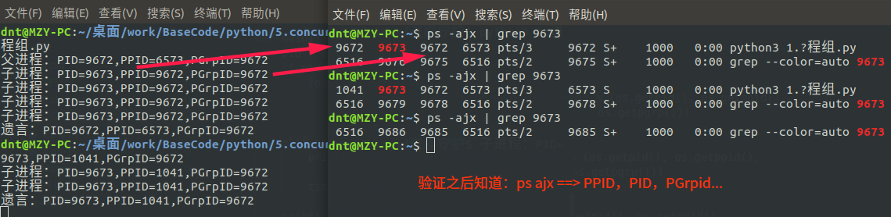

先看看这个SessionID是啥：
```py
import os
import time

def main():
    print("进程：PID=%d,PPID=%d,PGrpID=%d" % (os.getpid(), os.getppid(), os.getpgrp()))
    print(os.getsid(os.getpid()))
    for i in range(1, 5):
        time.sleep(i)
    print("over")

if __name__ == '__main__':
    main()
```
**`ps ajx`**的参数现在全知道了：**PPID   PID  PGID   SID** (你不加grep就能看到的)
![session_test]](../../../images/python/2018-07-27/8.session_test.png)

验证一下SessionID的事情：


```python
# 验证一下父进程不能创建会话ID
import os

def main():
    pid = os.getpid()
    print("进程：PPID=%d,PID=%d,GID=%d,SID=%d" % (pid, os.getppid(), os.getpgrp(),os.getsid(pid)))
    os.setsid() # 父进程没法设置为会话ID的验证


if __name__ == '__main__':
    main()
```

    进程：PPID=3301,PID=2588,GID=3301,SID=3301


    ---------------------------------------------------------------------------

    PermissionError                           Traceback (most recent call last)

    <ipython-input-1-375f70009fcf> in <module>()
          8 
          9 if __name__ == '__main__':
    ---> 10     main()
    

    <ipython-input-1-375f70009fcf> in main()
          4     pid = os.getpid()
          5     print("进程：PPID=%d,PID=%d,GID=%d,SID=%d" % (pid, os.getppid(), os.getpgrp(),os.getsid(pid)))
    ----> 6     os.setsid() # 父进程没法设置为会话ID的验证
          7 
          8 


    PermissionError: [Errno 1] Operation not permitted


步入正轨：

**创建守护进程的步骤**：
1. fork子进程，父进程退出（子进程变成了孤儿）
2. 子进程创建新会话（创建出新会话会丢弃原有的控制终端）
3. 改变当前工作目录【为了减少bug】（eg：你在某个文件夹下运行，这个文件夹被删了，多少会点受影响）
4. 重置文件掩码（继承了父进程的文件掩码，通过`umask(0)`重置一下，这样可以获取777权限）
5. 关闭文件描述符（既然用不到了，就关了）
6. 自己的逻辑代码

先简单弄个例子实现上面步骤：
```py
import os
import time
from sys import stdin, stdout, stderr

def main():

    # 【必须】1. fork子进程，父进程退出（子进程变成了孤儿）
    pid = os.fork()
    if pid > 0:
        exit(0)

    # 【必须】2. 子进程创建新会话（创建出新会话会丢弃原有的控制终端）
    os.setsid()

    # 3. 改变当前工作目录【为了减少bug】# 改成不会被删掉的目录，比如/
    os.chdir("/home/dnt")  # 我这边因为是用户创建的守护进程，就放它下面，用户删了，它也没必要存在了

    # 4. 重置文件掩码（获取777权限）
    os.umask(0)

    # 5. 关闭文件描述符（如果写日志也可以重定向一下）
    os.close(stdin.fileno())
    os.close(stdout.fileno())
    os.close(stderr.fileno())

    # 【必须】6. 自己的逻辑代码
    while True:
        time.sleep(1)

if __name__ == '__main__':
    main()
```
运行效果：（直接后台走起了）
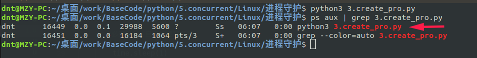

---
#### 基础回顾

**如果对Linux基础不熟，可以看看几年前说的LinuxBase：**

Linux基础命令：<a href="http://www.cnblogs.com/dunitian/p/4822807.html" target="_blank">http://www.cnblogs.com/dunitian/p/4822807.html</a>

Linux系列其他文章：<a href="https://www.cnblogs.com/dunitian/p/4822808.html#linux" target="_blank">https://www.cnblogs.com/dunitian/p/4822808.html#linux</a>

---

**如果对部署运行系列不是很熟，可以看之前写的小demo：**

用Python3、NetCore、Shell分别开发一个Ubuntu版的定时提醒（附NetCore跨平台两种发布方式）：<a href="https://www.cnblogs.com/dotnetcrazy/p/9111200.html" target="_blank">https://www.cnblogs.com/dotnetcrazy/p/9111200.html</a>

---

**如果对OOP不是很熟悉可以查看之前写的OOP文章：**

Python3 与 C# 面向对象之～封装<a href="https://www.cnblogs.com/dotnetcrazy/p/9202988.html" target="_blank">https://www.cnblogs.com/dotnetcrazy/p/9202988.html</a>

Python3 与 C# 面向对象之～继承与多态<a href="https://www.cnblogs.com/dotnetcrazy/p/9219226.html" target="_blank">https://www.cnblogs.com/dotnetcrazy/p/9219226.html</a>

Python3 与 C# 面向对象之～异常相关<a href="https://www.cnblogs.com/dotnetcrazy/p/9219751.html" target="_blank">https://www.cnblogs.com/dotnetcrazy/p/9219751.html</a>

---

**如果基础不牢固，可以看之前写的PythonBase：**

Python3 与 C# 基础语法对比（Function专栏）<a href="https://www.cnblogs.com/dotnetcrazy/p/9175950.html" target="_blank">https://www.cnblogs.com/dotnetcrazy/p/9175950.html</a>

Python3 与 C# 扩展之～模块专栏<a href="https://www.cnblogs.com/dotnetcrazy/p/9253087.html" target="_blank">https://www.cnblogs.com/dotnetcrazy/p/9253087.html</a>

Python3 与 C# 扩展之～基础衍生<a href="https://www.cnblogs.com/dotnetcrazy/p/9278573.html" target="_blank">https://www.cnblogs.com/dotnetcrazy/p/9278573.html</a>

Python3 与 C# 扩展之～基础拓展<a href="https://www.cnblogs.com/dotnetcrazy/p/9333792.html" target="_blank">https://www.cnblogs.com/dotnetcrazy/p/9333792.html</a>

---

现在正儿八经的来个**简化版的守护进程**：（你可以根据需求多加点信号处理）
```py
import os
import time
import signal
from sys import stdin, stdout, stderr

class Daemon(object):
    def __init__(self, p_name, p_script):
        self.p_name = p_name
        self.p_script = p_script

    @staticmethod
    def write_log(msg):
        # 追加方式写
        with open("info.log", "a+") as f:
            f.write(msg)
            f.write("\n")

    def is_running(self, p_name):
        """是否在运行"""
        try:
            # grep -v grep 不显示grep本身，wc -l是计数用的
            result = os.popen(
                "ps ax | grep %s | grep -v grep" % p_name).readlines()
            if len(result) > 0:
                return True
            else:
                return False
        except Exception as ex:
            self.write_log(ex)
            return False

    def is_restart(self, p_script):
        """重启程序"""
        try:
            if os.system(p_script) == 0:
                return True
            else:
                return False
        except Exception as ex:
            self.write_log(ex)
            return False

    def heartbeat(self, signalnum, frame):
        """心跳检查"""
        if not self.is_running(self.p_name):
            self.write_log("[%s]程序(%s)已挂，准备重启" % (time.strftime("%Y-%m-%d %X"),
                                                  self.p_name))
            if not self.is_restart(self.p_script):
                self.is_restart(self.p_script)  # 再给一次机会

    def run(self):
        """运行守护进程"""
        pid = os.fork()
        if pid > 0:
            exit(0)

        os.setsid()  # 子进程创建新会话
        os.chdir("/home/dnt")  # 改变当前工作目录
        os.umask(0)  # 获取777权限

        # 5. 关闭文件描述符
        os.close(stdin.fileno())
        os.close(stdout.fileno())
        os.close(stderr.fileno())

        # 【必须】6. 自己的逻辑代码
        # 捕捉设置的定时器
        signal.signal(signal.SIGALRM, self.heartbeat)
        # 第一次2s后执行，以后5s执行一次
        signal.setitimer(signal.ITIMER_REAL, 2, 5)

        self.write_log("[%s]daeman running" % time.strftime("%Y-%m-%d %X"))
        self.write_log("p_name:%s，p_script:%s" % (self.p_name, self.p_script))

        while True:
            time.sleep(5)  # 不用担心影响signal（优先级别高）

def main():
    try:
        pro = Daemon("test.py", "python3 ~/demo/test.py")
        pro.run()
    except Exception as ex:
        Daemon.write_log(ex)

if __name__ == '__main__':
    main()
```
运行效果：(关闭文件描述符后就不要printf了)

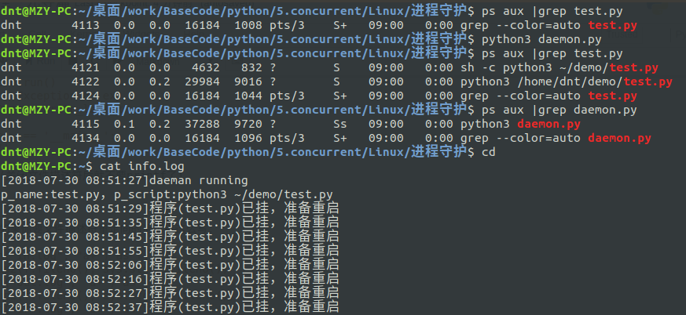

扩展说明，如果你要文件描述符重定向的话可以这么写：
```py
with open("in.log", "a+") as f:
    os.dup2(f.fileno(), sys.stdin.fileno())
with open("out.log", "a+") as f:
    os.dup2(f.fileno(), sys.stdout.fileno())
with open("err.log", "a+") as f:
    os.dup2(f.fileno(), sys.stderr.fileno())
```
之后你printf就自动到指定的文件了

### 扩展说明：

Socket，在讲基础最后一个系列～**网络编程**的时候会讲，不急，而且进程间通信不需要这么`‘重量级’`的

线程相关打算和代码一起讲，有机会也可以单独拉出来说一个结尾篇

---

业余拓展：

<a href="https://docs.python.org/3/contents.html" target="_blank">官方文档大全</a>

<a href="https://docs.python.org/3/library/ipc.html" target="_blank">进程间通信和网络</a>

<a href="https://docs.python.org/3/library/os.html" target="_blank">os - 其他操作系统接口</a>

<a href="https://docs.python.org/3/library/mmap.html" target="_blank">mmap - 内存映射文件支持</a>

<a href="https://docs.python.org/3/library/signal.html" target="_blank">signal - 设置异步事件的处理程序</a>

Other：
```
Linux下0、1、2号进程
https://blog.csdn.net/gatieme/article/details/51484562
https://blog.csdn.net/gatieme/article/details/51532804
https://blog.csdn.net/gatieme/article/details/51566690

Linux 的启动流程
http://www.ruanyifeng.com/blog/2013/08/linux_boot_process.html
http://www.ruanyifeng.com/blog/2016/03/systemd-tutorial-commands.html
http://www.ruanyifeng.com/blog/2016/03/systemd-tutorial-part-two.html

孤儿进程与僵尸进程
https://www.cnblogs.com/Anker/p/3271773.html
https://blog.csdn.net/believe_s/article/details/77040494

Python2 OS模块之进程管理
https://www.cnblogs.com/now-fighting/p/3534185.html

缓冲区的个人理解
https://blog.csdn.net/lina_acm/article/details/51865543

深入Python多进程编程基础
https://zhuanlan.zhihu.com/p/37370577
https://zhuanlan.zhihu.com/p/37370601

python多进程实现进程间通信实例
https://www.jb51.net/article/129016.htm

PIPE2参考：
https://bugs.python.org/file22147/posix_pipe2.diff
https://stackoverflow.com/questions/30087506/event-driven-system-call-in-python
https://stackoverflow.com/questions/5308080/python-socket-accept-nonblocking/5308168

FIFO参考：
https://blog.csdn.net/an_tang/article/details/68951819
https://blog.csdn.net/firefoxbug/article/details/8137762

Python之mmap内存映射模块（大文本处理）说明
https://www.cnblogs.com/zhoujinyi/p/6062907.html

python 基于mmap模块的jsonmmap实现本地多进程内存共享
https://www.cnblogs.com/dacainiao/p/5914114.html

如果把一个事务可看作是一个程序,它要么完整的被执行,要么完全不执行。这种特性就叫原子性。
https://blog.csdn.net/Android_Mrchen/article/details/77866490

事务四大特征：原子性，一致性，隔离性和持久性
https://blog.csdn.net/u014079773/article/details/52808193

python 、mmap 实现内存数据共享
https://www.jianshu.com/p/c3afc0f02560
http://www.cnblogs.com/zhoujinyi/p/6062907.html
https://blog.csdn.net/zhaohongyan6/article/details/71158522

Python信号相关：
https://my.oschina.net/guol/blog/136036

Linux--进程组、会话、守护进程
https://www.cnblogs.com/forstudy/archive/2012/04/03/2427683.html
```
