# 3.协程篇

在线预览：<https://github.lesschina.com/python/base/concurrency/4.并发编程-协程篇.html>

示例代码：<https://github.com/lotapp/BaseCode/tree/master/python/5.concurrent/ZCoroutine>

多进程和多线程切换之间也是有资源浪费的，相比而言协程更轻量级

## 3.1.知识回顾

### 1.装饰器

往期文章：<a href="https://www.cnblogs.com/dotnetcrazy/p/9333792.html#2.Python装饰器" target="_blank">https://www.cnblogs.com/dotnetcrazy/p/9333792.html#2.Python装饰器</a>

基础拓展篇已经讲的很透彻了，就不再雷同了，贴一个简单案例，然后扩展说说**`可迭代`、`迭代器`和`生成器`**


```python
% time

from functools import wraps

def log(func):
    @wraps(func)
    def wrapper(*args,**kv):
        print("%s log_info..." % func.__name__)
        return func(*args,**kv)
    return wrapper

@log
def login_out():
    print("已经退出登录")

def main():
    # @wraps(func) 可以使得装饰前后，方法签名一致
    print(f"方法签名：{login_out.__name__}")
    login_out()
    
    # @wraps能让你通过属性 __wrapped__ 直接访问被包装函数
    login_out.__wrapped__() # 执行原来的函数

if __name__ == '__main__':
    main()
```

    Wall time: 0 ns
    方法签名：login_out
    login_out log_info...
    已经退出登录
    已经退出登录
    

### 2.迭代器

往期文章：<a href="https://www.cnblogs.com/dotnetcrazy/p/9278573.html#6.Python迭代器" target="_blank">https://www.cnblogs.com/dotnetcrazy/p/9278573.html#6.Python迭代器</a>

过于基础的就不说了，简单说下，然后举一个`OOP`的`Demo`：
1. **判断是否可迭代：（能不能for遍历）**
    - `from collections.abc import Iterable`
    - `isinstance(xxx, Iterable)`
2. **判断是否是迭代器：（能不能`next(xxx)`遍历）**
    - `from collections.abc import Iterator`
    - `isinstance(xxx, Iterable)`
    - PS：迭代器是一定可以迭代的
3. **可迭代对象转迭代器：（生成器都是迭代器）**
    - 把`list、dict、str`等`Iterable`变成`Iterator`可以使用`iter()`函数 eg：**`iter([])`**（节省资源）
    - PS：生成器都是`Iterator`对象，但list、dict、str虽然是`Iterable`，却不是`Iterator`

**提醒一下：`from collections import Iterable, Iterator # 现在已经不推荐使用了（3.8会弃用）`**

查看一下`typing.py`的源码就知道了:
```PY
# 模仿collections.abc中的那些（Python3.7目前只是过渡的兼容版，没有具体实现）
def _alias(origin, params, inst=True):
    return _GenericAlias(origin, params, special=True, inst=inst)

T_co = TypeVar('T_co', covariant=True)  # Any type covariant containers.

Iterable = _alias(collections.abc.Iterable, T_co)
Iterator = _alias(collections.abc.Iterator, T_co)
```

之前说了个 <a href="https://www.cnblogs.com/dotnetcrazy/p/9278573.html#7.1.IEnumerator-%E5%92%8C-IEnumerable" target="_blank">CSharp 的 OOP Demo</a>，这次来个`Python`的，我们来一步步演变：


```python
% time

# 导入相关模块
from collections.abc import Iterable, Iterator
# from collections import Iterable, Iterator # 现在已经不推荐使用了（3.8会弃用）
```

    Wall time: 0 ns
    


```python
# 定义一个Class
class MyArray(object):
    pass
```


```python
# 是否可迭代 False
isinstance(MyArray(),Iterable)
```


    False


```python
# 是否是迭代器 False
isinstance(MyArray(),Iterator)
```


    False


```python
# 如果Class里面含有`__iter__`方法就是可迭代的
```


```python
# 重新定义测试：
class MyArray(object):
    def __iter__(self):
        pass

# 是否可迭代 False
isinstance(MyArray(),Iterable)
```


    True


```python
# 是否是迭代器 False
isinstance(MyArray(),Iterator)
```


    False


**这时候依然不是迭代器**

这个可以类比C#：
1. 能不能foreach就看你遍历对象有没有实现IEnumerable，就说明你是不是一个可枚举类型（enumerator type）
2. 是不是个枚举器（enumerator）就看你实现了IEnumerator接口没

```csharp
// 能不能foreach就看你遍历对象有没有实现IEnumerable，就说明你是不是一个可枚举类型
public interface IEnumerable
{
    IEnumerator GetEnumerator();
}

// 是不是个枚举器（enumerator）就看你实现了IEnumerator接口没
public interface IEnumerator
{
    object Current { get; }

    bool MoveNext();

    void Reset();
}
```
先看看Python对于的类吧：
```py
# https://github.com/lotapp/cpython3/blob/master/Lib/_collections_abc.py
class Iterable(metaclass=ABCMeta):

    __slots__ = ()

    @abstractmethod
    def __iter__(self):
        while False:
            yield None

    @classmethod
    def __subclasshook__(cls, C):
        if cls is Iterable:
            return _check_methods(C, "__iter__")
        return NotImplemented

class Iterator(Iterable):

    __slots__ = ()

    @abstractmethod
    def __next__(self):
        'Return the next item from the iterator. When exhausted, raise StopIteration'
        raise StopIteration

    def __iter__(self):
        return self

    @classmethod
    def __subclasshook__(cls, C):
        if cls is Iterator:
            return _check_methods(C, '__iter__', '__next__')
        return NotImplemented
```
读源码的好处来了==>**`抽象方法：@abstractmethod（子类必须实现）`，上次漏讲了吧～**

上面说**迭代器肯定可以迭代**，说很抽象，代码太直观了 (继承)：**`class Iterator(Iterable)`**

现在我们来模仿并实现一个`Python`版本的`迭代器`：


```python
% time

# 先搭个空架子
class MyIterator(Iterator):
    def __next__(self):
        pass

class MyArray(Iterable):
    def __iter__(self):
        return MyIterator() # 返回一个迭代器

def main():
    # 可迭代 True
    print(isinstance(MyArray(), Iterable))
    # 迭代器也是可迭代的 True
    print(isinstance(MyIterator(), Iterable))
    # 是迭代器 True
    print(isinstance(MyIterator(), Iterator))

if __name__ == '__main__':
    main()
```

    Wall time: 0 ns
    True
    True
    True
    


```python
% time

# 把迭代器简化合并
class MyIterator(Iterator):
    def __next__(self):
        pass

    def __iter__(self):
        return self # 返回一个迭代器(现在就是它自己了)

def main():
    print(isinstance(MyIterator(), Iterable))
    print(isinstance(MyIterator(), Iterator))

if __name__ == '__main__':
    main()
```

    Wall time: 0 ns
    True
    True
    


```python
% time

# 马上进入正题了，先回顾一下Fibona
def fibona(n):
    a, b = 0, 1
    for i in range(n):
        a, b = b, a+b
        print(a)

# 获取10个斐波拉契数列
fibona(10)
```

    Wall time: 0 ns
    1
    1
    2
    3
    5
    8
    13
    21
    34
    55
    


```python
% time

# 改造成迭代器
from collections.abc import Iterable, Iterator

class FibonaIterator(Iterator):
    def __init__(self, n):
        self.__a = 0
        self.__b = 1
        self.__n = n  # 获取多少个
        self.__index = 0  # 当前索引

    def __next__(self):
        if self.__index < self.__n:
            self.__index += 1
            # 生成下一波
            self.__a, self.__b = self.__b, self.__a + self.__b
            return self.__a
        else:
            raise StopIteration # for循环结束条件

def main():
    print(FibonaIterator(10))
    for i in FibonaIterator(10):
        print(i)

if __name__ == "__main__":
    main()
```

    Wall time: 0 ns
    <__main__.FibonaIterator object at 0x000001CAFFD2C748>
    1
    1
    2
    3
    5
    8
    13
    21
    34
    55
    

---

### 3.生成器

往期文章：<a href="https://www.cnblogs.com/dotnetcrazy/p/9278573.html#5.Python生成器" target="_blank">https://www.cnblogs.com/dotnetcrazy/p/9278573.html#5.Python生成器</a>

生成器是啥？看源码就秒懂了：(**迭代器的基础上再封装**)
```py
class Generator(Iterator):
    __slots__ = ()

    def __next__(self):
        """从生成器返回下一个item，结束的时候抛出 StopIteration"""
        return self.send(None)

    @abstractmethod
    def send(self, value):
        """将值发送到生成器。返回下一个产生的值或抛出StopIteration"""
        raise StopIteration

    @abstractmethod
    def throw(self, typ, val=None, tb=None):
        """在生成器中引发异常。返回下一个产生的值或抛出StopIteration"""
        if val is None:
            if tb is None:
                raise typ
            val = typ()
        if tb is not None:
            val = val.with_traceback(tb)
        raise val

    # 现在知道之前close后为啥没异常了吧～
    def close(self):
        """屏蔽异常"""
        try:
            self.throw(GeneratorExit)
        except (GeneratorExit, StopIteration):
            pass
        else:
            raise RuntimeError("generator ignored GeneratorExit")

    @classmethod
    def __subclasshook__(cls, C):
        if cls is Generator:
            return _check_methods(C, '__iter__', '__next__',
                                  'send', 'throw', 'close')
        return NotImplemented
```
迭代器的基础上再封装了两个抽象方法`send`、`throw`和屏蔽异常的方法`close`

现在用生成器的方式改写下斐波拉契数列：（列表推导式改成小括号是最简单的一种生成器）


```python
% time

# 代码瞬间就简洁了
def fibona(n):
    a = 0
    b = 1
    for _ in range(n):
        a, b = b, a + b
        yield a # 加个yiel就变成生成器了

def main():
    print(fibona(10))
    for i in fibona(10):
        print(i)

if __name__ == "__main__":
    main()
```

    Wall time: 0 ns
    <generator object fibona at 0x000001CAFFD1AC00>
    1
    1
    2
    3
    5
    8
    13
    21
    34
    55
    

注意下这几点：
1. <a herf="https://www.cnblogs.com/dotnetcrazy/p/9278573.html#5.3.扩展之～send(msg)方法：" target="_blank">generator刚启动的时候，要么 next()，要么 send(None)，不然会引发：</a>
    - `TypeError: can't send non-None value to a just-started generator`
2. <a herf="https://www.cnblogs.com/dotnetcrazy/p/9278573.html#5.4.扩展之～return和break的说明" target="_blank">在一个generator函数中，遇到return或者break则直接抛出StopIteration终止迭代</a>
    - 如果没有则默认执行至函数完毕
3. 如果想要拿到返回值，必须捕获`StopIteration`错误，返回值包含在`StopIteration`的`value`中

```py
def test_send(n):
    for i in range(n):
        if i==2:
            return "i==2"
        yield i

g = test_send(5)

while True:
    try:
        tmp = next(g)
        print(tmp)
    except StopIteration as ex:
        print(ex.value)
        break
```
输出：
```
0
1
i==2
```

其他的也没什么好说的了，读完源码再看看之前讲的内容`别有一番滋味在心头`哦～

---

## 3.2.概念篇

上集回顾：<a href="https://mp.weixin.qq.com/s/jWRBHi_ZNDBxOXElgAk86w" target="_blank">网络：静态服务器+压测</a>

### 1.同步与异步

> 同步是指一个任务的完成需要依赖另外一个任务时，只有等待被依赖的任务完成后，依赖的任务才能算完成。

> 异步是指不需要等待被依赖的任务完成，只是通知被依赖的任务要完成什么工作。然后继续执行下面代码逻辑，只要自己完成了整个任务就算完成了（异步一般使用状态、通知和回调）

PS：**项目里面一般是这样的**：（个人经验）
1. 同步架构：一般都是和钱相关的需求，需要实时返回的业务
2. 异步架构：更多是对写要求比较高时的场景（同步变异步）
    - 读一般都是实时返回，代码一般都是`await xxx()`
3. 想象个情景就清楚了：
    - 异步：现在用户写了篇文章，可以异步操作，就算没真正写到数据库也可以返回：发表成功（大不了失败提示一下）
    - 同步：用户获取订单信息，你如果异步就会这样了：提示下获取成功，然后一片空白...用户不卸载就怪了...

### 2.阻塞与非阻塞

> 阻塞是指调用结果返回之前，当前线程会被挂起，一直处于等待消息通知，不能够执行其他业务（大部分代码都是这样的）

> 非阻塞是指在不能立刻得到结果之前，该函数不会阻塞当前线程，而会立刻返回（继续执行下面代码，或者重试机制走起）

PS：**项目里面重试机制为啥一般都是3次？**
1. 第一次重试，两台PC挂了也是有可能的
2. 第二次重试，负载均衡分配的三台机器同时挂的可能性不是很大，这时候就有可能是网络有点拥堵了
3. 最后一次重试，再失败就没意义了，日记写起来，再重试网络负担就加大了，得不偿失了

### 3.五种IO模型

对于一次IO访问，数据会先被拷贝到内核的缓冲区中，然后才会从内核的缓冲区拷贝到应用程序的地址空间。需要经历两个阶段：
1. 准备数据
2. 将数据从内核缓冲区拷贝到进程地址空间

由于存在这两个阶段，Linux产生了下面五种IO模型（`以socket为例`）
1. 阻塞式IO：
    - 当用户进程调用了`recvfrom`等阻塞方法时，内核进入IO的第1个阶段：准备数据（内核需要等待足够的数据再拷贝）这个过程需要等待，用户进程会被阻塞，等内核将数据准备好，然后拷贝到用户地址空间，内核返回结果，用户进程才从阻塞态进入就绪态
    - Linux中默认情况下所有的socket都是阻塞的
2. 非阻塞式IO：
    - 当用户进程发出read操作时，如果`kernel`中的数据还没有准备好，那么它并不会`block`用户进程，而是立刻返回一个`error`。
    - 用户进程判断结果是一个`error`时，它就知道数据还没有准备好，于是它可以再次发送read操作
    - 一旦`kernel`中的数据准备好了，并且又再次收到了用户进程的`system call`，那么它马上就将数据拷贝到了用户内存，然后返回
    - 非阻塞IO模式下用户进程需要不断地询问内核的数据准备好了没有
3. **IO多路复用**：
    - 通过一种机制，一个进程可以监视多个文件描述符（套接字描述符）一旦某个文件描述符就绪（一般是读就绪或者写就绪），能够通知程序进行相应的读写操作（这样就不需要每个用户进程不断的询问内核数据准备好了没）
    - 常用的IO多路复用方式有`select`、`poll`和`epoll`
4. 信号驱动IO：（之前我们讲进程先导篇的时候说过）
    - 内核文件描述符就绪后，通过信号通知用户进程，用户进程再通过系统调用读取数据。
    - 此方式属于同步IO（实际读取数据到用户进程缓存的工作仍然是由用户进程自己负责的）
5. **异步IO**（`POSIX`的`aio_`系列函数）
    - 用户进程发起read操作之后，立刻就可以开始去做其它的事。内核收到一个异步`IO read`之后，会立刻返回，不会阻塞用户进程。
    - 内核会等待数据准备完成，然后将数据拷贝到用户内存，当这一切都完成之后，内核会给用户进程发送一个`signal`告诉它read操作完成了

### 4.Unix图示

贴一下Unix编程里面的图：

<center>非阻塞IO</center>

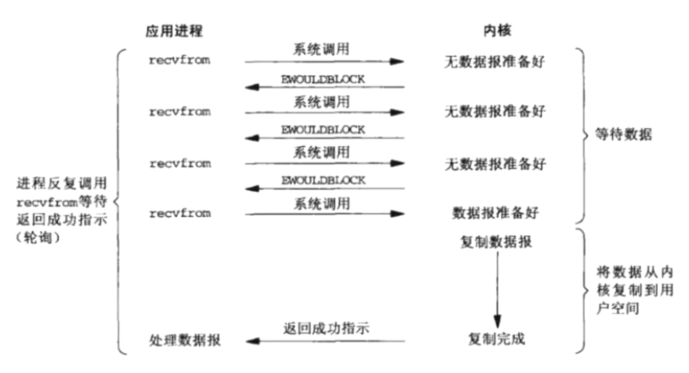

<center>IO复用</center>

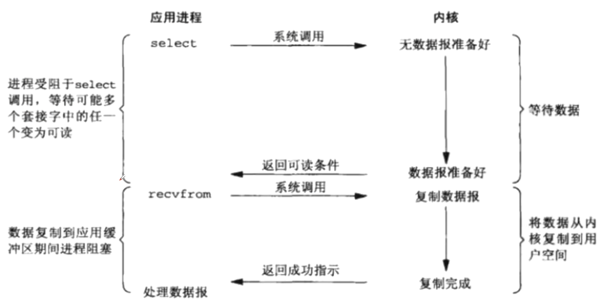

<center>信号IO</center>

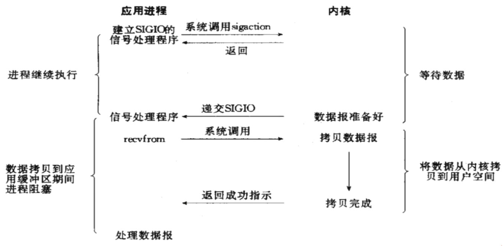

<center>异步AIO</center>

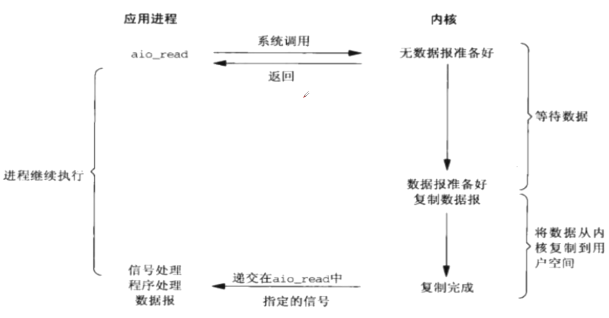

## 3.3.IO多路复用

开始之前咱们通过非阻塞IO引入一下：（来个简单例子`socket.setblocking(False)`)
```py
import time
import socket

def select(socket_addr_list):
    for client_socket, client_addr in socket_addr_list:
        try:
            data = client_socket.recv(2048)
            if data:
                print(f"[来自{client_addr}的消息：]\n")
                print(data.decode("utf-8"))
                client_socket.send(
                    b"HTTP/1.1 200 ok\r\nContent-Type: text/html;charset=utf-8\r\n\r\n<h1>Web Server Test</h1>"
                )
            else:
                # 没有消息是触发异常，空消息是断开连接
                client_socket.close()  # 关闭客户端连接
                socket_addr_list.remove((client_socket, client_addr))
                print(f"[客户端{client_addr}已断开连接，当前连接数：{len(socket_addr_list)}]")
        except Exception:
            pass

def main():
    # 存放客户端集合
    socket_addr_list = list()

    with socket.socket() as tcp_server:
        # 防止端口绑定的设置
        tcp_server.setsockopt(socket.SOL_SOCKET, socket.SO_REUSEADDR, 1)
        tcp_server.bind(('', 8080))
        tcp_server.listen()
        tcp_server.setblocking(False)  # 服务端非阻塞
        while True:
            try:
                client_socket, client_addr = tcp_server.accept()
                client_socket.setblocking(False)  # 客户端非阻塞
                socket_addr_list.append((client_socket, client_addr))
            except Exception:
                pass
            else:
                print(f"[来自{client_addr}的连接，当前连接数：{len(socket_addr_list)}]")
            # 防止客户端断开后出错
            if socket_addr_list:
                # 轮询查看客户端有没有消息
                select(socket_addr_list)  # 引用传参
                time.sleep(0.01)

if __name__ == "__main__":
    main()
```
输出：
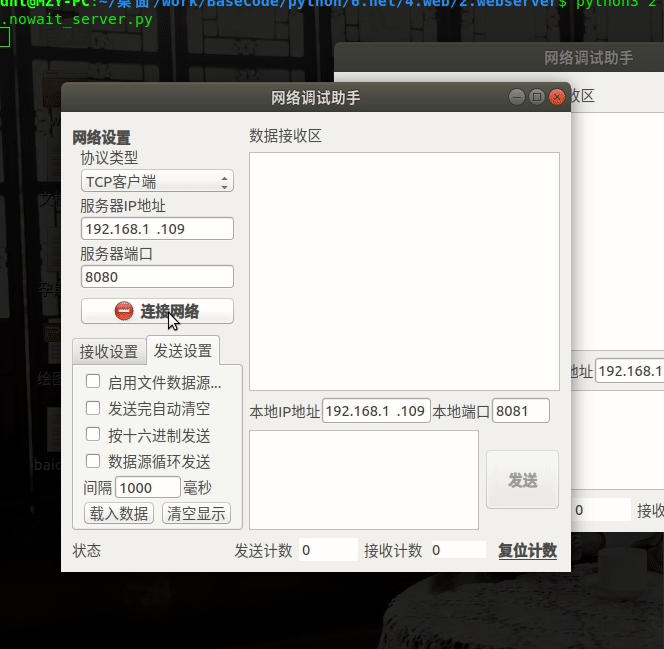

可以思考下：
1. 为什么Server也要设置为非阻塞？
    - PS：一个线程里面只能有一个死循环，现在程序需要两个死循环，so ==> 放一起咯
2. 断开连接怎么判断？
    - PS：没有消息是触发异常，空消息是断开连接
3. client_socket为什么不用dict存放？
    - PS：dict在循环的过程中，del会引发异常

### 1.Select

select和上面的有点类似，就是轮询的过程交给了操作系统：
> kernel会“监视”所有select负责的socket，当任何一个socket中的数据准备好了，select就会返回。这个时候用户进程再调用read操作，将数据从kernel拷贝到用户进程

来个和上面等同的案例：
```py
import select
import socket

def main():
    with socket.socket() as tcp_server:
        tcp_server.setsockopt(socket.SOL_SOCKET, socket.SO_REUSEADDR, 1)
        tcp_server.bind(('', 8080))
        tcp_server.listen()
        socket_info_dict = dict()
        socket_list = [tcp_server]  # 监测列表
        while True:
            # 劣势：select列表数量有限制
            read_list, write_list, error_list = select.select(
                socket_list, [], [])
            for item in read_list:
                # 服务端迎接新的连接
                if item == tcp_server:
                    client_socket, client_address = item.accept()
                    socket_list.append(client_socket)
                    socket_info_dict[client_socket] = client_address
                    print(f"[{client_address}已连接，当前连接数：{len(socket_list)-1}]")
                # 客户端发来
                else:
                    data = item.recv(2048)
                    if data:
                        print(data.decode("utf-8"))
                        item.send(
                            b"HTTP/1.1 200 ok\r\nContent-Type: text/html;charset=utf-8\r\n\r\n<h1>Web Server Test</h1>"
                        )
                    else:
                        item.close()
                        socket_list.remove(item)
                        info = socket_info_dict[item]
                        print(f"[{info}已断开，当前连接数：{len(socket_list)-1}]")

if __name__ == "__main__":
    main()
```
**输出和上面一样**

扩展说明：
> select 函数监视的文件描述符分3类，分别是`writefds`、`readfds`、和`exceptfds`。调用后select函数会阻塞，直到有描述符就绪函数返回（**有数据可读、可写、或者有except**）或者超时（timeout指定等待时间，如果立即返回设为null即可）

> select的一个缺点在于单个进程能够监视的文件描述符的数量存在最大限制，在Linux上一般为1024（64位=>2048）

**然后Poll就出现了，就是把上限给去掉了，本质并没变，还是使用的`轮询`**

### 2.EPoll

> epoll在内核2.6中提出（Linux独有），使用一个文件描述符管理多个描述符，将用户关心的文件描述符的事件存放到内核的一个事件表中，采用监听回调的机制，这样在用户空间和内核空间的copy只需一次，避免再次遍历就绪的文件描述符列表

先来看个案例吧：（输出和上面一样）
```py
import socket
import select

def main():
    with socket.socket() as tcp_server:
        tcp_server.setsockopt(socket.SOL_SOCKET, socket.SO_REUSEADDR, 1)
        tcp_server.bind(('', 8080))
        tcp_server.listen()

        # epoll是linux独有的
        epoll = select.epoll()
        # tcp_server注册到epoll中
        epoll.register(tcp_server.fileno(), select.EPOLLIN | select.EPOLLET)

        # key-value
        fd_socket_dict = dict()

        # 回调需要自己处理
        while True:
            # 返回可读写的socket fd 集合
            poll_list = epoll.poll()
            for fd, event in poll_list:
                # 服务器的socket
                if fd == tcp_server.fileno():
                    client_socket, client_addr = tcp_server.accept()
                    fd = client_socket.fileno()
                    fd_socket_dict[fd] = (client_socket, client_addr)
                    # 把客户端注册进epoll中
                    epoll.register(fd, select.EPOLLIN | select.EPOLLET)
                else:  # 客户端
                    client_socket, client_addr = fd_socket_dict[fd]
                    data = client_socket.recv(2048)
                    print(
                        f"[来自{client_addr}的消息，当前连接数：{len(fd_socket_dict)}]\n")
                    if data:
                        print(data.decode("utf-8"))
                        client_socket.send(
                            b"HTTP/1.1 200 ok\r\nContent-Type: text/html;charset=utf-8\r\n\r\n<h1>Web Server Test</h1>"
                        )
                    else:
                        del fd_socket_dict[fd]
                        print(
                            f"[{client_addr}已离线，当前连接数：{len(fd_socket_dict)}]\n"
                        )
                        # 从epoll中注销
                        epoll.unregister(fd)
                        client_socket.close()

if __name__ == "__main__":
    main()
```

扩展：**epoll的两种工作模式**
> LT（level trigger，水平触发）模式：当epoll_wait检测到描述符就绪，将此事件通知应用程序，应用程序可以不立即处理该事件。下次调用epoll_wait时，会再次响应应用程序并通知此事件。LT模式是默认的工作模式。
> LT模式同时支持阻塞和非阻塞socket。

> ET（edge trigger，边缘触发）模式：当epoll_wait检测到描述符就绪，将此事件通知应用程序，应用程序必须立即处理该事件。如果不处理，下次调用epoll_wait时，不会再次响应应用程序并通知此事件。
> ET是高速工作方式，只支持非阻塞socket（ET模式减少了epoll事件被重复触发的次数，因此效率要比LT模式高）

**Code提炼一下**：
1. 实例化对象：`epoll = select.epoll()`
2. 注册对象：`epoll.register(tcp_server.fileno(), select.EPOLLIN | select.EPOLLET)`
3. 注销对象：`epoll.unregister(fd)`

PS：`epoll`不一定比`Select`性能高，一般都是分场景的：
1. 高并发下，连接活跃度不高时：epoll比Select性能高（eg：web请求，页面随时关闭）
2. 并发不高，连接活跃度比较高：Select更合适（eg：小游戏）
3. **Select是win和linux通用的，而epoll只有linux有**

其实IO多路复用还有一个`kqueue`，和`epoll`类似，下面的通用写法中有包含

---

### 3.通用写法（`Selector`）

一般来说：**Linux下使用epoll，Win下使用select**（IO多路复用会这个通用的即可）

先看看Python源代码：
```py
# 选择级别：epoll|kqueue|devpoll > poll > select
if 'KqueueSelector' in globals():
    DefaultSelector = KqueueSelector
elif 'EpollSelector' in globals():
    DefaultSelector = EpollSelector
elif 'DevpollSelector' in globals():
    DefaultSelector = DevpollSelector
elif 'PollSelector' in globals():
    DefaultSelector = PollSelector
else:
    DefaultSelector = SelectSelector
```

**实战案例**：(可读和可写可以不分开)
```py
import socket
import selectors

# Linux下使用epoll，Win下使用select
Selector = selectors.DefaultSelector()

class Task(object):
    def __init__(self):
        # 存放客户端fd和socket键值对
        self.fd_socket_dict = dict()

    def run(self):
        self.server = socket.socket()
        self.server.setsockopt(socket.SOL_SOCKET, socket.SO_REUSEADDR, 1)
        self.server.bind(('', 8080))
        self.server.listen()
        # 把Server注册到epoll
        Selector.register(self.server.fileno(), selectors.EVENT_READ,
                          self.connected)

    def connected(self, key):
        """客户端连接时处理"""
        client_socket, client_address = self.server.accept()
        fd = client_socket.fileno()
        self.fd_socket_dict[fd] = (client_socket, client_address)
        # 注册一个客户端读的事件（服务端去读消息）
        Selector.register(fd, selectors.EVENT_READ, self.call_back_reads)
        print(f"{client_address}已连接，当前连接数：{len(self.fd_socket_dict)}")

    def call_back_reads(self, key):
        """客户端可读时处理"""
        # 一个fd只能注册一次，监测可写的时候需要把可读给注销
        Selector.unregister(key.fd)
        client_socket, client_address = self.fd_socket_dict[key.fd]
        print(f"[来自{client_address}的消息:]\n")
        data = client_socket.recv(2048)
        if data:
            print(data.decode("utf-8"))
            # 注册一个客户端写的事件（服务端去发消息）
            Selector.register(key.fd, selectors.EVENT_WRITE,
                              self.call_back_writes)
        else:
            client_socket.close()
            del self.fd_socket_dict[key.fd]
            print(f"{client_address}已断开，当前连接数：{len(self.fd_socket_dict)}")

    def call_back_writes(self, key):
        """客户端可写时处理"""
        Selector.unregister(key.fd)
        client_socket, client_address = self.fd_socket_dict[key.fd]
        client_socket.send(b"ok")
        Selector.register(key.fd, selectors.EVENT_READ, self.call_back_reads)

def main():
    t = Task()
    t.run()
    while True:
        ready = Selector.select()
        for key, obj in ready:
            # 需要自己回调
            call_back = key.data
            call_back(key)

if __name__ == "__main__":
    main()
```

**Code提炼一下**：
1. 实例化对象：`Selector = selectors.DefaultSelector()`
2. 注册对象：
    - `Selector.register(server.fileno(), selectors.EVENT_READ, call_back)`
    - `Selector.register(server.fileno(), selectors.EVENT_WRITE, call_back)`
3. 注销对象：`Selector.unregister(key.fd)`
4. 注意一下：**一个fd只能注册一次，监测可写的时候需要把可读给注销（反之一样）**

业余拓展：
```
select, iocp, epoll,kqueue及各种I/O复用机制
https://blog.csdn.net/shallwake/article/details/5265287

kqueue用法简介
http://www.cnblogs.com/luminocean/p/5631336.html
```

---

## 3.4.协程引入

### 1.yield from

我们经常有这样的需求：`读取两个分表的数据列表，然后合并之后进行一些处理`

平时可以借用`itertools.chain`来遍历：
```py
# https://docs.python.org/3/library/itertools.html#itertools.chain
import itertools

def main():
    # 模拟分表后的两个查询结果
    user1 = ["小张", "小明"]
    user2 = ["小潘", "小周"]
    # dict只能遍历key（这种情况需要自己封装合并方法并处理下）
    user3 = {"name": "test1", "name1": "test2"}
    
    # 需求：合并并遍历
    for item in itertools.chain(user1, user2, user3):
        print(item)

if __name__ == '__main__':
    main()
```
输出：
```
小张
小明
小潘
小周
name
name1
```

它的内部实现其实是这样的：（`相当于两层遍历，用yield返回`）
```py
def my_chain(*args, **kwargs):
    for items in args:
        for item in items:
            yield item

def main():
    # 模拟分表后的两个查询结果
    user1 = ["小张", "小明"]
    user2 = ["小潘", "小周"]
    # dict只能遍历key（这种情况需要自己封装合并方法并处理下）
    user3 = {"name": "test1", "name1": "test2"}
    
    # 需求：合并并遍历
    for item in my_chain(user1, user2, user3):
        print(item)

if __name__ == '__main__':
    main()
```

然后`Python3.3`之后语法再一步简化（**`yield from iterable对象`**）

```py
def my_chain(*args, **kwargs):
    for items in args:
        yield from items

def main():
    # 模拟分表后的两个查询结果
    user1 = ["小张", "小明"]
    user2 = ["小潘", "小周"]
    
    # 需求：合并并遍历
    for item in my_chain(user1, user2):
        print(item)

if __name__ == '__main__':
    main()
```
输出：
```
小张
小明
小潘
小周
test1
test2
```

#### 扩展（可忽略）

其实知道了内部实现，很容易就写上一段应对的处理：
```py
def my_chain(*args, **kwargs):
    for my_iterable in args:
        # 如果是字典类型就返回value
        if isinstance(my_iterable, dict):
            my_iterable = my_iterable.values()
        for item in my_iterable:
            yield item

def main():
    # 模拟分表后的两个查询结果
    user1 = ["小张", "小明"]
    user2 = ["小潘", "小周"]
    # dict只能遍历key（这种情况需要自己封装合并方法并处理下）
    user3 = {"name": "test1", "name1": "test2"}
    # 需求：合并并遍历
    for item in my_chain(user1, user2, user3):
        print(item)

if __name__ == '__main__':
    main()
```
输出：
```
小张
小明
小潘
小周
test1
test2
```
#### 扩展的正确处理

PS：一般不会这么干的，一般都是`[{},{}]`遍历并处理：
```py
import itertools

def main():
    # 模拟分表后的两个查询结果
    user1 = [{"name": "小张"}, {"name": "小明"}]
    user2 = [{"name": "小潘"}, {"name": "小周"}]
    user3 = [{"name": "test1"}, {"name": "test2"}]
    # 需求：合并并遍历
    for item in itertools.chain(user1, user2, user3):
        # 一般都是直接在这里进行处理
        for key, value in item.items():
            print(value)

if __name__ == '__main__':
    main()
```

### 1.yield版协程

协程的目的其实很简单：**像写同步代码那样实现异步编程**

先看个需求：**生成绘图的数据（`max,min,avg`）**

比如说原来数据是这样的：
```py
products = [{
    "id": 2344,
    "title": "御泥坊补水面膜",
    "price": [89, 76, 120, 99]
}, {
    "id": 2345,
    "title": "御泥坊火山泥面膜",
    "price": [30, 56, 70, 89]
}]
```
处理之后：
```py
new_products = [{
    "id": 2344,
    "title": "御泥坊补水面膜",
    "price": [89, 76, 120, 99],
    "max": 120,
    "min": 76,
    "avg": 96.0
},
{
    "id": 2345,
    "title": "御泥坊火山泥面膜",
    "price": [30, 56, 70, 89],
    "max": 89,
    "min": 30,
    "avg": 61.25
}]
```

处理过的数据一般用来画图，实际效果类似于：
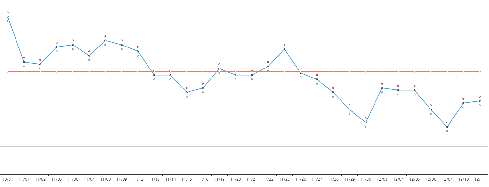

如果不借助协程，我们一般这么处理：（数据库获取过程省略）


```python
# 生成新的dict数据
def get_new_item(item):
    prices = item["price"]
    item["avg"] = sum(prices) / len(prices)
    item["max"] = max(prices)
    item["min"] = min(prices)
    return item

def get_new_data(data):
    newdata = []
    for item in data:
        new_item = get_new_item(item)
        # print(new_item) # 处理后的新dict
        newdata.append(new_item)
    return newdata

def main():
    # 需求：生成绘图的数据（max,min,avg）
    products = [{
        "id": 2344,
        "title": "御泥坊补水面膜",
        "price": [89, 76, 120, 99]
    }, {
        "id": 2345,
        "title": "御泥坊火山泥面膜",
        "price": [30, 56, 70, 89]
    }]

    new_products = get_new_data(products)
    print(new_products)

if __name__ == "__main__":
    main()
```

    [{'id': 2344, 'title': '御泥坊补水面膜', 'price': [89, 76, 120, 99], 'avg': 96.0, 'max': 120, 'min': 76}, {'id': 2345, 'title': '御泥坊火山泥面膜', 'price': [30, 56, 70, 89], 'avg': 61.25, 'max': 89, 'min': 30}]
    

改成yield版的协程也很方便，基本上代码没有变，也不用像IO多路复用那样来回的回调


```python
# 生成新的dict数据
def get_new_item(item):
    prices = item["price"]
    item["avg"] = sum(prices) / len(prices)
    item["max"] = max(prices)
    item["min"] = min(prices)
    yield item

def get_new_data(data):
    for item in data:
        yield from get_new_item(item)

def main():
    # 需求：生成绘图的数据（max,min,avg）
    products = [{
        "id": 2344,
        "title": "御泥坊补水面膜",
        "price": [89, 76, 120, 99]
    }, {
        "id": 2345,
        "title": "御泥坊火山泥面膜",
        "price": [30, 56, 70, 89]
    }]
    new_products = list()
    # 如果需要返回值就捕获StopIteration异常
    for item in get_new_data(products):
        new_products.append(item)
    print(new_products)

if __name__ == "__main__":
    main()
```

    [{'id': 2344, 'title': '御泥坊补水面膜', 'price': [89, 76, 120, 99], 'avg': 96.0, 'max': 120, 'min': 76}, {'id': 2345, 'title': '御泥坊火山泥面膜', 'price': [30, 56, 70, 89], 'avg': 61.25, 'max': 89, 'min': 30}]
    

简单解析一下：（用`yield from`的目的就是为了引出等会说的`async/await`）

**`yield from`（委托生成器`get_new_data`）的好处就是让调用方（`main`）和`yield`子生成器(`get_new_item`)直接建立一个双向通道**

你也可以把`yield from`当作一个中介(**如果不理解就把`yield from`想象成`await`就容易理解了**)，本质就是下面代码：


```python
# 生成新的数据
def get_new_data(data):
    for item in data:
        prices = item["price"]
        item["avg"] = sum(prices) / len(prices)
        item["max"] = max(prices)
        item["min"] = min(prices)
        yield item


def main():
    # 需求：生成绘图的数据（max,min,avg）
    products = [{
        "id": 2344,
        "title": "御泥坊补水面膜",
        "price": [89, 76, 120, 99]
    }, {
        "id": 2345,
        "title": "御泥坊火山泥面膜",
        "price": [30, 56, 70, 89]
    }]
    new_products = list()
    for item in get_new_data(products):
        new_products.append(item)
    print(new_products)


if __name__ == "__main__":
    main()
```

    [{'id': 2344, 'title': '御泥坊补水面膜', 'price': [89, 76, 120, 99], 'avg': 96.0, 'max': 120, 'min': 76}, {'id': 2345, 'title': '御泥坊火山泥面膜', 'price': [30, 56, 70, 89], 'avg': 61.25, 'max': 89, 'min': 30}]
    

#### PEP 380（含分析）

`yield from`内部其实在`yield`基础上做了很多事情（比如一些异常的处理），具体可以看看 **<a href="https://www.python.org/dev/peps/pep-0380/" target="_blank">PEP 380</a>**

先提炼一个`简版`的：
```py
# 正常调用
RESULT = yield from EXPR

# _i：子生成器（也是个迭代器）
# _y：子生成器生产的值
# _r：yield from 表达式最终结果
# _s：调用方通过send发送的值
# _e：异常对象

# 内部原理
_i = iter(EXPR) # EXPR是一个可迭代对象，_i是子生成器
try:
    # 第一次不能send值，只能next() or send(None)，并把产生的值放到_y中
    _y = next(_i)
except StopIteration as _e:
    # 如果子生成器直接就return了，那就会抛出异常，通过value可以拿到子生成器的返回值
    _r = _e.value
else:
    # 尝试进行循环（调用方和子生成器交互过程），yield from这个生成器会阻塞（委托生成器）
    while 1:
        # 这时候子生成器已经和调用方建立了双向通道，在等待调用方send(value)，把这个值保存在_s中
        _s = yield _y # 这边还会进行一系列异常处理，我先删掉，等会看
        try:
            # 如果send(None)，那么继续next遍历
            if _s is None:
                _y = next(_i) # 把子生成器结果放到 _y 中
            else:
                _y = _i.send(_s) # 如果调用方send一个值，就转发到子生成器
        except StopIteration as _e:
            _r = _e.value # 如果子生成器遍历完了，就把返回值给_r
            break
RESULT = _r # 最终的返回值（yield from 最终的返回值）
```

现在再来看`完整版`压力就没有那么大了：

```py
# 正常调用
RESULT = yield from EXPR

# _i：子生成器（也是个迭代器）
# _y：子生成器生产的值
# _r：yield from 表达式最终结果
# _s：调用方通过send发送的值
# _e：异常对象

# 内部原理
_i = iter(EXPR) # EXPR是一个可迭代对象，_i是子生成器
try:
    # 第一次不能send值，只能next() or send(None)，并把产生的值放到_y中
    _y = next(_i)
except StopIteration as _e:
    # 如果子生成器直接就return了，那就会抛出异常，通过value可以拿到子生成器的返回值
    _r = _e.value
else:
    # 尝试进行循环（调用方和子生成器交互过程），yield from这个生成器会阻塞（委托生成器）
    while 1:
        try:
            # 这时候子生成器已经和调用方建立了双向通道，在等待调用方send(value)，把这个值保存在_s中
            _s = yield _y
        
        # 【现在补全】有这么几种情况需要处理
        # 1.子生成器可能只是一个迭代器，并不能作为协程的生成器（不支持throw和close）
        # 2.子生成器虽然支持了throw和close，但在子生成器内部两种方法都会抛出异常
        # 3.调用法调用了gen.throw()，想让子生成器自己抛异常
        # 这时候就要处理 gen.close() 和 gen.throw()的情况
        
        # 生成器close()异常的处理
        except GeneratorExit as _e:
            try:
                _m = _i.close
            except AttributeError:
                pass # 屏蔽close的异常
            else:
                _m()
            raise _e # 上抛异常
        # 生成器throw()异常的处理
        except BaseException as _e:
            _x = sys.exc_info()
            try:
                _m = _i.throw
            except AttributeError:
                raise _e
            else:
                try:
                    _y = _m(*_x)
                except StopIteration as _e:
                    _r = _e.value
                    break
        else:
            try:
                # 如果send(None)，那么继续next遍历
                if _s is None:
                    _y = next(_i) # 把子生成器结果放到 _y 中
                else:
                    _y = _i.send(_s) # 如果调用方send一个值，就转发到子生成器
            except StopIteration as _e:
                _r = _e.value # 如果子生成器遍历完了，就把返回值给_r
                break
RESULT = _r # 最终的返回值（yield from 最终的返回值）
```

### 2.async/await

把上面的原生代码用`async和await`改装一下：(**协程的目的就是像写同步代码一样写异步，这个才算是真做到了**)
```py
import asyncio

# 生成新的dict数据
async def get_new_item(item):
    prices = item["price"]
    item["avg"] = sum(prices) / len(prices)
    item["max"] = max(prices)
    item["min"] = min(prices)
    return item

async def get_new_data(data):
    newdata = []
    for item in data:
        new_item = await get_new_item(item)
        # print(new_item) # 处理后的新dict
        newdata.append(new_item)
    return newdata

def main():
    # 需求：生成绘图的数据（max,min,avg）
    products = [{
        "id": 2344,
        "title": "御泥坊补水面膜",
        "price": [89, 76, 120, 99]
    }, {
        "id": 2345,
        "title": "御泥坊火山泥面膜",
        "price": [30, 56, 70, 89]
    }]
    
    # python 3.7
    new_products = asyncio.run(get_new_data(products))
    print(new_products)

if __name__ == "__main__":
    main()
```
输出：（是不是很原生代码没啥区别？）
```
[{'id': 2344, 'title': '御泥坊补水面膜', 'price': [89, 76, 120, 99], 'avg': 96.0, 'max': 120, 'min': 76}, 
{'id': 2345, 'title': '御泥坊火山泥面膜', 'price': [30, 56, 70, 89], 'avg': 61.25, 'max': 89, 'min': 30}]
```

下级预估：**asyncio**

---

## 3.5.asyncio

官方文档：<a href="https://docs.python.org/3/library/asyncio.html" target="_blank">https://docs.python.org/3/library/asyncio.html</a>

开发中常见错误：<a href="https://docs.python.org/3/library/asyncio-dev.html" target="_blank">https://docs.python.org/3/library/asyncio-dev.html</a>

代码示例：<https://github.com/lotapp/BaseCode/tree/master/python/5.concurrent/ZCoroutine>

**PS：`asyncio`是`Python`用于解决`异步IO`编程的`一整套`解决方案**

### 3.5.1.上节回顾

上次说了下<a href="https://mp.weixin.qq.com/s/5d701WQG1L8mDOO-bnKXdQ" target="_blank">协程演变过程</a>，这次继续，先接着上次的说：

像`JS`是可以生成器和`async`和`await`混用的，那`Python`呢？（NetCore不可以混用）
```py
import types

# 和生成器完全分开了，不过可以理解为yield from
@types.coroutine
def get_value(value):
    yield value

async def get_name(name):
    # 一系列逻辑处理
    return await get_value(name)

if __name__ == '__main__':
    gen = get_name("小明")
    print(gen.send(None))
# 直接混用会报错：TypeError: object generator can't be used in 'await' expression
```

我们的`async`和`await`虽然和`yield from`不是一个概念，但是可以理解为`yield from`上面这段代码你可以理解为：
```py
import types

def get_value(value):
    yield value

# 这个async和await替换成yield from
def get_name(name):
    # 一系列逻辑处理
    yield from get_value(name)

if __name__ == '__main__':
    gen = get_name("小明")
    print(gen.send(None))
```
PS：**Python默认和NetCore一样，不能直接混用，如果你一定要混用，那么得处理下**（`使用@asyncio.coroutine`也行）

### 3.5.2.asyncio引入

在今天之前，协程我们是这么实现的：`事件循环(loop)`+`回调(驱动生成器)`+`IO多路复用(epoll)`

现在可以通过官方提供的`asyncio`（**可以理解为协程池**）来实现了（第三方还有一个`uvloop`【基于C写的`libuv`库（`nodejs`也是基于这个库）】）

PS：`uvloop`的使用非常简单，只要在获取事件循环前将`asyncio`的事件循环策略设置为`uvloop`的:**`asyncio.set_event_loop_policy(uvloop.EventLoopPolicy())`**

#### 1.简单案例

先看个简单的协程案例：
```py
import types
import asyncio

# 模拟一个耗时操作
async def test():
    print("start...")
    # 不能再使用以前阻塞的暂停了
    await asyncio.sleep(2)
    print("end...")
    return "ok"

if __name__ == '__main__':
    import time
    start_time = time.time()
    
    # # >=python3.4
    # # 返回asyncio的事件循环
    # loop = asyncio.get_event_loop()
    # # 运行事件循环，直到指定的future运行完毕，返回结果
    # result = loop.run_until_complete(test())
    # print(result)
    
    # python3.7
    result = asyncio.run(test())
    print(result)

    print(time.time() - start_time)
```
输出：
```
start...
end...
ok
2.001772403717041
```

简单说下，`asyncio.run`是python3.7才简化出来的语法（类比NetCore的`Task.Run`）看看源码就知道了：
```py
# https://github.com/lotapp/cpython3/blob/master/Lib/asyncio/runners.py
def run(main, *, debug=False):
    # 以前是直接使用"asyncio.get_event_loop()"（开发人员一般都习惯这个了）
    # 3.7开始推荐使用"asyncio.get_running_loop()"来获取正在运行的loop（获取不到就抛异常）
    if events._get_running_loop() is not None:
        raise RuntimeError("无法从正在运行的事件循环中调用asyncio.run()")

    if not coroutines.iscoroutine(main):
        raise ValueError("{!r}应该是一个协程".format(main))

    loop = events.new_event_loop() # 创建一个新的事件循环
    try:
        events.set_event_loop(loop)  # 设置事件循环
        loop.set_debug(debug)  # 是否调试运行（默认否）
        return loop.run_until_complete(main)  # 等待运行
    finally:
        try:
            _cancel_all_tasks(loop)  # 取消其他任务
            loop.run_until_complete(loop.shutdown_asyncgens())
        finally:
            events.set_event_loop(None)
            loop.close()
```
新版本其实就是使用了一个新的`loop`去启动`run_until_complete`

PS：`uvloop`也可以这样去使用：获取loop`loop = uvloop.new_event_loop()`再替换原生的loop`asyncio.set_event_loop(loop)`

### 3.5.3.批量任务

#### 1.旧版本实现

```py
import asyncio

# 模拟一个耗时操作
async def test(i):
    print("start...")
    # 不能再使用以前阻塞的暂停了
    await asyncio.sleep(2)
    print("end...")
    return i

if __name__ == '__main__':
    import time

    start_time = time.time()

    # # >=python3.4
    loop = asyncio.get_event_loop()
    # tasks = [asyncio.ensure_future(test(i)) for i in range(10)]
    # 注意：是loop的方法，而不是asyncio的，不然就会引发RuntimeError：no running event loop
    tasks = [loop.create_task(test(i)) for i in range(10)]
    loop.run_until_complete(asyncio.wait(tasks))
    for task in tasks:
        print(task.result())

    print(time.time() - start_time)
```
输出：(tasks替换成这个也一样：`tasks = [asyncio.ensure_future(test(i)) for i in range(10)]`)
```
start...
start...
start...
start...
start...
start...
start...
start...
start...
start...
end...
end...
end...
end...
end...
end...
end...
end...
end...
end...
0
1
2
3
4
5
6
7
8
9
2.028331995010376
```

然后我们再看看这个`asyncio.wait`是个啥：（回顾：<https://www.cnblogs.com/dotnetcrazy/p/9528315.html#wait()说明>）
```
# return_when 这个参数和之前一样
FIRST_COMPLETED = concurrent.futures.FIRST_COMPLETED
FIRST_EXCEPTION = concurrent.futures.FIRST_EXCEPTION
ALL_COMPLETED = concurrent.futures.ALL_COMPLETED

# 官方准备在未来版本废弃它的loop参数
# 和concurrent.futures里面的wait不一样，这边是个协程
async def wait(fs, *, loop=None, timeout=None, return_when=ALL_COMPLETED):
```

**平时使用可以用高级API`asyncio.gather(*tasks)`来替换`asyncio.wait(tasks)`**

#### 1.旧版另用

PS：官方推荐使用`create_task的方式`来创建一个任务
```py
import asyncio

# 模拟一个耗时操作
async def test(i):
    print("start...")
    # 不能再使用以前阻塞的暂停了
    await asyncio.sleep(2)
    print("end...")
    return i

async def main():
    tasks = [test(i) for i in range(10)]
    # await task 可以得到返回值（得到结果或者异常）
    # for task in asyncio.as_completed(tasks):
    #     try:
    #         print(await task)
    #     except Exception as ex:
    #         print(ex)
    return [await task for task in asyncio.as_completed(tasks)]

if __name__ == '__main__':
    import time

    start_time = time.time()

    # old推荐使用
    loop = asyncio.get_event_loop()
    result_list = loop.run_until_complete(main())
    print(result_list)
    
    print(time.time() - start_time)
```
输出：(PS：用`asyncio.gather(*tasks)`直接替换`asyncio.wait(tasks)`也行)
```
start...
start...
start...
start...
start...
start...
start...
start...
start...
start...
end...
end...
end...
end...
end...
end...
end...
end...
end...
end...
[1, 6, 4, 5, 0, 7, 8, 3, 2, 9]
2.0242035388946533
```

**其实理解起来很简单，而且和`NetCore`以及`NodeJS`它们统一了，只要是`await xxx`就返回一个（`结果`|`异常`），`不await`就是一个`task对象`**

#### 2.新版本实现

```py
import asyncio

# 模拟一个耗时操作
async def test(i):
    print("start...")
    await asyncio.sleep(2)
    print("end...")
    return i

async def main():
    tasks = [test(i) for i in range(10)]
    # 给`协程/futures`返回一个future聚合结果
    return await asyncio.gather(*tasks) # 记得加*来解包

if __name__ == '__main__':
    import time

    start_time = time.time()

    # python3.7
    result_list = asyncio.run(main())
    print(result_list)
    
    # 2.0259485244750977
    print(time.time() - start_time)
```
输出：(语法简化太多了，用起来特别简单)
```
start...
start...
start...
start...
start...
start...
start...
start...
start...
start...
end...
end...
end...
end...
end...
end...
end...
end...
end...
end...
[0, 1, 2, 3, 4, 5, 6, 7, 8, 9]
2.00840163230896
```

关于参数需要加`*`解包的说明 ==> 看看函数定义就秒懂了：
```py
# 给 协程/futures 返回一个future聚合结果
def gather(*coros_or_futures, loop=None, return_exceptions=False):
    pass

# 把协程或者awaitable对象包裹成task
def ensure_future(coro_or_future, *, loop=None):
    pass

# 传入一个协程对象，返回一个task对象
class BaseEventLoop(events.AbstractEventLoop):
    def create_task(self, coro):
        pass
```

### 关于高级和低级API的说明

**asyncio的高级（`high-level`）API一般用于这几个方面**：（开发基本够用了）
1. 并行运行Python协同程序并完全控制它们的执行
2. **网络通信（`IO`）和进程间通信（`IPC`）**
3. **子进程**（`subprocesses`）相关
4. 通过**队列**（`Queue`）分配任务（`Tasks`）
5. **同步**（`synchronize`）并发代码

**低级（`low-level`）API一般这么用**：（事件循环和回调会用下，其他基本不用）
1. 创建和管理**事件循环**，为网络、子进程、信号处理（`Signal`）等提供异步（`asynchronous `）API
2. 为传输使用高效协议
3. 使用`async/await`语法桥接基于**回调**的库和代码

### 3.5.4.回调函数

回调一般不利于代码维护，现在基本上是尽量不用了（异步代码用起来都和同步没多大差别了，回调也就没那么大用处了）

#### 1.回调函数获取返回值

上面说的获取返回值，其实也可以通过回调函数来获取：
```py
# 低级API示例
import asyncio

async def get_html(url):
    print(f"get {url} ing")
    await asyncio.sleep(2)
    return f"<h1>This is a test for {url}</h1>"

def call_back(task):
    print(type(task))
    print(task.result())

if __name__ == "__main__":
    import time
    start_time = time.time()

    urls = [
        "https://www.baidu.com", "https://www.sogou.com",
        "https://www.python.org", "https://www.asp.net"
    ]
    tasks = set()  # 任务集合
    loop = asyncio.get_event_loop()
    for url in urls:
        # task = asyncio.ensure_future(get_html(url))
        task = loop.create_task(get_html(url))
        # 设置回调函数
        task.add_done_callback(call_back)
        # 添加到任务集合中
        tasks.add(task)
    # 批量执行
    loop.run_until_complete(asyncio.gather(*tasks))

    print(time.time() - start_time)
```
输出：（**`task.add_done_callback(回调函数)`**）
```
get https://www.baidu.com ing
get https://www.sogou.com ing
get https://www.python.org ing
get https://www.asp.net ing
<class '_asyncio.Task'>
<h1>This is a test for https://www.baidu.com</h1>
<class '_asyncio.Task'>
<h1>This is a test for https://www.python.org</h1>
<class '_asyncio.Task'>
<h1>This is a test for https://www.sogou.com</h1>
<class '_asyncio.Task'>
<h1>This is a test for https://www.asp.net</h1>
2.0168468952178955
```

#### 2.回调函数传参扩展

实例：
```py
import asyncio
import functools

async def get_html(url):
    await asyncio.sleep(2)
    return "This is a test for"

# 注意一个东西：通过偏函数传过来的参数在最前面
def call_back(url, task):
    # do something
    print(type(task))
    print(task.result(), url)

if __name__ == "__main__":
    import time
    start_time = time.time()

    urls = [
        "https://www.baidu.com", "https://www.sogou.com",
        "https://www.python.org", "https://www.asp.net"
    ]
    tasks = set()  # 任务集合
    loop = asyncio.get_event_loop()
    for url in urls:
        # task = asyncio.ensure_future(get_html(url))
        task = loop.create_task(get_html(url))
        # 设置回调函数 （不支持传参数，我们就利用偏函数来传递）
        task.add_done_callback(functools.partial(call_back, url))
        # 添加到任务集合中
        tasks.add(task)
    # 批量执行
    loop.run_until_complete(asyncio.gather(*tasks))

    print(time.time() - start_time)
```
输出：(**PS：通过偏函数传过来的参数在最前面**)
```
<class '_asyncio.Task'>
This is a test for https://www.baidu.com
<class '_asyncio.Task'>
This is a test for https://www.python.org
<class '_asyncio.Task'>
This is a test for https://www.sogou.com
<class '_asyncio.Task'>
This is a test for https://www.asp.net
2.0167236328125
```

### 3.5.5.异常相关

之前说的`await task`可能得到结果也可能得到异常有些人可能还不明白 ==> 其实你把他看出同步代码（PS：协程的目的就是**像写同步代码一样进行异步编程**）就好理解了，函数执行要么得到结果要么得到返回值

看个异常的案例：
```py
import asyncio

async def get_html(url):
    print(f"get {url} ing")
    if url == "https://www.asp.net":
        raise Exception("Exception is over")
    await asyncio.sleep(2)
    return f"<h1>This is a test for {url}</h1>"

async def main():
    urls = [
        "https://www.baidu.com", "https://www.asp.net",
        "https://www.python.org", "https://www.sogou.com"
    ]
    tasks = [get_html(url) for url in urls]
    return await asyncio.gather(*tasks)

if __name__ == "__main__":
    import time
    start_time = time.time()

    try:
        asyncio.run(main())
    except Exception as ex:
        print(ex)

    print(time.time() - start_time)

```
输出：(**和同步代码没差别，可能出异常的部分加个异常捕获即可**)
```
get https://www.baidu.com ing
get https://www.asp.net ing
get https://www.python.org ing
get https://www.sogou.com ing
Exception is over
0.008000373840332031
```

再一眼旧版怎么用：（PS：基本差不多，下次全部用新用法了）
```py
import asyncio

async def get_html(url):
    print(f"get {url} ing")
    if url == "https://www.asp.net":
        raise Exception("Exception is over")
    await asyncio.sleep(2)
    return f"<h1>This is a test for {url}</h1>"

async def main():
    urls = [
        "https://www.baidu.com", "https://www.asp.net",
        "https://www.python.org", "https://www.sogou.com"
    ]
    tasks = set()  # 任务集合
    tasks = [get_html(url) for url in urls]
    return await asyncio.gather(*tasks)

if __name__ == "__main__":
    import time
    start_time = time.time()

    loop = asyncio.get_event_loop()
    try:
        # 批量执行
        loop.run_until_complete(main())
    except Exception as ex:
        print(ex)

    print(time.time() - start_time)
```

### 常见异常

**Python3调试过程中的常见异常**：<https://www.cnblogs.com/dotnetcrazy/p/9192089.html>

#### asyncio中常见异常

官方文档：`https://docs.python.org/3/library/asyncio-exceptions.html`
1. **`asyncio.TimeoutError(Exception.Error)`：**
    - 任务超时引发的异常
2. **`asyncio.CancelledError(Exception.Error)`：**
    - 任务取消引发的异常
3. `asyncio.InvalidStateError(Exception.Error)`：
    - `Task/Future`内部状态无效引发
4. `asyncio.IncompleteReadError(Exception.Error)`：读取未完成引发的错误:
    - 不完整: 在到达流结束之前读取字节字符串（读取了不完整的字符串就转换了）
    - 不清楚读多少: 预期读取的字节总数未知
5. `asyncio.LimitOverrunError(Exception)`：
    - 超出缓冲区引发的异常
6. `asyncio.SendfileNotAvailableError(Exception.ReferenceError.RuntimeError)`：
    - 系统调用不适用于给定的套接字或文件类型（系统调用类型不匹配导致的）

#### Python常见异常

有些异常官方没有写进去，我补了一些常用的异常：`https://docs.python.org/3/library/exceptions.html`

**`BaseException`**
- `SystemExit`：`sys.exit()`引发的异常（目的：让Python解释器退出）
- `KeyboardInterrupt`：用户Ctrl+C终止程序引发的异常
- **`GeneratorExit`**：生成器或者协程关闭的时候产生的异常（**特别注意**）
- **`Exception`**：所有内置异常（非系统退出）或者用户定义异常的基类
    - **`asyncio.Error`**
        - **`asyncio.CancelledError`**
        - **`asyncio.TimeoutError`**：和`Exception.OSError.TimeoutError`区分开
        - `asyncio.InvalidStateError`：`Task/Future`内部状态无效引发
    - `asyncio.LimitOverrunError`：超出缓冲区引发的异常
    - `StopIteration`：`next()、send()`引发的异常：
        - `https://www.cnblogs.com/dotnetcrazy/p/9278573.html#6.Python迭代器`
    - `StopAsyncIteration`：`__anext__()`引发的异常
    - ArithmeticError
        - FloatingPointError
        - OverflowError
        - ZeroDivisionError
    - `AssertionError`：当断言`assert`语句失败时引发
    - `AttributeError`：当属性引用或赋值失败时引发
    - BufferError
    - `EOFError`
        - `asyncio.IncompleteReadError`：读取操作未完成引发的错误
    - ImportError
        - ModuleNotFoundError
    - LookupError
        - IndexError
        - KeyError
    - MemoryError
    - NameError
        - UnboundLocalError
    - **`OSError`**：当系统函数返回与系统相关的错误时引发
        - BlockingIOError
        - ChildProcessError
        - ConnectionError
           - BrokenPipeError
           - ConnectionAbortedError
           - ConnectionRefusedError
           - ConnectionResetError
        - FileExistsError
        - FileNotFoundError
        - InterruptedError
        - IsADirectoryError
        - NotADirectoryError
        - PermissionError
        - ProcessLookupError
        - **`TimeoutError`**：系统函数执行超时时触发
    - `ReferenceError`：引用错误（对象被资源回收或者删除了）
    - **`RuntimeError`**：出错了，但是检测不到错误类别时触发
        - `NotImplementedError`：为实现报错（比如调用了某个不存在的子类方法）
        - `RecursionError`：递归程度太深引发的异常
        - `asyncio.SendfileNotAvailableError`：系统调用不适用于给定的套接字或文件类型
    - **`SyntaxError`**：语法错误时引发（**粘贴代码经常遇到**）
        - `IndentationError`：缩进有问题
        - `TabError`：当缩进包含不一致的制表符和空格使用时引发
    - SystemError
    - `TypeError`：类型错误
    - ValueError
        - UnicodeError
        - UnicodeDecodeError
        - UnicodeEncodeError
        - UnicodeTranslateError
    - Warning
    - DeprecationWarning
    - PendingDeprecationWarning
    - RuntimeWarning
    - SyntaxWarning
    - UserWarning
    - FutureWarning
    - ImportWarning
    - UnicodeWarning
    - BytesWarning
    - ResourceWarning

---

### 新语法的说明

Net方向的同志记得对比当时写的 <a href="https://mp.weixin.qq.com/s/PY1DZLiT74teuzh2GaA0kw">Python3 与 C# 并发编程之～Net篇：https://www.cnblogs.com/dunitian/p/9419325.html</a>

#### 1.概念

先说说概念：
1. `event_loop`事件循环：
    - 程序开启一个无限的循环，程序员会把一些函数（协程）注册到事件循环上
    - 当满足事件发生的时候，调用相应的协程函数
2. `coroutine`协程：
    - 协程对象，指一个使用`async`关键字定义的函数，它的调用不会立即执行函数，而是会返回一个协程对象
    - 协程对象需要注册到事件循环，由事件循环调用
3. `future`对象：
    - 代表将来执行或没有执行的任务的结果（它和task上没有本质的区别）
4. `task`任务：
    - 一个协程对象就是一个原生可以挂起的函数，Task则是对协程进一步封装，其中包含任务的各种状态
    - **`Task`对象是`Future`的子类**，它将`coroutine`和`Future`联系在一起，将`coroutine`封装成一个`Future`对象
5. `async/await`关键字：
    - 定义协程的关键字，`async`定义一个协程，`await`用于挂起阻塞的异步调用接口
    - 类似于`yield from`（都是在调用方与子协程之间直接建立一个双向通道）
    
#### 2.语法

**为了避免读者混乱于新旧代码的使用，从下面开始就直接使用最新的语法的**
1. 运行asyncio：`asyncio.run(main())`
    - 只运行一次(`if __name__ == "__main__"`)
2. 创建一个任务：`asyncio.create_task(func())`
    - Python3.8会多一个name的别名参数
3. 批量执行任务：`asyncio.gather(*tasks)`
    - return_exceptions=True可以屏蔽这批任务的异常，并把异常结果返回
    - 如果有类似于(第一个任务完成|第一个异常产生后)进行相应的操作，则推荐`asyncio.wait`
4. 获取loop：`asyncio.get_event_loop()`
    - 优先考虑：`asyncio.get_running_loop()`（获取不到会抛异常）

```py
# 如果和旧版本混用，就应该这么写了（麻烦）
try:
    loop = asyncio.get_running_loop()
except RuntimeError as ex:
    print(ex) # no running event loop
    loop = asyncio.get_event_loop()
...
loop.run_until_complete(xxx)
```

新语法：
```py
async def main():
    loop = asyncio.get_running_loop()
    ...

asyncio.run(main())
```

#### 3.状态

Task基本上就是这几个状态（生成器、Future也是）：
1. `Pending`：创建Task，还未执行
2. `Running`：事件循环正在调用执行任务
3. `Done`：Task执行完毕
4. `Cancelled`：Task被取消后的状态

#### 4.时序图

Python3.7之前官方贴了张时序图，我们拿来理解上面的话：`https://docs.python.org/3.6/library/asyncio-task.html`
```py
import asyncio

async def compute(x, y):
    print(f"计算 {x}+{y}...")
    await asyncio.sleep(1.0)
    return x + y

async def main(x, y):
    result = await compute(x, y)
    print(f"{x}+{y}={result}")

loop = asyncio.get_event_loop()
loop.run_until_complete(main(1, 2))
loop.close()
```


### 3.5.4.回调函数（新用法）

和旧版本比起来其实就是创建一个`task`，然后为`task`添加一个回调函数`add_done_callback`
```py
import asyncio

async def get_html(url):
    print(f"get {url} ing")
    await asyncio.sleep(2)
    return f"<h1>This is a test for {url}</h1>"

def callback_func(task):
    print(type(task))
    if task.done():
        print(f"done")  # print(task.result())

async def main():
    urls = [
        "https://www.baidu.com", "https://www.asp.net",
        "https://www.python.org", "https://www.sogou.com"
    ]
    # asyncio.create_task来创建一个Task
    tasks = [asyncio.create_task(get_html(url)) for url in urls]
    # 给每个任务都加一个回调函数
    for task in tasks:
        task.add_done_callback(callback_func)
    # 批量执行任务
    result = await asyncio.gather(*tasks)
    print(result)  # 返回 result list

if __name__ == "__main__":
    import time
    start_time = time.time()

    asyncio.run(main())

    print(time.time() - start_time)
```
输出：
```
get https://www.baidu.com ing
get https://www.asp.net ing
get https://www.python.org ing
get https://www.sogou.com ing
<class '_asyncio.Task'>
done
<class '_asyncio.Task'>
done
<class '_asyncio.Task'>
done
<class '_asyncio.Task'>
done
['<h1>This is a test for https://www.baidu.com</h1>', '<h1>This is a test for https://www.asp.net</h1>', '<h1>This is a test for https://www.python.org</h1>', '<h1>This is a test for https://www.sogou.com</h1>']
2.0189685821533203
```

注意：<a href="https://docs.python.org/3.8/library/asyncio-eventloop.html#asyncio.loop.add_signal_handler">`add_signal_handler`是loop独有的方法，Task中没有</a>，eg：`loop.add_signal_handler(signal.SIGINT, callback_handle, *args)`

### 3.5.5.异常相关扩展

关于批量任务的异常处理：
1. 默认：同一批次有一个task产生了异常，这一批次任务就全部结束了
2. `return_exceptions=True`:不影响其他任务，异常消息也放在结果列表中
3. 当`gather`被取消的时候，不管True or False，这批次任务全部取消

```py
import asyncio

async def get_html(url):
    print(f"get {url} ing")
    if url == "https://www.asp.net":
        raise Exception("Exception is over")
    await asyncio.sleep(2)
    return f"<h1>This is a test for {url}</h1>"

def callback_func(task):
    if task.done():
        print(f"done")  # print(task.result())

async def main():
    urls = [
        "https://www.baidu.com", "https://www.asp.net",
        "https://www.python.org", "https://www.sogou.com"
    ]
    # asyncio.create_task来创建一个Task
    tasks = [asyncio.create_task(get_html(url)) for url in urls]
    # 给每个任务都加一个回调函数
    for task in tasks:
        task.add_done_callback(callback_func)
    # 批量执行任务
    result = await asyncio.gather(*tasks, return_exceptions=True)
    print(result)  # 返回 result list

if __name__ == "__main__":
    import time
    start_time = time.time()

    asyncio.run(main())

    print(time.time() - start_time)
```
输出：
```
get https://www.baidu.com ing
get https://www.asp.net ing
get https://www.python.org ing
get https://www.sogou.com ing
done
done
done
done
['<h1>This is a test for https://www.baidu.com</h1>', Exception('Exception is over'), '<h1>This is a test for https://www.python.org</h1>', '<h1>This is a test for https://www.sogou.com</h1>']
2.013272523880005
```

### 3.5.6.任务分组、取消

#### 1.分组

看个简单的任务分组案例：
```py
import asyncio

async def get_html(url):
    print(f"get url for{url}")
    await asyncio.sleep(2)
    return f"<h1>This is a test for {url}</h1>"

async def main():
    urls1 = ["https://www.baidu.com", "https://www.asp.net"]
    urls2 = ["https://www.python.org", "https://www.sogou.com"]

    tasks1 = [asyncio.create_task(get_html(url)) for url in urls1]
    tasks2 = [asyncio.create_task(get_html(url)) for url in urls2]
    
    # 等待两组都完成，然后返回聚合结果
    result = await asyncio.gather(*tasks1, *tasks2)
    print(result)

if __name__ == "__main__":
    import time
    start_time = time.time()

    try:
        asyncio.run(main())
    except Exception as ex:
        print(ex)

    print(time.time() - start_time)

```
输出：(两个分组结果被一起放到了list中)
```
get url forhttps://www.baidu.com
get url forhttps://www.asp.net
get url forhttps://www.python.org
get url forhttps://www.sogou.com
['<h1>This is a test for https://www.baidu.com</h1>', '<h1>This is a test for https://www.asp.net</h1>', '<h1>This is a test for https://www.python.org</h1>', '<h1>This is a test for https://www.sogou.com</h1>']
2.0099380016326904
```

#### 2.取消

如果想要对`Group1`和`Group2`进行更多的自定化，可以再包裹一层`gather`方法：
```py
import asyncio

async def get_html(url):
    print(f"get url for{url}")
    await asyncio.sleep(2)
    return f"<h1>This is a test for {url}</h1>"

async def main():
    urls1 = ["https://www.baidu.com", "https://www.asp.net"]
    urls2 = ["https://www.python.org", "https://www.sogou.com"]

    tasks1 = [asyncio.create_task(get_html(url)) for url in urls1]
    tasks2 = [asyncio.create_task(get_html(url)) for url in urls2]

    group1 = asyncio.gather(*tasks1)
    group2 = asyncio.gather(*tasks2)
    
    # 分组2因为某原因被取消任务了（模拟）
    group2.cancel()

    # 等待两组都完成，然后返回聚合结果
    result = await asyncio.gather(group1, group2, return_exceptions=True)
    print(result)

if __name__ == "__main__":
    import time
    start_time = time.time()

    try:
        asyncio.run(main())
    except Exception as ex:
        print(ex)

    print(time.time() - start_time)
```
输出：
```
get url forhttps://www.baidu.com
get url forhttps://www.asp.net
[['<h1>This is a test for https://www.baidu.com</h1>', '<h1>This is a test for https://www.asp.net</h1>'], CancelledError()]
2.0090348720550537
```

再看个单个任务的案例：
```py
import asyncio

async def test():
    print("start...")
    await asyncio.sleep(10)
    print("end...")

async def main():
    task = asyncio.create_task(test())

    await asyncio.sleep(1)

    # 取消task任务
    task.cancel()

    try:
        await task
    except asyncio.CancelledError:
        print(f"任务已经被取消：{task.cancelled()}")
        print(f"任务是因为异常而完成：{task.done()}")

if __name__ == "__main__":
    import time
    start_time = time.time()

    asyncio.run(main())

    print(time.time() - start_time)
```
输出：
```
start...
任务已经被取消：True
任务是因为异常而完成：True
1.0133979320526123
```

简单说明下：
1. `task.done()`：任务是否完成
    - 任务完成：`task.done() ==> true`：
        1. 任务正常完成
        2. 触发异常而被标记为任务完成
2. `task.cancelled()`：用来判断是否成功取消

为什么这么说？看看源码：
```py
# 完成包含了正常+异常
if outer.done():
    # 把因为异常完成的任务打个标记
    if not fut.cancelled():
        fut.exception() # 标记检索的异常
```

PS：官方推荐**`asyncio.all_tasks`**(loop中尚未完成的Task集合):
- 原来是通过：`asyncio.Task.all_tasks`来获取(返回loop的所有Task集合)

### wait_for and wait

#### 1.一个任务限时等待(wait_for)

超时等待：**`asyncio.wait_for(task, timeout)`**

```py
import asyncio

async def test(time):
    print("start...")
    await asyncio.sleep(time)
    print("end...")
    return time

async def main():
    task = asyncio.create_task(test(3))
    try:
        result = await asyncio.wait_for(task, timeout=2)
        print(result)
    except asyncio.CancelledError:
        print("Cancel")
    except asyncio.TimeoutError:
        print("超时取消")
    except Exception as ex:
        print(ex)

if __name__ == "__main__":
    import time
    start_time = time.time()

    asyncio.run(main())

    print(time.time() - start_time)
```
输出：
```
start...
超时取消
2.007002115249634
```

#### 2.多个任务限时等待(wait)

`wait`是比`gather`更底层的api，比如现在这个**多任务限时等待**`gather`并不能满足:

```py
import asyncio

async def test(time):
    print("start...")
    await asyncio.sleep(time)
    print("end...")
    return time

async def main():
    tasks = [asyncio.create_task(test(i)) for i in range(10)]

    # 已完成的任务（包含异常），未完成的任务
    done, pending = await asyncio.wait(tasks, timeout=2)
    # 任务总数（我用了3种表示）PS：`all_tasks()`的时候记得去除main的那个
    print(
        f"任务总数：{len(tasks)}=={len(done)+len(pending)}=={len(asyncio.Task.all_tasks())-1}"
    )
    # 所有未完成的task：asyncio.all_tasks()，记得去掉run(main())
    print(f"未完成Task:{len(pending)}=={len(asyncio.all_tasks()) - 1}")

    print(await asyncio.gather(*done))
    # for task in done:
        # print(await task)

if __name__ == "__main__":
    import time
    start_time = time.time()

    asyncio.run(main())

    print(time.time() - start_time)
```
输出：
```
start...
start...
start...
start...
start...
start...
start...
start...
start...
start...
end...
end...
end...
任务总数：10==10==10
未完成Task:7==7
[0, 1, 2]
2.0071778297424316
```

#### wait的扩展

用法其实和Future一样（<a href="https://mp.weixin.qq.com/s/UeBOJlXwKc24zwSD2-bzWw">https://www.cnblogs.com/dotnetcrazy/p/9528315.html#Future对象</a>），这边就当再普及下新语法了

##### 第一个任务执行完成则结束此批次任务

项目里经常有这么一个场景：`同时调用多个同效果的API，有一个返回后取消其他请求`,看个引入案例
```py
import asyncio

async def test(i):
    print(f"start...task{i}")
    await asyncio.sleep(i)
    print(f"end...task{i}")
    return "ok"

# 第一个任务执行完成则结束此批次任务
async def main():
    tasks = [asyncio.create_task(test(i)) for i in range(10)]
    
    # 项目里经常有这么一个场景：同时调用多个同效果的API，有一个返回后取消其他请求
    done, pending = await asyncio.wait(
        tasks, return_when=asyncio.FIRST_COMPLETED)

    # print(await asyncio.gather(*done))
    for task in done:
        print(await task)

if __name__ == "__main__":
    import time
    start_time = time.time()

    asyncio.run(main())

    print(time.time() - start_time)
```
输出：
```
start...task0
start...task1
start...task2
start...task3
start...task4
start...task5
start...task6
start...task7
start...task8
start...task9
end...task0
ok
0.017002105712890625
```

课后拓展：(**`asyncio.shield`保护等待对象不被取消**)
https://docs.python.org/3/library/asyncio-task.html#shielding-from-cancellation

**下级预估：旧代码兼容、同步语、Socket新用**

---

### 代码答疑

之前有人问我，这个`asyncio.get_running_loop()`到底是用还是不用？为什么一会`asyncio.get_event_loop()`一会又是`asyncio.get_running_loop()`，一会是`loop.run_until_complete()`一会又是`asyncio.run()`的，有点混乱了。

之前逆天简单的提了一下，可能说的还是不太详细，这边再举几个例子说说：

首先：如果你用的是**`Python3.7`之前的版本，那么你用不到`loop = asyncio.get_running_loop()`和`asyncio.run()`的**

如果是**老版本**你就使用`asyncio.get_event_loop()`来获取`loop`，用`loop.run_until_complete()`来运行：
```py
import asyncio

async def test():
    print("start ...")
    await asyncio.sleep(2)
    print("end ...")

# 如果你用`get_running_loop`就不要和`loop.run_until_complete`混用
loop = asyncio.get_event_loop()
loop.run_until_complete(test())
```
输出：（混用需要捕获Runtime的异常）
```
start ...
end ...
```
上节课说使用`asyncio.get_running_loop()`麻烦的情景是这个：（这种情况倒不如直接`asyncio.get_event_loop()`获取loop了）
```py
# 如果和旧版本混用，就应该这么写了（麻烦）
try:
    loop = asyncio.get_running_loop()
except RuntimeError as ex:
    loop = asyncio.get_event_loop()
...
asyncio.run(test())
```

官方推荐的新语法是这样的：(>=`Python3.7`)
```py
async def main():
    loop = asyncio.get_running_loop()
    ...

asyncio.run(main())
```
PS：记住一句就行：**`asyncio.get_running_loop()`和`asyncio.run()`成对出现**

可以这么理解：`asyncio.run`里会创建对应的`loop`，所以你才能获取正在运行的`loop`：
```py
# https://github.com/lotapp/cpython3/blob/master/Lib/asyncio/runners.py
def run(main, *, debug=False):
    if events._get_running_loop() is not None:
        raise RuntimeError("无法从正在运行的事件循环中调用asyncio.run()")

    if not coroutines.iscoroutine(main):
        raise ValueError("{!r}应该是一个协程".format(main))
    
    # 创建一个新的事件循环
    loop = events.new_event_loop()
    try:
        events.set_event_loop(loop) # 设置事件循环
        loop.set_debug(debug) # 是否调试运行（默认否）
        return loop.run_until_complete(main) # 等待运行
    finally:
        try:
            _cancel_all_tasks(loop) # 取消其他任务
            loop.run_until_complete(loop.shutdown_asyncgens())
        finally:
            events.set_event_loop(None)
            loop.close()
```

**就是怕大家混乱，上节课开始就直接使用的最新语法，旧语法文章里尽量不使用了，本节也是**

### 3.5.7.兼容旧代码 or 运行阻塞代码

部分可以参考官方文档：`https://docs.python.org/3/library/asyncio-eventloop.html`

学了协程`GIL`的问题其实也不是多大的事情了，多进程+协程就可以了，`asyncio`现在也提供了线程安全的`run`方法：**`asyncio.run_coroutine_threadsafe(coro)`**（也算是对GIL给出的官方解决方法了）

#### 1.协程 and 线程池

前面我们说过了并发编程（线程+进程）的通用解决方案：<a href="https://mp.weixin.qq.com/s/UeBOJlXwKc24zwSD2-bzWw" target="_blank">并发编程：concurrent.futures专栏</a>

`asyncio`框架虽然几乎包含了所有常用功能，但毕竟是新事物，旧代码怎么办？协程只是单线程工作，理论上不能使用阻塞代码，那库或者api只能提供阻塞的调用方式怎么办？ ~ 不用慌，可以使用官方提供的兼容方法，先看个案例：

##### 1.回顾下一起的通用方案：

```py
import asyncio
import concurrent.futures

# 模拟一个耗时操作
def test(n):
    return sum(i * i for i in range(10**n))

# old main
def main():
    with concurrent.futures.ThreadPoolExecutor() as pool:
        # 注意：future和asyncio.future是不一样的
        future = pool.submit(test, 7)
        result = future.result()
        print(result)

if __name__ == "__main__":
    import time

    start_time = time.time()

    main()  # old

    print(time.time() - start_time)
```
输出：（注意：`future`和`asyncio.future`不是一个东西，只是类似而已）
```
333333283333335000000
15.230607032775879
```
##### 2.兼容版新用法：

```py
import asyncio
import concurrent.futures


# 模拟一个耗时操作
def test(n):
    return sum(i * i for i in range(10**n))

async def main():
    # 获取loop
    loop = asyncio.get_running_loop()

    with concurrent.futures.ThreadPoolExecutor() as pool:
        # 新版兼任代码
        result = await loop.run_in_executor(pool, test, 7)
        print(result)


if __name__ == "__main__":
    import time

    start_time = time.time()

    asyncio.run(main())  # new

    print(time.time() - start_time)
```
输出：（不谈其他的，至少运行速度快了）
```
333333283333335000000
15.283994913101196
```

##### 源码分析

我们来看看`run_in_executor`的内部逻辑是啥：
```py
class BaseEventLoop(events.AbstractEventLoop):
    def run_in_executor(self, executor, func, *args):
        # 检查loop是否关闭，如果关闭就抛`RuntimeError`异常
        self._check_closed()
        if self._debug:
            self._check_callback(func, 'run_in_executor')
        # 如果不传一个executor,就会使用默认的executor
        # 换句话说：你可以不传`线程池`
        if executor is None:
            executor = self._default_executor
            if executor is None:
                executor = concurrent.futures.ThreadPoolExecutor()
                self._default_executor = executor
        # 把`concurrent.futures.Future`对象封装成`asyncio.futures.Future`对象
        return futures.wrap_future(executor.submit(func, *args), loop=self)
```
看完源码就发现，代码还可以进一步简化：
```py
import asyncio

# 模拟一个耗时操作
def test(n):
    return sum(i * i for i in range(10**n))

async def main():
    # 获取loop
    loop = asyncio.get_running_loop()

    # 新版兼任代码
    result = await loop.run_in_executor(None, test, 7)
    print(result)

if __name__ == "__main__":
    import time

    start_time = time.time()

    asyncio.run(main())

    print(time.time() - start_time)
```
输出：
```
333333283333335000000
15.367998838424683
```

**PS：协程里面不应该出现传统的阻塞代码，如果只能用那些代码，那么这个就是一个兼任的措施了**

#### 2.回调扩展

这个没有之前讲的那些常用，就当了解下，框架里面碰到不至于懵逼：
1. Task执行完后执行：**`add_done_callback(回调函数)`**
    - **`task.add_done_callback()`** or `loop.add_done_callback()`
    - 想要传参数可以使用：`functools.partial(call_back, url)`
    - PS：通过偏函数传过来的参数在最前面：`call_back(url,task)`
2. 尽快执行：**`call_soon(callback,*args)`**
    - `loop.call_soon()`、线程安全：`loop.call_soon_threadsafe()`
    - 可以看成是`loop.call_later(0,callback,*args)`
    - 一般临时插入一个任务的时候会用到
3. 指定时间后执行：**`loop.call_later(delay,callback,*args)`**
    - 延迟可以是int或float，以秒为单位（相对于当前时间）
    - 返回的对象可以使用cancel()方法来取消任务
4. 指定协程时间后执行：**`loop.call_at(绝对时间,callback,*args)`**
    - 和call_later差不多，时间使用绝对时间(这个绝对时间是loop的time()方法)

注意点：**首先要保证任务执行前loop不断开**，比如你`call_later(2,xxx)`，这时候loop退出了，那么任务肯定完成不了

这个比较简单，看个案例：
```py
import asyncio

def test(name):
    print(f"start {name}...")
    print(f"end {name}...")

async def main():
    # 正在执行某个任务
    loop = asyncio.get_running_loop()

    # 插入一个更要紧的任务
    # loop.call_later(0, callback, *args)
    task1 = loop.call_soon(test, "task1")

    # 多少秒后执行
    task2 = loop.call_later(2, test, "task2")

    # 内部时钟时间
    task3 = loop.call_at(loop.time() + 3, test, "task3")

    print(type(task1))
    print(type(task2))
    print(type(task3))

    # 保证loop在执行完毕后才关闭
    await asyncio.sleep(5)

if __name__ == "__main__":
    import time
    start_time = time.time()

    asyncio.run(main())

    print(time.time() - start_time)
```
输出：(`回调函数一般都是普通函数`)
```
<class 'asyncio.events.Handle'>
<class 'asyncio.events.TimerHandle'>
<class 'asyncio.events.TimerHandle'>
start task1...
end task1...
start task2...
end task2...
start task3...
end task3...
4.9966819286346436
```

PS：关于返回值的说明可以看官方文档：`https://docs.python.org/3/library/asyncio-eventloop.html#callback-handles`

然后说下**`call_later`**（这个执行过程会**按照时间排个先后顺序**，然后再批次运行）
```py
import asyncio

# 回调函数一般都是普通函数
def test(name):
    print(name)

if __name__ == "__main__":
    import time
    start_time = time.time()

    loop = asyncio.get_event_loop()

    # 新版本限制了时间不能超过24h（防止有些人当定时任务来乱用）
    # 这个执行过程会安装时间排个先后顺序，然后再批次运行
    task4 = loop.call_later(4, test, "task2-4")
    task2 = loop.call_later(2, test, "task2-2")
    task3 = loop.call_later(3, test, "task2-3")
    task1 = loop.call_later(1, test, "task2-1")
    # 取消测试
    task4.cancel()
    # close是直接丢弃任务然后关闭loop
    loop.call_later(4, loop.stop)  # 等任务执行完成结束任务 loop.stop()

    # run内部运行的是run_until_complete，而run_until_complete内部运行的是run_forever
    loop.run_forever()
    print(time.time() - start_time)
```
输出：（`asyncio.get_running_loop()`不要和旧代码混用）
```
task2-1
task2-2
task2-3
4.009201526641846
```
**PS：`run`内部运行的是`run_until_complete`，而`run_until_complete`内部运行的是`run_forever`**

---

### Task答疑

从开始说新语法之后，我们创建任务都直接用`asyncio.create_task`来包裹一层，有人问我这个`Task`除了是`Future`的子类外，有啥用？为啥不直接使用`Future`呢？貌似也没语法啊？

看一个案例：
```py
import asyncio

# 不是协程就加个装饰器
@asyncio.coroutine
def test():
    print("this is a test")

async def test_async():
    print("this is a async test")
    await asyncio.sleep(1)

async def main():
    # 传入一个协程对象，返回一个task
    task1 = asyncio.create_task(test())
    task2 = asyncio.create_task(test_async())
    await asyncio.gather(task1, task2)

if __name__ == "__main__":
    import time
    start_time = time.time()

    asyncio.run(main())

    print(time.time() - start_time)
```
输出：
```
this is a test
this is a async test
1.0070011615753174
```
我们来看看`asyncio.create_task`的源码：（关键在`Task`类）
```py
# 传入一个协程对象，返回一个Task对象
def create_task(self, coro):
    self._check_closed()
    if self._task_factory is None:
        # look：核心点
        task = tasks.Task(coro, loop=self)
        if task._source_traceback:
            del task._source_traceback[-1]
    else:
        task = self._task_factory(self, coro)
    return task
```
看看核心类`Task`：
```py
class Task(futures._PyFuture):
    def __init__(self, coro, *, loop=None):
        super().__init__(loop=loop)
        ...
        # 安排了一个尽快执行的回调方法：self.__step
        self._loop.call_soon(self.__step, context=self._context)
        
    def __step(self, exc=None):
       try:
            if exc is None:
                # 协程初始化（生成器或者协程初始化 next(xxx））
                result = coro.send(None)
            else:
                result = coro.throw(exc)
        except StopIteration as exc:
            if self._must_cancel:
                # 在停止之前取消任务
                self._must_cancel = False
                super().set_exception(futures.CancelledError())
            else:
                # 拿到了协程/生成器的结果
                super().set_result(exc.value)
        except futures.CancelledError:
            super().cancel()  # I.e., Future.cancel(self).
        except Exception as exc:
            super().set_exception(exc)
        except BaseException as exc:
            super().set_exception(exc)
            raise
    ...
```

PS：那么很**明显了，`Task`的作用就类似于`future`和`协程`的中间人了**（屏蔽某些差异）

### 3.5.8.Socket新用法

官方文档：https://docs.python.org/3/library/asyncio-stream.html

`asyncio`实现了`TCP、UDP、SSL`等协议，`aiohttp`则是基于`asyncio`实现的HTTP框架，我们简单演示一下（PS：网络通信基本上都是使用`aiohttp`）

#### 1.简单案例

服务端：
```py
import asyncio

async def handler(client_reader, client_writer):
    # 没有数据就阻塞等（主线程做其他事情去了）
    data = await client_reader.read(2048)
    print(data.decode("utf-8"))
    
    client_writer.write("骊山语罢清宵半,泪雨霖铃终不怨\n何如薄幸锦衣郎,比翼连枝当日愿".encode("utf-8"))
    await client_writer.drain()  # 等待缓冲区（缓冲区没占满就直接返回）
    client_writer.close()  # 关闭连接

async def main():
    server = await asyncio.start_server(handler, "127.0.0.1", 8080)
    print("Server已经启动，端口：8080")
    # 实现了协程方法`__aenter__`和`__aexit__`的可以使用`async with`
    async with server:
        # async def serve_forever(self):pass ==> use await
        await server.serve_forever()  # 异步方法

if __name__ == "__main__":
    import time
    start_time = time.time()

    asyncio.run(main())

    print(time.time() - start_time)
```
客户端：
```py
import asyncio

async def main():
    reader, writer = await asyncio.open_connection("127.0.0.1", 8080)
    writer.write("人生若只如初见,何事秋风悲画扇\n等闲变却故人心,却道故人心易变".encode("utf-8"))
    data = await reader.read(2048)
    if data:
        print(data.decode("utf-8"))

if __name__ == "__main__":
    import time
    start_time = time.time()

    asyncio.run(main())

    print(time.time() - start_time)
```
输出图示：
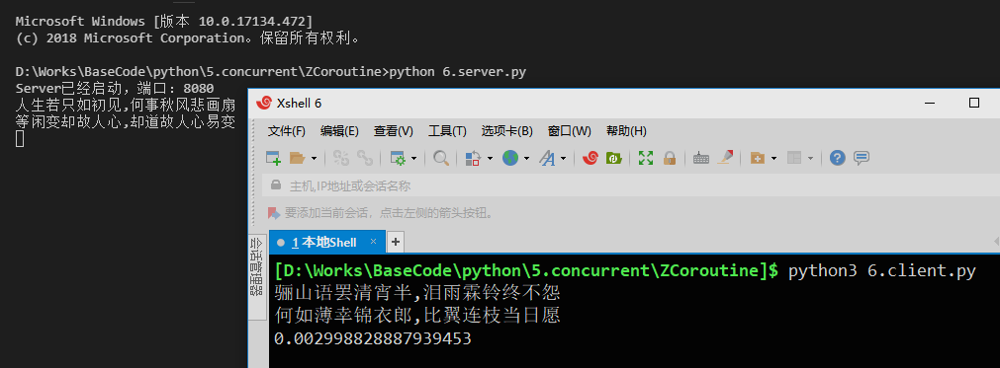

#### 2.HTTP案例

再举个HTTP的案例：
```py
import asyncio

async def get_html(host):
    print("get_html %s..." % host)
    reader, writer = await asyncio.open_connection(host, 80)
    writer.write(f"GET / HTTP/1.1\r\nHost: {host}\r\n\r\n".encode('utf-8'))
    await writer.drain()  # 等待缓冲区

    html_list = []
    async for line in reader:
        html_list.append(line.decode("utf-8"))

    writer.close()  # 关闭连接
    return "\n".join(html_list)

async def main():
    tasks = [
        asyncio.create_task(get_html(url))
        for url in ['dotnetcrazy.cnblogs.com', 'dunitian.cnblogs.com']
    ]
    html_list = await asyncio.gather(*tasks)
    print(html_list)

if __name__ == "__main__":
    import time
    start_time = time.time()

    asyncio.run(main())

    print(time.time() - start_time)
```
输出：
```
get_html dotnetcrazy.cnblogs.com...
get_html dunitian.cnblogs.com...
[html内容省略,html内容省略]
5.092018604278564
```

GIF过程图：
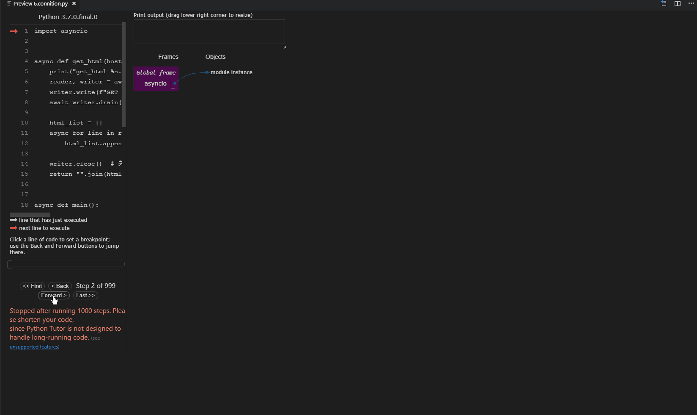

PS：（后面会继续说的）
1. **实现了协程方法`__anext__`的可以使用`async for`**
2. **实现了协程方法`__aenter__`和`__aexit__`的可以使用`async with`**

#### 3.源码分析

还记得之前IO多路复用的时候自己写的`非阻塞Server`不，简单梳理下流程，然后咱们再一起看看`asyncio`对应的源码：
1. 设置`Socket`为非阻塞（**`socket.setblocking(False)`**）
2. 利用轮询用来监视文件描述符`fd`（**`register`**）
3. 对可读写的`socket`进行相应操作
4. 取消轮询的监听（**`unregister`**）

看看`await asyncio.open_connection(ip,port)`的源码：
```py
# asyncio.streams.py
async def open_connection(host=None, port=None, *, loop=None, limit=_DEFAULT_LIMIT, **kwds):
    if loop is None:
        loop = events.get_event_loop()
    reader = StreamReader(limit=limit, loop=loop)
    protocol = StreamReaderProtocol(reader, loop=loop)
    # 核心点
    transport, _ = await loop.create_connection(lambda: protocol, host, port, **kwds)
    writer = StreamWriter(transport, protocol, reader, loop)
    return reader, writer
```
发现，其实内部核心在`loop.create_connection`中
```py
# asyncio.base_events.py
# 连接TCP服务器
class BaseEventLoop(events.AbstractEventLoop):
    async def create_connection(self,
                                protocol_factory,
                                host=None,
                                port=None,
                                *,
                                ssl=None,
                                family=0,
                                proto=0,
                                flags=0,
                                sock=None,
                                local_addr=None,
                                server_hostname=None,
                                ssl_handshake_timeout=None):
        ...
        # 主要逻辑
        if host is not None or port is not None:
            exceptions = []
            # 主要逻辑
            for family, type, proto, cname, address in infos:
                try:
                    sock = socket.socket(family=family, type=type, proto=proto)
                    sock.setblocking(False) # 1.设置非阻塞 <<<< look
                    if local_addr is not None:
                        for _, _, _, _, laddr in laddr_infos:
                            try:
                                sock.bind(laddr) # 端口绑定
                                break
                            except OSError as exc:
                                msg = (f'error while attempting to bind on '
                                       f'address {laddr!r}: '
                                       f'{exc.strerror.lower()}')
                                exc = OSError(exc.errno, msg)
                                exceptions.append(exc)
                        else:
                            sock.close()
                            sock = None
                            continue
                    if self._debug:
                        logger.debug("connect %r to %r", sock, address)
                    # 在selector_events中
                    await self.sock_connect(sock, address) # <<< look
                except OSError as exc:
                    if sock is not None:
                        sock.close()
                    exceptions.append(exc)
                except:
                    if sock is not None:
                        sock.close()
                    raise
                else:
                    break
```
发现源码中**设置了socket为非阻塞**，调用了`sock_connect`
```py
async def sock_connect(self, sock, address):
        """连接远程socket地址(协程方法)"""
        # 非阻塞检查
        if self._debug and sock.gettimeout() != 0:
            raise ValueError("the socket must be non-blocking")
        ...
        fut = self.create_future()
        self._sock_connect(fut, sock, address)
        return await fut

def _sock_connect(self, fut, sock, address):
        fd = sock.fileno() # 获取socket的文件描述符 <<< look
        try:
            sock.connect(address)
        except (BlockingIOError, InterruptedError):
            # 设置future的回调函数_sock_connect_done（用来注销的）<<< look
            fut.add_done_callback(functools.partial(self._sock_connect_done, fd))
            # 注册selector.register
            self.add_writer(fd, self._sock_connect_cb, fut, sock, address)
        except Exception as exc:
            fut.set_exception(exc)
        else:
            fut.set_result(None)
```
先看下`sock_connect`中调用的`add_writer`(注册)
```py
def add_writer(self, fd, callback, *args):
    """添加一个写的回调"""
    self._ensure_fd_no_transport(fd)
    return self._add_writer(fd, callback, *args)

def _add_writer(self, fd, callback, *args):
        self._check_closed()
        handle = events.Handle(callback, args, self, None)
        try:
            key = self._selector.get_key(fd)
        except KeyError:
            self._selector.register(fd, selectors.EVENT_WRITE,
                                    (None, handle)) # selector.register
        else:
            mask, (reader, writer) = key.events, key.data
            self._selector.modify(fd, mask | selectors.EVENT_WRITE,
                                  (reader, handle))
            if writer is not None:
                writer.cancel()
```
再看下`sock_connect`中设置的回调函数`_sock_connect_done`（注销）
```py
def _sock_connect_done(self, fd, fut):
    # 取消注册selector.unregister
    self.remove_writer(fd)
    
def remove_writer(self, fd):
    """移除写的回调"""
    self._ensure_fd_no_transport(fd)
    return self._remove_writer(fd)

def _remove_writer(self, fd):
    if self.is_closed():
        return False
    try:
        key = self._selector.get_key(fd)
    except KeyError:
        return False
    else:
        mask, (reader, writer) = key.events, key.data
        mask &= ~selectors.EVENT_WRITE
        if not mask:
            self._selector.unregister(fd) # 注销 <<< look
        else:
            self._selector.modify(fd, mask, (reader, None))

        if writer is not None:
            writer.cancel()
            return True
        else:
            return False
```

**PS：嵌套的非常深，而且底层代码一致在变（Python3.6到Python3.7这个新小更新就变化很大）**

### 关于源码的说明

之前并发编程的基础知识已经讲的很清楚了，也分析了很多源码，你可以自己去拓展一下（`Python3`的`asyncio`模块的源码一直在优化改进的路上）我这边就不一一分析了(源码很乱，估计几个版本后会清晰，现在是多层混套用)，你可以参考部分源码解析：<https://github.com/lotapp/cpython3/tree/master/Lib/asyncio>
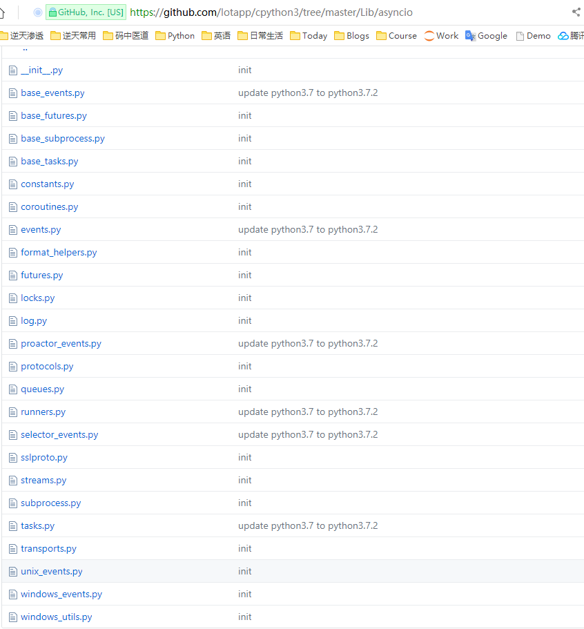

课后拓展：
```
https://docs.python.org/3/library/asyncio-protocol.html#examples
https://docs.python.org/3/library/asyncio-eventloop.html#creating-network-servers
```

下节预估：**同步与通信、aiohttp版爬虫**

---

### 3.5.9.同步与通信

官方文档：
```
https://docs.python.org/3/library/asyncio-sync.html
https://docs.python.org/3/library/asyncio-queue.html
```
写在前面：
1. **下面的方式不是线程安全的（协程就一个线程）**
2. **这些同步原语的方法不接受超时参数; 使用asyncio.wait_for(协程方法,超时时间)函数执行超时操作**
3. `asyncio`具有以下基本同步原语：`Lock、Event、Condition、Semaphore、BoundedSemaphore`

#### 1.引导示例

##### 1.1.old code

先看个原来的引导案例：估计的结果是0，而不借助lock得出的结果往往出乎意料
```py
import concurrent.futures

num = 0

def test(i):
    global num
    for _ in range(10000000):
        num += i

def main():
    with concurrent.futures.ThreadPoolExecutor() as executor:
        print("start submit...")
        future1 = executor.submit(test, 1)
        future2 = executor.submit(test, -1)
        concurrent.futures.wait([future1, future2])  # wait some time
        print("end submit...")
    global num
    print(num)

if __name__ == "__main__":
    import time
    start_time = time.time()
    main()
    print(f"time:{time.time()-start_time}")
```
输出：(但是代码并不是线程安全的，所以结果往往不是我们想要的）
```
start submit...
end submit...
82705
time:5.032064199447632
```

##### 1.2.new code

再看看协程的案例：
```py
import asyncio

num = 0

async def test(i):
    global num
    for _ in range(10000000):
        num += i

async def main():
    print("start tasks...")
    task1 = asyncio.create_task(test(1))
    task2 = asyncio.create_task(test(-1))
    await asyncio.gather(task1, task2)
    print("end tasks...")

    global num
    print(num)


if __name__ == "__main__":
    import time
    start_time = time.time()

    asyncio.run(main())

    print(f"time:{time.time()-start_time}")
```
输出：（就一个线程，当然安全）
```
start tasks...
end tasks...
0
time:4.860997438430786
```

##### 1.3.注意点

PS：**你使用协程的兼容代码，并不能解决线程不安全的问题**
```
import asyncio
import concurrent.futures

num = 0

def test(i):
    global num
    for _ in range(10000000):
        num += i

async def main():
    # 获取当前loop
    loop = asyncio.get_running_loop()

    with concurrent.futures.ThreadPoolExecutor() as executor:
        print("start submit...")
        future1 = loop.run_in_executor(executor, test, 1)
        future2 = loop.run_in_executor(executor, test, -1)
        # await asyncio.wait([future1,future2])
        await asyncio.gather(future1, future2)
        print("end submit...")
    global num
    print(num)

if __name__ == "__main__":
    import time
    start_time = time.time()

    asyncio.run(main())

    print(f"time:{time.time()-start_time}")
```
输出：
```
start submit...
end submit...
-1411610
time:5.0279998779296875
```

#### 2.为什么需要同步机制？

咋一看，单线程不用管线程安全啥的啊，要啥同步机制？其实在业务场景里面还是会出现诸如重复请求的情况，这个时候就需要一个同步机制了：
```py
import asyncio

# 用来存放页面缓存
cache_dict = {}

# 模拟一个获取html的过程
async def fetch(url):
    # 每次网络访问，时间其实不确定的
    import random
    time = random.randint(2, 5)
    print(time)

    await asyncio.sleep(time)
    return f"<h2>{url}</h2>"

async def get_html(url):
    # 如果缓存存在，则返回缓存的页面
    for url in cache_dict:
        return cache_dict[url]
    # 否则获取页面源码并缓存
    html = await fetch(url)
    cache_dict[url] = html
    return html

async def parse_js(url):
    html = await get_html(url)
    # do somthing
    return len(html)

async def parse_html(url):
    html = await get_html(url)
    # do somthing
    return html

async def main():
    # 提交两个Task任务
    task1 = asyncio.create_task(parse_js("www.baidu.com"))
    task2 = asyncio.create_task(parse_html("www.baidu.com"))
    # 等待任务结束
    result_list = await asyncio.gather(task1, task2)
    print(result_list)

if __name__ == "__main__":
    import time
    start_time = time.time()

    asyncio.run(main())

    print(time.time() - start_time)
```
输出：(`fetch`方法访问了两次 ==> 两次网络请求)
```
2
3
[22, '<h2>www.baidu.com</h2>']
3.0100157260894775
```

**简单说明：`baidu.com`一开始没缓存，那当解析js和解析html的任务提交时，就会进行两次网络请求（网络IO比较耗时），这样更容易触发反爬虫机制**

#### 3.Lock（互斥锁）

线程相关的Lock复习：<https://www.cnblogs.com/dotnetcrazy/p/9528315.html#2.2.1.线程同步~互斥锁Lock>

协程是线程安全的，那么这个`Lock`肯定是和`多线程/进程`里面的`Lock`是不一样的，我们先看一下提炼版的源码：
```py
class Lock(_ContextManagerMixin):
    def __init__(self, *, loop=None):
        self._waiters = collections.deque()
        self._locked = False
        if loop is not None:
            self._loop = loop
        else:
            self._loop = events.get_event_loop()

    async def acquire(self):
        if not self._locked:
            self._locked = True  # 改变标识
        ...
        return self._locked

    def release(self):
        if self._locked:
            self._locked = False
        ...
```
**PS：源码看完秒懂了，asyncio里面的lock其实就是一个标识而已**

修改一下上面的例子：
```py
import asyncio

# 用来存放页面缓存
cache_dict = {}
lock = None  # 你可以试试在这边直接写`asyncio.Lock()`

# 模拟一个获取html的过程
async def fetch(url):
    # 每次网络访问，时间其实不确定的
    import random
    time = random.randint(2, 5)
    print(time)

    await asyncio.sleep(time)
    return f"<h2>{url}</h2>"


async def get_html(url):
    async with lock:
        # 如果缓存存在，则返回缓存的页面
        for url in cache_dict:
            return cache_dict[url]
        # 否则获取页面源码并缓存
        html = await fetch(url)
        cache_dict[url] = html
        return html

async def parse_js(url):
    html = await get_html(url)
    # do somthing
    return len(html)

async def parse_html(url):
    html = await get_html(url)
    # do somthing
    return html

async def main():
    global lock
    lock = asyncio.Lock()  # 如果在开头就定义，那么lock的loop和方法的loop就会不一致了

    # 提交两个Task任务
    task1 = asyncio.create_task(parse_js("www.baidu.com"))
    task2 = asyncio.create_task(parse_html("www.baidu.com"))
    # 等待任务结束
    result_list = await asyncio.gather(task1, task2)
    print(result_list)

if __name__ == "__main__":
    import time
    start_time = time.time()

    asyncio.run(main())

    print(time.time() - start_time)
```
输出:(`fetch`方法访问了1次 ==> 1次网络请求)
```
3
[22, '<h2>www.baidu.com</h2>']
3.0020127296447754
```

#### 4.Semaphore（信号量）

线程篇`Semaphore`：<https://www.cnblogs.com/dotnetcrazy/p/9528315.html#2.2.5.线程同步~信号量Semaphore(互斥锁的高级版)>

这个用的比较多，简单回顾下之前讲的概念案例：

**通俗讲就是：在互斥锁的基础上封装了下，实现一定程度的并行**

举个例子，以前使用互斥锁的时候：（厕所就一个坑位，必须等里面的人出来才能让另一个人上厕所）

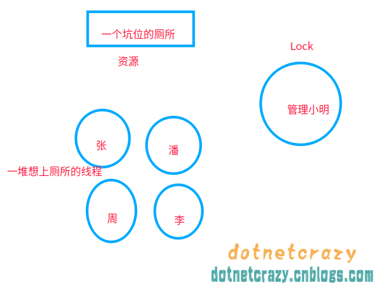

使用信号量`Semaphore`之后：厕所坑位增加到5个（自己指定），这样可以5个人一起上厕所了==> 实现了一定程度的并发控制

先看下缩略的源码：（可以这么想：**内部维护了一个引用计数，每次来个任务就-1，一个任务结束计数就+1**）
```py
class Semaphore(_ContextManagerMixin):
    def __init__(self, value=1, *, loop=None):
        if value < 0:
            raise ValueError("Semaphore initial value must be >= 0")
        self._value = value
        self._waiters = collections.deque()
        if loop is not None:
            self._loop = loop
        else:
            self._loop = events.get_event_loop()

    async def acquire(self):
        while self._value <= 0:
            fut = self._loop.create_future()
            self._waiters.append(fut) # 把当前任务放入Queue中
            try:
                await fut # 等待一个任务的完成再继续
            except:
                fut.cancel() # 任务取消
                if self._value > 0 and not fut.cancelled():
                    self._wake_up_next() # 唤醒下一个任务
                raise
        self._value -= 1 # 用掉一个并发量
        return True

    def release(self):
        self._value += 1 # 恢复一个并发量
        self._wake_up_next() # 唤醒下一个任务
```

现在举个常见的场景：**比如调用某个免费的api，该api限制并发数为5**
```py
import asyncio

sem = None

# 模拟api请求
async def api_test(i):
    async with sem:
        await asyncio.sleep(1)
        print(f"The Task {i} is done")

async def main():
    global sem
    sem = asyncio.Semaphore(5)  # 设置并发数为5
    tasks = [asyncio.create_task(api_test(i)) for i in range(20)]
    await asyncio.gather(*tasks)

if __name__ == "__main__":
    import time
    start_time = time.time()

    asyncio.run(main())

    print(time.time() - start_time)
```
动态输出：
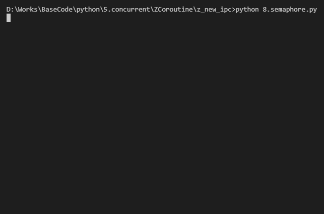

**PS：`BoundedSemaphore`是`Semaphore`的一个版本，在调用`release()`时检查计数器的值是否超过了计数器的初始值，如果超过了就抛出一个异常**

#### 5.Event（事件）

线程篇`Event`：<https://www.cnblogs.com/dotnetcrazy/p/9528315.html#2.2.8.线程同步~Event>

之前讲的很详细了，举个`爬虫批量更新`的例子就一笔带过：
```py
import asyncio

event = None
html_dict = {}

async def updates():
    # event.wait()是协程方法，需要await
    await event.wait()
    # 入库操作省略 html_dict >> DB
    return "html_dict >> DB done"

async def get_html(url):
    # 摸拟网络请求
    await asyncio.sleep(2)
    html_dict[url] = f"<h1>{url}</h1>" # 可以暂时写入临时文件中

    event.set()  # 标记完成，普通方法
    return f"{url} done"

async def main():
    global event
    event = asyncio.Event()  # 初始化 event 对象

    # 创建批量任务
    tasks = [
        asyncio.create_task(get_html(f"www.mmd.com/a/{i}"))
        for i in range(1, 10)
    ]
    # 批量更新操作
    tasks.append(asyncio.create_task(updates()))
    
    result = await asyncio.gather(*tasks)
    print(result)

if __name__ == "__main__":
    import time
    start_time = time.time()

    asyncio.run(main())

    print(time.time() - start_time)
```
输出：
```
['www.mmd.com/a/1 done', 'www.mmd.com/a/2 done', 'www.mmd.com/a/3 done', 'www.mmd.com/a/4 done', 'www.mmd.com/a/5 done', 'www.mmd.com/a/6 done', 'www.mmd.com/a/7 done', 'www.mmd.com/a/8 done', 'www.mmd.com/a/9 done', 'html_dict >> DB done']
2.0012683868408203
```

跟之前基本上一样，就一个地方不太一样：`async def wait(self)`，`wait`方法现在是协程方法了，使用的时候需要`await`
1. **`coroutine wait()`**
    - 等待事件内部标志被设置为`True`
    - 如果事件的内部内部标志已设置，则立即返回`True`。否则，一直阻塞，直到另外的任务调用`set()`
2. **`set()`**
    - 设置事件内部标志为`True`
    - 所有等待事件的任务将会立即被触发
3. **`clear()`**
    - 清除事件内部标志（即重置为`False`）
    - 等待事件的任务将会阻塞，直到`set()`方法被再次调用
4. **`is_set()`**
    - 如果事件内部标志被设置为`True`，则返回`True`

#### 6.Condition（条件变量）

线程篇`Condition`：<https://www.cnblogs.com/dotnetcrazy/p/9528315.html#2.2.4.线程同步~条件变量Condition>

先简单看看方法列表：
1. **`coroutine acquire()`**：
    - 获取底层锁。该方法一直等待，直到底层锁处于未锁定状态，然后设置其为锁定状态，并且返回True
2. `notify(n=1)`：
    - 唤醒至多n个等待条件的任务。如果没有正在等待的任务，则该方法无操作。
    - 在调用该方法之前，必须先调用`acquire()`获取锁，并在调用该方法之后释放锁。
    - 如果在锁为锁定的情况下调用此方法，会引发`RuntimeError`异常。
3. `locked()`：
    - 如果底层锁已获取，则返回True。
4. `notify_all()`：
    - 唤醒所有正在等待该条件的任务。该方法与notify()类似，区别只在它会唤醒所有正在等待的任务。
5. `release()`：
    - 释放底层锁。在未锁定的锁上调用时，会引发RuntimeError异常。
6. **`coroutine wait()`**：
    - 等待通知。如果调用此方法的任务没有获取到锁，则引发RuntimeError异常。
    - 此方法释放底层锁，然后保持阻塞，直至被notify()或notify_all()唤醒。被唤醒之后，条件对象重新申请锁，该方法返回True。
7. **`coroutine wait_for(predicate)`**
    - 等待`predicate`变为True。`predicate`必须可调用，它的执行结果会被解释为布尔值，并作为最终结果返回。

PS：**`Condition`结合了`Event`和`Lock`的功能**(也可以使多个Condition对象共享一个Lock，允许不同任务之间协调对共享资源的独占访问)

看个生产消费者的案例：
```py
import asyncio

cond = None
p_list = []

# 生产者
async def producer(n):
    for i in range(5):
        async with cond:
            p_list.append(f"{n}-{i}")
            print(f"[生产者{n}]生产商品{n}-{i}")
            # 通知任意一个消费者
            cond.notify()  # 通知全部消费者：cond.notify_all()
        # 摸拟一个耗时操作
        await asyncio.sleep(0.01)

# 消费者
async def consumer(i):
    while True:
        async with cond:
            if p_list:
                print(f"列表商品：{p_list}")
                name = p_list.pop()  # 消费商品
                print(f"[消费者{i}]消费商品{name}")
                print(f"列表剩余：{p_list}")

                # 摸拟一个耗时操作
                await asyncio.sleep(0.01)
            else:
                await cond.wait()

async def main():
    global cond
    cond = asyncio.Condition()  # 初始化condition
    p_tasks = [asyncio.create_task(producer(i)) for i in range(2)]  # 两个生产者
    c_tasks = [asyncio.create_task(consumer(i)) for i in range(5)]  # 五个消费者
    await asyncio.gather(*p_tasks, *c_tasks)

if __name__ == "__main__":
    asyncio.run(main())
```
输出：
```
[生产者0]生产商品0-0
[生产者1]生产商品1-0
列表商品：['0-0', '1-0']
[消费者0]消费商品1-0
列表剩余：['0-0']
列表商品：['0-0']
[消费者1]消费商品0-0
列表剩余：[]
[生产者0]生产商品0-1
[生产者1]生产商品1-1
列表商品：['0-1', '1-1']
[消费者0]消费商品1-1
列表剩余：['0-1']
列表商品：['0-1']
[消费者1]消费商品0-1
列表剩余：[]
[生产者0]生产商品0-2
[生产者1]生产商品1-2
列表商品：['0-2', '1-2']
[消费者0]消费商品1-2
列表剩余：['0-2']
列表商品：['0-2']
[消费者1]消费商品0-2
列表剩余：[]
[生产者0]生产商品0-3
[生产者1]生产商品1-3
列表商品：['0-3', '1-3']
[消费者0]消费商品1-3
列表剩余：['0-3']
列表商品：['0-3']
[消费者1]消费商品0-3
列表剩余：[]
[生产者0]生产商品0-4
[生产者1]生产商品1-4
列表商品：['0-4', '1-4']
[消费者0]消费商品1-4
列表剩余：['0-4']
列表商品：['0-4']
[消费者1]消费商品0-4
列表剩余：[]
```

PS：第七条的简单说明：（来看看`wait_for`方法的源码）
```py
# 一直等到函数返回true（从返回结果来说：要么一直阻塞，要么返回true）
async def wait_for(self, predicate):
    result = predicate()
    # 如果不是返回true就继续等待
    while not result:
        await self.wait()
        result = predicate()
    return result
```

课后拓展：`async_timeout`（兼容async的超时的上下文管理器）
<https://github.com/lotapp/BaseCode/blob/master/python/5.concurrent/ZCoroutine/async_timeout_timeout.py>

#### 7.Queue（队列）

官方文档：<https://docs.python.org/3/library/asyncio-queue.html>

线程篇`Queue`：<https://www.cnblogs.com/dotnetcrazy/p/9528315.html#2.2.6.线程同步~Queue-引入>

其实你不考虑限流的情况下，协程里面的queue和list基本上差不多（ps：`asyncio.Queue(num)`可以指定数量）

举个经典的生产消费者案例：
```py
import random
import asyncio

async def producer(q, i):
    for i in range(5):
        num = random.random()
        await q.put(num)
        print(f"[生产者{i}]商品{num}出厂了")
        await asyncio.sleep(num)

async def consumer(q, i):
    while True:
        data = await q.get()
        print(f"[消费者{i}]商品{data}抢光了")

async def main():
    queue = asyncio.Queue(10)  # 为了演示，我这边限制一下

    p_tasks = [asyncio.create_task(producer(queue, i)) for i in range(2)]  # 两个生产者
    c_tasks = [asyncio.create_task(consumer(queue, i)) for i in range(5)]  # 五个消费者
    await asyncio.gather(*p_tasks, *c_tasks)

if __name__ == "__main__":
    import time
    start_time = time.time()

    asyncio.run(main())

    print(time.time() - start_time)
```
输出：（注意一下`get`和`put`方法都是协程方法即可）
```
[生产者0]商品0.20252203397767787出厂了
[生产者0]商品0.9641503458079388出厂了
[消费者0]商品0.20252203397767787抢光了
[消费者0]商品0.9641503458079388抢光了
[生产者1]商品0.8049655468032324出厂了
[消费者0]商品0.8049655468032324抢光了
[生产者1]商品0.6032743557097342出厂了
[消费者1]商品0.6032743557097342抢光了
[生产者2]商品0.08818326334746773出厂了
[消费者2]商品0.08818326334746773抢光了
[生产者3]商品0.3747289313977561出厂了
[消费者3]商品0.3747289313977561抢光了
[生产者4]商品0.3948823110071299出厂了
[消费者4]商品0.3948823110071299抢光了
[生产者2]商品0.5775767044660681出厂了
[消费者0]商品0.5775767044660681抢光了
[生产者3]商品0.500537752889471出厂了
[消费者1]商品0.500537752889471抢光了
[生产者4]商品0.9921528527523727出厂了
[消费者2]商品0.9921528527523727抢光了
```

PS：协程也提供了**`Priority Queue`优先级队列 and `LifoQueue`后进先出队列**，这边就不再啰嗦了(前面我们**画图演示并手动实现过**)

课后拓展：<https://docs.python.org/3/library/asyncio-queue.html#examples>

### 扩展：Subprocesses

官方文档：<https://docs.python.org/3/library/asyncio-subprocess.html>

这个之前进程篇的时候说过，不是我们今天的重点，我贴一个官方demo：
```py
import asyncio

async def run(cmd):
    proc = await asyncio.create_subprocess_shell(
        cmd,
        stdout=asyncio.subprocess.PIPE,
        stderr=asyncio.subprocess.PIPE)

    stdout, stderr = await proc.communicate()

    print(f'[{cmd!r} exited with {proc.returncode}]')
    if stdout:
        print(f'[stdout]\n{stdout.decode()}')
    if stderr:
        print(f'[stderr]\n{stderr.decode()}')

asyncio.run(run('ls /zzz'))
```
输出：
```
['ls /zzz' exited with 1]
[stderr]
ls: /zzz: No such file or directory
```

下节预告：**`asyncio`+`aiohttp`版爬虫**

---

## 4.aiohttp

代码：<https://github.com/lotapp/BaseCode/tree/master/python/5.concurrent/ZCoroutine/z_spider>

`asyncio`库只有`TCP`和`UDP`服务，并不支持`HTTP`，`aiohttp`就可以理解为是基于`asyncio`的`http`服务

### 4.1.入门案例

先来个获取页面html的demo：
```py
import asyncio
import aiohttp

error_urls = set()

# 获取页面html
async def fetch(session, url):
    async with session.get(url) as response:
        if response.status == 200:
            return await response.text()
        else:
            error_urls.add(url)  # 添加到待处理集合中

async def main():
    async with aiohttp.ClientSession() as session:
        html = await fetch(session, "http://www.biquge.cm/12/12097/")
        if html:  # 获取到html
            print(len(html))

if __name__ == "__main__":
    import time
    start_time = time.time()

    asyncio.run(main())

    print(time.time() - start_time)
```
输出：
```
24287
0.5429983139038086
```

### 4.2.html解析

推荐一款轻量级网页解析库：**`pyquery`**（一个类似jquery的python库）

#### 4.2.1.列表页

在上面基础上简单提取：（`pq.items("dd a")` ==> 类比JQ选择器）
```py
import asyncio
import aiohttp
from pyquery import PyQuery

error_urls = set()

# 获取页面html
async def fetch(session, url):
    async with session.get(url) as response:
        if response.status == 200:
            return await response.text()
        else:
            error_urls.add(url)  # 待处理的url集合

# 阻塞方法
def saves(results):
    with open("www.biquge.cm.txt", "a+", encoding="utf-8") as fs:
        fs.writelines(results)
        print("ok")

async def main():
    async with aiohttp.ClientSession() as session:
        html = await fetch(session, "http://www.biquge.cm/12/12097/")
        pq = PyQuery(html)

        results = [
            item.text() + ":" + item.attr("href") + "\n"
            for item in pq.items("dd a")
        ]
        # print(pq("dd a").text())
        
        # 兼容阻塞旧代码
        await asyncio.get_running_loop().run_in_executor(None, saves, results)

if __name__ == "__main__":
    import time
    start_time = time.time()

    asyncio.run(main())

    print(time.time() - start_time)
```
输出：`www.biquge.cm.txt`
```
新书的一些话:/12/12097/7563947.html
第一章论坛里的鬼故事。:/12/12097/7563949.html
第二章临时讲课:/12/12097/7563950.html
第三章鬼域。:/12/12097/7563951.html
第四章恐怖敲门鬼:/12/12097/7565568.html
第五章迷路:/12/12097/7565569.html
第六章厕所中的手:/12/12097/7565570.html
第七章身后的脚步:/12/12097/7565571.html
第八章奇怪的树:/12/12097/7565572.html
第九章鬼婴:/12/12097/7565573.html
第十章恶鬼之力:/12/12097/7565574.html
...
第三百二十七章三口箱子:/12/12097/7950281.html
第三百二十八章鬼橱里的照片:/12/12097/7952145.html
第三百二十九章中山市事件:/12/12097/7955244.html
第三百三十章两条信息:/12/12097/7956401.html
第三百三十一章进入中山市:/12/12097/7959077.html
第三百三十二章出乎意料:/12/12097/7962119.html
第三百三十四章酒店的二楼:/12/12097/7964192.html
第三百三十五章黑色的烛火:/12/12097/7969058.html
第三百三十六章微笑的尸体:/12/12097/7973826.html
```

#### 4.2.2.详情页

获取一个详情页看看：
```py
import asyncio
import aiohttp
from pyquery import PyQuery

error_urls = set()

# 获取页面html
async def fetch(session, url):
    async with session.get(url) as response:
        if response.status == 200:
            return await response.text()
        else:
            error_urls.add(url)  # 待处理的url集合

# 详情页获取测试
async def main():
    async with aiohttp.ClientSession() as session:
        html = await fetch(session,
                           "http://www.biquge.cm//12/12097/7563949.html")
        pq = PyQuery(html)
        print(pq("#content").text())
        # results = [item.text() for item in pq.items("#content")]
        # print(results)

if __name__ == "__main__":
    import time
    start_time = time.time()

    asyncio.run(main())

    print(time.time() - start_time)
```
输出：
```
老夫掐指一算，你现在正在床上看小说，而且还是侧身，搞不好手机还在充电。

正在读高三的杨间此刻正躺在被窝里无聊的翻看着手机，他随手点开了一个帖子，下面有不少网友在回帖。

“卧槽，楼主真乃神人也，这都被楼主猜中了。”

“呵，你会告诉你们我现在正在厕所蹲坑么？不用问了，脚麻了。”

......

0.6684205532073975
```

**PS：Win下Py包安装出错就去这个网站下对应包** <https://www.lfd.uci.edu/~gohlke/pythonlibs/>

### 4.3.爬虫小案例

#### 4.3.1.小说网站实战

限流以及反爬虫和如何应对反爬虫机制，后面我们会继续说，这边简单举个小说离线的例子：
```py
import asyncio
import aiohttp
from pyquery import PyQuery

sem = None
error_urls = set()

# 获取html
async def fetch(session, url):
    async with sem:
        async with session.get(url) as response:
            if response.status == 200:
                # aiohttp遇到非法字符的处理
                return await response.text("gbk", "ignore")  # 忽略非法字符
            else:
                error_urls.add(url)  # 待处理的url集合

# 获取文章正文
async def get_text(session, url):
    # 把相对路径改成域名+路径
    if not url.startswith("http://www.biquge.cm"):
        url = "http://www.biquge.cm" + url
    html = await fetch(session, url)
    pq = PyQuery(html)
    return pq("#content").text()

# 普通阻塞方法
def save(title, text):
    with open("恐怖复苏.md", "a+", encoding="gbk") as fs:
        fs.write(f"## {title}\n\n{text}\n\n")
        print(f"{title} done...")

async def main():
    global sem
    sem = asyncio.Semaphore(3) # 控制并发数反而更快
    loop = asyncio.get_running_loop()

    async with aiohttp.ClientSession() as session:
        html = await fetch(session, "http://www.biquge.cm/12/12097/")
        pq = PyQuery(html)
        for item in pq.items("dd a"):
            title = item.text()
            text = await get_text(session, item.attr("href"))
            # 兼容阻塞旧代码
            await loop.run_in_executor(None, save, title, text)
    print("task over")


if __name__ == "__main__":
    import time
    start_time = time.time()

    asyncio.run(main())

    print(time.time() - start_time)
```
输出：（爬取整站就不用我说了吧：`提取a标签中的src，url去重后爬取内容`）
```
新书的一些话 done...
第一章论坛里的鬼故事。 done...
第二章临时讲课 done...
第三章鬼域。 done...
第四章恐怖敲门鬼 done...
第五章迷路 done...
第六章厕所中的手 done...
第七章身后的脚步 done...
第八章奇怪的树 done...
第九章鬼婴 done...
第十章恶鬼之力 done...
第十一章逐渐复苏 done...
第十二章宛如智障 done...
第十三章羊皮纸 done...
第十四章诡异的纸 done...
......
第三百二十八章鬼橱里的照片 done...
第三百二十九章中山市事件 done...
第三百三十章两条信息 done...
第三百三十一章进入中山市 done...
第三百三十二章出乎意料 done...
第三百三十四章酒店的二楼 done...
第三百三十五章黑色的烛火 done...
第三百三十六章微笑的尸体 done...
task over
```
动态展示：
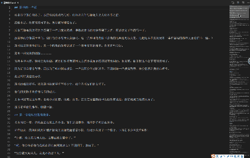

### 闲言碎语

**【推荐】Python高性能异步框架**：<https://github.com/LessChina/sanic>

逆天点评：（只看主线，只说我的见识）
1. 原来大家都是使用大一统的`Django`（方便）
2. 后来因为性能不佳，FaceBook开发了`Tornado`（IO多路复用）来代替
3. 再后来时代主流是敏捷开发，于是就有了`Flask`（简单）
4. 后来Node和Go火了，NetCore也出山了，Python的Flask等同步框架总是被吊打
5. 于是被逼出了`Japronto`，瞬间惊艳和吊打的所有开发语言，但是只是冒了泡就不怎么维护了
6. 后来就是AI爆发时期，Python直接打上了AI的标签了，而Web也逐渐被打上了初创公司的标配
7. 之后官方看不下去了，自己搞了一套异步框架`asyncio`and`aiohttp`（Node兄弟这么优秀，凭啥我们不行）
8. 民间看不下去了来了个`asyncio`替代品**`uvloop`**（C实现的程度比官方多(谁多谁高效)，PS：官方用法太丑陋了3.7才给足了语法糖）
9. 解决方案虽然各种出，但是web框架不行啊，于是又冒了个主流**`sanic`**（语法和`Flask`很像，性能不亚于`Japronto`）
10. 现在又刚冒出**`vibora`**（都是C实现）有超过`sanic`的趋势（PS：等过几个版本再试水，不过现在很多开发者都是`Go + Python`了)

最后BB一句：
1. `gevent`用猴子补丁的确很方便，但很多内部异常就被屏蔽了，而且性能现在不是最高
2. `tornado`为了兼容`py2`和`py3`，内部还是通过生成器来实现异步的，效率相对低点
3. `asyncio`是未来的主流方向，`sanic`是目前最火的异步框架（`vibora`还在观察中）

PS：`Django`、`Flask`是阻塞式IO，web框架一般不会直接部署（它自带的解决方案只是方便调试），一般使用`uwsgi` or `gunicorn` + `nginx`来部署（tornado可以直接部署）

参考链接：
```
python异步编程之asyncio
https://www.cnblogs.com/shenh/p/9090586.html

uWSGI, Gunicorn, 啥玩意儿?
https://www.cnblogs.com/gdkl/p/6807667.html

asyncio异步IO中文翻译：
http://www.cnblogs.com/mamingqian/p/10008279.html
https://www.cnblogs.com/mamingqian/p/10075444.html
https://www.cnblogs.com/mamingqian/p/10044730.html

PyQuery基础：
https://www.cnblogs.com/zhaof/p/6935473.html
https://www.cnblogs.com/lei0213/p/7676254.html
```
