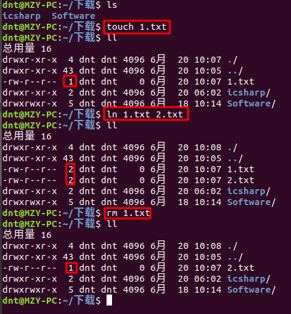

这次尽量用故事模式来讲知识

## 1.定义一个类
类的组成：类名、属性（没有字段）、方法
### 1.1创建一个类


```python
# 类名首字母大写
class Student(object):
    """创建一个学生类"""
    # 没有属性定义，直接使用即可
    # 定义一个方法，方法里面必须有self（相当于C#的this）
    def show(self):
        print("name:%s age:%d"%(self.name,self.age))
```


```python
# 实例化一个张三
zhangsan=Student()
# 给name，age属性赋值
zhangsan.name="张三"
zhangsan.age=22
# 调用show方法
zhangsan.show()
```

    name:张三 age:22


```python
# 打印一下类和类的实例
print(Student)
print(zhangsan) #张三实例的内存地址：0x7fb6e8502d30
```

    <class '__main__.Student'>
    <__main__.Student object at 0x7fe961195b70>


和静态语言不同，Python允许**对实例变量绑定任何数据** ==> 对于两个实例变量，**虽然它们都是同一个类的不同实例，但拥有的变量名称可能都不同**

说的比较抽象，举个例子就明了了：


```python
xiaoming=Student("小明",22)
xiaoming.mmd="mmd"
print(xiaoming.mmd)

# 小明和小潘都是Student类，但是小明有的mmd属性，小潘却没有
xiaopan=Student("小潘",22)
print(xiaopan.mmd)
```


    ---------------------------------------------------------------------------

    TypeError                                 Traceback (most recent call last)

    <ipython-input-4-500940527165> in <module>()
    ----> 1 xiaoming=Student("小明",22)
          2 xiaoming.mmd="mmd"
          3 print(xiaoming.mmd)
          4 
          5 # 小明和小潘都是Student类，但是小明有的mmd属性，小潘却没有


    TypeError: object() takes no parameters


### 1.2使用\_\_init\_\_初始化赋值

创建对象后，python解释器默认调用**\__init\__**方法，对必要字段进行初始化赋值

需要注意的是：**\_\_init\_\_**并不是C#中的构造函数，**\_\_new\_\_** （后面会说） + **\_\_init\_\_** 等价于构造函数

第一个参数和类的其他方法一样，都是self（相当于C#里面的this，表示创建的实例本身）调用的时候直接忽略它


```python
class Student(object):
    # 初始化赋值
    def __init__(self,name,age):
        self.name=name
        self.age=age
    
    def show(self):
        print("name:%s age:%d"%(self.name,self.age))
```


```python
# 有了__init__方法，在创建实例的时候，就不能传入空的参数了
lisi=Student()
```


    ---------------------------------------------------------------------------

    TypeError                                 Traceback (most recent call last)

    <ipython-input-6-1ba88e24910b> in <module>()
          1 # 有了__init__方法，在创建实例的时候，就不能传入空的参数了
    ----> 2 lisi=Student()
    

    TypeError: __init__() missing 2 required positional arguments: 'name' and 'age'


```python
# 创建一个正确的实例
xiaowang=Student("小王",22)
xiaowang.show()
```

    name:小王 age:22


### 1.3使用魔法方法\__str\__

在print(类名)的时候自定义输出

这个有点像C#类里面重写ToString，eg:

```csharp
public override string ToString()
{
    return "Name:" + this.Name + " Age:" + this.Age;
}
```


```python
# Python的__str__()方法
class Student(object):
    def __init__(self, name, age):
        self.name = name
        self.age = age

    # self别忘记写了，return也别忘了
    def __str__(self):
        return "姓名：%s，年龄：%s" % (self.name, self.age)
```


```python
lisi = Student("李四", 22)
print(lisi) #现在打印就是你DIV的输出了
```

    姓名：李四，年龄：22


### 1.4 私有属性、方法

C#、Java里面都是有**访问修饰符**的，Python呢？

Python规定，如果**以双下划线\__开头**的属性或者方法**就是私有的**

变量名类似**__xxx__**的，也就是以双下划线开头，并且以双下划线结尾的，**是特殊变量**。特殊变量是可以直接访问的，**不是private变量**

在说私有属性前，我们来个案例说说属性不私有的**弊端**，eg:

小明同学学了点C#，然后学习了上面的知识，心想 ～ Python这么搞安全性呢？不行，我得构造构造，于是有了下面的代码：


```python
class Student(object):
    def __init__(self, name, age):
        self.name = name
        self.age = age

    def get_name(self):
        return self.name

    def set_name(self, name):
        self.name = name

    def get_age(self):
        return self.age

    def set_age(self, age):
        if age > 0:
            self.age = age
        else:
            print("age must > 0")

    def show(self):
        print("name:%s,age:%d" % (self.name, self.age))

```

小明心想，想要修改age属性，你通过set_age我就可以判断了哇，还是本宝宝聪明

这时候小潘过来了，淡淡的一笑，看我怎么破了你 ～ 看代码：


```python
zhangsan = Student("张三", -20)
zhangsan.show()  # name:张三,age:-20
zhangsan.age = -1  # set_age方法形同虚设，我完全可以直接访问字段了
zhangsan.show()  # name:张三,age:-1
```

    name:张三,age:-20
    name:张三,age:-1


小潘傲气的说道～大叔，给你脸呢。我就是不去访问你设定的方法怎么滴呢？

小明急的啊，赶紧去找伟哥求经。不一会，傲气的贴出自己的New Code，心想着我私有属性都用上了还怕个毛毛：


```python
class Student(object):
    def __init__(self, name, age):
        self.__name = name
        # 一般需要用到的属性都直接放在__init__里面了
        # self.__age = age
        self.set_age(age)

    def get_name(self):
        return self.__name

    def set_name(self, name):
        self.__name = name

    def get_age(self):
        return self.__age

    def set_age(self, age):
        if age > 0:
            self.__age = age
        else:
            print("age must > 0")

    def show(self):
        print("name:%s,age:%s" % (self.__name, self.__age))
```

小潘冷笑道～呵呵，然后使用了上次的绝招：


```python
zhangsan = Student("张三", -20)
zhangsan.__age = -1  # 同样的代码，只是属性前面加了下划线
zhangsan.show()
```

    age must > 0


    ---------------------------------------------------------------------------

    AttributeError                            Traceback (most recent call last)

    <ipython-input-13-82c41ff46846> in <module>()
          1 zhangsan = Student("张三", -20)
          2 zhangsan.__age = -1  # 同样的代码，只是属性前面加了下划线
    ----> 3 zhangsan.show()
    

    <ipython-input-12-1dec32486a19> in show(self)
         22 
         23     def show(self):
    ---> 24         print("name:%s,age:%s" % (self.__name, self.__age))
    

    AttributeError: 'Student' object has no attribute '_Student__age'


这次小潘同志傻眼了，完全**不能访问**了啊？不行，怎么能被小明大叔笑话呢？

于是上网翻资料，国内不行就国外，外文不好就翻译，终于找到一个新破解方式：

双下划线开头的实例变量不能直接访问,是因为Python解释器对外把\__age变量改成了_Student__age，所以，仍然可以通过**_Student__age**来访问：


```python
# 搞事情
zhangsan._Student__age = -1
zhangsan.show()
```

    name:张三,age:-1


建议你不要这么干，不同版本的Python解释器可能会把\__age改成不同的变量名

有些时候，你会看到**以一个下划线开头的实例变量名**，比如_age这样的实例变量,外部是可以访问的。

但是，**请把它视为私有变量**，不要随意访问（**Python很多东西全凭自觉**~捂脸@_@）

小潘终于长叹一口气，然后还不忘取笑小明同学～**你这属性搞的，真麻烦，总是通过方法调用，太累了** <_> 鄙视!

这可把小明急的啊，学习的积极性都没有了，吃了碗牛肉面就去伟哥那边好好取经了～


```python
# 私有方法一笔带过
class Student(object):
    """私有方法"""
    def __go_home(self):
        pass


zhangsan = Student()
zhangsan.__go_home() # 访问不到
```


    ---------------------------------------------------------------------------

    AttributeError                            Traceback (most recent call last)

    <ipython-input-15-45c76191b808> in <module>()
          7 
          8 zhangsan = Student()
    ----> 9 zhangsan.__go_home() # 访问不到
    

    AttributeError: 'Student' object has no attribute '__go_home'


### 1.5 装饰器，让方法像属性那样便利

Python内置的`@property`装饰器就是负责把一个方法变成属性调用的，来个例子


```python
class Student(object):
    def __init__(self, name, age):
        # 一般需要用到的属性都直接放在__init__里面了
        self.name = name
        self.age = age

    @property
    def name(self):
        return self.__name

    @name.setter
    def name(self, name):
        self.__name = name

    @property
    def age(self):
        return self.__age

    @age.setter
    def age(self, age):
        if age > 0:
            self.__age = age
        else:
            print("age must > 0")

    def show(self):
        print("name:%s,age:%s" % (self.name, self.age))

```


```python
xiaoming = Student("小明", 22)
xiaoming.name = "小潘"
xiaoming.age = -2
xiaoming.show()
```

    age must > 0
    name:小潘,age:22


把一个getter**方法变成属性**，只需要加上`@property`就可以了

`@方法名.setter`，负责把一个setter方法变成**属性赋值**

当然了，如果只想读 ==> 就只打上`@property`标签

小明同学高兴坏了，赶紧大吃了一顿～

---

### 1.6 \__del\__ and \__new\__

创建对象后，python解释器默认调用**\__init\__()** 方法

当删除一个对象时，python解释器也会默认调用**\__del\__()** 方法（有点析构函数的味道）

当有1个变量保存了对象的引用时，此对象的引用**计数就会加1**

当使用del删除变量指向的对象时，**如果对象的引用计数不为1**，那么**每次删除计数减1**，当**计数为1的时候再调del就真把对象删了**

这个可以结合我之前说过的链接来理解：<a href="http://www.cnblogs.com/dunitian/p/8046389.html" target="_blank">于链接文件的探讨</a>

看着老师夸夸其谈，小明愣了楞，摸摸肚子想到，真BB，我先搞个例子练练：


```python
# 定义一个临时类
class Temp(object):
    def __del__(self):
        print("你被干掉了")
```

验证方面用编辑器比较合适，交互模式下可能不是真正的结果
```py
# 对象被s1和s2引用
s1 = Temp()
s2 = s1

del s1  # 只删除s1，新创建的对象并没有被删除
print("-" * 10)
```
输出：（最后的被干掉是程序退出了）
```
# ----------
# 你被干掉了
```
如果用链接来解释就是这样的：


这次两个都删掉：
```py
t1 = Temp()
t2 = t1

del t1
del t2
print("-" * 10)
```
输出：
```
# 你被干掉了
# ----------
```
都删了，自然就真删掉了

---

这样搞比较麻烦，我们引入一下**获取引用个数:getrefcount**（object也会占1个引用计数）来个案例：
```py
# 程序退出的时候，在他运行期间所有占用资源归还操作系统
# 引用计数
import sys
t1 = Temp()
print(sys.getrefcount(t1))  #（结果比实际引用大1）【object也会占1个引用计数】

t2 = t1
print(sys.getrefcount(t1))
print(sys.getrefcount(t2))

del t1
print(sys.getrefcount(t2))
# sys.getrefcount(t1)#被删掉自然没有了

del t2
print("-" * 10)
```
运行结果：
```
2
3
3
2
你被干掉了
----------
```

我再贴一种情况，你可以思考下为啥：
```py
t1 = Temp()
t2 = Temp()

del t1
del t2
print("-" * 10)
```
输出：
```
# 你被干掉了
# 你被干掉了
# ----------
```


---

小潘扭过头瞅了一眼说道：“大叔，你\__new\__忘记写案例了”

小明一愣神，立马反应过来说：“我这叫谋而后动～”

当你实例化一个对象的时候，就会执行new 方法里面的方法。new方法在类定义中不是必须写的，如果没定义，默认会调用object.new去创建一个对象

\__new\__方法中至少要有一个参数**cls**，代表要实例化的类，此参数在实例化时由Python解释器自动提供

\__new\__方法中必须要**有返回值**(返回实例化出来的实例)

小明翻阅了官方文档，淡定的打下了如下标准格式的代码：


```python
class Dog(object):
    def __init__(self, name):
        self.name = name
        print("初始化完毕")

    def __str__(self):
        return "Dog的名字叫：%s" % self.name

    def __new__(cls, name):
        # 注意参数，是cls，然后其他参数和init保持一致即可
        print("创建对象完毕")
        # 别忘记写返回值哦
        return object.__new__(cls)


def main():
    happy = Dog("Happy")
    print(happy)


if __name__ == '__main__':
    main()

```

    创建对象完毕
    初始化完毕
    Dog的名字叫：Happy


---

关于\__name\__在模块调用的时候会详细说，你可以先这样理解：如果直接运行py文件就执行，别人调用那么你的main就不执行了

标准写法:
```py
# 1.导入的模块
# 2.class的定义
# 3.其他方法定义

def main():
    pass

if __name__ == '__main__':
    main()
```
其他内容后面会继续说，封装部分再说说**静态方法**和**类方法**之类的就结束了（和C#还是有很大区别的）

---


### 1.7 类属性、实例属性

小明问老师：“老师老师，怎么没有静态类，静态属性之类的东西呢？”

老师笑而不语道：“小家伙原来不仅仅是体重增加啊，这求知欲也是大大的增加呢 ～ 且听我慢慢道来”

---

类在程序里面也是对象（你姑且可以认为所有的类都类似于C#里面的静态类），而通过类实例化的对象，叫实例化对象

**实例属性** --> **实例对象相互之间不共享** 一般我们都是在`__init__`中定义

**类属性**（类似于C#里面的静态字段） --> 属于类对象，**多个实例对象之间共享**

注意一下：**相同名称的实例属性将屏蔽掉类属性**（尽量别同名）

类属性除了可以通过 **类名.类属性** 访问外，还可以直接 **实例对象.类属性** （C#中抽象类和静态类是不能被实例化的）

来个案例更直观点：


```python
class Person(object):
    # age为类属性
    age = 1

    def __init__(self, name):
        # name为实例属性
        self.name = name


def main():
    # 类名.类属性
    print(Person.age)
    xiaoming = Person("小明")
    # 对象.类属性
    print(xiaoming.age)


if __name__ == '__main__':
    main()

```

    1
    1


---

如果需要在类外 **修改类属性**，必须通过**类对象**去引用然后**进行修改**

**如果通过实例对象去引用**，**会产生一个同名的实例属性**,这种方式修改的是实例属性，不会影响到类属性

如果通过实例对象去引用该名称的属性，实例属性会强制 **屏蔽掉类属性**，即引用的是实例属性，**除非del了该实例属性**才能正常访问类属性

你可以理解为，Python这么做只是为了方便你获取，该怎么修改还得怎么做。来看个案例：


```python
class Person(object):
    # age为类属性
    age = 1

    def __init__(self, name):
        # name为实例属性
        self.name = name


def main():
    # 类名.类属性
    print(Person.age)

    # 通过对象.类属性修改
    xiaoming = Person("小明")
    xiaoming.age = 100
    print(xiaoming.age)  # 其实，并没有修改成功，只是产生了一个同名age
    print(Person.age)  # 对吧，类属性并没有被修改

    # 通过类名修改
    Person.age = 22  # 如果需要在类外修改类属性，必须通过类对象去引用然后进行修改
    print(xiaoming.age)  # 刚才已经创建一个同名age，所以现在显示的是刚才的值
    print(Person.age)  # 通过类名.类属性 就可以看到值被修改了

    # 如果你还是不信，可以创建一个新对象看看
    xiaopan = Person("小潘")
    print(xiaopan.age)

    # xiaoming实例对象想访问怎么办？
    # 除非del了该实例属性才能正常访问类属性
    del xiaoming.age
    print(xiaoming.age)  # 这时候访问的就是 类属性 了


if __name__ == '__main__':
    main()

```

    1
    100
    1
    100
    22
    22
    22


### 1.8 实例方法、类方法、静态方法

先说说 **实例方法**，实例方法第一个定义的参数只能是实例本身引用`self`,只能通过实例调用（就是我们之前用的 `def func_name(self,xxx):` ）

**类方法**：是类对象所拥有的方法，需要用修饰器`@classmethod`来标识,第一个参数必须是类对象`cls`,可以通过类或者实例直用

**静态方法**：定义静态方法使用装饰器`@staticmethod`,没有默认的必须参数，通过类和实例直接调用

静态方法中不需要额外定义参数，因此在静态方法中引用类属性的话，必须通过 **类对象**来引用(访问)

小明眼花缭乱的对老师说道，老师给我看几个案例吧：


```python
class Dog(object):
    # 类属性
    name = "小汪"

    # 实例方法
    def __init__(self, age):
        # 实例属性
        self.age = age
        # 打印看看
        print("self id:%s" % id(self))

    # 类方法
    @classmethod
    def show_name(cls):
        # 访问类属性 cls.xxx
        print("我叫%s" % cls.name)
        # 打印看看
        print("cls id:%s" % id(cls))

    # 静态方法
    @staticmethod
    def say_hello():
        print("汪汪汪")


def main():
    # 类名方式访问
    Dog.show_name()
    Dog.say_hello()  # 类名的方式可以访问静态方法

    # 实例对象方式访问
    dog = Dog(2)
    dog.show_name()
    dog.say_hello()


if __name__ == '__main__':
    main()

```

    我叫小汪
    cls id:94310818174200
    汪汪汪
    self id:140392216464016
    我叫小汪
    cls id:94310818174200
    汪汪汪


---

一般都是这样用的（供参考）：

**实例方法**：一般平时用的都是它

**类方法**：类方法用在模拟C#多个构造函数(<a href="https://www.cnblogs.com/dotnetcrazy/p/9175950.html#ext" target="_blank">Python里面不能有同名函数</a>) or 你需要 **对类属性、类方法操作**之类的

**静态方法**：一般 **都是独立功能**，类似于函数，只不过在面向对象里面一般这么用


---

### 1.9 C#封装案例
C#面向对象比较优美，来个封装的案例基本上就搞定了：
```csharp
using System;

namespace _1Encapsulation
{
    public class Student
    {
        /// <summary>
        /// 字段
        /// </summary>
        private int _age;
        /// <summary>
        /// 属性
        /// </summary>
        public int Age
        {
            get
            {
                return _age;
            }

            set
            {
                if (value > 1)
                {
                    _age = value;
                }
            }
        }

        /// <summary>
        /// 自动化属性
        /// </summary>
        public string Name { get; set; }

        /// <summary>
        /// 自动属性必须要有get访问器
        /// </summary>
        public string SNum { get; }

        private int _gender;
        public int Gender
        {
            set
            {
                _gender = value;
            }
        }

        /// <summary>
        /// 构造函数的名字必须与类名一致
        /// 构造函数没有返回值也没有viod
        /// 默认自动生成一个无参构造函数，当有一个有参构造函数的时候无参构造函数便不会自动创建
        /// </summary>
        public Student() { }

        /// <summary>
        /// 有参构造函数
        /// </summary>
        /// <param name="name"></param>
        /// <param name="age"></param>
        public Student(string name, int age)
        {
            this.Name = name;
            this.Age = age;
        }

        /// <summary>
        /// this调用当前类的某个有参构造函数
        /// </summary>
        /// <param name="name"></param>
        /// <param name="age"></param>
        /// <param name="gender"></param>
        public Student(string name, int age, int gender) : this(name, age)
        {
            this.Gender = gender;
        }

        /// <summary>
        /// 某个方法
        /// </summary>
        public void Show()
        {
            Console.WriteLine("Name:" + this.Name + " Age:" + this.Age + "\n");
        }

        public override string ToString()
        {
            return "Name:" + this.Name + " Age:" + this.Age;
        }
    }
}
```
调用部分：
```csharp
using System;

namespace _1Encapsulation
{
    class Program
    {
        static void Main(string[] args)
        {
            Student s = new Student() { Name = "mmd", Age = 13, Gender = 1 };
            s.Show();
            
            Student s1 = new Student("dmm", 20);
            s1.Show();

            Console.WriteLine(s);
        }
    }
}
```

