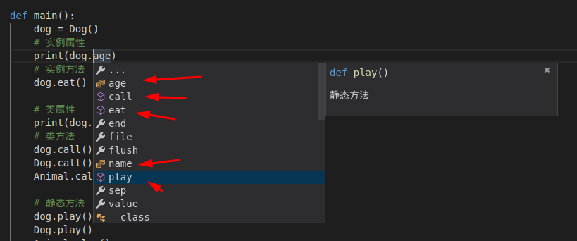

- [2.继承](#2继承)
    - [2.1.单继承](#21单继承)
    - [2.2.多继承](#22多继承)
    - [2.3.C#继承](#23c继承)
    - [2.4.C#接口的多实现](#24c接口的多实现)
- [3 多态](#3-多态)
    - [3.1.Python](#31python)
    - [3.2.C#虚方法实现多态](#32c虚方法实现多态)
    - [3.3.C#抽象类实现多态](#33c抽象类实现多态)
    - [3.4.C#接口实现多态](#34c接口实现多态)

## 2.继承

### 2.1.单继承
在OOP中，当我们定义一个Class的时候，可以从某个现有的Class继承

新的Class称为子类，而被继承的class称为 基类 或者 父类

Python的继承格式 ==> **xxx(base_class)**

小明兴高采烈的听着老师开新课，不一会就看见了一个演示Demo：


```python
class Animal(object):
    def eat(self):
        print("动物会吃")

class Cat(Animal):
    # 注意一下Python的继承格式
    pass

class Dog(Animal):
    pass

def main():
    cat = Cat()
    dog = Dog()
    cat.eat()
    dog.eat()

if __name__ == "__main__":
    main()
```

    动物会吃
    动物会吃


当听到老师说：“**私有**的属性方法 **不会被子类继承** ”的时候，小明心里一颤，联想到之前讲的 **类属性**、**实例属性**、**实例方法**、**类方法**、**静态方法**，于是赶紧写个Demo验证一下：


```python
class Animal(object):
    # 类属性
    name = '动物'

    def __init__(self):
        # 实例属性
        self.age = 1

    def __bug(self):
        """实例私有方法"""
        print("我是动物类身上的私有方法：bug")

    def eat(self):
        """实例方法"""
        print("我是实例方法，动物会吃哦～")

    @classmethod
    def call(cls):
        """类方法"""
        print("我是类方法，动物会叫哦")

    @staticmethod
    def play():
        """静态方法"""
        print("我是静态方法，动物会玩耍哦")


class Dog(Animal):
    pass


def main():
    dog = Dog()
    # 实例属性
    print(dog.age)
    # 实例方法
    dog.eat()

    # 类属性
    print(dog.name)
    # 类方法
    dog.call()
    Dog.call()
    Animal.call()

    # 静态方法
    dog.play()
    Dog.play()
    Animal.play()


if __name__ == '__main__':
    main()
```

    1
    我是实例方法，动物会吃哦～
    动物
    我是类方法，动物会叫哦
    我是类方法，动物会叫哦
    我是类方法，动物会叫哦
    我是静态方法，动物会玩耍哦
    我是静态方法，动物会玩耍哦
    我是静态方法，动物会玩耍哦


来张图就懂了，不是 **私有的** 都能访问：



这时候，小明老高兴了，单回头一想 ==> 不科学啊，dog应该有其对应的方法吧，C#有**虚方法**重写，Python怎么搞？在**子类**里面又**怎么调用父类方法**呢？

对于小明的提示老师很高兴，于是点名小潘来写一个子类调用父类的demo（老师昨天从窗户里看见小潘有预习）：


```python
# 调用父类的方法
class Father(object):
    def eat(self):
        print("文雅的吃饭")


class Son(Father):
    def eat(self):
        # 调用父类方法第1种（super().方法）
        super().eat()


class GrandSon(Son):
    def eat(self):
        # 调用父类方法第2种（记得传self）
        Son.eat(self)


def main():
    xiaoming = Son()
    xiaoming.eat()

    xiaoli = GrandSon()
    xiaoli.eat()


if __name__ == '__main__':
    main()
```

    文雅的吃饭
    文雅的吃饭


一般我们使用`super().方法`来调用父类方法

第二种方法`类名.方法(self)`千万别忘记传self哦

对了，C#是用base关键词，别搞混了

小明这时候可不高兴了，风头怎么能被小潘全部抢走呢，赶紧问问旁边同样预习的伟哥

不一会儿淡定的发了份重写父类方法的demo给老师：


```python
# 重写父类方法==>子类和父类有同名方法
class Father(object):
    def __init__(self, name):
        self.name = name

    def eat(self):
        print("%s喜欢文雅的吃饭" % self.name)


class Son(Father):
    def __init__(self, name):
        super().__init__(name)

    def eat(self):
        print("%s喜欢大口吃饭大口喝酒" % self.name)


def main():
    xiaoming = Father("小明")
    xiaoming.eat()

    xiaopan = Son("小潘")
    xiaopan.eat()


if __name__ == "__main__":
    main()
```

    小明喜欢文雅的吃饭
    小潘喜欢大口吃饭大口喝酒


老师半喜半忧的说道：“小明同学啊，你也老大不小了，怎么跟孩子一样啊？案例不错，但是怎么能人身攻击人家小潘了？”

当子类和父类都存在相同的`eat()`方法时，我们说，子类的`eat()`覆盖了父类的`eat()`

在代码运行的时候，总是会调用子类的`eat()` 这样，我们就获得了继承的另一个好处：**多态**

### 2.2.多继承

在讲`多态`之前，我们先引入一下Python的 **多继承** 对，你没有听错

Java、C#都是单继承，多实现。Python和C++一样，可以多继承，先不要吐槽，**规范使用**其实很方便的

来个案例看看：


```python
# 多继承引入
class Father(object):
    def eat(self):
        print("文雅的吃饭")


class Mom(object):
    def run(self):
        print("小碎步")


class Son(Father, Mom):
    pass


def main():
    son = Son()
    son.eat()
    son.run()


if __name__ == '__main__':
    main()

```

    文雅的吃饭
    小碎步


继承可以把父类的所有功能都直接拿过来，这样就不必重0开始写代码，子类只需要新增自己特有的方法，也可以把父类不适合的方法覆盖重写

注意一个情况，如果父类里面有同名方法咋办了？到底调哪个呢？

使用`子类名.__mro__`可以看在调方法的时候搜索顺序

一般同名方法都是 **先看自己**有没有，然后看继承顺序，比如这边 **先看Mom再看Father**


```python
# 如果父类里面有同名方法怎么知道调哪个？
class Father(object):
    def eat(self):
        print("文雅的吃饭")


class Mom(object):
    def eat(self):
        print("开心的吃饭")


class Son(Mom, Father):
    pass


def main():
    son = Son()
    son.eat()
    print(Son.__mro__)  # 一般同名方法都是先看自己有没有，然后看继承顺序，比如这边先看Mom再看Father


if __name__ == '__main__':
    main()

```

    开心的吃饭
    (<class '__main__.Son'>, <class '__main__.Mom'>, <class '__main__.Father'>, <class 'object'>)


Python的多继承最好是当C#或者Java里面的接口使用，这样结构不会混乱(**特殊情况除外**)

来个例子：
```py
class Animal(object):
    pass

class Flyable(object):
    """飞的方法"""
    pass

class Runable(object):
    """跑的方法"""
    pass

class Dog(Animal, Runable):
    pass

class Cat(Animal, Runable):
    pass

class Bird(Animal, Flyable):
    pass

class Dack(Animal, Runable, Flyable):
    """鸭子会飞也会跑"""
    pass
```
和C#一样，Python的 **父类构造函数不会被继承**

其实从资源角度也不应该被继承，如果有1w个子类，那每个子类里面都有一个父类方法，想想这是多么浪费的一件事情？

---

### 2.3.C#继承

下课后，小明认真思考总结，然后对照Python写下了C#版的继承：

定义一个人类
```csharp
public class Person
{
    public string Name { get; set; }
    public ushort Age { get; set; }

    public Person(string name, ushort age)
    {
        this.Name = name;
        this.Age = age;
    }
    public void Hi()//People
    {
        Console.WriteLine("Name: " + this.Name + " Age: " + this.Age);
    }
    public virtual void Show()//People
    {
        Console.WriteLine("Name: " + this.Name + " Age: " + this.Age);
    }
}
```
定义一个学生类
```csharp
public class Student : Person
{
    #region 属性
    /// <summary>
    /// 学校
    /// </summary>
    public string School { get; set; }
    /// <summary>
    /// 班级
    /// </summary>
    public string StrClass { get; set; }
    /// <summary>
    /// 学号
    /// </summary>
    public string StrNum { get; set; }
    #endregion

    #region 构造函数
    /// <summary>
    /// 调用父类构造函数
    /// </summary>
    /// <param name="name"></param>
    /// <param name="age"></param>
    public Student(string name, ushort age) : base(name, age)
    {

    }
    public Student(string name, ushort age, string school, string strClass, string strNum) : this(name, age)
    {
        this.School = school;
        this.StrClass = strClass;
        this.StrNum = strNum;
    } 
    #endregion

    /// <summary>
    /// new-隐藏
    /// </summary>
    public new void Hi()//Student
    {
        Console.WriteLine("Name: " + this.Name + " Age: " + this.Age + " School: " + this.School + " strClass: " + this.StrClass + " strNum: " + this.StrNum);
    }
    /// <summary>
    /// override-覆盖
    /// </summary>
    public override void Show()//Student
    {
        Console.WriteLine("Name: " + this.Name + " Age: " + this.Age + " School: " + this.School + " strClass: " + this.StrClass + " strNum: " + this.StrNum);
    }
}
```
调用一下：
```csharp
Person p = new Student("app", 10, "北京大学", "001", "01001");
p.Hi(); p.Show();

Console.WriteLine();

Student s = p as Student;
s.Hi(); s.Show();
```
结果:
```
Name: app Age: 10
Name: app Age: 10 School: 北京大学 strClass: 001 strNum: 01001
Name: app Age: 10 School: 北京大学 strClass: 001 strNum: 01001
Name: app Age: 10 School: 北京大学 strClass: 001 strNum: 01001
```
---
### 2.4.C#接口的多实现

定义两个接口：
```csharp
public interface IRun
{
    //什么都不用加
    void Run();
}

public interface IEat
{
    void Eat();
}
```
定义一个Dog类来实现两个接口，这样dog就有了run和eat的方法了
```csharp
var dog = new Dog();
dog.Eat();
dog.Run();
```
结果：
```
狗狗吃
狗狗跑
```

---

## 3 多态

### 3.1.Python
说多态之前说说类型判断，以前我们用`type()` or `isinstance()`

**判断一个变量和另一个变量是否是同一个类型**==> `type(a)==type(b)`

**判断一个变量是否是某个类型**==> `type(a)==A` or `isinstance(a,A)`


```python
# 判断一个变量是否是某个类型 ==> isinstance() or type
class Animal(object):
    pass


class Dog(Animal):
    pass


def main():
    dog = Dog()
    dog2 = Dog()
    print(type(dog) == Dog)
    print(type(dog) == type(dog2))
    print(type(dog))

    print(isinstance(dog, Dog))
    print(isinstance(dog, Animal))
    # arg 2 must be a type or tuple
    # print(isinstance(dog, dog2))


if __name__ == '__main__':
    main()

```

    True
    True
    <class '__main__.Dog'>
    True
    True


小明老高兴了，终于讲解多态了，不禁问道：“**多态的好处**是啥？”

小潘瞥了一眼小明～“废话，肯定为了 **屏蔽子类差异用**的啊，像简单工厂不就干的这个事？"

小明楞了楞，眼巴巴的看着老师继续讲课。

设计模式我们会找个专题讲讲，现在给你们说的是Python的基础。

Python是动态语言的“**鸭子类型**”，它并不要求严格的继承体系。

一个对象只要“看起来像鸭子，走起路来像鸭子”，那它就可以被看做是鸭子（最后会贴一个案例）

C#实现多态有很多方式，比如虚方法，比如抽象类，比如接口等等...

小明迷迷糊糊的问道：“那 **Python怎么实现多态呢**？”

老师看了一眼打断他讲课的小明，然后继续说道～来个简单案例：


```python
class People(object):
    def eat(self):
        print("人类会吃饭")

class Father(object):
    def eat(self):
        print("优雅的吃饭")

class Teacher(object):
    def eat(self):
        print("赶时间的吃饭")

# C# 或者 Java里面 写成 eat(People obj)
def eat(obj):
    obj.eat()

def main():
    teacher = Teacher()
    father = Father()
    eat(teacher)
    eat(father)

if __name__ == '__main__':
    main()
```

    赶时间的吃饭
    优雅的吃饭


多态的好处在于，如果这时候我再来个Son子类，有eat()方法编写正确，不用管原来的代码是如何调用的

这次小明懂了，为了装一下，说道：”老师老师，我记得C# 或者 Java里面是写成 eat(People obj) 的吧？“

老师欣慰的笑了一下，说道：”记得刚才说的`填鸭式`吗？Python这么写有个好处哦，我们来看个案例，然后你自己总结“


```python
class People(object):
    def eat(self):
        print("人类会吃饭")

class Father(object):
    def eat(self):
        print("优雅的吃饭")

class Teacher(object):
    def eat(self):
        print("赶时间的吃饭")

class Dog(object):
    def eat(self):
        print("舔着吃")

def eat(obj):
    obj.eat()

def main():
    teacher = Teacher()
    father = Father()
    eat(teacher)
    eat(father)
    
    # 我们添加一个不是People子类的Dog类，只要有eat方法，参数一样就可以直接调
    dog = Dog()
    eat(dog)

if __name__ == '__main__':
    main()
```

    赶时间的吃饭
    优雅的吃饭
    舔着吃


小明突然大声说道：”老师老师，我知道了，Python这是吧类的继承和接口继承融合起来了啊，实现多态就相当于C#里面的接口实现多态啊！！！“

老师点评道：”你姑且可以这么理解，这些我们后面还会继续说的，这种填鸭式的手段刚开始的确会有点不方便，用着用着你就会觉得挺方便的“

---

小明认真思考总结，然后对照Python和小潘一起写下了 **C#版的多态**：

### 3.2.C#虚方法实现多态

定义一个人类：
```csharp
public class Person
{
    #region 字段+属性
    /// <summary>
    /// 姓名
    /// </summary>
    private string _name;
    public string Name
    {
        get
        {
            return _name;
        }

        set
        {
            _name = value;
        }
    }
    /// <summary>
    /// 性别
    /// </summary>
    private bool _gender;
    public bool Gender
    {
        get
        {
            return _gender;
        }

        set
        {
            _gender = value;
        }
    }
    /// <summary>
    /// 年龄
    /// </summary>
    public short Age { get; set; }
    #endregion

    #region 构造函数
    public Person() { }
    public Person(string name, bool gender)
    {
        this.Name = name;
        this.Gender = gender;
    }
    public Person(string name, bool gender, short age) : this(name, gender)
    {
        this.Age = age;
    }
    #endregion

    #region 方法
    /// <summary>
    /// 打招呼
    /// </summary>
    public virtual void SaiHi()
    {
        Console.WriteLine("我是一个人类！");
    }
    #endregion
}
```
定义一个女孩类：
```csharp
public class Gril : Person
{
    #region 构造函数
    public Gril() { }
    public Gril(string name, bool gender) : base(name, gender) { }
    public Gril(string name, bool gender, short age) : base(name, gender, age) { }
    #endregion

    /// <summary>
    /// 重写父类方法
    /// </summary>
    public override void SaiHi()
    {
        string genderStr = Gender == true ? "男孩" : "女孩";
        Console.WriteLine($"你好，我叫{Name}，今年{Age}岁了，我是一个腼腆的小{genderStr}");
    }
}
```
定义一个男孩类：
```csharp
public class Boy : Person
{
    #region 构造函数
    public Boy() { }
    public Boy(string name, bool gender) : base(name, gender) { }
    public Boy(string name, bool gender, short age) : base(name, gender, age) { }
    #endregion

    //public void SaiHi()
    public override void SaiHi()
    {
        string genderStr = Gender == true ? "男孩" : "女孩";
        Console.WriteLine($"你好，我叫{Name}，今年{Age}岁了，我是一个腼腆的小{genderStr}");
    }
}
```
调用：
```csharp
static void Main(string[] args)
{
    Person[] persons = { new Person(), new Boy("铁锅", true, 13), new Gril("妞妞", false, 22) };
    foreach (var item in persons)
    {
        //看看item里面到底放的是什么
        Console.WriteLine(item.ToString());
        item.SaiHi();
        Console.WriteLine();
    }
}
```
结果：
```
Polymorphism1.Person
我是一个人类！
Polymorphism1.Boy
你好，我叫铁锅，今年13岁了，我是一个腼腆的小男孩
Polymorphism1.Gril
你好，我叫妞妞，今年22岁了，我是一个腼腆的小女孩
```

---

### 3.3.C#抽象类实现多态

定义一个动物类：
```csharp
public abstract class Animal
{
    /// <summary>
    /// 抽象类中可以有正常的方法
    /// </summary>
    public void Action()
    {
        Console.WriteLine("动物可以动");
    }

    /// <summary>
    /// 抽象方法必须在抽象类中
    /// </summary>
    public abstract void Call();
}
```
定义一个猫科动物类（子类必须实现父类抽象方法，如果不实现，那么该类也必须是抽象类）
```csharp
/// <summary>
/// 猫科动物---子类必须实现父类抽象方法，如果不实现，那么该类也必须是抽象类
/// </summary>
public abstract class Feline : Animal
{
}
```
定义一个猫类
```csharp
public class Cat : Feline
{
    /// <summary>
    /// 子类必须实现父类抽象方法，如果不实现，那么该类也必须是抽象类
    /// </summary>
    public override void Call()
    {
        Console.WriteLine("喵喵叫~~~");
    }
}
```
定义一个狗类
```csharp
public class Dog : Animal
{
    /// <summary>
    /// 子类必须实现抽象类中的抽象方法
    /// </summary>
    public override void Call()
    {
        Console.WriteLine("汪汪叫~~~");
    }
}
```
调用：
```csharp
Animal[] animals = { new Dog(), new Cat() };
foreach (var item in animals)
{
    item.Call();
}
```
结果：
```
汪汪叫~~~
喵喵叫~~~
```

---

### 3.4.C#接口实现多态

定义一个跑的接口：
```csharp
public interface IRun
{
    /// <summary>
    /// 接口中可以声明属性，方法，索引器等
    /// </summary>
    //string Name { get; set; }

    void Runing();
}
```
定义一个猫类：
```csharp
public class Cat : IRun
{
    public void Runing()
    {
        Console.WriteLine("飞快的跑着上树");
    }
}
```
定义一个学生类：
```csharp
public class Student : IRun
{
    public void Runing()
    {
        Console.WriteLine("飞快的跑着去上课");
    }
}
```
调用：
```csharp
IRun[] objs = { new Student(), new Cat() };
foreach (var item in objs)
{
    item.Runing();
}
```
结果：
```
飞快的跑着去上课
飞快的跑着上树
```
